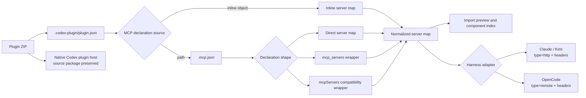
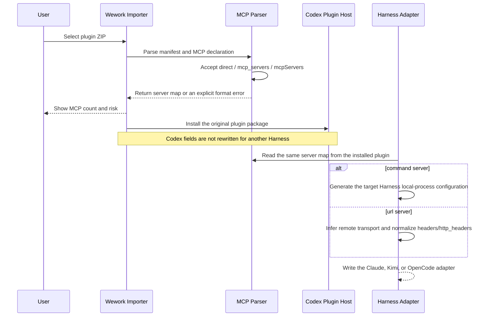

# Agent plugin MCP configuration compatibility

Scope: validation and component indexing of MCP declarations in Agent plugin packages, plus the Harness adapters Wework generates for Claude Code, Kimi Code, and OpenCode. MCP server networking and business tool contracts are outside this topic.

| Edge                          | Code ownership                                          |
| ----------------------------- | ------------------------------------------------------- |
| ZIP to import preview         | Wework Tauri `local_executor`                           |
| MCP declaration to server map | Wework `agent_plugins`; Backend `plugin_package_parser` |
| Server map to component index | Wework import preview; Backend package parser           |
| Server map to Claude / Kimi   | Wework `agent_plugins` Claude adapter                   |
| Server map to OpenCode        | Wework `agent_plugins` OpenCode adapter                 |
| Source plugin to Codex        | Codex personal-marketplace installation path            |
| Manual MCP JSON to form       | Wework `mcp-json-import`                                |

Invariants:

- `.mcp.json` accepts the Codex-standard direct server map and `mcp_servers` wrapper. `mcpServers` remains only for compatibility with existing Claude/Wework plugins. Preview, component counting, Backend indexing, and Harness adapters use the same parsing semantics.
- A manifest MCP path is a safe relative path contained by the plugin root. Format compatibility never weakens path validation.
- The Codex plugin package is installed unchanged. Cross-Harness differences exist only in derived adapters and never rewrite `.mcp.json`.
- A server containing `command` normalizes to local stdio. A server containing `url` normalizes to a remote transport. A Codex configuration with only `url` is not dropped because it omits an explicit `type`.
- Remote static headers accept both Codex `http_headers` and Claude/OpenCode `headers`. When both exist, `http_headers` is read first and `headers` overrides duplicate names, preserving existing Wework behavior.
- Claude and Kimi Streamable HTTP output uses `type: http` and `headers`; OpenCode output uses `type: remote` and `headers`. Derived adapters never leave unsupported `http_headers` in the target configuration.
- Format errors appear as explicit validation issues before installation. An invalid declaration is never silently reported as zero MCP servers.
