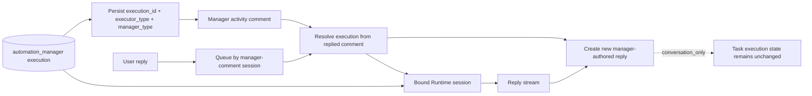
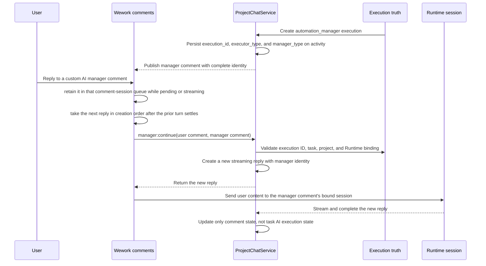

# Custom AI manager comment continuation

| Boundary                              | Code ownership                                                                                  |
| ------------------------------------- | ----------------------------------------------------------------------------------------------- |
| Execution-to-comment identity binding | `backend/app/services/project_automation_execution.py`                                          |
| Comment detection and routing         | `wework/src/features/todo/TaskActivityView.tsx`                                                 |
| Socket contract                       | `wework/src/api/backend/projectChatSocket.ts`, `backend/app/api/ws/wework_runtime_namespace.py` |
| Execution and comment validation      | `backend/app/services/project_chat/service.py`                                                  |
| Runtime-session continuation          | `wework/src/features/workbench/`                                                                |

Invariants: before a manager activity comment is published it must persist `execution_id`, `executor_type=automation_manager`, and the corresponding `manager_type`; neither the UI nor the continuation service may infer comment identity from the task's current assignee; continuation is selected from the replied comment's bound execution and Runtime session; only custom `automation_manager` executions may enter this path; follow-ups appended while the same manager-comment session is `pending` or `streaming` must be retained in its queue and sent in creation order; the user reply and manager answer are separate new comments, and an existing comment's author identity is immutable; continuation reuses the original manager session; conversation replies must not overwrite the task's current robot execution state, assignee, or board status.
