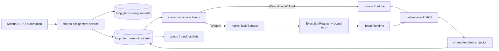
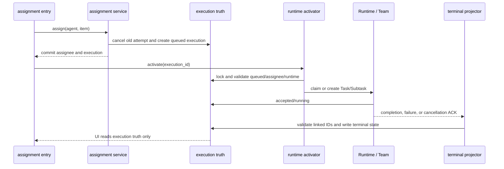

# Board automation and Wegent execution

Scope: manual, API, and automation assignment enter one execution-truth and runtime-activation path, then project trusted terminal state back to the board.

| Edge                           | Code owner                                                            |
| ------------------------------ | --------------------------------------------------------------------- |
| Entry → assignment             | `backend/app/services/loop_items/`, `project_automation_execution.py` |
| Assignment → execution truth   | `backend/app/services/loop_item_executions/service.py`                |
| Execution → runtime activation | `board_team_execution.py`, `robot_queue_tasks.py`, Wework puller      |
| Wegent request → board MCP     | `execution/request_builder.py`, `mcp_server/tools/wework_space.py`    |
| Runtime event → terminal state | `board_team_completion.py`, Executor status updates                   |
| Comment → exact continuation   | `board_team_continuation.py`, `project_automation_tasks.py`           |

Invariants: all entries share assignment and activation; activation occurs only after commit; `loop_item_executions` is the sole board-execution truth; Wegent binding uses exact execution/task/subtask/team IDs; cancellation writes intent first and only a Runtime ACK writes terminal state; messages and UI never overwrite execution state.

See the [cloud-project collaboration guide](../wegent/developer-guide/cloud-project-collaboration.md) for domain, API, and delivery details.
