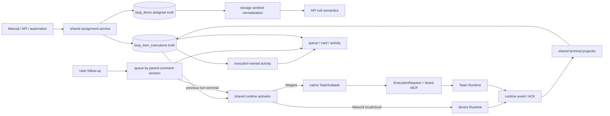

# Board automation and Wegent execution

Scope: manual, API, and automation assignment enter one execution-truth and runtime-activation path, then project trusted terminal state back to the board.



```mermaid
sequenceDiagram
    participant E as assignment entry
    participant A as assignment service
    participant I as loop_items
    participant X as execution truth
    participant C as execution activity
    participant R as runtime activator
    participant T as Runtime / Team
    participant P as terminal projector
    participant Q as comment continuation queue

    E->>A: assign(agent, item)
    A->>I: write assignee; MySQL stores unassigned Team as sentinel 0
    I-->>A: normalize sentinel 0 to domain null on reads
    A->>X: cancel old attempt and create queued execution
    X->>C: create one immutable-identity activity per execution
    A-->>E: commit assignee and execution
    E->>R: activate(execution_id)
    R->>X: lock and validate queued/assignee/runtime
    R->>T: claim or create Task/Subtask
    T->>X: accepted/running
    T-->>P: completion, failure, or cancellation ACK
    P->>X: validate linked IDs and write terminal state
    E->>Q: append to a pending or streaming parent-comment session
    Q-->>E: retain as a queued message
    T-->>Q: parent-comment Runtime session becomes terminal
    Q->>R: continue the same parent-comment session in order
    X-->>E: UI reads execution truth only
    opt user reruns a failed stage
        E->>R: run workflow node
        R->>X: atomically create one new execution
        R-->>E: success or explicit conflict
        E->>X: reload authoritative state after either response
    end
```

| Edge                                             | Code owner                                                                        |
| ------------------------------------------------ | --------------------------------------------------------------------------------- |
| Entry → assignment                               | `backend/app/services/loop_items/`, `project_automation_execution.py`             |
| Assignee storage → API meaning                   | `backend/app/models/delivery.py`, `backend/app/schemas/delivery.py`               |
| Assignment → execution truth                     | `backend/app/services/loop_item_executions/service.py`                            |
| Execution → immutable activity                   | `loop_item_executions/service.py`, `project_automation_execution.py`              |
| Execution → runtime activation                   | `board_team_execution.py`, `robot_queue_tasks.py`, Wework puller                  |
| Wegent request → board MCP                       | `execution/request_builder.py`, `mcp_server/tools/wework_space.py`                |
| Runtime event → terminal state                   | `board_team_completion.py`, Executor status updates                               |
| Comment → exact continuation                     | `board_team_continuation.py`, `project_automation_tasks.py`                       |
| Pending/streaming comment → ordered continuation | `wework/src/features/todo/TaskActivityView.tsx`, conversation message queue cache |

Invariants: all entries share assignment and activation; changing the assignee to a robot must create its queued execution in the same business transaction, and automatic execution remains owned by the existing queue-consumption path; activation occurs only after commit; `loop_item_executions` is the sole board-execution truth; one stage-rerun action may create only one new execution, duplicate clicks are disabled while the request is pending, and the client reloads authoritative Issue state after success or conflict; a conflict converges successfully only when that reload shows the stage already queued/running, otherwise the error remains visible; a task contains multiple comments and each comment's author identity is immutable after creation; when a person creates a root comment and the assignee is a robot, the robot answers with a new reply; when a person replies to a robot-created root comment, the assigned robot answers with another new reply; a follow-up appended while the same parent-comment session is `pending` or `streaming` must be retained in that session's pending-message queue and sent in creation order, never discarded because the Runtime is busy or dispatched as a parallel continuation; comments are connected only through `reply_to_message_id` and `thread_root_message_id`, never by rewriting an existing comment's author; an AI-manager activity and its selected project-robot activity are always distinct; Wegent binding uses exact execution/task/subtask/team IDs; MySQL `loop_items.assignee_team_id=0` means unassigned only, and services plus APIs must normalize it to `null` instead of treating `0` as a Team ID; optional Team/Task IDs in `loop_item_executions` use a separate but consistent `0 ↔ null` boundary; cancellation writes intent first and only a Runtime ACK or authoritative post-cancellation absence may write terminal state; messages and UI never overwrite execution state.

See the [cloud-project collaboration guide](../wegent/developer-guide/cloud-project-collaboration.md) for domain, API, and delivery details.
