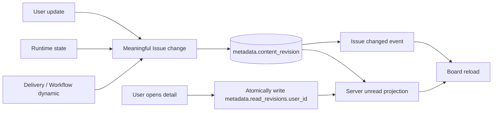
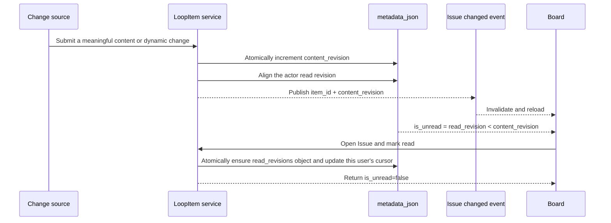

# Board Issue unread projection

Scope: Issue content changes, status changes, and Runtime or Delivery dynamics advance one content revision, while per-user read cursors project unread state onto the board.

| Edge                                      | Code ownership                                                        |
| ----------------------------------------- | --------------------------------------------------------------------- |
| Meaningful change → content revision      | Backend `loop_item_unread` and LoopItem mutation services             |
| User read → read revision                 | Backend deliveries API and `loop_item_unread`                         |
| Revision → current-user unread projection | Backend `LoopItemService.response_values` and delivery schema         |
| Issue changed → board refresh             | Backend `loop_item_events` and Wework `projectChatSocket`             |
| Unread projection → card marker / read    | Wework `CloudTodoWorkspace`, `CloudTodoBoardCard`, and deliveries API |

Essential invariants:

- Unread is a server-side relationship projection for the current user, not local client state.
- `content_revision` advances only for user-visible Issue content, status, Workflow, Runtime, or Delivery changes. Reordering, listing, and marking read do not advance it.
- `read_revisions` reuses the LoopItem `metadata_json`, keyed by user ID with the last read `content_revision`; no database table is added.
- The formula is fixed: an absent read cursor or `read_revision < content_revision` means unread.
- A meaningful update aligns the actor's read cursor in the same transaction, so a user's own edit does not immediately become unread.
- Mark-read must ensure a missing or invalid `read_revisions` value is an object and update one user's JSON path in the same database expression. It must not read and overwrite the entire `metadata_json`, discard other users' cursors, increment the LoopItem optimistic-lock `version`, or change business `updated_at`.
- The Issue changed event only invalidates projections and is never unread truth. List and detail APIs restore correct state after reconnects or cross-device access.
