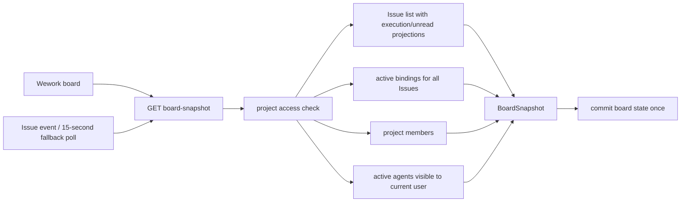
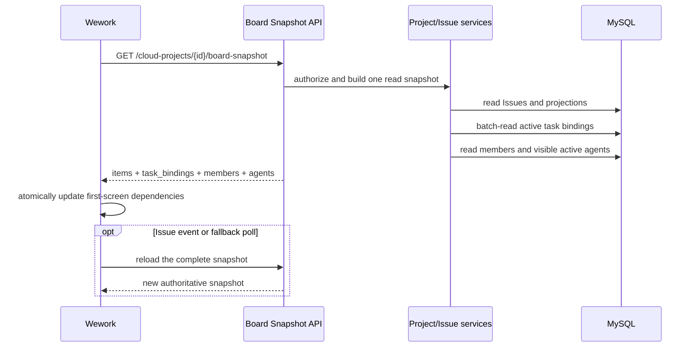

# Board first-screen read snapshot

Scope: when Wework opens a cloud project-space board, one authoritative snapshot request loads the Issues, task bindings, members, and visible agents required by first-screen rendering and interaction.

| Edge | Code owner |
| --- | --- |
| Board → snapshot API | `wework/src/features/todo/CloudTodoWorkspace.tsx`, `wework/src/api/deliveries.ts` |
| Snapshot API → aggregate read | `backend/app/api/endpoints/cloud_projects.py`, `backend/app/services/project_board_snapshot.py` |
| Issues → batch task bindings | `backend/app/services/loop_items/service.py` |
| Snapshot → frontend state | `wework/src/features/todo/CloudTodoWorkspace.tsx` |

Invariants: opening one cloud board issues exactly one HTTP request for first-screen business data; the snapshot contains every Issue visible to the current user, all active task bindings for those Issues, project members, and active agents visible to the current user; task bindings are read in one project-level batch and never through per-card N+1 requests; the frontend commits first-screen dependency state only after the complete snapshot succeeds, and a cancelled or stale project request never overwrites the active project; Issue events and the 15-second fallback poll reload this same snapshot contract and never restore split requests; non-first-screen detail data such as attachments, comments, and deliveries remains lazy-loaded.
