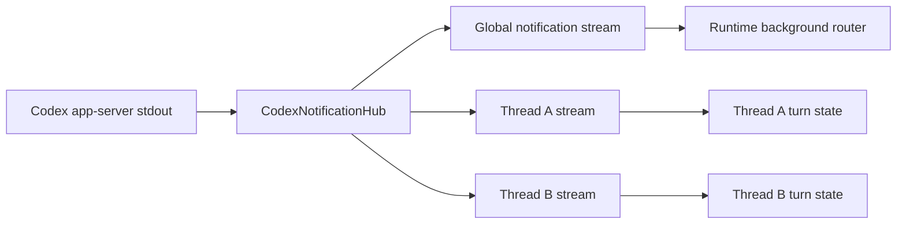
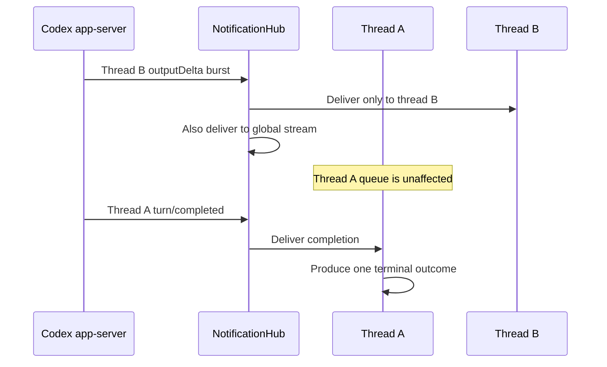

# Codex notification isolation

## Scope

Governs how JSON-RPC notifications are projected to the global background router and individual active threads when the local Executor reuses one Codex app-server.

## Connection graph

## Sequence

## Code ownership

| Responsibility | Code |
| --- | --- |
| App-server process and notification hub | `executor/src/agents/codex.rs` |
| Active turn state machine | `executor/src/agents/codex/run_state.rs` |
| Runtime background projection | `executor/src/runtime_work/handler/notifications.rs` |
| Shared app-server contract tests | `executor/tests/codex_app_server_contract.rs` |

## Essential invariants

- A burst from one thread must not consume or overwrite another thread's bounded queue.
- Notifications with a `threadId` enter only the matching turn stream; the global stream still receives every notification.
- Process-exit notifications without a `threadId` reach every active thread.
- A thread subscription exists before any request that may start its turn.
- Lag in the global background router must not fail unrelated active turns.
