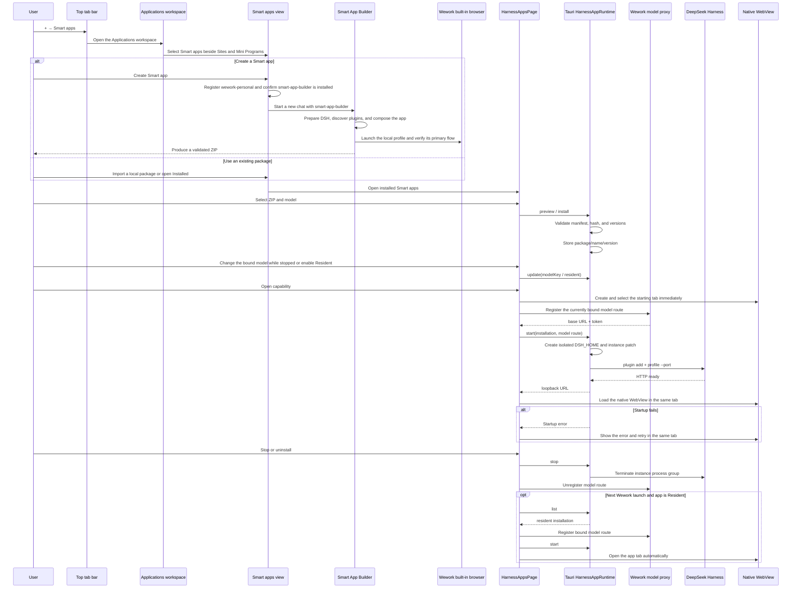

# Smart apps (DeepSeek Harness runtime)

Scope: Wework imports a DeepSeek Harness package as a Smart app, binds it to one Wework model without modifying Harness source, and runs it in an independent workspace tab.

```mermaid
flowchart LR
    EXPERIMENT[Experimental features toggle] --> PLUS[Top tab bar +]
    EXPERIMENT --> APPS[Applications workspace]
    EXPERIMENT --> ROUTES[Smart app view and resident restoration]
    PLUS --> APPS
    APPS --> SITES[Sites]
    APPS --> MINIAPP[Mini Programs]
    APPS --> MARKET[Smart apps]
    ROUTES --> MARKET
    MARKET --> DEFAULTS[Register bundled marketplace and idempotently install defaults]
    DEFAULTS --> BUILDER[Smart App Builder plugin]
    BUILDER --> DISCOVER[DSH setup / discovery / composition]
    DISCOVER --> BROWSER[Wework built-in browser verification]
    BROWSER --> ZIP
    MARKET --> INSTALLED[Installed Smart apps]
    MARKET --> ZIP
    INSTALLED --> ZIP
    ZIP[Smart app ZIP] --> VALIDATE[manifest / SHA-256 / path / size validation]
    VALIDATE --> STORE[(Immutable version directory)]
    STORE --> INSTANCE[(Isolated DSH_HOME)]
    STAGING[DSH runtime staging directory] --> SIGN[macOS Mach-O pre-signing]
    SIGN --> NODE[Node JIT entitlement signing and Isolate startup validation]
    NODE --> RUNTIME[Fingerprint-named DSH runtime release asset]
    DESCRIPTOR[Runtime descriptor bundled with the app] --> DOWNLOAD[First-use download and SHA-256 validation]
    RUNTIME --> DOWNLOAD
    DOWNLOAD --> CACHE[(Archive-hash cache)]
    CACHE --> EXTRACT[(Content-addressed extraction)]
    EXTRACT --> INSTANCE
    MODEL[Wework model] --> PROXY[Local Anthropic Messages proxy]
    INSTALLED --> MODEL
    INSTALLED --> LOADING[Create a starting tab immediately]
    PROXY --> INSTANCE
    INSTANCE --> PROCESS[Independent process group and port]
    LOADING --> TAB[Wework app tab]
    PROCESS --> READY[HTTP ready]
    READY --> TAB
    PROCESS --> ERROR[Startup failure state]
    ERROR --> TAB
    RESIDENT[Resident setting] --> STARTUP[Main-window startup manager]
    STARTUP --> MODEL
    STARTUP --> PROCESS
    STARTUP --> TAB
    STOP[Stop / uninstall / app exit] --> PROCESS
```

| Edge                                                                                   | Code ownership                                                                                                                                                      |
| -------------------------------------------------------------------------------------- | ------------------------------------------------------------------------------------------------------------------------------------------------------------------- |
| ZIP, manifest, version, and storage validation                                         | `wework/src-tauri/src/harness_apps.rs`                                                                                                                              |
| Runtime release asset, descriptor, fingerprint, macOS pre-signing, and Node JIT checks | `wework/scripts/prepare-deepseek-harness-runtime.mjs`, `wework/scripts/lib/deepseek-harness-signing.mjs`, `wework/scripts/deepseek-harness-node.entitlements.plist` |
| First-use download, SHA-256 validation, caching, extraction, instances, and processes  | `wework/src-tauri/src/harness_apps.rs`                                                                                                                              |
| Wework model to Anthropic Messages proxy                                               | `wework/src/features/local-harness/localHarnessModels.ts`                                                                                                           |
| Top tab bar entry                                                                      | `wework/src/features/workspace-tabs/WorkspaceTabStrip.tsx`                                                                                                          |
| Applications workspace and Sites / Mini Programs / Smart apps navigation               | `wework/src/pages/SitesPage.tsx`, `wework/src/components/sites/SitesWorkspace.tsx`                                                                                  |
| Smart app marketplace and Marketplace / Installed navigation                           | `wework/src/pages/SmartAppsMarketplacePage.tsx`, `wework/src/components/smart-apps/SmartAppsSectionNav.tsx`                                                         |
| Bundled marketplace registration and default plugin installation                       | `wework/src/tauri/localExecutor.ts`, `wework/src-tauri/src/local_executor.rs`, `executor/src/runtime_work/handler/runtime_rpc.rs`                                   |
| Smart app creation workflow plugin                                                     | `wework/src-tauri/bundled-plugins/wework-personal/plugins/smart-app-builder/`                                                                                       |
| Installation, management, and lifecycle UI                                             | `wework/src/pages/HarnessAppsPage.tsx`                                                                                                                              |
| Resident app startup restoration                                                       | `wework/src/features/harness-apps/ResidentSmartAppsManager.tsx`                                                                                                     |
| Starting / failed state, workspace tabs, and native WebViews                           | `wework/src/App.tsx`, `wework/src/features/harness-apps/`, `wework/src/features/workspace-tabs/workspaceTabs.ts`                                                    |

Invariants: all user-facing names use “Smart apps,” while DeepSeek Harness appears only as a runtime implementation detail; Smart apps belong to the Applications workspace and must appear as a peer application type beside Sites and Mini Programs, while the plugin marketplace and plugin management page do not host Smart app management UI; `smart-app-builder` may exist as a development-tool plugin, but its product entry belongs to the experimental Smart app marketplace, its workflow keeps DSH source read-only, composes external plugin packages, verifies them in the Wework built-in browser, and ends installation through native preview, version validation, and model confirmation instead of editing the local installation registry; the entire Smart apps feature is experimental, so when the toggle is off the top “+” and Applications workspace expose no Smart apps entry, direct visits to `/sites?app_type=smart_app` and stale app tabs leave the feature, and resident apps are not restored; when enabled, `/sites?app_type=smart_app` owns the Smart app marketplace and installed management views, while running apps use independent tabs, with no mixing of the Applications workspace, management view, and runtime tab responsibilities; top tab bar “+ → Smart apps” opens the Smart apps type inside Applications, while the workspace tab title remains “Applications”; DeepSeek Harness source remains read-only; application installers contain only a small runtime descriptor and never the DSH runtime archive or recursively registered `node_modules`; runtime release assets are named by content fingerprint, while the descriptor pins an HTTPS download URL, SHA-256, and byte length; first use downloads to a temporary file, validates it completely, atomically activates an archive-hash cache entry, and then extracts by content fingerprint under app data; failed, truncated, or mismatched downloads never activate or pollute the cache, and concurrent app launches share one download and extraction critical section; production macOS builds sign every Mach-O file in staging with a Developer ID, secure timestamp, and hardened runtime before creating the release asset, and signing mode and identity are part of the content fingerprint so unsigned or differently signed assets are never reused; the archived Node then receives the V8 JIT and executable-memory entitlements after generic Mach-O pre-signing and passes a real V8 Isolate startup check instead of only `node --version`; packages are validated before being written to immutable `name/version` directories; the package DSH version range must contain the actual runtime version; every Smart app instance owns an isolated `DSH_HOME`, port, and process group; the bound model is persisted and can only be changed while the app is stopped, while credentials exist only in the runtime proxy and child environment; Resident means that the main window automatically starts the app and opens its tab once per Wework launch; a normal Open action creates and selects the app's single tab immediately and shows startup state there, reuses that same tab for the native WebView after HTTP readiness, and shows failure plus retry in the same tab without allowing tab-strip motion or backend startup time to block tab creation; starting, stopping, or failing one instance cannot affect another; stop, uninstall, disabling experimental features, and Wework exit reclaim the complete process group.
Plugins marked `INSTALLED_BY_DEFAULT` in the `wework-personal` catalog are installed idempotently after bundled marketplace registration. The Smart app creation entry confirms `smart-app-builder` is installed before writing the plugin-referenced fresh-chat draft and navigating; installation failure stays on the marketplace page instead of opening an empty chat. Default-plugin reconciliation reads existing plugin configuration through the Executor-explicitly-allowed Codex `config/read` method and treats a present but user-disabled plugin as configured, so default synchronization must never re-enable it.
