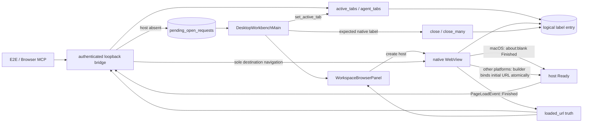
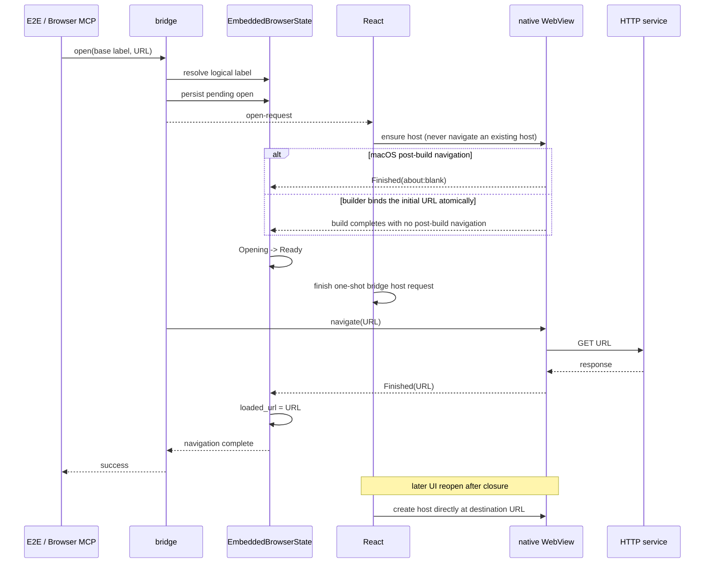

# Embedded-browser navigation and tabs

Scope: first page open through the bridge by an Agent or test, plus routing, load truth, and closure for multiple right-workspace browser tabs.

| Edge                                                     | Code owner                                                                |
| -------------------------------------------------------- | ------------------------------------------------------------------------- |
| Bridge authentication and dispatch                       | `wework/src-tauri/src/embedded_browser/bridge_server.rs`                  |
| Logical-label routing, pending request, navigation truth | `wework/src-tauri/src/embedded_browser.rs`                                |
| Tab creation, selection, and closure                     | `wework/src/components/layout/DesktopWorkbenchMain.tsx`                   |
| `about:blank` host creation and UI state                 | `wework/src/components/layout/workspace-panels/WorkspaceBrowserPanel.tsx` |
| Real-desktop multi-tab regression                        | `wework/e2e/desktop/scenarios/embedded-browser-multi-tabs.scenario.mjs`   |

Invariants: a base label is only a routing entry; every tab owns a distinct logical label and WebView; a bridge request is valid only while its first host is being created, and React uses ensure-host semantics that never navigate an existing host; on macOS, `build()` means only that the object exists, so the post-build bootstrap `about:blank` must emit `Finished` before `Opening → Ready`; other platforms bind the initial URL atomically in the builder and have no post-build navigation race; the bridge solely owns the first post-build destination navigation; only destination `Finished → loaded_url` completes `open`; close may destroy only the expected native label.

See the [embedded-browser developer guide](../wework/developer-guide/wework-embedded-browser.md) for capabilities and verification details.
