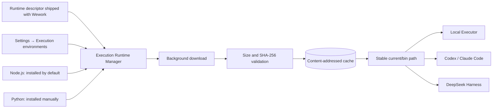
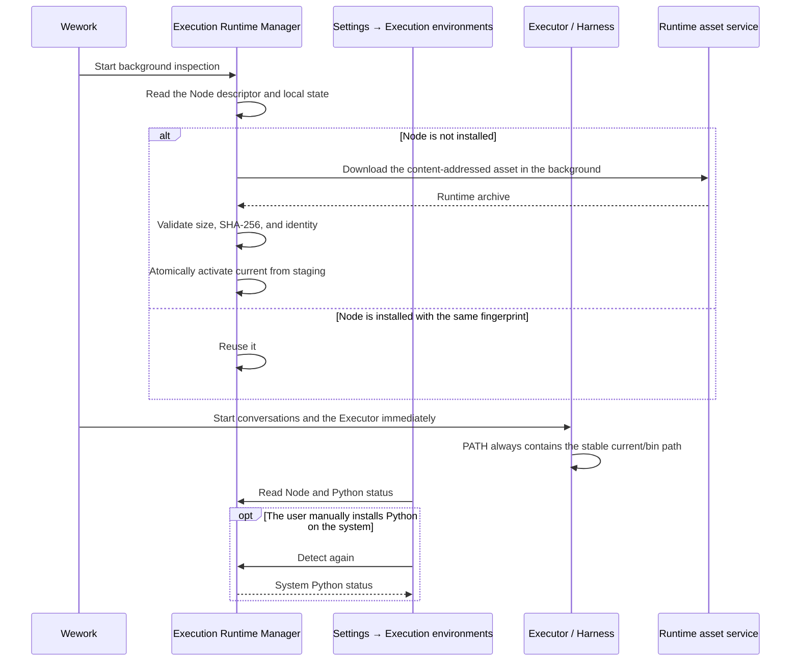

# Wework execution environments

Scope: Wework independently manages script runtimes used by Codex, Claude Code, Skills, MCP, and Smart apps without modifying the system PATH or blocking conversation startup on runtime installation.

| Edge                                                           | Code ownership                                                                                                             |
| -------------------------------------------------------------- | -------------------------------------------------------------------------------------------------------------------------- |
| Runtime descriptors and release assets                         | `wework/scripts/prepare-execution-runtime.mjs`, `.github/workflows/wework-app.yml`                                         |
| Download, validation, caching, activation, and status commands | `wework/src-tauri/src/execution_environments.rs`                                                                           |
| Executor and local Harness PATH injection                      | `wework/src-tauri/src/local_executor.rs`, `wework/src-tauri/src/local_terminal.rs`                                         |
| Shared Node for DeepSeek Harness                               | `wework/src-tauri/src/harness_apps.rs`, `wework/scripts/prepare-harness-runtime.mjs`                                       |
| Settings entry and management UI                               | `wework/src/plugin-runtime/core-settings-data.tsx`, `wework/src/components/settings/ExecutionEnvironmentsSettingsPage.tsx` |

Invariants: the managed Node environment lives in Wework-private application data and never modifies the system PATH, system Node.js, or system Python; conversations and Executor startup never wait for a Runtime download; every managed Node child process uses a stable `current/bin` path, and a Runtime is atomically activated from staging only after complete validation; failed, truncated, or mismatched downloads never pollute the current usable version; Wework upgrades reuse a Runtime when its content fingerprint is unchanged; Node.js installs in the background by default, while Python is never downloaded and only detects a Python installation that the user manages on the system; the DeepSeek Harness Runtime never carries a separate Node and shares Wework Node with Codex, Claude Code, and Skills; a failed update activation preserves the previously usable version; invoking an environment that is not ready returns a diagnosable error without blocking ordinary conversation or unrelated tools.
