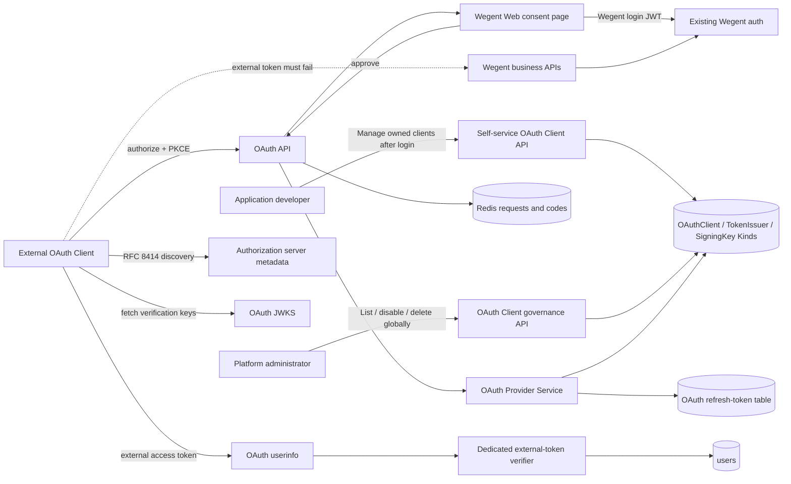
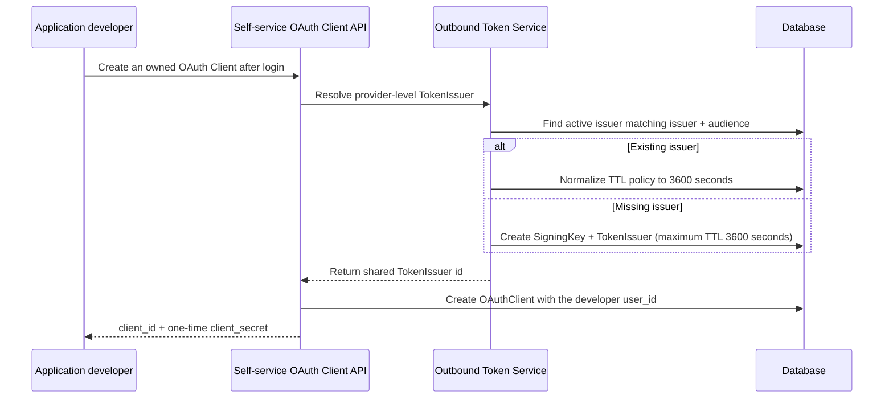
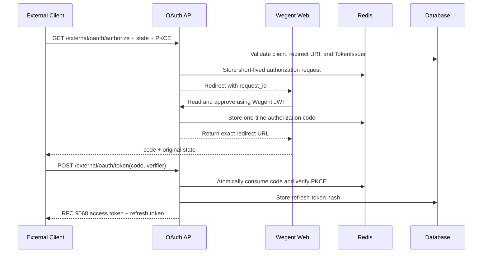
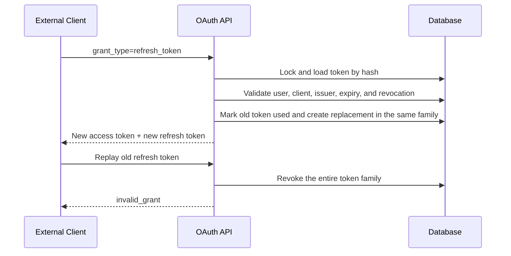

# External OAuth identity tokens

## Scope

Wegent acts as a constrained OAuth 2 authorization server that proves the current user's identity to registered external clients. External access tokens may read only the dedicated userinfo resource and grant no Wegent API or downstream business permissions.

See the [External OAuth 2.0 Integration Guide](../wegent/developer-guide/external-oauth-integration.md) for client registration, PKCE, token exchange, refresh, and revocation.

## Connection graph

## Provider initialization sequence

## Authorization-code sequence

## Refresh sequence

## Code ownership

| Responsibility                                                 | Owner                                                                       |
| -------------------------------------------------------------- | --------------------------------------------------------------------------- |
| OAuth protocol endpoints and errors                            | `backend/app/api/endpoints/oauth_provider.py`                               |
| Clients, codes, JWTs, and refresh rotation                     | `backend/app/services/auth/oauth_provider.py`                               |
| OAuth request, response, and Kind schemas                      | `backend/app/schemas/oauth_provider.py`                                     |
| Refresh-token persistence                                      | `backend/app/models/oauth_refresh_token.py`                                 |
| Developer self-service Client API                              | `backend/app/api/endpoints/oauth_clients.py`                                |
| Administrator Client governance API                            | `backend/app/api/endpoints/admin/oauth_clients.py`                          |
| Automatic provider-level SigningKey / TokenIssuer provisioning | `backend/app/services/auth/outbound_token_service.py`                       |
| Client management and consent UI                               | `frontend/src/features/settings/`, `frontend/src/app/auth/oauth/authorize/` |

## Essential invariants

- External access tokens may access OAuth userinfo only; existing Wegent JWT, API-key, and task-token authentication must reject them.
- Userinfo returns only `id`, `user_name`, and `email`; it never returns roles, auth sources, preferences, Git data, or resource permissions.
- Audience is fixed to `wegent-userinfo`, scope is fixed to `userinfo.read`, and clients cannot expand either.
- Authorization server metadata is published at the RFC 8414 location derived from the issuer, and exposes an OAuth-specific JWKS.
- External OAuth Provider APIs consistently use the `/external/oauth` prefix and do not share a namespace with Wegent login authentication or internal TokenIssuer APIs.
- SigningKey and TokenIssuer are OAuth Provider-level configuration, not OAuth Client configuration. The backend must reuse the same eligible signing resources and atomically create them when first needed; the TokenIssuer access-token maximum is fixed at 3600 seconds and must not depend on Client input.
- An OAuth Client belongs to the developer who created it through `Kind.user_id`. Ordinary users may list, update, rotate, and delete only their own clients, and client names need to be unique only within one owner.
- Administrators globally list, disable, and delete clients; they do not register applications or hold client secrets on behalf of developers.
- Provider protocol resolution searches every active OAuth Client by public `client_id`; it must not be restricted to clients owned by the system user.
- OAuth Client create and update APIs must not accept TokenIssuer or token TTL configuration; each Client manages only its own client id, secret, redirect URIs, and enabled state.
- JWT access tokens follow RFC 9068: they use `typ=at+jwt` and include and validate `iss`, `sub`, `aud`, `exp`, `iat`, `jti`, `client_id`, and `scope`.
- Redirect URIs match registered values exactly; authorization codes require well-formed PKCE S256, expire quickly, and are consumed once.
- Token and revocation endpoints allow exactly one client authentication method and reject requests combining HTTP Basic with body credentials.
- A client's access-token TTL cannot exceed its TokenIssuer limit; a referenced TokenIssuer cannot be deleted or changed to another audience.
- Authorization errors may redirect with the original `state` only after both the client and redirect URI are trusted; otherwise the provider returns a local error to prevent open redirects.
- Refresh tokens are stored only as hashes and rotate on every use; replay revokes the entire family.
- The RFC 7009 revocation endpoint accepts `token_type_hint` and returns success for unknown tokens without revealing token state.
- Disabling or deleting a client, rotating its secret, changing its type, or changing its TokenIssuer revokes its existing refresh tokens.
- Disabled users, clients, TokenIssuers, or SigningKeys cannot issue or refresh tokens.
- The consent page cannot be framed, does not leak Referer data, and is not cached.
- Logs never contain access tokens, refresh tokens, authorization codes, client secrets, or Authorization headers.
