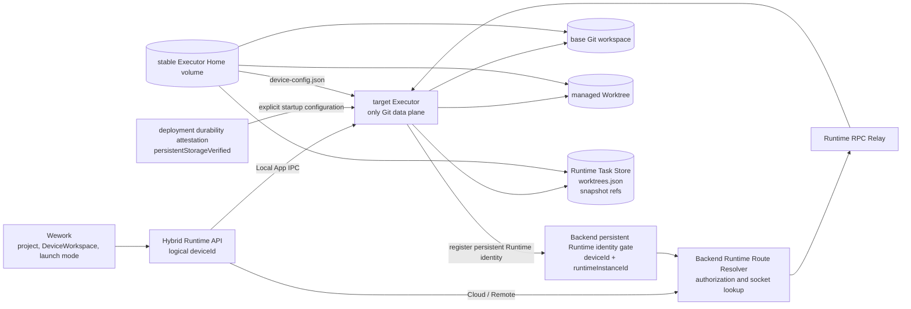
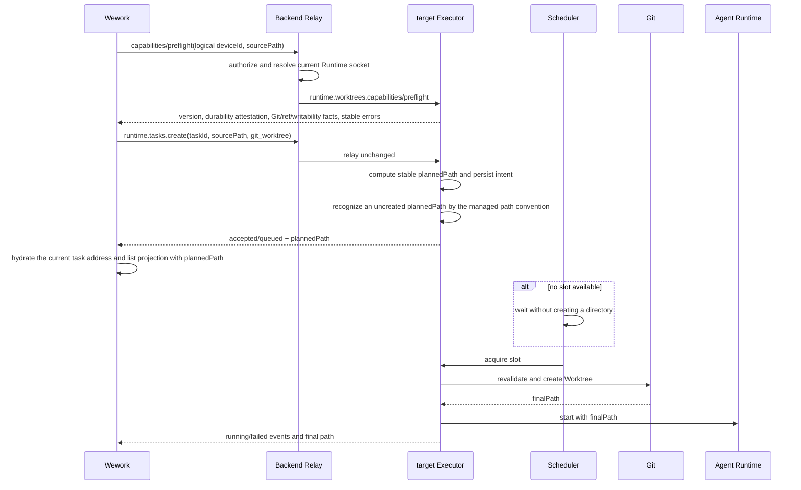
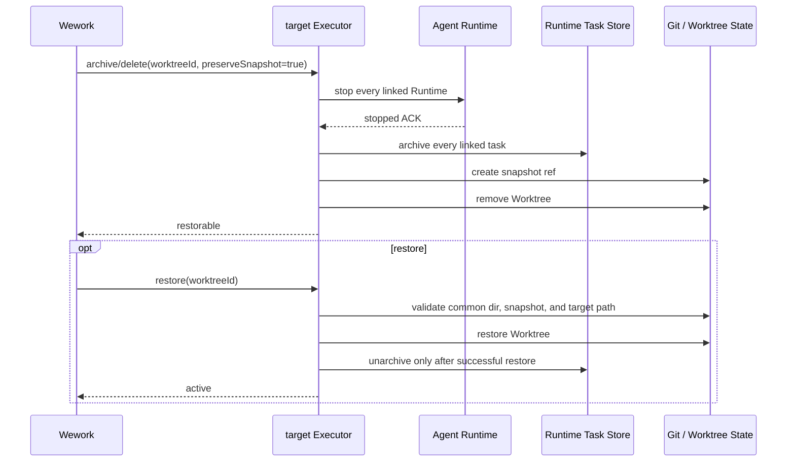

# Git Worktree execution

Scope: Worktree capability discovery, task creation, queuing, execution, archive, restore, cleanup, device routing, and UI projection for Local, Cloud, and Remote DeviceWorkspaces.

| Edge                                                                             | Code owner                                                                                                                              |
| -------------------------------------------------------------------------------- | --------------------------------------------------------------------------------------------------------------------------------------- |
| DeviceWorkspace selection, availability, preferences, and UI                     | `wework/src/features/workbench/`, `wework/src/components/chat/composer/`                                                                |
| Local/Cloud/Remote Runtime routing and task projection                           | `wework/src/api/`, `wework/src/features/workbench/useWorkbenchRuntimeMessaging.ts`, `wework/src/features/workbench/workbenchReducer.ts` |
| Logical-device authorization, persistent Runtime identity, and socket resolution | `backend/app/services/device/`, `backend/app/api/ws/`                                                                                   |
| Worktree capability, preflight, Git lifecycle, and state                         | `executor/src/runtime_work/`                                                                                                            |
| Cloud persistent volume, stable mount path, and single writer                    | cloud device provider, deployment configuration, `docker/device/`                                                                       |
| Cross-layer acceptance                                                           | `wework/e2e/desktop/`, `scripts/acceptance/`, Backend and Executor contract tests                                                       |

Essential invariants:

1. Backend never executes Git. Worktree files, Git common directories, snapshots, and lifecycle truth belong only to the target Executor.
2. External requests use logical `deviceId`; Backend resolves the current Runtime socket identity and verifies that both logical and Runtime identities belong to the current user.
3. Worktree support uses independent `runtime.worktrees.capabilities`. An optional live projection uses `runtime_features.worktrees` and never reuses the Skills, Plugins, and MCP `capabilities` payload. Unparseable `runtime_features` is treated as absent capability metadata without blocking device heartbeats. Cloud and Remote must also return `persistentStorageVerified=true`. Only a deployment that has verified a stable volume, a fixed canonical absolute mount path, and the single-writer constraint may inject that value. If it is missing or false, Wework disables Worktrees with `worktree_persistent_storage_unverified`.
4. `runtime.worktrees.preflight` creates no task Worktree. Every task-creation entry point passes through the same Worktree preflight gate, and `runtime.tasks.create` repeats the critical checks immediately before creation.
5. Worktree identity includes `deviceId` and stable `taskId/worktreeId`; no cross-device fallback, restoration, or deletion is implicit.
6. Request `workspacePath` is the base workspace. Response `workspacePath` is the stable planned or final Worktree path. A `git_worktree` response with no independent path, or with the base path, fails structurally. Backend and UI never fall back to the base directory or project it as a Worktree before receiving the planned path.
7. Queued tasks create no directory. Worktree preparation consumes a Runtime slot. Failure starts no Runtime and never falls back to the base workspace.
8. An existing target path is adopted only after proving that it is the expected Git Worktree for the same repository and Worktree ID.
9. Blocking Git and directory scans never run on the asynchronous RPC worker.
10. Deletion requires stop acknowledgement from every linked Runtime. Runtime exit or panic sends that acknowledgement through a scope-exit guard. Archive, snapshot, and removal happen in order, every failure preserves diagnosable data, and bulk archive uses bounded concurrency instead of accumulating stop timeouts linearly per stuck task.
11. Restart reconciliation may recover a manageable Worktree, but never auto-resumes an interrupted agent. Persistent failures are throttled with a fixed retry interval while preserving later retries.
12. One Executor process writes an Executor Home at a time. Cloud and Remote Executor Home, repositories, Worktrees, Runtime Store, and absolute mount path remain durably stable.
13. Launch-mode and branch preferences are scoped by DeviceWorkspace; execution location is not a launch mode.
14. Offline, missing route, timeout, disconnect, unsupported, non-Git, path-conflict, and non-durable-storage failures have stable distinct errors. Timeout and disconnect are marked retryable, but mutating RPCs are never automatically retried.
15. Terminal, IDE, file tree, Git, archive, restore, and settings always use the owning device and the task's final Worktree path. Remote file commands fail closed when Backend cannot authenticate an allowed workspace root; an empty root set never means unrestricted access.
16. Once restart reconciliation marks an interrupted task failed or cancelled, task-list projection never revives it as active from stale provider thread metadata. Only a provider turn newer than the local completion time can represent a new execution.
17. Cloud and Remote `runtimeInstanceId` is stored in Executor Home and becomes immutable after Backend first records it. Container or instance replacement must reuse that value. Registration of the same logical device with a new Runtime Instance ID is rejected as a persistent-storage identity mismatch; Backend never overwrites the established value or creates a bypass device record.
18. Deferred creation persists the source-repository fingerprint captured while planning and compares it with a freshly computed fingerprint after acquiring a slot. Replacing the source directory with another repository fails as `worktree_source_changed`.
19. A stop timeout has an unknown outcome. It never clears Runtime cancellation control or treats the task as stopped; an archive/delete retry still requires a stop acknowledgement from the same Runtime.
20. `preserveSnapshot=false` is terminal cleanup: the Executor deletes any existing snapshot reference and removes the record from `worktrees.json`; later `runtime.worktrees.list` calls never return a tombstone for the cleaned Worktree.
21. Workspace-kind detection for an existing workspace prefers Git metadata on the candidate root itself. An uncreated managed planned path is recognized first by the `worktrees/<id>/<project>` convention and is not rejected because a higher Executor source checkout has a `.git` directory. An existing candidate root with normal repository metadata remains a workspace and is never projected as a Worktree solely because an ancestor directory is named `worktrees`.
22. After Runtime accepts task creation, a work-list refresh failure only defers reconciliation; it never removes the accepted task from local visibility or reports the send as failed.
23. Optimistic Worktree navigation may carry only task identity before the planned path returns. Once the create response or task list first provides the planned or final path, Wework hydrates that path into the current task address. The current task, list projection, and later Terminal, IDE, and file operations never retain a pathless optimistic address indefinitely.

See [Cloud Git Worktree Goal Mode and Parallel Development Plan](../wework/developer-guide/wework-cloud-git-worktree-parallel-development-plan.md) for delivery waves, sub-agent write scopes, and the acceptance matrix.
