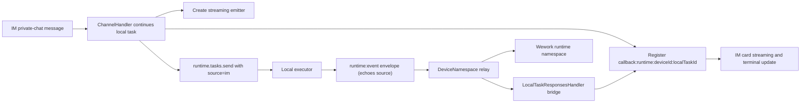
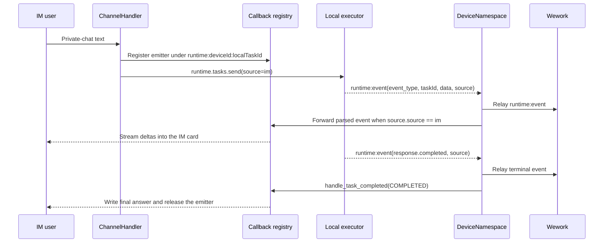

# IM private-chat continuation streaming from the native runtime

Scope: how model output returns to the IM card after an IM private-chat message continues a native runtime task. It excludes IM binding, `/switch` task selection, and cloud Shell execution.

| Boundary                         | Code ownership                                                        |
| -------------------------------- | --------------------------------------------------------------------- |
| IM continuation and registration | `backend/app/services/channels/handler.py`                            |
| Callback key and forwarding      | `backend/app/services/channels/callback.py`                           |
| `runtime:event` envelope         | `executor/src/runtime_work/events.rs`, `executor/src/local/backend.rs` |
| Relay and IM bridge              | `backend/app/api/ws/device_namespace.py`                              |
| Envelope normalization, terminal dialect | `backend/app/api/ws/local_task_responses.py`      |

Invariants: the native runtime returns streaming output only through `runtime:event` envelopes, so the flat `response.*` device events do not cover this flow and the relay path must forward IM callbacks itself; the callback key is always `runtime:<device_id>:<local_task_id>`, where `device_id` comes from the device session identity and must equal the `address.device_id` used at IM registration; envelopes use camelCase (`taskId`, `subtaskId`) and must be normalized before the event parser; the native terminal dialect differs from the Responses API — the final answer lives in `data.value` and failures in `data.error.message`, while the shared parser reads `data.response.output[].content[].text` and does not recognize `response.failed`, so terminal events must be translated into an `ExecutionEvent` in the bridge or the card finishes empty or hangs forever; envelopes without `source` or with `source.source != "im"` must not enter IM forwarding; the Wework relay runs before IM forwarding, and IM channel failures stay isolated per channel and must never block the relay or persistence; terminal events must go through `handle_task_completed` so the final content is written and the emitter is released, never deltas alone.
