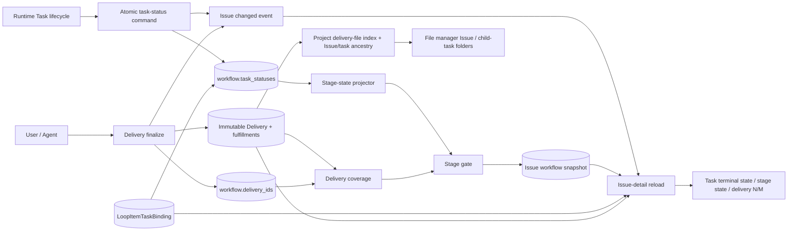
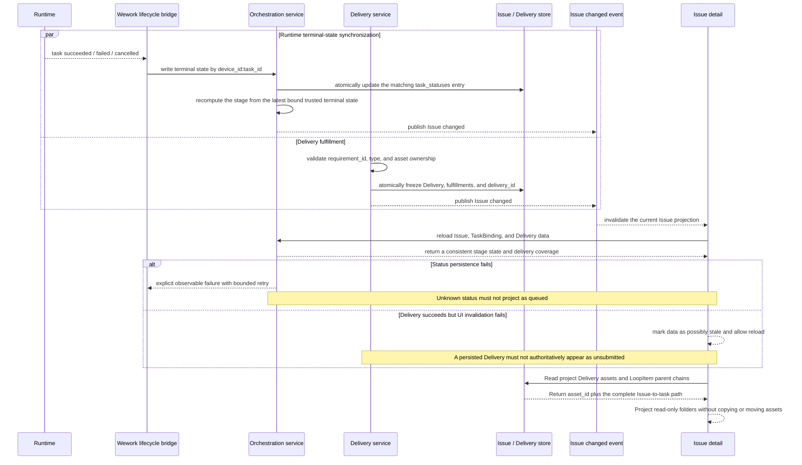

# Issue Runtime status, delivery, and UI projection

Scope: Runtime Task terminal-state projection into an Issue workflow, Delivery fulfillment projection into the stage gate, and a consistent Issue-detail view of tasks, stage state, and delivery coverage.

| Edge                                              | Code ownership                                                                                   |
| ------------------------------------------------- | ------------------------------------------------------------------------------------------------ |
| Runtime lifecycle → Issue status synchronization  | Wework `deliveries` API and the Backend `project_workflow_projection` atomic task-status command |
| TaskBinding + task status → stage state           | Wework `issueWorkflow`, Backend workflow projection                                              |
| Delivery finalize → fulfillment and node binding  | Backend Delivery service, `wework-space` MCP                                                     |
| fulfillment → N/M coverage and approval gate      | Backend deliverable projection, workflow decision service                                        |
| Issue changed → detail refresh                    | Backend `loop_item_events`, Wework `projectChatSocket`, and `CloudTodoWorkspace`                 |
| Issue, TaskBinding, Delivery → UI                 | Wework `TodoEditor`, `IssueWorkflowDag`                                                          |
| Delivery asset + LoopItem ancestry → file manager | Backend `cloud_files` service and cloud-project API, Wework `CloudFilesView`                     |

Essential invariants:

- Runtime Task state is keyed by stable `device_id:task_id` and updated atomically by the backend. A client must not read and rewrite the entire workflow JSON to change one task state.
- A human task may display queued only when Runtime explicitly reports queued. An unknown newly bound task state must preserve the backend stage state or display synchronizing; it must not infer queued.
- Stage state is derived from TaskBinding order and persisted terminal truth: any running task wins, otherwise the latest bound trusted terminal state wins; a successful human stage enters `awaiting_approval`.
- Delivery finalize atomically freezes the Delivery, typed fulfillments, and node `delivery_id`. Only persisted `fulfillments[].requirement_id` values count toward N/M.
- Runtime-state updates and Delivery finalize both invalidate the Issue-detail projection. A refresh must read Issue, TaskBinding, and Delivery together instead of mixing cache versions.
- Status-persistence failures return structured errors and use bounded retry. They must not create an unbounded PATCH loop or change UI semantics.
- Human approval uses a server-side live recomputation of stage state and delivery coverage, never a client cache or a possibly stale node snapshot.
- The project delivery-file index returns the complete persisted parent chain from the root Issue to the task owning the Delivery. The frontend must not infer task hierarchy from titles, identifiers, or file paths.
- The `parent_id` boundary for a root LoopItem includes both `NULL` and the historical empty string; either value terminates ancestry traversal.
- File-manager folders are a read-only projection of Delivery assets. Navigation, preview, and download never copy, move, or mutate the stored asset; file identity remains the original `asset_id`.
