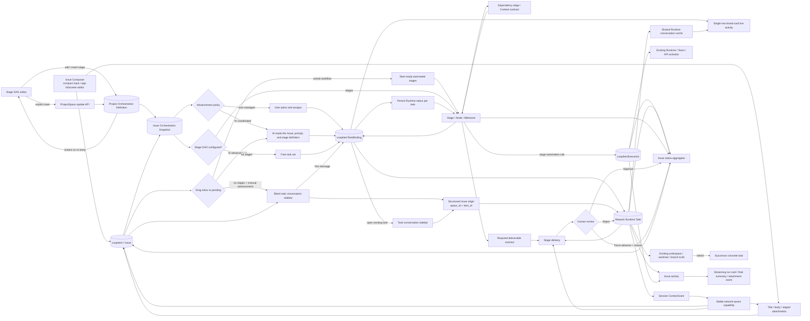

# Issue, task, and workflow orchestration

Scope: Issue task organization, advancement policy, project stage DAGs, Issue stage snapshots, references to concrete tasks and executions, dependency readiness, workspace inheritance, activity projection, and aggregated Issue status.



```mermaid
sequenceDiagram
    participant U as User
    participant C as Issue Composer
    participant G as Stage DAG editor
    participant O as Orchestration service
    participant A as AI coordinator
    participant B as Task binding
    participant E as Execution service
    participant R as Runtime scheduler
    participant Q as Runtime conversation cache
    participant K as Board card
    participant M as project-space capability
    participant V as Delivery service
    participant H as Human review service
    participant D as Issue activity
    participant I as Issue projection

    U->>C: Enter body and attachments
    opt Long-form editing is needed
        U->>C: Expand to the app-fullscreen editor
    end
    C->>O: Create the Issue, then upload attachments
    opt Insert a stage before or after the selected stage
        U->>G: Click the plus control on a stage handle
        G->>G: Rewire direct dependencies and migrate their edge context
    end
    U->>G: Click Save orchestration
    G->>O: Update the project Orchestration Definition
    O-->>G: Return the persisted definition and new project version
    opt Leave and re-enter Automation
        G->>O: Read the Orchestration Definition from the project snapshot
        O-->>G: Restore the saved policy, prompt, and stage DAG
    end
    O->>O: Snapshot policy, prompt, and optional stage DAG
    O->>O: Validate the DAG, edge context contracts, and ready stages
    U->>O: Drag the Issue from inbox to pending
    alt No stages and manual advancement
        O-->>U: Defer the status move and open the new-task Composer
    else Preset workflow or AI advancement
        O->>O: Persist pending and enter the configured orchestration
        O->>E: Preset workflow starts every ready automated stage
        O->>A: AI advancement starts the configured coordinator
        Note over O,U: Do not create a blank Runtime Task or open the new-task Composer
    end
    alt User managed
        U->>O: Click New Task in Issue detail
        O-->>U: Show a blank task conversation in the right sidebar
        U->>B: Create a concrete task on the first message, optionally in a ready stage
    else AI coordinated
        O->>A: Provide Issue, prompt, stage definition, edge context contracts, and execution truth
        A->>B: Decompose and assign concrete tasks
        Note over A,B: Every task belongs to a stage when stages exist
    end
    opt Stage has an automation action
        O->>E: Create a queued execution
        E->>R: Enter the existing capacity queue
    end
    B->>R: Concrete task enters the existing capacity queue
    B->>R: Carry structured space_id and item_id on every turn
    R->>M: Enable the stable capability with a ContextGrant
    M-->>R: Return the Issue description, attachments, and other current context
    R-->>Q: Store streaming thinking by device_id:task_id
    Q-->>K: Scroll tools and latest thinking while the bound task is running
    R-->>D: Stream progress, terminal result, and delivered assets
    B-->>O: Runtime Task status changes
    E-->>O: Execution status changes
    opt Human stage declares required deliverables
        U->>V: Upload and submit deliverables for the node
        V->>O: Bind delivered Delivery to the workflow node
    end
    O->>O: Persist each task status; running wins, otherwise aggregate the latest task terminal state
    alt Human-stage review prerequisites are satisfied
        O-->>U: Move node to awaiting approval
        U->>H: Approve / reject / force advance
        H->>O: Record actor, time, reason, and decision
    end
    O->>O: Unlock successors only after approval, force advancement, or trusted automated completion
    O->>I: Aggregate all required stages and free tasks
```

| Edge                                                                | Code ownership                                                                            |
| ------------------------------------------------------------------- | ----------------------------------------------------------------------------------------- |
| Issue Composer to Issue, draft, and attachments                     | Wework `IssueComposer` and ProjectSpace API; compact and fullscreen views share one draft |
| Stage DAG editing and adjacent insertion                            | Wework `ProjectWorkflowEditor`                                                            |
| Explicit orchestration save and re-entry restoration                | Wework `ProjectAutomationView`, `ProjectWorkflowEditor`, and ProjectSpace API             |
| Project orchestration definition and Issue snapshot                 | Backend workflow schemas/services; Wework Automation DAG UI                               |
| Dependency edge to successor context                                | Workflow node dependency context; Composer / automation instruction                       |
| User/AI coordination to concrete tasks                              | Standard Wework Composer, AI manager, `LoopItemTaskBinding`                               |
| Issue new/existing task to right-side conversation                  | `CloudTodoWorkspace`, `TodoEditor`, `AiChatModal`                                         |
| Runtime Task binding to stage-status synchronization                | `projectSpaceSelection`, `WorkbenchProvider`, and ProjectSpace API                        |
| Runtime Task binding plus conversation cache to board live activity | `CloudTodoWorkspace`, `CloudTodoBoardCard`, and `runtimeConversationCache`                |
| Stage task status history and latest-terminal aggregation           | Wework `issueWorkflow`, `IssueWorkflowDag`, and the Issue workflow snapshot               |
| Node deliverables to human review and advancement                   | Delivery API, workflow decision service, and `IssueWorkflowDag`                           |
| Issue board entry to manual task or orchestration                   | `CloudTodoWorkspace`, `workItemTaskInput`, and the Issue workflow snapshot                |
| Issue conversation to current project-space context                 | Runtime metadata, ContextGrant, bundled `wework-space` Plugin, and Local Gateway          |
| Stage to automated execution                                        | `project_automation_execution.py`, `loop_item_executions/service.py`                      |
| Workspace and successor-task inheritance                            | Runtime Task summary and Wework project work controls                                     |
| DAG readiness, stage, and Issue aggregation                         | Backend workflow service; local ProjectSpace service; live Wework projection              |
| Execution truth to Issue activity                                   | Project chat stream, task activity cards, delivery/attachment projection                  |

Invariants:

- `LoopItem` is the Issue and business aggregate, not one execution.
- The compact and app-fullscreen Issue creation views must edit the same body and staged attachments. Switching views must not recreate the draft, duplicate uploads, or change the create-Issue/create-task semantics.
- The app-fullscreen editor must cover both the left project list and right task area of the current board workspace, preserve the top-level 38px tab/title chrome, and keep the standard content inset below and around that chrome.
- The app-fullscreen collapse and close actions must be grouped on the right side of its header. The body and attachment area must use the available width with only standard page gutters instead of a fixed narrow width that creates unused space.
- Issue text drafts persist per target project space and creation mode, while staged `File` objects remain in process memory. Ordinary close preserves the draft; only successful creation or explicit discard removes it.
- Issue creation exposes no separate title field. Both compact and app-fullscreen views must derive the title from the body through the existing default rule. Attachments continue through the existing ProjectSpace attachment API after Issue creation.
- A Stage / Node / Milestone is a logical task category and dependency node, not an execution and not an executor type.
- Wework Runtime Tasks, Wegent Tasks, and `LoopItemExecution` remain the concrete task and execution truths. Stages only reference them and never duplicate state, directories, worktrees, branches, or queue fields.
- The stage DAG and advancement policy are orthogonal. User management and AI coordination both work with or without stages.
- A dependency edge is both a readiness constraint and a context contract from the predecessor stage to the successor. Core Issue context is always included; the edge controls whether predecessor final results, delivered assets, and execution activity are added.
- Edge context policy is stored as the successor node's input declaration for a direct predecessor. Removing a dependency must remove its policy as well.
- Inserting a stage before or after another stage must rewire every direct dependency in that direction and migrate each replaced edge's context policy to the semantically equivalent new edge. It must not drop branches, leave orphaned context, or introduce a cycle.
- Orchestration editing is a local draft and is written to the project only after the user invokes a clearly visible Save orchestration primary action. A successful save must adopt the definition and project version returned by the service, and re-entering the page must fully restore the persisted project definition.
- AI advances an Issue only by creating, assigning, and starting concrete tasks. With stages, every AI-created task belongs to a stage and follows its dependencies. Without stages, AI may decompose work from the Issue and prompt.
- When an Issue is dragged from Inbox to Pending, task entry must read that Issue's orchestration snapshot. Only no stages plus manual advancement is self-managed and therefore defers the move to open the new-task Composer. A preset workflow must persist Pending and start every ready automated stage; AI advancement must start the coordinator bound by the snapshot. Neither path may open the new-task Composer or create a blank Runtime Task merely to bypass it, and repeated entry must not create duplicate runs for the same stage or AI coordinator.
- Human stages in a preset workflow start only through an explicit user action. Issue detail must expose every ready human stage as a primary action outside the zoomable graph, label it as human execution, and provide Start work; the graph is structure and progress, never the only action entry. Start work opens the task Composer bound to that stage, and still creates no blank Runtime Task before the first message.
- After a Runtime Task is created for a human stage, the first persistent action is only `LoopItemTaskBinding`. Runtime Task cloud context must expose that binding's `workflow_node_id`, and binding completion must replay the known Runtime lifecycle. The UI must not represent the human task as a queued `LoopItemExecution` or invent Queued/In Progress before Runtime confirms running.
- The human-stage state machine is `blocked → ready → running → awaiting_approval → completed`. `awaiting_approval` blocks only successor advancement and must not prevent creating another human task in the current stage to correct results or supply missing deliverables. Rejection enters `changes_requested`, where either the existing task or a new task may continue the work. Force advancement enters `forced_completed`. `queued` is reserved for an existing automated execution waiting for Runtime capacity and must never describe an unstarted human stage.
- A node may declare zero or more required deliverables with stable IDs and value types. The task Composer and Issue detail must show those requirements and their fulfillment methods. A submitted Delivery must resolve through its source TaskBinding to exactly one `workflow_node_id` and bind every value to a `requirement_id`. Approval is forbidden while required deliverables are missing, while an authorized user may force advancement with a non-empty reason. See [Workflow stage deliverables and dependency context](workflow-stage-deliverables.md) for the complete lifecycle.
- An Agent bound to an Issue stage uses the shared `wework-space` MCP for the same Delivery creation, asset upload/download, read, finalize, and draft-discard capabilities available to a user. Write operations resolve the source TaskBinding from the ContextGrant Runtime address and never accept model-selected stage ownership.
- Each stage task's Runtime state is persisted in `task_statuses` under stable `device_id:task_id`, and Issue detail displays that state per task instead of exposing only the stage aggregate.
- A board card may subscribe to the shared Runtime conversation cache only through a `LoopItemTaskBinding`'s stable `device_id:task_id`. Loading a transcript in the task-conversation sidebar must merge it into that same cache, and an empty cache notification or snapshot must not erase activity already visible in the sidebar. Binding selection prefers a task that Runtime reports as running; when the Issue execution is already active but the work-list projection is still catching up, the card still subscribes to the current binding and renders activity only while the cache contains a streaming assistant. Tool activity and thinking share one fixed-height row with consistent typography. An indented guide visually associates that row with the task; the viewport hides its scrollbar while retaining scrolling and follows the newest status instead of growing the card with activity history. While a tool is running, that tool must be the latest visible item instead of being obscured by stale thinking; thinking becomes visible again after the tool settles and later reasoning arrives. Clicking the task activity region must open the bound task rather than only the Issue, and the outside-dismiss layer must not cover the board's native scrollbar. This content is an ephemeral read-only projection: it is never copied into `LoopItem`, `LoopItemExecution`, or stage state and never drives a state transition.
- When a board status change starts a task automatically, the conversation panel may remain mounted invisibly to create the task and retain its stream subscription, but it must not open the Issue detail or task sidebar. The bound task is revealed only after the user explicitly clicks its activity region.
- Moving an Issue from Inbox to Pending first opens the task-send composer so the user can confirm its content; the status change is deferred until that confirmation. After the user sends the task, the conversation continues creating and running in the background and the task-conversation sidebar closes.
- A stage is `running` while any bound task is running. Otherwise, the trusted terminal state of the most recently bound task determines the current stage result. A later success supersedes an older failure for stage aggregation, while the old task remains visibly failed in task history. Issue detail rendering and human-decision validation must recompute the stage from task truth instead of trusting a potentially stale stage snapshot. Human-stage success enters `awaiting_approval`; it never completes automatically.
- Only approval or force advancement unlocks successors. Rejection preserves tasks, deliverables, and prior decisions instead of rolling them back or overwriting audit history.
- Every node decision records action, actor user id, reason, and timestamp. Force advancement requires a non-empty reason; approval may include a note; rejection requires a reason.
- Issue detail must expose stable entries for task re-entry, deliverable upload, approval, rejection, and force advancement. A stage task row remains reopenable after the right-side conversation is closed.
- New Task in Issue detail only opens a blank Composer in the same right sidebar used by existing task conversations. No Runtime Task or `LoopItemTaskBinding` exists before the first message is sent.
- Every Runtime turn started or continued from an Issue carries structured `space_id` and `item_id` and converts them into a session-isolated ContextGrant. The Runtime must not inject a complete MCP Server definition per task or rely only on natural-language prompts or `cloud://` text detection. See [Project-space Agent capability](project-space-agent-capability.md) for the capability lifecycle.
- One Issue may bind multiple heterogeneous tasks, and one stage may aggregate multiple concrete tasks. Tasks remain discoverable in Wework's task list.
- Stage automation controls when and how a concrete execution is created or started; it is not an entity type parallel to Task.
- `inherit` reads a confirmed workspace/worktree/branch only from an explicit predecessor Runtime Task. Without an inheritable source, the standard Composer must request a selection instead of guessing.
- Queued, approval-pending, and dependency-blocked work projects to Pending. Only Runtime-confirmed running work projects to In Progress.
- An automated stage completes from the trusted terminal state of its executions. A human stage additionally requires approval or force advancement. An Issue completes from all required stages and free tasks. Completing one task or delivery cannot complete a stage or Issue with unreviewed work.
- The DAG must be acyclic. A referenced stage must exist, dependencies must be satisfied before a stage starts, edge context may reference direct predecessors only, and the UI must never write running directly.
- Issue Activity is the unified execution projection. Streaming cards show compact Runtime truth, completed cards show a final-content summary, and attachment events reference real delivery assets.
