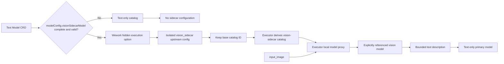
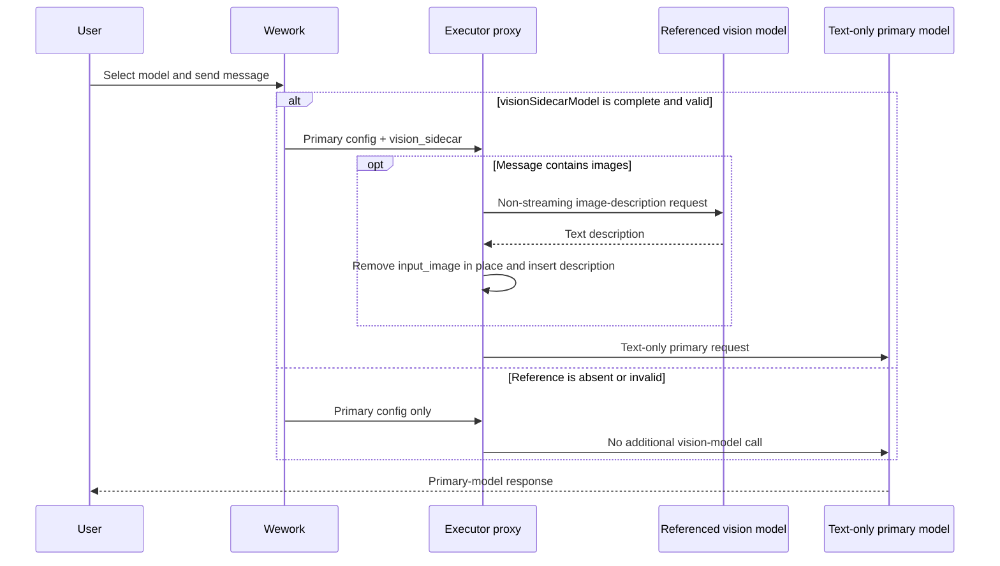

# Text-model vision delegation

Scope: when Wework runs an image-bearing Codex request with a text-only model, it constructs a sidecar only from the explicit vision-model reference in the Model CRD and replaces images with text descriptions before the primary request. Vision capability is represented by a generic derivative of the base catalog entry, without model-specific sidecar mappings.

| Edge                                             | Code ownership                                           |
| ------------------------------------------------ | -------------------------------------------------------- |
| Cloud explicit-reference editing and constraints | `frontend/src/features/settings/`                        |
| Safe Model CRD config aggregation                | `backend/app/services/model_aggregation_service.py`      |
| Cloud-reference validation and hidden option     | `wework/src/features/workbench/runtimeModelSelection.ts` |
| Local/cloud sidecar upstream configuration       | `wework/src/api/local/localServices.ts`                  |
| Base catalog and upstream-model identity metadata | `shared/assets/codex-models/`                           |
| Generic vision catalog derivation and selection | `executor/src/server/codex_model_catalog.rs`             |
| Image description, cache, limits, replacement    | `executor/src/server/local_model_proxy/vision.rs`        |
| Proxy registration and primary forwarding        | `executor/src/server/local_model_proxy/mod.rs`           |
| Cloud Model to Codex catalog identity mapping    | Wework runtime selection and Backend trigger paths       |

Invariants: the vision model comes only from an explicit `modelConfig.visionSidecarModel` reference and is never selected automatically from sign-in state, model names, or defaults; an absent, structurally invalid, stale, inaccessible, inactive, non-image-capable, or `apiFormat`-mismatched reference must not configure a sidecar, advertise image capability, preprocess images, or make an additional model call; the explicit reference contains model name, type, namespace, resource owner, and `apiFormat`, but no provider credential; runtime configuration carries only the applicable gateway credential or executor-bound local credential, neither of which is exposed to Codex or logs; with a configured sidecar, Executor derives a hidden vision catalog from the effective base catalog and changes only its identity, display metadata, visibility, and input modalities while preserving all reasoning, tool, context, and compaction capabilities; without a sidecar, the base catalog remains selected; adding a base model must not require sidecar-specific constants, mappings, or copied catalog entries; the original image reaches only the referenced vision model and the primary model receives text; sidecar timeouts, invalid images, or upstream failures remove the original image and insert an explicit failure description; logs contain no images, credentials, or prompt bodies.

See [Wework settings](../wework/settings.md) for configuration and limits.
