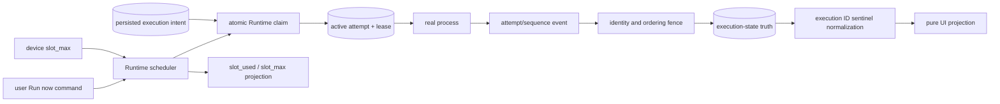
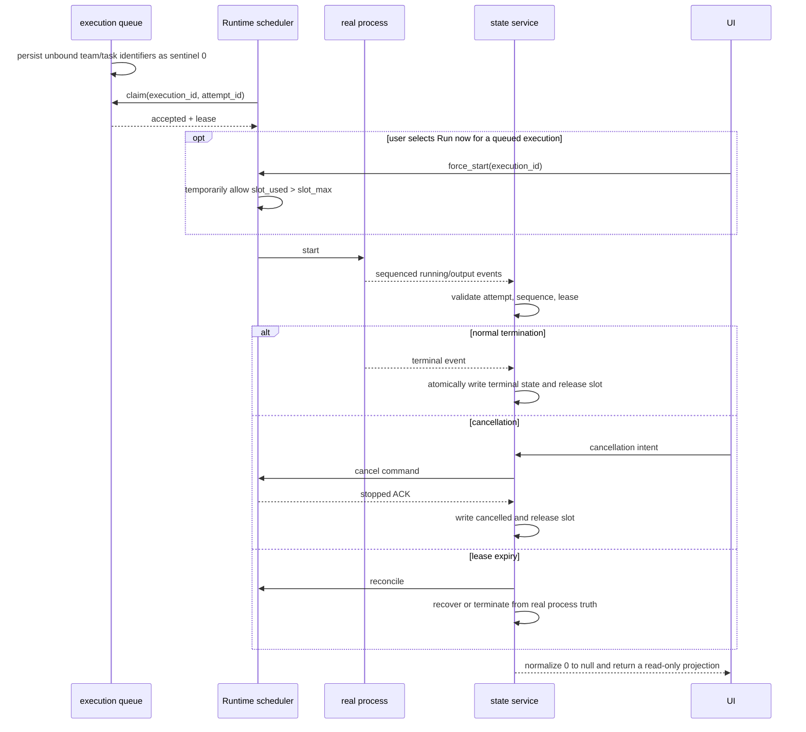

# Project execution state and Runtime capacity

Scope: execution claim, event ordering, cancellation, late events, lease reconciliation, device concurrency capacity, and UI projection.

| Edge                                  | Code owner                                                      |
| ------------------------------------- | --------------------------------------------------------------- |
| Claim, attempt, and state transitions | `backend/app/services/loop_item_executions/service.py`          |
| Execution ID storage and normalization | `backend/app/models/loop_item_execution.py`, execution API/schema |
| Scheduler, slots, and real process    | `executor/src/runner/`, `executor/src/runtime_work/`            |
| Local IPC and Runtime RPC             | `executor/src/local/app_ipc.rs`, Backend device runtime service |
| UI projection                         | Wework workbench stores and board queries                       |

Invariants: attempt identity and event sequence must match; late events cannot overwrite a newer attempt; terminal state and slot release are atomic; sending cancellation is not cancellation success, and Runtime scope exit must guarantee the stopped acknowledgement; `loop_item_executions.team_id/backend_task_id=0` means unbound only, existence checks must use positive-ID semantics, and APIs/UI must normalize the sentinel to `null`; capacity belongs to each device Runtime scheduler and aggregate capacity is not execution truth; persisted queue state and queued task IDs come from one scheduler snapshot; Run now may temporarily push a selected queued execution beyond `slot_max`, in which case `slot_used` is projected exactly from active task IDs and no other queued execution starts automatically until active usage drops below the limit; UI never derives or writes runtime state.

See [project execution state-of-truth refactoring](../wework/developer-guide/wework-project-execution-state-truth-refactoring.md) for the detailed state matrix and acceptance coverage.
