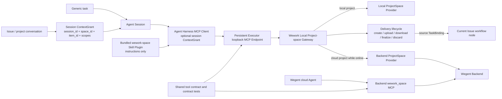
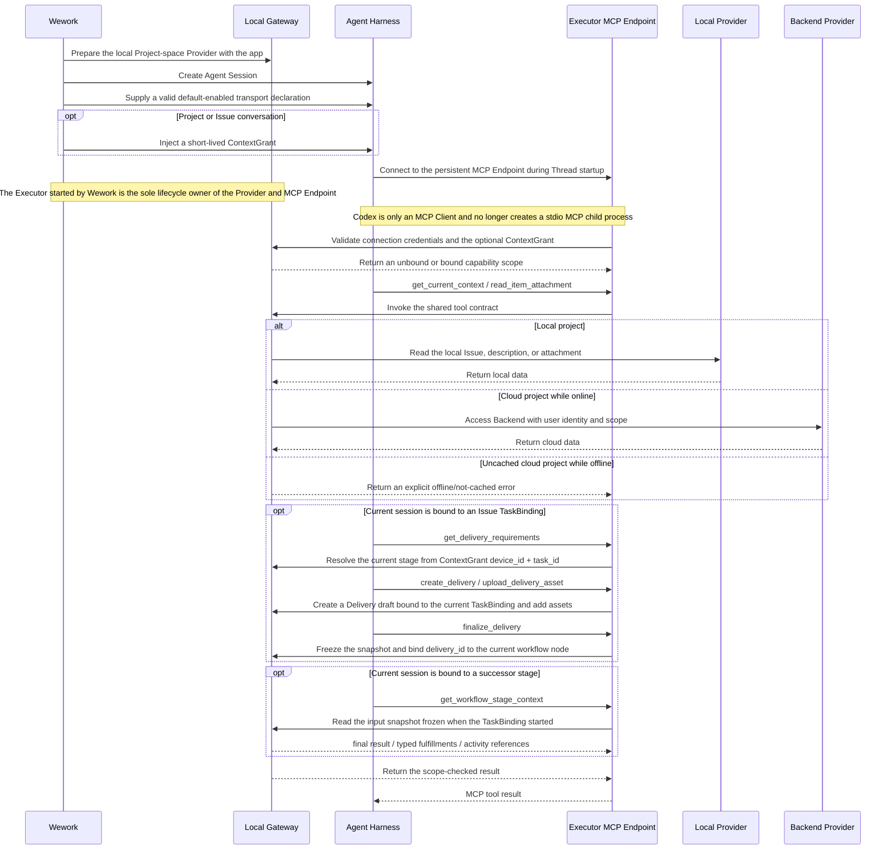

# Project-space Agent capability

Scope: installation, session enablement, Issue-context binding, local offline access, cloud routing, and Agent Harness adaptation for project-space tools in Wework.

| Edge                                                 | Code ownership                                                       |
| ---------------------------------------------------- | -------------------------------------------------------------------- |
| Wework startup to Local Provider lifecycle           | Wework Tauri local executor; Executor local ProjectSpace provider    |
| Agent Session to ContextGrant                        | Wework Runtime message metadata; Executor session context registry   |
| Agent Session to persistent MCP Endpoint             | Executor Codex adapter; Executor `task_runtime/mcp_http.rs`           |
| Codex to project-space capability                    | Codex MCP Client; Executor loopback Endpoint                          |
| Plugin to Codex usage instructions                   | Bundled Wework `wework-space` Skill Plugin                            |
| Gateway to Local Provider                            | Executor `task_runtime` and local ProjectSpace provider              |
| Gateway to Backend Provider                          | Executor authenticated Backend ProjectSpace client                   |
| MCP to Delivery lifecycle                            | Executor `task_runtime/mcp.rs`, Delivery API, and local ProjectSpace  |
| Delivery to current workflow node                    | ContextGrant Runtime address, `LoopItemTaskBinding`, Delivery service |
| Cloud Agent to Backend MCP                           | Backend `wework_space` MCP                                           |
| Shared tool contract to every Adapter                | Shared schema, tool names, permission semantics, and contract tests  |

Invariants:

- MCP installation and service declaration are stable configuration; `space_id`, `item_id`, and permissions are session data. Issue context must not be represented by mutating the task's complete MCP Server list.
- Local-project Issues, descriptions, and attachments remain available when Wework is disconnected from Backend. Backend is the cloud-project Provider, not a prerequisite for local capability.
- The Plugin is only the Codex Adapter. Gateway, ContextGrant, and tool contracts must not depend on Codex-specific types.
- Starting Executor must also start the single persistent loopback MCP Endpoint. Codex app-server may only connect to that Endpoint and must never execute `executor space-mcp-server` to create a stdio child process.
- The Plugin MCP declaration is the product packaging entry point. Runtime supplies the default-enabled state, actual Executor path, and optional session ContextGrant, so correctness cannot depend on opening the plugin marketplace UI or on asynchronous installation timing.
- The project-space MCP is enabled by default for every Agent session. Generic tasks remain unbound and may select a project explicitly; project or Issue conversations receive default `space_id/item_id` values and out-of-scope protection through ContextGrant.
- A ContextGrant is Agent-session scoped and hidden from the model. Its one-hour validity only limits bootstrap of a new MCP session; once accepted, the lease follows the session adapter lifecycle, so a long-running turn is not interrupted and adapter exit revokes access. Model arguments, prompt text, and a global current-project value are never authorization sources.
- Generic tasks do not bind project context. Project conversations may bind only `space_id`; Issue conversations bind `space_id + item_id`.
- `get_current_context` returns an explicit unbound result when no context exists. MCP startup failure, missing permission, cloud-project offline, and uncached data are distinct errors.
- The Gateway rejects explicit `space_id/item_id` outside the ContextGrant scope and never trusts identifiers supplied by the model.
- Delivery write tools are available only to an Issue session bound to `space_id + item_id + device_id + task_id`. `source_task` and `workflow_node_id` are derived from the ContextGrant and the active `TaskBinding`; the model cannot specify or override them.
- Local and cloud Providers expose the same semantics for `get_delivery_requirements`, `create_delivery`, `upload_delivery_asset`, `list_deliveries`, `read_delivery`, `download_delivery_asset`, `finalize_delivery`, and `discard_delivery_draft`. Ordinary Issue-attachment tools never substitute for Delivery tools.
- Local and cloud Providers expose the same `get_workflow_stage_context` semantics and return the scope-checked input snapshot frozen when the TaskBinding starts; reads never rebuild drifting predecessor data.
- `create_delivery` chat selection is resolved server-side from the current Issue timeline and supports all messages, the latest N messages, or explicit message IDs; model-supplied message content is never trusted as the result of a selection.
- Delivery-asset download verifies that the asset belongs to a Delivery visible under the current Issue. Upload and discard operate only on a still-draft Delivery created by the current session. `finalize_delivery` reuses the immutable snapshot boundary and binds the Delivery to the unique workflow node of its source TaskBinding.
- Before the first model turn, Runtime validates persistent Endpoint readiness, fixed capability configuration, and ContextGrant. It must not call `mcpServerStatus/list` or another inventory API that can actively start, restart, or enumerate MCP servers. Runtime only observes connection status emitted by Codex app-server. A capability connection failure terminates the current execution while the conversation UI preserves both the user message and failed assistant response.
- A bound Issue conversation that reads the current description or attachments follows one deterministic path: `get_current_context` → `get_board_item` → `list_item_attachments` → `read_item_attachment`. It must not use MCP resource listing, a browser, Shell, `curl`, or direct `wegent://` parsing to infer capability availability.
- Local, remote, and Backend MCP implementations share the same tool schema and contract tests. Providers choose data location without changing tool semantics.
- After migration, the per-task `ensure_space_mcp_server` service-injection path is removed; two primary paths must not remain.
