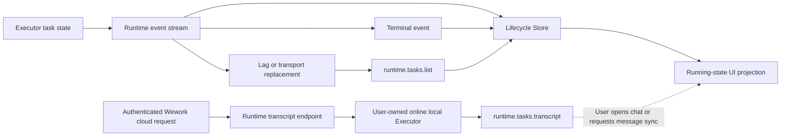
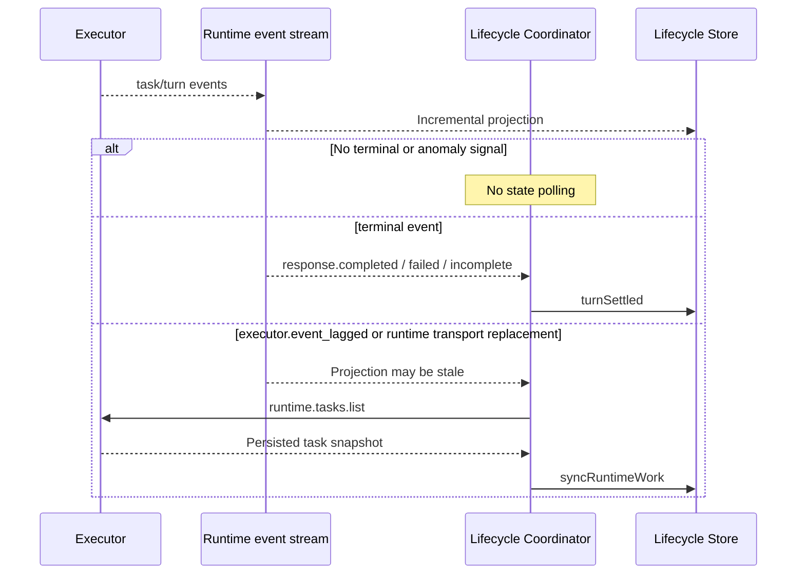

# Runtime task lifecycle reconciliation

## Scope

Governs how Wework consumes Runtime task events, detects a potentially stale local projection, and recovers authoritative task state without polling transcripts.

## Connection graph

## Sequence

## Code ownership

| Responsibility                                | Code                                                                                           |
| --------------------------------------------- | ---------------------------------------------------------------------------------------------- |
| Local Executor event bridge and service reuse | `wework/src/api/local/localServices.ts`, `wework/src/api/runtime/runtimeChatStream.ts`         |
| Hybrid stream handler routing                 | `wework/src/api/hybrid/hybridServices.ts`                                                      |
| Event-driven reconciliation coordinator       | `wework/src/features/workbench/runtimeTaskLifecycle/RuntimeTaskLifecycleStreamCoordinator.tsx` |
| Lifecycle truth projection                    | `wework/src/features/workbench/runtimeTaskLifecycle/RuntimeTaskLifecycleStore.ts`              |
| Executor task list and transcript             | `executor/src/runtime_work/handler/queries.rs`                                                 |

## Essential invariants

- The normal lifecycle consumes only the event stream and never reads task lists or transcripts on a timer.
- The same underlying local Executor transport must reuse one Runtime event stream. Preference refreshes or equivalent identity objects must not rebuild its native listener, which would accumulate listeners and create a terminal-event gap while subscriptions move.
- A terminal event locates the task by `deviceId + taskId` and independently writes `turn.outcome` for its `turnId` into the shared lifecycle store. The resident coordinator must not depend on a mounted pane or overwrite that turn outcome with a task list read immediately after the event or with a stale snapshot that arrives later, because the Executor and provider list projections may still be finishing the same turn.
- `executor.event_lagged` and runtime transport replacement also trigger reconciliation because they explicitly indicate that the local projection may be stale.
- Concurrent anomaly signals share one in-flight reconciliation request; new signals during that request coalesce into at most one serial trailing reconciliation and never create a concurrent request burst or timed retry loop.
- Persisted `task.status` is projected from Executor state fields, while `turn.outcome` is projected independently from terminal events. A task snapshot that still reports `active` must not erase an already settled turn outcome. Neither value is inferred from transcripts, turn items, or rollout JSONL.
- Transcript reads serve only user-visible chat loading or explicit message synchronization; they are not lifecycle heartbeats. Cloud reads must pass through the authenticated Runtime transcript endpoint, validate device ownership, and delegate to the user-owned online local Executor; direct or cross-Executor reads are forbidden.
