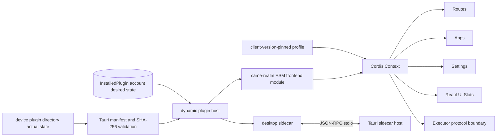
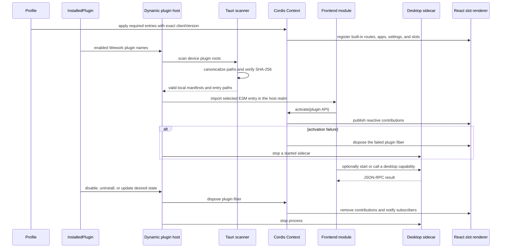

# Wework host plugin runtime

Scope: product composition, dynamic installation, lifecycle, UI contributions, desktop sidecars, and failure recovery for Wework React and Tauri, excluding the Executor implementation. Backend owns packages, account desired state, and device actual state, but never executes plugin code.

| Edge                                                                          | Code owner                                                         |
| ----------------------------------------------------------------------------- | ------------------------------------------------------------------ |
| Context, services, and plugin fibers                                          | Pinned `@deepseek-ai/cordis`                                       |
| Wework routes, apps, settings, slots, and SDK                                 | `wework/src/plugin-runtime/`                                       |
| React slot contracts and React 19 renderer                                    | `wework/src/plugin-runtime/slots.tsx`                              |
| Built-in required profile and product entrypoints                             | `wework/src/plugins/`                                              |
| Manifest scan, path/SHA-256 checks, sidecar lifecycle                         | `wework/src-tauri/src/workbench_plugins.rs`                        |
| Plugin manifests, account desired state, and device installation actual state | Backend plugin schemas/services and device capability sync         |
| Executor startup and protocol transport                                       | Existing Executor bridge; Executor internals are outside this flow |

Invariants: the product entrypoint loads only a profile and never enumerates concrete features; every registration belongs to a Cordis effect, and unloading may leave no route, slot, setting, app, listener, or process behind; React, ReactDOM, Cordis, and the Wework Plugin SDK have exactly one host instance across frontend plugins; required plugins must be pinned by the client profile to an exactly matching `clientVersion` and account desired state cannot disable them; optional plugins load only when the account enables them and the current device has a valid manifest with matching content hashes; dynamic registration and unloading must notify React subscribers; packages without `.wework-plugin/plugin.json` remain valid Executor capability plugins; frontend plugins execute in the same JavaScript realm with host-page authority, so SHA-256 proves content integrity but not publisher identity or permission isolation; sidecars may start only from verified files inside their package root and the requested plugin ID must match the manifest; Backend never loads or executes plugin code.
