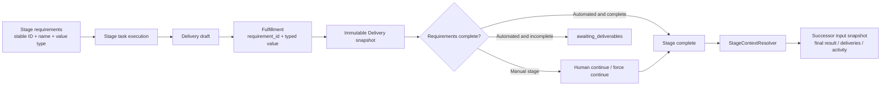

# Workflow stage deliverables and dependency context

Scope: structured required deliverables, Delivery fulfillment, manual and automated stage gates, code evidence, and predecessor context entering successor tasks.



```mermaid
sequenceDiagram
    participant U as User / Agent
    participant D as Delivery service
    participant W as Workflow service
    participant R as StageContextResolver
    participant N as Successor Runtime Task

    U->>D: Create Delivery draft bound to the current TaskBinding
    U->>D: Upload assets
    U->>D: finalize_delivery(typed fulfillments + requirement_id)
    D->>D: Validate scope, type, references, and immutable snapshot
    D->>W: Attach delivery_id to the current workflow node
    alt Manual stage
        U->>W: Continue or force continue with a reason
        W->>W: Validate all requirement fulfillments
    else Automated stage
        W->>W: Complete when full; otherwise awaiting_deliverables
    end
    W->>R: Start successor stage
    R->>R: Resolve direct dependencies and dependency_context
    R-->>N: Freeze StageInputSnapshot and hash
    N->>D: Read or download referenced delivery assets
```

| Edge | Code ownership |
| --- | --- |
| Workflow definition → structured requirements | Issue workflow schema, Wework workflow editor |
| TaskBinding → Delivery fulfillment | Delivery service, Local ProjectSpace store |
| Delivery → stage advancement gate | Workflow decision/projection service |
| Runtime terminal state → final result and code evidence | Runtime lifecycle projection, Executor file-change artifacts |
| Predecessor stage → successor input snapshot | StageContextResolver, manual and automated task launch paths |
| Input snapshot → Agent reads and downloads | `wework-space` MCP, local and cloud Providers |

Invariants:

- Every requirement has a stable `requirement_id`, a user-editable name, and a deterministic value type. Rename and reorder must preserve the ID.
- Value types define storage and deterministic validation only. The system does not call another AI to decide semantic claims such as whether an image depicts a cat; the human continuing a manual stage reviews semantics, while the original Agent self-checks automated work.
- A Delivery fulfillment must reference a requirement in the current stage snapshot. File references must belong to the same Delivery draft; cross-Issue, cross-stage, and forged references are rejected.
- The `finalize_delivery` MCP schema must expose the complete typed fulfillment contract. When the stage has required deliverables, an empty fulfillment list cannot produce a `delivered` snapshot. `Delivery.status=delivered` means only that the container is immutable; only persisted `fulfillments[].requirement_id` values count toward stage coverage.
- A human stage in `awaiting_approval` still accepts new stage tasks that correct results or supply missing fulfillments; waiting for approval must not make the current stage non-executable.
- A finalized Delivery is immutable. Re-fulfillment creates a new Delivery; the latest valid fulfillment is current while all history remains preserved.
- Normal continuation of a manual stage requires every required deliverable. Force continuation may omit them but requires a non-empty reason. An incomplete automated stage enters `awaiting_deliverables` and completes automatically after the missing items are supplied.
- `git_branch` and `pull_request` requirements authorize the Agent to perform the matching remote write only from its isolated workspace. No declaration means no automatic push or PR/MR creation. PRs and MRs are Draft by default.
- Code evidence must be reproducible: prefer a verified remote commit; otherwise freeze a patch, changed-file manifest, and checksum. A non-Git workspace packages changed files plus a deletion manifest and excludes secrets, dependency directories, and build output.
- A successor reads direct predecessors only. Base Issue context always transfers; every other source follows the edge's `final_result`, `deliveries`, and `activity` selection exactly.
- Stage input is frozen with a hash when the task starts and cannot drift during execution. Local, cloud, manual, and automated launch paths share one resolver contract.
- Delivery binaries transfer by reference, never inline in prompts. Cross-workspace code restoration tries an exact remote commit, then a patch, then a non-Git changed-file bundle; restoration failure blocks launch.
