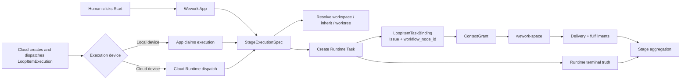
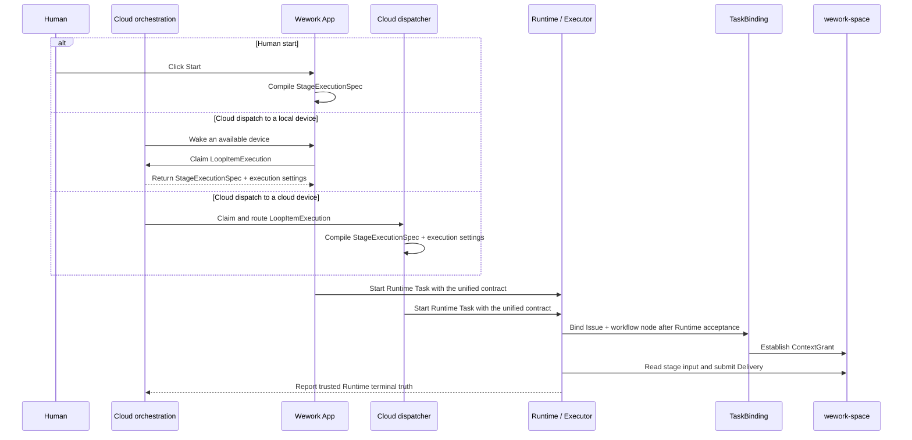

# Workflow stage execution routing

Scope: how human clicks, cloud automation dispatch, local execution devices, and cloud execution devices converge on one stage-task execution contract.

| Edge | Code ownership |
| --- | --- |
| Workflow node → `StageExecutionSpec` | Backend `workflow_stage_context.py`, Wework `workItemTaskInput.ts` |
| Cloud queue → local-device claim | Backend `loop_item_executions`, Wework `localRobotQueueDispatcher.ts` |
| Cloud queue → cloud-device start | Backend robot queue dispatcher, Runtime execution dispatcher |
| Runtime acceptance → TaskBinding | Backend `loop_item_executions/service.py`, `loop_items/service.py` |
| Workspace policy → Runtime workspace | Wework Runtime work resolver, robot execution profile |
| TaskBinding → ContextGrant / Delivery | Executor project-space gateway, Delivery service |

Invariants:

- Human click and cloud dispatch are only start sources; local and cloud devices are only execution locations. All four combinations use the same `StageExecutionSpec`.
- `StageExecutionSpec` includes at least the Issue, target `workflow_node_id`, frozen stage input and hash, concrete task instruction, required deliverables, and workspace policy.
- A robot may append its role prompt and use configured model, device, concurrency, and permission defaults. It cannot change stage instructions, delivery requirements, dependency context, TaskBinding, ContextGrant, or status aggregation semantics.
- After Runtime accepts a task and before the first model turn, a `LoopItemTaskBinding` for the current Runtime address must exist. Automated stages cannot bypass binding.
- Human and robot starts use the same workspace policy. `inherit` resolves an explicit predecessor TaskBinding; `composer` uses human selection or the robot's configured project. Missing deterministic workspace input blocks launch.
- The stage prompt and Delivery instructions belong in the concrete user task message. Structured context supports deterministic reads and validation; it does not replace the task instruction.
- Delivery stage ownership is derived only from ContextGrant and TaskBinding. The model, start source, and transport cannot specify or override it.
- A local claim may be woken through WebSocket and fetch its payload through `claim`; this is a cloud-dispatch transport detail, not a separate task semantic.
