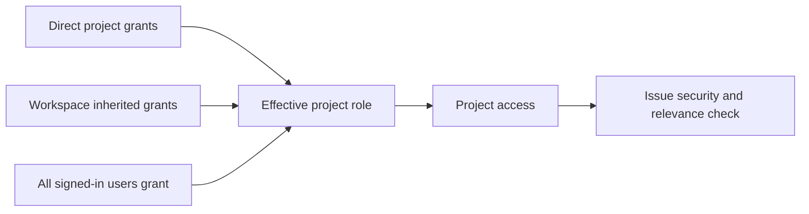

# Project roles and issue visibility

Cloud projects use one set of roles: Owner, Maintainer, Developer, and Viewer. Owners administer the project and members. Maintainers manage settings, members, assignments, and issue security. Developers create and edit visible issues. Viewers have read-only access. Creators retain Owner access. Workspace members inherit Viewer access through the existing project association; direct project grants can raise their role.

Private and public access are represented by grants in `resource_members`. A public project grants Viewer or Developer to all signed-in users; a private project has no such grant. Direct, inherited, and all-user grants combine using the strongest role. Pending, rejected, and invalid grants have no effect. Archived projects remain inaccessible.

Issue visibility is configured separately. Project settings define the default security level for new issues. Each issue can be `open` (visible to project members) or `related` (visible only to related people). Owners and Maintainers see all issues. Other roles see open issues and related issues they created, are assigned to, collaborate on, have an active task binding for, or that are assigned to a robot they created. Lists, details, deliveries, executions, and project conversations use the same check; unrelated issue reads return 404.

DingTalk AI Table records are served directly by DingTalk, so DingTalk controls record access. Wework project roles control entry and editing in the table view; Wework issue security levels do not apply to those records.

Project lists and detail checks share `cloud_project_visibility.py`. Lists batch authorization, the public role, and parent workspace context in three queries when nonempty. `workspace_context` contains only the parent's ID, public ID, and name. Displaying the parent does not grant access to workspace settings, members, or other private projects.

The data migration updates existing `resource_members` rows and issue metadata. It adds no table or column. Issues in existing public projects default to `related` so migration does not widen visibility.
