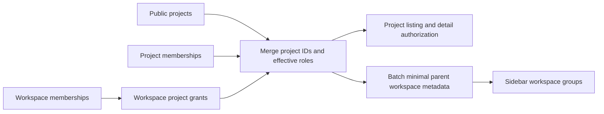

# Project visibility and workspace navigation

Visible projects are the union of the following sets, excluding archived projects:

- Public projects.
- Projects with a direct membership for the current user.
- Projects in active workspaces the current user actually belongs to.

Creators retain Owner access. Workspace membership provides the baseline Reporter project role, without project administration. Stronger explicit project roles take precedence. Reporter actions follow the existing project permission rules. Pending, rejected, and invalid-role memberships do not grant access.

Project listing and individual authorization share `cloud_project_visibility.py`. Nonempty project lists resolve permissions and parent contexts in two queries. Single-project authorization pushes the project ID into each grant branch. Nonempty workspace lists batch roles and aggregate counts in three queries.

The project response's `workspace_context` contains only the parent's ID, public ID, and name. Displaying a parent label through a project neither creates workspace membership nor grants access to workspace settings, members, or unrelated private projects. Empty workspaces the user belongs to remain visible.

The sidebar merges workspace memberships with project parent contexts and builds a Map of projects by workspace in one pass. Opening a project reuses its parent context from the response.

This implementation changes neither the database schema nor indexes and introduces no authorization cache. Public visibility remains in JSON; its scan cost requires a MySQL execution-plan check. Lists retain the existing unpaginated response contract. A fixed query count does not imply a bounded response size.
