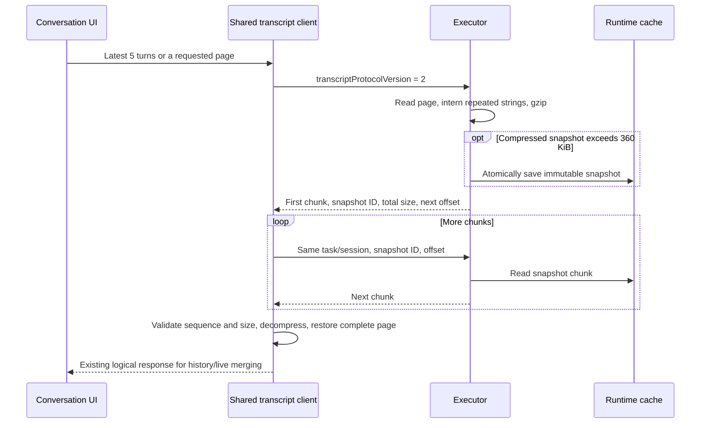

# Runtime transcript transfer

A persisted history file can outgrow the 980,000-byte cloud Runtime response limit,
even after gzip and base64 encoding. Protocol 2 adds lossless chunks to the existing
`runtime.tasks.transcript` RPC so a transport failure does not appear as an empty chat.



## Protocol and compatibility

- New clients explicitly request `transcriptProtocolVersion: 2`. New Executors retain
  the original response for absent versions and version 1. Unknown versions fail explicitly.
- A new client accepts a legacy response when an old Executor ignores the additional field.
  The old Executor's payload limit still applies. Both client and Executor need the update
  for chunked transfer. The backend forwards the existing RPC without a new public API.
- The main conversation pane defaults to the latest 5 turns. For protocol 2, the Executor
  defaults an unspecified page size to 5. Explicit `limit` values retain the existing
  pagination behavior, including navigation and test overrides.
- Existing Codex turn/item cursors, provider compatibility and live merging retain their
  semantics. Protocol 2 projects full tool content for the page it reads;
  `fullContent: false` still means that only a page was loaded. Exports use
  `includeFullContent: true` and no longer silently stop at 500 turns.

Each response contains `success: true`, `transcriptProtocolVersion: 2`, and `transfer`:

| Field        | Meaning                                        |
| ------------ | ---------------------------------------------- |
| `snapshotId` | SHA-256 identity of the complete gzip snapshot |
| `encoding`   | `gzip+base64+json`                             |
| `offset`     | This chunk's byte offset in the gzip stream    |
| `nextOffset` | Next offset, or `null` for the final chunk     |
| `totalBytes` | Complete gzip snapshot size                    |
| `payload`    | Base64-encoded bytes for this chunk            |

Continuations add `transcriptTransfer: { snapshotId, offset }` to the original request.
Each chunk contains at most 360 KiB of bytes. Base64 and metadata remain below 512 KiB,
avoiding outer compression and the 980,000-byte cloud limit. Chunk boundaries can cross
UTF-8 characters; clients decompress and parse only after receiving the complete stream.

The gzip payload is `{ transcript, strings, references }`. Strings of at least 1,024 bytes
are interned in a shared table. Explicit paths and table indexes restore their `null`
placeholders. This removes repeated transmission of tool content in messages, runtime
items and turns without removing logical fields. Clients validate consistent snapshot
identity, contiguous offsets and final size; gzip verifies content integrity. Incomplete
pages never reach conversation state.

## Cache and failures

Multipart snapshots are stored alongside the Runtime index at
`runtime-work/transcript-transfers/<SHA-256 of task/session address>/<snapshotId>.gz`.
They are scoped to the task and requested session. Without an explicit session,
publication resolves the task's linked session after reading. Writes are atomic, and continuations need no
process-local state. Reads can continue after Executor restart if the address is unchanged
and the snapshot has not expired. Single-chunk responses do not write files.

Snapshots expire after 24 hours and are removed on subsequent protocol 2 history reads.
Expired or cross-session reads, invalid offsets, disk errors and corrupt data fail explicitly
and require reloading history. The main pane shows the error and a reload action while
preserving visible messages. RPC completion logging now happens after outer encoding,
so payload-limit failures are no longer logged as successful responses.

Chunking bounds individual transport packets, not total memory or latency. The rollout
reader parses lines on a blocking worker, but still scans the file and retains parsed turns
before selecting a page. Very large turns and full exports can still consume substantial
memory. The cache has time-based cleanup but no additional disk quota. Original history
files are never rewritten by this protocol.

## Regression coverage

| Scenario                                                           | Expected result                                                                       |
| ------------------------------------------------------------------ | ------------------------------------------------------------------------------------- |
| Mixed client/Executor versions                                     | Legacy responses remain readable; new responses require opt-in; unknown versions fail |
| High-entropy output, Unicode and structured results                | Exact reconstruction over multiple bounded packets                                    |
| Missing/reordered chunks, changed snapshot, corrupt gzip or expiry | Explicit failure without publishing a partial page                                    |
| Continuation under another task/session                            | Snapshot cannot be read from another address                                          |
| More than 500 turns                                                | Complete export and contiguous latest/older pages                                     |
| Failed history load                                                | Visible error and reload action                                                       |

Tests cover Rust transport and Codex pagination, the shared TypeScript decoder, desktop IPC
and conversation UI. The existing registered `running-conversation-history` desktop
checkpoint includes high-entropy tool output and checks restart hydration, complete tool
history and multipart snapshot content through its existing CI entry point. Run E2E and
`ai:verify` only when explicitly requested.

### Real history validation (2026-10-09)

A local run exercised the production code with a 77,796,060-byte rollout containing
4,326 records. Parsing recovered 19 turns and 1,173 completed items. The four history
pages matched the full turn sequence without omissions or duplicates. The shared
TypeScript client decoded actual Rust response packets; all six cases matched the
original logical responses field for field.

| Request          | Original single gzip/base64 response | New chunks | Largest chunk response |
| ---------------- | -----------------------------------: | ---------: | ---------------------: |
| Latest 5 turns   |                        270,575 bytes |          1 |          116,038 bytes |
| Previous 5 turns |                      3,149,525 bytes |          3 |          491,758 bytes |
| All 19 turns     |                      4,262,662 bytes |          4 |          491,760 bytes |

Sizes include protocol response fields. The original responses above the 980,000-byte
limit demonstrate that reducing turn count alone does not prevent oversized responses.
The offline run covered local parsing, response projection, disk snapshot continuation
and cross-language decoding. A subsequent isolated Electron run imported the same file
and loaded 5 → 10 → 15 → 19 turns, showing 38 user/assistant messages without a history
error. All pages loaded again after a renderer reload, and the latest five turns recovered
after a Runtime restart. A live cloud connection and the full E2E suite were not tested.
Private history and temporary test entry points are excluded from the repository.

### Validate a real JSONL file in the desktop app

From the repository root, use the existing isolated verification launcher:

```bash
pnpm --filter wework ai:verify start --rollout /absolute/path/to/rollout.jsonl --timeout 180000
```

The launcher builds the current app and Executor, copies the history into an isolated
test directory, and seeds a **Rollout replay** project and task binding. Only the copied
initial workspace metadata changes; subsequent history records and the source file
remain byte-identical. No conversation is sent and no historical command is replayed.
This option cannot be combined with `--codex-home-initialization true` or `--executor-home`.

Open the conversation under **Rollout replay** and verify:

1. The latest history appears without an empty-chat placeholder or loading error.
2. Older pages load, including the large tool output on the preceding page. This case
   contains 19 turns in total.
3. Switching away or reloading the window preserves recoverable history.
4. History remains readable after restarting the isolated Runtime. Use the `session`
   path printed by the launcher in these commands:

```bash
pnpm --filter wework ai:verify reload --session /path/from/start/session.json
pnpm --filter wework ai:verify restart-core-dsh --session /path/from/start/session.json
pnpm --filter wework ai:verify stop --session /path/from/start/session.json
```

The final command ends the test session. Logs are next to `session.json`; multipart
snapshots are under `executor-home/runtime-work/transcript-transfers/`. This checks
the desktop UI and real local IPC. Verify cloud Socket.IO separately on a test cloud device.
