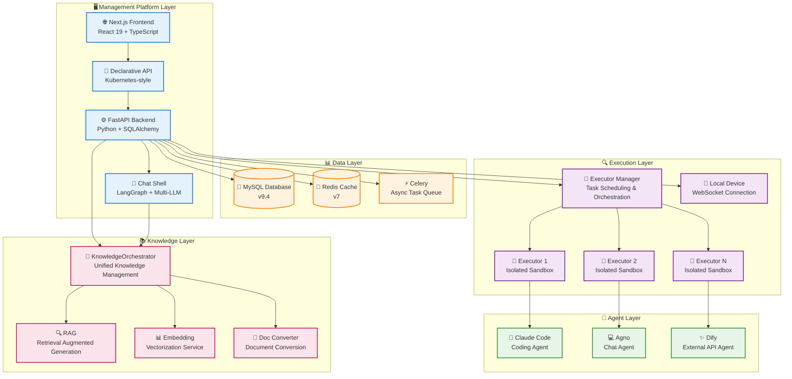
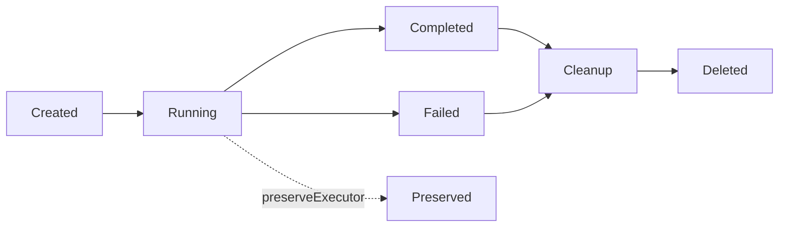
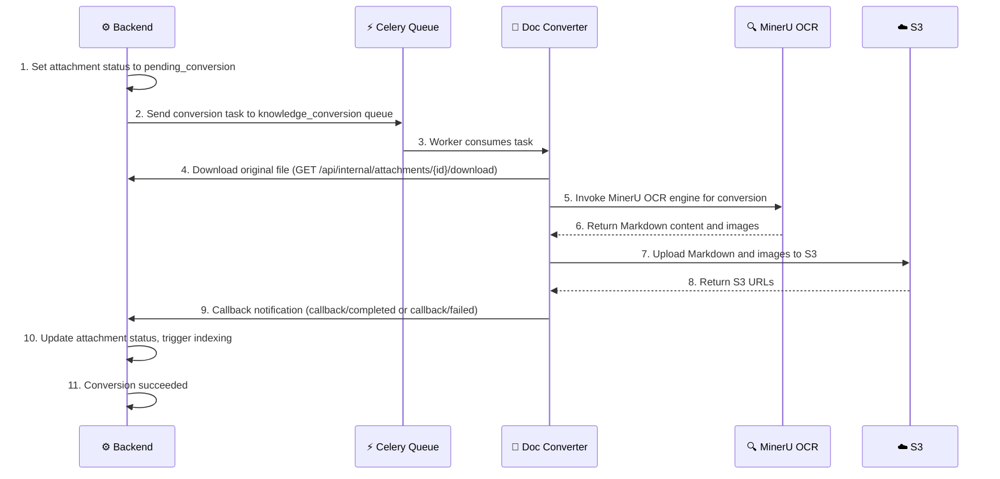
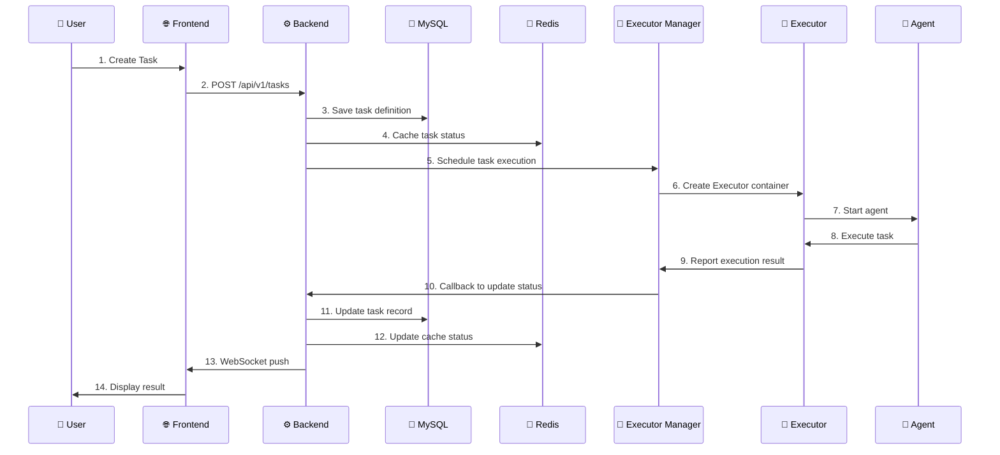

# 🏗️ System Architecture

This document provides a detailed overview of Wegent's system architecture, component design, and technology stack.

---

## 📋 Table of Contents

- [Architecture Overview](#architecture-overview)
- [Core Components](#core-components)
- [Data Flow and Communication Patterns](#data-flow-and-communication-patterns)
- [Technology Stack](#technology-stack)
- [Design Principles](#design-principles)
- [Scalability and Deployment](#scalability-and-deployment)

---

## 🌐 Architecture Overview

Wegent adopts a modern layered architecture design based on Kubernetes-style declarative API and CRD (Custom Resource Definition) design patterns, providing a standardized framework for creating and managing AI agent ecosystems.

### System Architecture Diagram



### Architecture Layers

| Layer | Responsibilities | Core Technologies |
|-------|-----------------|-------------------|
| **Management Platform Layer** | User interaction, resource management, API services, chat processing | Next.js 15, FastAPI, React 19, Chat Shell |
| **Data Layer** | Data persistence, cache management, async task scheduling | MySQL 9.4, Redis 7, Celery |
| **Execution Layer** | Task scheduling, container orchestration, resource isolation, local device management | Docker, Rust Executor, WebSocket, App IPC |
| **Agent Layer** | AI capabilities, code execution, chat processing, external API integration | Claude Code, Agno, Dify |
| **Knowledge Layer** | Knowledge base management, RAG retrieval, vectorization, document format conversion | KnowledgeOrchestrator, Embedding, Doc Converter |

---

## 🔧 Core Components

### 1. 🌐 Frontend

**Responsibilities**:
- Provide user interface for resource definition and management
- Implement task creation, monitoring, and result display
- Provide real-time interaction and status updates
- Manage local devices and executors

**Technology Stack**:
- **Framework**: Next.js 15 (App Router)
- **UI Library**: React 19, shadcn/ui
- **Styling**: Tailwind CSS 3.4
- **State Management**: React Context + Hooks
- **Internationalization**: i18next 25.5
- **Icons**: Heroicons, Tabler Icons, Lucide React

**Core Features**:
- 🎨 Configuration-driven UI with YAML visualization
- 🔄 Real-time task status updates (WebSocket)
- 🌍 Multi-language support (Chinese/English)
- 📱 Responsive design (Mobile/Desktop component separation)
- 📱 Local device management interface
- 💭 Thinking process visualization

**Key File Structure**:
```
frontend/src/
├── app/              # Next.js App Router
│   ├── (tasks)/     # Task-related pages
│   ├── (settings)/  # Settings pages
│   └── admin/       # Admin pages
├── features/        # Feature modules
│   ├── admin/       # Admin dashboard
│   ├── devices/     # Device management (new)
│   ├── feed/        # Discovery and subscriptions
│   ├── knowledge/   # Knowledge base management
│   ├── settings/    # Agent configuration
│   └── tasks/       # Core task functionality
├── components/      # Shared components
│   ├── ui/          # shadcn/ui base components
│   └── common/      # Business common components
└── hooks/           # Custom hooks
```

**Feature Modules**:

| Module | Purpose |
|--------|---------|
| **tasks** | Task creation, chat, group chat, workbench |
| **devices** | Local device management, executor guide |
| **knowledge** | Knowledge base, documents, permissions |
| **settings** | Agent, model, shell, skill configuration |
| **feed** | Subscription market, trigger management |

---

### 2. ⚙️ Backend

**Responsibilities**:
- Implement declarative API for resource CRUD operations
- Manage user authentication and authorization
- Coordinate execution layer for task scheduling
- Provide WebSocket support for real-time chat communication (Socket.IO)
- Unified knowledge management (KnowledgeOrchestrator)
- Manage local device connections

**Technology Stack**:
- **Framework**: FastAPI 0.68+
- **ORM**: SQLAlchemy 2.0
- **Database Driver**: PyMySQL
- **Authentication**: JWT (PyJWT), OAuth (Authlib), OIDC
- **Async Support**: asyncio, aiohttp
- **Cache**: Redis client
- **Real-time Communication**: Socket.IO (python-socketio) with Redis adapter
- **Async Tasks**: Celery

**Core Features**:
- 🚀 High-performance async API
- 🔒 JWT-based authentication
- 📝 Complete CRUD operation support
- 🔄 Real-time status synchronization
- 🛡️ Data encryption (AES-256-CBC)
- 👥 Role-based access control (admin/user)
- 🎼 Unified knowledge management (KnowledgeOrchestrator)
- 📱 Local device management (Device Provider)

**API Design**:
```
/api/v1/
├── /ghosts          # Ghost resource management
├── /models          # Model resource management
├── /shells          # Shell resource management
├── /bots            # Bot resource management
├── /teams           # Team resource management
├── /workspaces      # Workspace resource management
├── /tasks           # Task resource management
├── /devices         # Device management (new)
├── /knowledge       # Knowledge base management
├── /groups          # Organization/group management
├── /share           # Share link management
└── /admin           # Admin operations (user management, public models)
```

**Service Layer Architecture**:

| Service | Responsibility |
|---------|----------------|
| **KindService** | Unified CRD resource management |
| **KnowledgeOrchestrator** | Knowledge management entry point (REST API + MCP tools) |
| **DeviceService** | Local device management |
| **ChatService** | Chat processing and RAG |
| **SubtaskService** | Subtask management |
| **GroupService** | Multi-tenant group management |
| **UserService** | User management |

**Key Dependencies**:
```python
FastAPI >= 0.68.0      # Web framework
SQLAlchemy >= 2.0.28   # ORM
PyJWT >= 2.8.0         # JWT authentication
Redis >= 4.5.0         # Cache
httpx >= 0.19.0        # HTTP client
python-socketio >= 5.0 # Socket.IO server
celery >= 5.0          # Async tasks
```

---

### 3. 💬 Chat Shell (Conversation Engine)

**Responsibilities**:
- Provide lightweight AI conversation engine
- Support multiple LLM models (Anthropic, OpenAI, Google)
- Manage conversation context and session storage
- Integrate MCP tools and skill system
- Support knowledge base retrieval augmentation (RAG)

**Technology Stack**:
- **Framework**: FastAPI
- **Agent Framework**: LangGraph + LangChain
- **LLM**: Anthropic, OpenAI, Google Gemini
- **Storage**: SQLite, Remote API
- **Observability**: OpenTelemetry

**Three Deployment Modes**:

| Mode | Description | Use Case |
|------|-------------|----------|
| **HTTP** | Standalone HTTP service `/v1/response` | Production |
| **Package** | Python package, imported by Backend | Monolithic deployment |
| **CLI** | Command-line interactive interface | Development/Testing |

**Core Features**:
- 🤖 Multi-LLM support (Anthropic, OpenAI, Google)
- 🛠️ MCP tool integration (Model Context Protocol)
- 📚 Dynamic skill loading
- 💾 Multiple storage backends (SQLite, Remote)
- 📊 Message compression (auto-compress when exceeding context limit)
- 📈 OpenTelemetry integration

**Module Structure**:
```
chat_shell/chat_shell/
├── main.py           # FastAPI application entry
├── agent.py          # ChatAgent creation
├── interface.py      # Unified interface definitions
├── agents/           # LangGraph agent building
├── api/              # REST API endpoints
│   └── v1/          # V1 version API
├── services/         # Business logic layer
│   ├── chat_service.py
│   └── streaming/   # Streaming response
├── tools/            # Tool system
│   ├── builtin/     # Built-in tools (WebSearch, etc.)
│   ├── mcp/         # MCP tool integration
│   └── sandbox/     # Sandbox execution environment
├── storage/          # Session storage
│   ├── sqlite/      # SQLite storage
│   └── remote/      # Remote storage
├── models/           # LLM model factory
├── messages/         # Message processing
├── compression/      # Context compression
└── skills/           # Skill loading
```

---

### 4. 💯 Executor Manager

**Responsibilities**:
- Manage Executor lifecycle
- Task queue and scheduling
- Resource allocation and rate limiting
- Callback handling
- Support multiple deployment modes

**Technology Stack**:
- **Language**: Python
- **Container Management**: Docker SDK
- **Networking**: Docker bridge network
- **Scheduling**: APScheduler

**Deployment Modes**:

| Mode | Description | Use Case |
|------|-------------|----------|
| **Docker** | Use Docker SDK to manage local containers | Standard deployment |
| **Local Device** | Connect to local device for execution | Development environment |

**Core Features**:
- 🎯 Maximum concurrent task control (default: 5)
- 🔧 Dynamic port allocation (10001-10100)
- 🐳 Docker container orchestration
- 📊 Task status tracking
- 📱 Local device support

**Configuration Parameters**:
```yaml
MAX_CONCURRENT_TASKS: 5              # Maximum concurrent tasks
EXECUTOR_PORT_RANGE_MIN: 10001      # Port range start
EXECUTOR_PORT_RANGE_MAX: 10100      # Port range end
NETWORK: wegent-network              # Docker network
EXECUTOR_IMAGE: wegent-executor:latest # Executor image
```

---

### 5. 🚀 Executor

**Responsibilities**:
- Provide isolated sandbox environment
- Execute agent tasks
- Manage workspace and code repositories
- Report execution results

**Technology Stack**:
- **Container**: Docker
- **Executor**: Rust (`executor/`)
- **Runtime**: Claude Code, Agno, Dify
- **Version Control**: Git

**Agent Types**:

| Agent | Type | Description |
|-------|------|-------------|
| **ClaudeCode** | local_engine | Claude Code SDK, supports Git, MCP, Skills |
| **Agno** | local_engine | Multi-agent collaboration, SQLite session management |
| **Dify** | external_api | Proxy to Dify platform |
| **ImageValidator** | validator | Custom base image validation |

Rust executor is the only executor runtime implementation. Backend Chat shell work may still use an in-process path, while other tasks run through standalone/local executor. In Wework packaged App local-first mode, the app does not start a local Backend; it calls the executor sidecar directly over Tauri app IPC. Codex runtime control uses `codex app-server --stdio` JSON-RPC to create, continue, read, archive, and rename threads. The executor stores only the local task index and the required `localTaskId -> threadId` mapping.

When Claude Code resumes an interactive-form session, the executor treats a defer as stale resume output only when it has the same `tool_use_id` as the form being answered and is still an interactive-form tool. A later form with a different `tool_use_id` is a new clarification request; even if that response also contains text, the executor must proxy it to the interactive MCP and wait for user input instead of discarding it as stale.

Before attachments enter Codex, the executor converts them by type: images become local image inputs, text attachments include a bounded preview and their complete local path, and binary attachments such as ZIP or PDF include their filename, MIME type, size, and local path. Codex can therefore locate a file even when the user sends an attachment without message text. These contexts are mutually exclusive by type so image and text attachments are not injected twice.

Image conversion may create temporary `*.model-input.*` files that exist only for model consumption; those paths must not become persistent Wework message attachment URLs. When restoring user messages from the Codex transcript, the executor prefers the original attachment path retained in the file-mention context or local runtime handle. Temporary model inputs are used only during inference, so historical messages, task switching, and reopened tasks continue to render the original image after temporary files are cleaned up.

Codex transcript pagination must preserve strict page boundaries. A user-message presentation retained in the local runtime handle for attachments, references, or supervisor input may join a page only when its client message ID already matches that page or its turn ID or creation time belongs to the page range. `ensureVisible` must never reinsert a message from a newer page into an older page. Before Wework requests an older page or fills a transcript gap, it records the current `scrollHeight` and distance from the bottom, temporarily disables native browser scroll anchoring, and restores the same bottom distance after the paginated content completes layout. Prepending older messages, virtual-list remeasurement, and the sticky bottom composer therefore participate in one deterministic scroll transaction without duplicating messages or moving the composer with the content.

The Codex runtime is separated by responsibility under `executor/src/agents/codex/`: `home` manages the isolated Codex Home, authentication link, and configuration normalization; `interaction` routes user-input and MCP interaction responses; `run_state` reduces app-server events into turn outcomes; `diagnostics` truncates logs and summarizes sensitive output; and `tests` contains module-level regressions. `codex.rs` retains the public API, shared app-server lifecycle, and turn orchestration. New behavior should live in the matching responsibility module so configuration, protocol state, and diagnostics do not become coupled to the orchestration layer again.

Live Codex agent-message text must be classified by an explicit phase: only `final` or `final_answer` enters the final answer, while `analysis`, `commentary`, and missing phases enter processing first. Missing phases can occur before or after a tool call, so a default final classification must not trigger Wework's final-processing collapse. When a turn ends, the executor uses explicit final text; if a model never sends a phase, it uses the last unphased text as the terminal answer. Transcript restoration follows the same rule and uses later tools or other process items to distinguish unphased processing text from the final answer.

Wework's built-in browser MCP is provided by the Rust executor's `browser-mcp-server` subcommand and controls the right-side browser through a local bridge address allocated independently for each Tauri instance. The packaged app does not require Node.js or a separately deployed browser MCP server, and multiple instances do not share a fixed port.

The project-space `wework_space` MCP is hosted persistently by the Rust executor started with Wework on a dynamically allocated loopback port. Codex receives only that instance's URL, instance credential, and optional ContextGrant; it no longer starts a `space-mcp-server` stdio child. Generic sessions remain unbound, while project or Issue sessions receive default `space_id/item_id` values and scope protection through ContextGrant.

Wework's Codex custom-instruction configuration persists only user input; built-in browser-routing rules are not written to that field. Before each Codex thread is started, resumed, or forked, the executor combines the user custom instructions, task-level system instructions, and built-in browser rules into the thread request's `developerInstructions` parameter. Configuration normalization removes every historical browser-rules block so settings never display duplicate content, while new threads always receive the browser-tool usage constraints.

When Codex uses a shared app-server thread, cancelling an active turn must await acknowledgement of `turn/interrupt` before reporting cancellation to the caller. Between the `turn/start` response and the first turn progress event, the app-server active-turn index may not yet contain the new turn; during this startup window, the executor must send the thread-level startup interrupt with an empty `turnId`, then use the concrete turn ID after initial progress arrives. This prevents stop requests from missing newly started turns. A retry can then start only after the previous turn has stopped, preventing an interrupt and a new request from interleaving and replaying cancelled input or dropping the retry message.

A failed Codex turn is not guaranteed to produce an assistant item in the thread transcript. The executor therefore writes a failed assistant message with a stable message ID, error type, and original error text to the local runtime handle when a turn fails. When a failed task is read, the executor merges that local record by stable ID only if the Codex transcript does not contain it. Wework can consequently restore the error card and retry action after reopening or switching back to the task without duplicating failures that Codex already persisted.

Wework local model calls enter the executor through the Codex Responses protocol. The executor generates an explicit model catalog for each custom model and uses the `custom`, `function`, or `shell` tool profile to decide whether Codex publishes freeform `apply_patch`. The local model proxy forwards native Responses endpoints directly, while dedicated protocol modules convert requests, streaming events, reasoning, tool calls, tool results, and usage for OpenAI Chat Completions and Anthropic Messages; custom-tool grammar is retained inside the function wrapper. Anthropic Messages total input usage must include `input_tokens`, `cache_read_input_tokens`, and `cache_creation_input_tokens`; cache-read usage is also mapped to the Responses cached-token detail so Codex context remaining and automatic compaction decisions use the complete input count. A bounded history restores cross-request tool calls. Non-2xx responses pass through, successful non-SSE responses become standard Responses SSE, transport-truncated or upstream-error streams produce a failed terminal event, and an explicit upstream output-length limit produces `response.incomplete`. A cloud Model's `context_window` and `max_output_tokens` flow through the Wework execution request into Codex and the local model proxy. An explicit request output limit takes precedence over model configuration, which takes precedence over defaults. Native Responses passthrough forwards `max_output_tokens` only when it is explicitly configured; Chat Completions and Anthropic Messages conversions apply the 96000-token proxy default when no limit is configured. Without configuration, the Codex context window still defaults to 256K (262144 tokens). The proxy forwards a fixed allowlist of Codex request headers, including `originator`, `session-id`, `thread-id`, and turn metadata, while never forwarding authorization, cookies, or attestation headers. API keys, additional headers, and outbound proxy settings remain inside the executor proxy boundary and are not passed to the Codex process. Proxy registrations derive stable tokens from the full upstream configuration, use reference counts, and expire after an idle timeout so persistent Codex follow-ups do not hit prematurely released tokens.

The Codex model catalog's `supports_search_tool` flag means that a model can participate in deferred App discovery; it does not mean that the upstream wire API natively implements `tool_search` or namespace tools. Wework enables this catalog capability for official and custom models so Codex exposes only a compact `tool_search` on the first turn instead of injecting every Remote App schema, then loads the matching App namespace after discovery. The executor independently tracks `native_tool_search` and `native_namespace_tools` at the protocol boundary. GPT 5.4+ cloud models using Responses pass native tool search through unchanged. Model configuration can override the inferred capabilities with `native_tool_search` or `nativeToolSearch` and `native_namespace_tools` or `nativeNamespaceTools`; an explicit `false` disables the corresponding inference. Other Responses, Chat Completions, and Anthropic Messages upstreams receive ordinary function representations of `tool_search` and namespace tools, and the executor restores the original Codex semantics on the response path. When the third-party Responses compatibility bridge converts tool-search call and output items, it removes their type-specific `id` and uses only `call_id` to associate calls with results; native Responses passthrough preserves the native item fields. Third-party models such as DeepSeek and Kimi can therefore use Apps on demand without implementing Codex-specific tools, while ordinary messages avoid the context cost of the complete App tool catalog.

A text-only model can explicitly reference a model that declares image input capability as a vision sidecar. Local-model references come from Wework's device-local model configuration. For a cloud Model CRD, the Wegent web UI writes the reference to `modelConfig.visionSidecarModel`; Wework only parses the referenced model identity and protocol from the Backend's aggregated model, does not edit cloud configuration, and never selects a default from sign-in state or model names. Codex still works with an image-bearing Responses request, but before protocol conversion and the primary request the executor calls the sidecar and replaces each `input_image` in place with a bounded text description. With a configured sidecar, executor generically derives a hidden catalog that adds image input to the current base catalog while preserving all reasoning, tool, context, and compaction capabilities; adding a model requires no sidecar-specific mapping or copied catalog. An unconfigured model keeps its original text-only catalog and makes no extra vision call. The original image is never sent to the text-only primary model. The sidecar supports Responses, Chat Completions, and Anthropic Messages, and its upstream credentials remain inside the executor. The implementation uses a bounded LRU description cache, a process-wide concurrency limit, per-turn image limits, and embedded-data size validation. Timeouts, invalid images, and upstream failures produce an explicit failure description while removing the original image; logs contain only aggregate protocol, count, cache, and timing diagnostics. See [text-model vision delegation](../../architecture/model-vision-delegation.md) for the governed data flow and invariants.

#### Task supervision and runtime readiness

Wework allows users to configure task supervision before sending the first message. The configuration travels as `RuntimeTaskCreateRequest.initialSupervisor` and is atomically stored by the executor before the new task is upserted into the runtime index. Do not call the standalone supervisor-setting endpoint while the task address is still unset; that creates invalid `thread_id=none` or `session_id=none` state and can be overwritten by the subsequent task write.

The supervisor evaluator may start only after the runtime session has been established. The gap between task creation and Codex session setup is normal initialization, not a supervision failure; the executor waits for the session instead of reporting an error. Once task creation finishes, Wework removes the pending composer notice and displays the active supervision state from task state in the right-side information panel.

Supervisor evaluation is a stateless model decision, not a Codex coding task. Wework only allows the supervisor to select a cloud Model whose complete resource identity can be resolved by Backend, and persists that `modelSelection` in local task state. The executor calls the authenticated `/api/model-runtime/responses` endpoint, while Backend resolves the Model CRD and upstream credentials. This path must not create a Codex thread, start an ephemeral app-server turn, or load MCP servers, skills, or tools. After an evaluation failure, the executor retries at the configured supervision interval; the scheduler must not retry on every tick merely because no successful content hash exists, because that would amplify an upstream failure into a process and request storm.

The next scheduled review time is derived from `lastEvaluatedAt + intervalSeconds`; no additional drift-prone derived field is persisted. When the user requests an immediate review through `runtime.tasks.supervisor.run_now`, the executor reuses the same per-task concurrency guard and forces the current visible progress to be evaluated even when its content hash matches the previous review. The supervisor model list remains limited to cloud Models with complete resource identity, but it must not hide those independent evaluation models based on compatibility flags for the current coding task runtime.

Wework settles task running state by turn identity rather than by task alone. A provider may replace the provisional subtask ID from the streaming start event with a canonical turn ID in the terminal event; the event adapter must associate those identities and pass the original start ID to the lifecycle state machine. The executor synchronizes in-memory running state when execution ownership changes, and completion of an older execution must not overwrite its replacement. App IPC, the local backend, and the supervisor scheduler must receive the same runtime handler before background workers start; creating a scheduled default handler and replacing it later leaves an orphan scheduler whose auto-corrections are invisible to task listings. Repeated or delayed terminal events from an older turn are ignored idempotently and must not clear a newer active turn, otherwise the sidebar can incorrectly appear idle while a supervisor auto-correction is still running.

A Codex fork reconstructs the parent thread's historical request. The `encrypted_content` carried by `reasoning`, `compaction`, `compaction_summary`, `context_compaction`, and `agent_message` items is non-portable state bound to the actual upstream cryptographic context. Even when the logical model and route name remain unchanged, credentials or project context behind a model gateway may be unable to verify ciphertext produced for the parent thread. The executor detects these requests from Codex fork metadata and recursively removes `encrypted_content` only from those historical item types at the fork boundary, while preserving messages, tool calls, tool results, and reasoning summaries. Ordinary continuations do not perform this cleanup, and the executor does not hide upstream failures through retries, fallbacks, or model switching.

Cloud model execution passes `modelConfig.env.model_id` from the Model spec to the executor as a separate Codex catalog model id. When that id matches a model in the official Codex catalog, Codex inherits its complete capability metadata and base instructions. The model gateway continues to use the resource name to locate the cloud Model CRD, so catalog mapping does not alter upstream routing.

`apply_patch` is not a command automatically supplied by the model service or the system shell. Only a Codex model catalog generated for the `custom` or `function` tool profile causes Codex to publish the tool in model requests; callers that invoke the Responses API directly must likewise provide the custom tool definition and grammar in `tools`. The `shell` profile does not publish it. After patch execution fails, the local model proxy preserves the original validation error and adds error-specific grammar guidance, correct Update/Add File examples, and an explicit retry instruction. Native Responses, Chat Completions, and Anthropic Messages conversions must preserve the same correction semantics, while successful results remain unchanged.

**Core Features**:
- 🔒 Fully isolated execution environment
- 💼 Independent workspace
- 🔄 Automatic cleanup mechanism (can be preserved with `preserveExecutor`)
- 📝 Real-time log output
- 🛠️ MCP tool support
- 📚 Dynamic skill loading
- 🪝 [Pre-execute hooks](./pre-execute-hooks.md) for custom task initialization before execution

**Lifecycle**:


---

### 6. 💾 Database (MySQL)

**Responsibilities**:
- Persistent storage of all resource definitions
- Manage user data and authentication information
- Record task execution history

**Version**: MySQL 9.4

**Core Table Structure**:
```
wegent_db/
├── kinds            # CRD resources (Ghost, Model, Shell, Bot, Team, Skill, Device)
├── tasks            # Task and Workspace resources (separate table)
├── skill_binaries   # Skill binary packages
├── users            # User information (with role field)
├── groups           # Organizations/groups
├── namespace_members # Namespace members
├── knowledge_bases  # Knowledge bases
├── documents        # Documents
└── public_models    # System-wide public models
```

**Data Model Features**:
- Uses SQLAlchemy ORM
- Supports transactions and relational queries
- Automatic timestamp management
- Soft delete support
- CRD resources uniquely identified by (namespace, name, user_id) tuple

---

### 7. 🔴 Cache (Redis)

**Responsibilities**:
- Task status caching
- Session management
- Temporary real-time data storage
- Task expiration management
- Socket.IO multi-instance adapter

**Version**: Redis 7

**Use Cases**:
- 🔄 Chat task context caching (2-hour expiration)
- 💻 Code task status caching (2-hour expiration)
- 🎯 Executor deletion delay control
- 📊 Real-time status updates
- 🔌 Socket.IO Redis adapter (multi-instance communication)

---

### 8. ⚡ Celery (Async Tasks)

**Responsibilities**:
- Knowledge base document indexing (async)
- Document summary generation
- Document format conversion (PDF/PPTX → Markdown)
- Long-running task processing

**Core Tasks**:

| Task | Purpose |
|------|---------|
| `index_document_task` | Document vectorization indexing |
| `generate_document_summary_task` | Document summary generation |
| `convert_document_task` | Document format conversion (consumed by Knowledge Doc Converter) |

**Task Queues**:

| Queue | Purpose | Consumer |
|-------|---------|----------|
| `celery` (default) | Document indexing, summary generation | Backend Worker |
| `knowledge_conversion` | PDF/PPTX document conversion to Markdown | Knowledge Doc Converter |

---

### 9. 🎼 KnowledgeOrchestrator

**Responsibilities**:
- Unify knowledge management for REST API and MCP tools
- Automatically select retriever, embedding model, summary model
- Coordinate Celery async tasks

**Architecture**:
```
Entry Layer (REST/MCP)
    ↓
KnowledgeOrchestrator
    ↓
Service Layer (knowledge_service.py)
    ↓
Celery Tasks (async processing)
```

**Core Features**:
- 🔗 Unified entry point: REST API and MCP tools share the same business logic
- 🤖 Auto model selection: Task → Team → Bot → Model chain resolution
- 📚 Multi-scope support: Personal, group, organization knowledge bases
- ⚡ Async indexing: Handle large documents via Celery

---

### 10. 📄 Knowledge Doc Converter

**Responsibilities**:
- Convert PDF/PPTX documents to Markdown via MinerU OCR
- Upload conversion results to S3 storage
- Notify Backend of conversion status via callback endpoints

**Technology Stack**:
- **Task Queue**: Celery + Redis
- **OCR Engine**: MinerU
- **Object Storage**: S3
- **Monitoring**: Prometheus (port 9090, multiprocess mode)

**Core Features**:
- 🔧 Standalone Celery Worker listening on the `knowledge_conversion` queue
- 📊 Prometheus metrics exposure (multiprocess mode)
- 🔄 Callback-driven async conversion flow

**Internal API**:

| Endpoint | Purpose |
|----------|---------|
| `POST /api/internal/conversion/callback/status` | Conversion status callback |
| `POST /api/internal/conversion/callback/completed` | Conversion completed callback |
| `POST /api/internal/conversion/callback/failed` | Conversion failed callback |
| `GET /api/internal/attachments/{id}/download` | Attachment download |

**Document Conversion Flow**:



---

## 🔄 Data Flow and Communication Patterns

### Task Execution Flow



### Communication Protocols

| Communication Type | Protocol | Purpose |
|-------------------|----------|---------|
| **Frontend ↔ Backend** | HTTP/HTTPS, WebSocket (Socket.IO) | API calls, real-time chat streaming |
| **Backend ↔ Database** | MySQL Protocol | Data persistence |
| **Backend ↔ Redis** | Redis Protocol | Cache operations, Socket.IO adapter |
| **Backend ↔ Executor Manager** | HTTP | Task scheduling |
| **Executor Manager ↔ Executor** | Docker API | Container management |
| **Executor ↔ Agent** | Process invocation | Task execution |

### WebSocket Architecture (Socket.IO)

The chat system uses Socket.IO for bidirectional real-time communication:

**Namespace**: `/chat`
**Path**: `/socket.io`

**Client → Server Events**:
| Event | Purpose |
|-------|---------|
| `chat:send` | Send a chat message |
| `chat:cancel` | Cancel ongoing stream |
| `chat:resume` | Resume stream after reconnect |
| `task:join` | Join a task room |
| `task:leave` | Leave a task room |
| `history:sync` | Sync message history |

**Server → Client Events**:
| Event | Purpose |
|-------|---------|
| `chat:start` | AI started generating response |
| `chat:chunk` | Streaming content chunk |
| `chat:done` | AI response completed |
| `chat:error` | Error occurred |
| `chat:cancelled` | Stream was cancelled |
| `chat:message` | Non-streaming message (group chat) |
| `task:created` | New task created |
| `task:status` | Task status update |

**Room-based Message Routing**:
- User Room: `user:{user_id}` - For personal notifications
- Task Room: `task:{task_id}` - For chat streaming and group chat

**Redis Adapter**: Enables multi-worker support for horizontal scaling

---

## 🛠️ Technology Stack

### Frontend Stack

```typescript
{
  "framework": "Next.js 15",
  "runtime": "React 19",
  "language": "TypeScript 5.7",
  "ui": [
    "shadcn/ui",
    "Tailwind CSS 3.4",
    "Lucide React",
    "Heroicons 2.2"
  ],
  "i18n": "i18next 25.5",
  "markdown": "react-markdown",
  "realtime": "socket.io-client",
  "devTools": [
    "ESLint 9.17",
    "Prettier 3.4",
    "Husky 9.1"
  ]
}
```

### Backend Stack

```python
{
    "framework": "FastAPI >= 0.68.0",
    "language": "Python 3.10+",
    "orm": "SQLAlchemy >= 2.0.28",
    "database": "PyMySQL 1.1.0",
    "auth": [
        "PyJWT >= 2.8.0",
        "python-jose 3.3.0",
        "passlib 1.7.4",
        "authlib"  # OIDC support
    ],
    "async": [
        "asyncio >= 3.4.3",
        "aiohttp >= 3.8.0",
        "httpx >= 0.19.0"
    ],
    "cache": "redis >= 4.5.0",
    "realtime": "python-socketio >= 5.0",
    "tasks": "celery >= 5.0",
    "security": [
        "cryptography >= 41.0.5",
        "pycryptodome >= 3.20.0"
    ],
    "telemetry": "opentelemetry-*",
    "testing": [
        "pytest >= 7.4.0",
        "pytest-asyncio >= 0.21.0"
    ]
}
```

### Chat Shell Stack

```python
{
    "framework": "FastAPI",
    "agent": "LangGraph + LangChain",
    "llm": [
        "langchain-anthropic",
        "langchain-openai",
        "langchain-google-genai"
    ],
    "storage": "SQLite / Remote API",
    "telemetry": "opentelemetry-*"
}
```

### Infrastructure

```yaml
database:
  mysql: "9.4"

cache:
  redis: "7"

container:
  docker: "latest"
  docker-compose: "latest"

task_queue:
  celery: "5.0+"
  broker: "redis"

executor_engines:
  - "Claude Code (Anthropic)"
  - "Agno"
  - "Dify"
```

---

## 🎯 Design Principles

### 1. Declarative API Design

Following Kubernetes CRD design patterns:
- ✅ Resources defined declaratively in YAML
- ✅ Clear resource hierarchy
- ✅ Unified API version management
- ✅ Separation of status and desired state

**Example**:
```yaml
apiVersion: agent.wecode.io/v1
kind: Bot
metadata:
  name: developer-bot
  namespace: default
spec:
  # Desired state
  ghostRef:
    name: developer-ghost
status:
  # Actual state
  state: "Available"
```

### 2. Separation of Concerns

- 🎨 **Frontend**: Focused on user interaction and presentation
- ⚙️ **Backend**: Focused on business logic and data management
- 🚀 **Execution Layer**: Focused on task scheduling and resource isolation
- 🤖 **Agent Layer**: Focused on AI capability provision

### 3. Microservices Architecture

- 🔧 Each component deployed independently
- 📦 Containerized packaging
- 🔄 Loose coupling between services
- 📊 Independent scaling capability

### 4. Security First

- 🔒 JWT authentication mechanism
- 🛡️ AES-256-CBC encryption for sensitive data
- 🔐 Sandbox environment isolation
- 🚫 Principle of least privilege
- 👥 Role-based access control (admin/user roles)
- 🔑 OIDC enterprise single sign-on support

### 5. Observability

- 📝 Structured logging (structlog)
- 📊 Status tracking and monitoring
- 🔍 Detailed error information
- 📈 Performance metrics collection
- 🔭 OpenTelemetry integration (distributed tracing)

---

## 📈 Scalability and Deployment

### Horizontal Scaling

#### Frontend Scaling
```yaml
# Multi-instance deployment
frontend:
  replicas: 3
  load_balancer: nginx
```

#### Backend Scaling
```yaml
# Stateless design, supports multiple instances
backend:
  replicas: 5
  session: redis
  socket_adapter: redis  # Socket.IO multi-instance support
```

#### Chat Shell Scaling
```yaml
# Standalone service, supports multiple instances
chat_shell:
  replicas: 2
  storage: remote  # Remote storage for multi-instance
```

#### Executor Scaling
```yaml
# Dynamic creation and destruction
executor_manager:
  max_concurrent_tasks: 20
  auto_scaling: true
```

### Vertical Scaling

#### Database Optimization
- Read-write separation
- Index optimization
- Query caching

#### Redis Optimization
- Memory optimization
- Persistence strategy
- Cluster mode

### Deployment Modes

#### 1. Single-Machine Deployment (Development/Testing)
```bash
docker-compose up -d
```

**Use Cases**:
- Local development
- Feature testing
- Small-scale usage

#### 2. Distributed Deployment (Production)
```yaml
architecture:
  frontend: "Multi-instance + Nginx load balancing"
  backend: "Multi-instance + API gateway"
  mysql: "Master-slave replication + read-write separation"
  redis: "Redis Cluster"
  executor: "Dynamic scaling"
```

**Use Cases**:
- Production environment
- High concurrency requirements
- Large-scale teams

```yaml
architecture:
  frontend: "Multi-instance + Nginx load balancing"
  backend: "Multi-instance + API gateway + Redis Socket.IO adapter"
  chat_shell: "Multi-instance + Remote storage"
  mysql: "Master-slave replication + read-write separation"
  redis: "Redis Cluster"
  celery: "Multi-worker"
  executor: "Dynamic scaling"
```

#### 3. Cloud-Native Deployment (Kubernetes)
```yaml
apiVersion: apps/v1
kind: Deployment
metadata:
  name: wegent-backend
spec:
  replicas: 3
  template:
    spec:
      containers:
      - name: backend
        image: wegent-backend:latest
```

**Use Cases**:
- Cloud environments
- Auto-scaling
- High availability requirements

### Performance Metrics

| Metric | Target Value | Description |
|--------|--------------|-------------|
| **API Response Time** | < 200ms | P95 latency |
| **Task Startup Time** | < 5s | From creation to execution |
| **Concurrent Tasks** | 5-100 | Configurable |
| **Database Connection Pool** | 20 | Default configuration |
| **WebSocket Connections** | 1000+ | Concurrent online |

### Monitoring and Alerting

#### Key Metrics
- 📊 Task success rate
- ⏱️ Task execution time
- 💾 Database performance
- 🔴 Redis cache hit rate
- 🐳 Container resource usage

#### Log Collection
```python
import structlog

logger = structlog.get_logger()
logger.info("task.created",
    task_id=task.id,
    team=task.team_ref.name)
```

---

## 🔗 Related Resources

- [Core Concepts](../concepts/core-concepts.md) - Understand Wegent's core concepts
- [Collaboration Models](../concepts/collaboration-models.md) - Deep dive into collaboration patterns
- [YAML Specification](../reference/yaml-specification.md) - Complete configuration guide
- [CRD Architecture](./crd-architecture.md) - CRD design details
- [Skill System](../concepts/skill-system.md) - Skill development and integration
- [Local Device Architecture](./local-device-architecture.md) - Local device support
- [Pre-execute Hooks](./pre-execute-hooks.md) - Custom Executor initialization before task execution

---

<p align="center">Understanding the architecture is key to mastering Wegent! 🚀</p>
