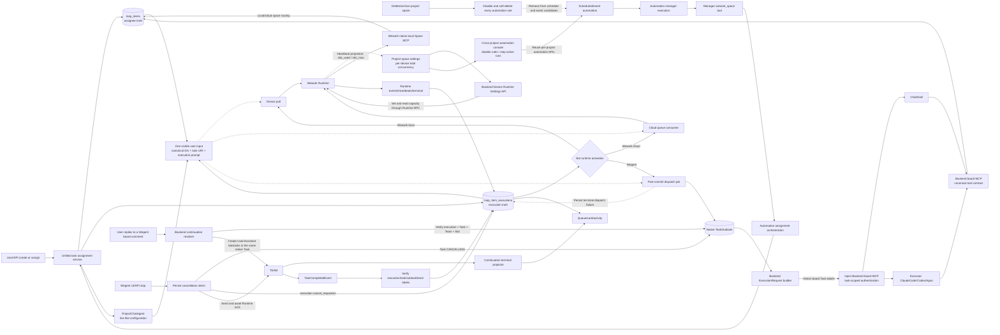
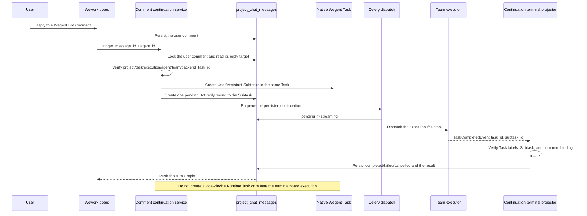
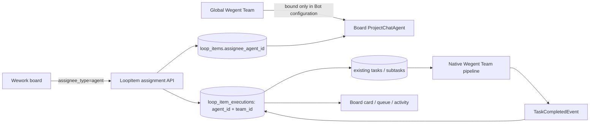
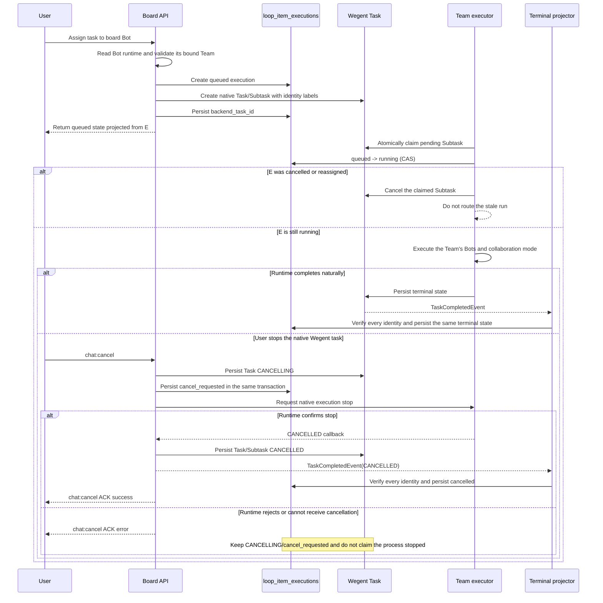

# Cloud project collaboration architecture

Use the dedicated [board automation and Wegent execution architecture](../../architecture/board-automation.md) for architecture review. This guide retains cloud-project domain, API, and delivery details.

> The current V4 UI source of truth is `/Users/hongyu9/Downloads/wework-delivery-v4-TODO.pen`. Implement the interaction from that design instead of deriving page layout from this document.

## Goal

A cloud project is the shared collaboration and storage boundary for a team. Members may select the same cloud project as the default destination of their own local projects, execute work in Wework, and submit selected conversations, files, and Markdown as immutable delivery snapshots.

A cloud project is not the existing `Project` model:

- `Project` is a user-owned local execution workspace containing device, path, Git, and runtime configuration.
- `CloudProject` is a shared aggregate containing membership, TODOs, shared files, and a MinIO namespace.
- Local projects owned by different members may independently select the same cloud project; the cloud project stores no reverse link.
- One TODO may link to many Wework Tasks, while one Task may process at most one active TODO at a time.

## Domain relationships

```text
CloudProject
├── ResourceMember(resource_type=CloudProject)
├── ShareLink(resource_type=CloudProject)
└── LoopItem
    ├── LoopItemTaskBinding
    │   └── TaskResource
    │       └── Project (local execution workspace)
    └── Delivery
        └── DeliveryAsset
```

## Data ownership

| Data                                                                                    | Source of truth                  |
| --------------------------------------------------------------------------------------- | -------------------------------- |
| Cloud projects, members, TODOs, task links, delivery metadata                           | Backend MySQL                    |
| Local paths, devices, Git, execution configuration, and default project-space reference | Device-local Codex project state |
| Shared files, Markdown, conversations, and delivery snapshots                           | MinIO/S3                         |
| AI access to cloud data                                                                 | MCP authorized by the Backend    |

Objects are isolated by the cloud project's public ID:

```text
projects/{cloud-project-public-id}/
  shared/
  loop-items/{loop-item-id}/
    deliveries/{delivery-id}/
      markdown.md
      chat.json
      manifest.json
      files/
```

Finalized delivery prefixes are immutable. Later tasks may only read or copy them.

## Data model

### CloudProject

`cloud_projects` stores the shared project and never stores local runtime configuration.

```text
id, public_id, project_key, name, description
created_by_user_id, storage_prefix, next_item_number
status, version, created_at, updated_at
```

### Local-project default space

A local Codex project may store one `{ projectStore, projectId }` default project-space reference. The reference belongs to device-local project state, never enters the Backend, and creates no reverse index on the project space. A new conversation may override or clear the default before its first message is sent.

### LoopItem

The existing `loop_items` table stores cloud TODOs. `cloud_project_id` references `cloud_projects`, and `sequence_number` produces display identifiers such as `WEG-18`.

The initial fixed workflow is:

```text
inbox → pending → in_progress → in_review → completed
```

Completed TODOs may be reopened into `in_progress`. Updates carry a `version` value and use optimistic locking.

### Board execution by Bots and Agents

A board assignee is either a project member or a project Bot (`ProjectChatAgent`). A Wegent Agent (`Kind(kind=Team)`) is runtime configuration for that Bot, not an assignee: the user creates a Bot in the board, selects Wegent as its execution environment, and binds one runnable Team. The binding lives in the Bot's existing `metadata_json`; no table is created.

#### Automation execution connection graph



Every edge has one owner:

| Edge                                      | Sole responsibility                                                                                                                                                                                                                             | Current code owner                                                       |
| ----------------------------------------- | ----------------------------------------------------------------------------------------------------------------------------------------------------------------------------------------------------------------------------------------------- | ------------------------------------------------------------------------ |
| Entry → assignment                        | Validate member/Bot and persist assignee                                                                                                                                                                                                        | `loop_items/service.py`, `external_provider.py`                          |
| Assignment → execution truth              | Cancel the old attempt and create a new one                                                                                                                                                                                                     | `loop_item_executions/service.py`                                        |
| Automation → runtime activation           | Activate the new execution after assignment commit                                                                                                                                                                                              | `project_automation_execution.py`                                        |
| Project archive → automation cleanup      | Disable and soft-delete every rule and clear its next trigger in the project-archive transaction                                                                                                                                                | `cloud_projects/service.py`, `project_automations.py`                    |
| Wework activation                         | Local device pull or cloud consumer claim                                                                                                                                                                                                       | `robot_queue_tasks.py`, Wework local puller                              |
| Settings → device total concurrency       | Persist and immediately apply each scheduler limit through authenticated Runtime RPC; `slot_used/slot_max` are capacity projections only                                                                                                        | `devices.py`, `runtime_rpc_service.py`, Rust `runtime.settings.*`        |
| Wegent activation                         | Create Task/Subtask by execution ID and enter Team pipeline                                                                                                                                                                                     | `board_team_execution.py`, `project_automation_tasks.py`                 |
| Wegent board MCP injection                | Backend detects board execution from native Task labels and injects the Backend MCP URL plus task-scoped authentication into the same `ExecutionRequest` used by ChatShell and Executor; it must not depend on a caller-owned temporary boolean | `execution/request_builder.py`, `mcp_server/server.py`                   |
| Backend board MCP → domain services       | Expose the canonical local-Space-MCP tool names and operate through existing Backend CloudProject, LoopItem, file, attachment, delivery, and assignment services; never invoke the Wework local stdio MCP                                       | `mcp_server/tools/wework_space.py` and the corresponding domain services |
| Wework local MCP                          | Started only by the Wework Runtime for local project-space and local-path capabilities; it must not replace the remote board MCP injected for a Wegent Runtime                                                                                  | `executor/src/task_runtime/mcp.rs`                                       |
| Board execution → all runtime inputs      | Local, cloud, and Wegent share one visible user input containing canonical IDs, the task URI, and the Bot execution prompt; the runtime reads task content through MCP                                                                          | `loop_item_executions/profile.py`, `board_team_execution.py`             |
| Wegent terminal → execution truth         | Project terminal state after strict identity checks                                                                                                                                                                                             | `board_team_completion.py`                                               |
| Wegent comment → native continuation      | Resolve the exact `backend_task_id` from the reply target and create Subtasks in the same Task; project the result only to that reply without rewriting the terminal execution                                                                  | `board_team_continuation.py`, `project_automation_tasks.py`              |
| Wegent user stop → cancellation intent    | Persist Task `CANCELLING` and execution `cancel_requested`, then send the Runtime cancellation command                                                                                                                                          | `chat_namespace.py`, `board_team_completion.py`                          |
| Runtime cancellation ACK → terminal truth | After process-stop confirmation, persist Task/Subtask `CANCELLED` and project board `cancelled` through the unified terminal projector                                                                                                          | Rust executor, `status_updating.py`, `board_team_completion.py`          |

The Backend board MCP exposes the complete Backend cloud-board domain surface: `get_current_context`; space `list/create/update`; board-item `list/search/create/get/update/reorder`; assignment candidates and `assign`; provider comments; space-file `list/read`; item-attachment `list/upload/read/delete`; and delivery `list/read`. The remote MCP transfers file contents as inline text or Base64 and never accepts a Runtime-local file path. DingTalk AI Table dynamic field/record tools remain a Wework-local provider route and must not be faked when no Backend provider service exists.

The 2026-08-15 queue defect was a missing edge: HTTP assignment invoked Wegent activation, while an automation manager's internal assignment only created a `queued` execution. Consequently `claimed_at` and `backend_task_id` stayed empty, and device consumers correctly ignored records whose `execution_environment=wegent`. The fix must add the automation-to-runtime-activation edge. It must not send Wegent rows to a Wework device consumer or infer execution from the queue UI.

#### Automation assignment and execution sequence

```mermaid
sequenceDiagram
    participant E as Event/scheduler
    participant M as Automation manager
    participant A as Assignment orchestration
    participant L as LoopItem assignment service
    participant X as loop_item_executions
    participant R as Runtime activator
    participant Q as Celery dispatch job
    participant T as Wegent Task/Subtask
    participant B as Backend request builder
    participant P as Backend board MCP
    participant W as Wegent Team executor
    participant C as Terminal projector
    participant U as Wegent user

    E->>M: Create automation run and task carrier
    M->>A: Select a board Bot through wework_space
    A->>L: assign(agent_id, automation_run_id)
    L->>X: Cancel old attempt and create new execution
    L-->>A: Commit assignee and queued execution
    A->>R: Activate runtime by new execution_id
    alt runtime = Wegent
        alt Activation message enqueued
            R->>Q: Enqueue execution_id after commit
            Q->>X: Lock and revalidate queued/Team/owner
            alt Validation and native Task dispatch succeed
                Q->>T: Create native Task/Subtask
                Note over Q,T: User input carries only canonical IDs, the task URI, and the Bot execution prompt; MCP reads task data
                Q->>X: Persist backend_task_id
                Note over X,T: Native Task labels and execution binding commit atomically
                Q->>B: Build ExecutionRequest from Task labels
                B->>B: Inject board MCP URL + Task Token
                B->>W: Dispatch to ChatShell or Executor
                W->>P: Call canonical board tools with injected auth
                P->>X: Verify Task labels and project role, then read/write board truth
                alt Team completes or Runtime terminates
                    W->>T: Persist native terminal state
                    W-->>C: TaskCompletedEvent
                    C->>X: Verify execution/task/subtask/team and persist terminal state
                else User stops the task in Wegent
                    U->>T: chat:cancel
                    T->>X: Atomically persist Task CANCELLING and execution cancel_requested
                    T->>W: Send Runtime cancellation command
                    alt Runtime confirms process stop
                        W-->>T: CANCELLED callback
                        T->>T: Persist Task/Subtask CANCELLED
                        T-->>C: TaskCompletedEvent(CANCELLED)
                        C->>X: Verify every identity and persist cancelled
                    else Cancellation command is not delivered
                        T-->>U: Return failure without inventing CANCELLED
                        Note over T,X: Keep CANCELLING/cancel_requested to express uncertainty and permit retry
                    end
                end
            else Worker activation fails
                Q->>X: Persist failed instead of leaving queued
            end
        else Activation message enqueue fails
            R->>X: Persist failed instead of leaving queued
        end
    else runtime = Wework cloud/local
        R-->>X: Leave execution claimable by the device queue
        Note over X: Cloud consumer or local puller claims before Runtime start
    end
    X-->>A: Queue, card, and activity only project execution truth
```

Review the sequence against these invariants, in order:

1. `LoopItem.assignee_agent_id` is always the board Bot; the Wegent Team exists only in Bot configuration and execution `team_id`.
2. Runtime activation occurs only after assignee and execution commit, so consumers can always read the execution.
3. Wegent dispatch locks an exact `execution_id` and idempotently checks `backend_task_id`; native Task labels and the execution binding commit together while the lock is held, so it never guesses the latest task or releases the lock before binding.
4. `queued` only means execution intent is durable. The UI cannot show running before a `backend_task_id` or Runtime acceptance event exists.
5. Automation run, Bot execution, and native Wegent Task keep separate state boundaries. Only the unified projector may write board terminal truth after verifying every identity label; Runtime events and user stops both invoke it.
6. Manual, API, scheduled, and AI-manager assignment converge on one runtime activator. New entry points must not copy dispatch logic.
7. Failure to enqueue activation, or activation failure in the worker, must persist an explicit `failed` terminal state; an execution with no remaining consumer must never stay `queued`.
8. A Wegent UI/API stop first writes only `CANCELLING/cancel_requested`. Both sides become `CANCELLED/cancelled` only after a Runtime ACK or trustworthy `CANCELLED` callback. Delivery failure cannot invent terminal truth, and the frontend must await and display the server ACK.
9. All three runtimes use the same visible user input: canonical `project_id`, `task_id`, and `execution_id`, the task `cloud://` URI, and the user-configured Bot execution prompt. The execution prompt never enters a Team/Ghost/Bot system prompt or hidden application context; MCP reads the latest task title, description, and state.
10. A Wegent comment continuation resolves the native Task from the reply target's exact `execution_id` and `backend_task_id`, then revalidates the current board Bot and Team. It never infers a session from the latest execution, a device runtime list, or frontend memory. Each turn creates Subtasks in the same Task, preserves the execution's terminal state, and uses the reply comment only as that turn's display projection. A native Task may have at most one `pending` or `streaming` continuation at a time so concurrent requests cannot overwrite the active Subtask label or cross-write projections.
11. Whenever native Wegent Task labels identify a board execution or board automation, Backend injects the board MCP on every request build. ChatShell and Executor consume the same injection result, and continuations never depend on MCP state left in a previous container.
12. The Backend board MCP and Wework's native local Space MCP are separate runtime boundaries. Backend owns the former with Task Token authentication; Wework Runtime starts the latter locally. They share canonical tool names and domain semantics but never fall back to or overwrite each other.
13. The Task Token's `task_id/subtask_id` and native Task labels jointly scope the current board space. The model may operate on other items inside that space, but the current item, automation run, and execution identities are resolved by the server and are never guessed, and a Task Token cannot cross the current space boundary.
14. A project cannot be archived while it has an active automation run; Settings provides the cross-project stop control. Project archival and rule cleanup then commit in one transaction. Every rule is disabled, soft-deleted, and stripped of its next trigger; schedule scans only select rules whose parent project remains `active`. Historical terminal runs remain as audit records and can never create new executions.
15. Device-wide concurrency belongs to each Runtime scheduler and is separate from Bot concurrency. Settings updates each device through authenticated Runtime RPC; an offline device cannot report a fabricated saved result. The sum of device `slot_max` values is capacity display only and never becomes execution-state truth.

#### Wegent board comment continuation sequence





`loop_item_executions` is the sole source of truth for board execution state, while native `tasks/subtasks` own Team-internal execution. `backend_task_id` and labels containing the execution, Subtask, and Team identities fence the two records together. Messages and activity rows are presentation projections and never override execution truth.



A board-originated reassignment or stop first moves board truth to `cancel_requested` when a process may exist, or `cancelled` when execution provably has not started, then routes cancellation to the device Runtime or native Team Task. A native Wegent stop atomically persists Task `CANCELLING` and board execution `cancel_requested`. Only after the Runtime actually stops and calls back may Task/Subtask become `CANCELLED`; the unified terminal event then advances the board execution to `cancelled`. A UI click or delivered HTTP request is not a substitute for Runtime ACK. A delayed worker must recheck board execution truth after claiming and cannot start a cancelled run.

Execution scope remains owned by the board Bot. `agent_id` determines queue columns, assignment history, and concurrency identity; `team_id` records only the actual Wegent runtime target. Different board tasks may still enter the native Team pipeline concurrently, where Team collaboration configuration controls internal parallelism.

### LoopItemTaskBinding

`loop_item_task_bindings` stores the historical many-to-many relationship between a TODO and concrete Wework Tasks. A runtime Task is identified by `task_user_id + device_id + task_id`, because a locally executed Task may not exist in the Backend `tasks` table; `backend_task_id` is only an optional index. Unlinking sets `unlinked_at` so execution provenance remains auditable.

### Delivery

`deliveries` and `delivery_assets` store immutable snapshot metadata. The nullable `Delivery.source_task_binding_id` points to a verified TODO/Task binding for local delivery and is null when a TODO is completed directly in the cloud UI.

## Authorization

Reuse `resource_members` and `share_links` with a new `CloudProject` resource type.

| Role       | Read | Edit TODOs/files | Manage members | Archive project |
| ---------- | ---- | ---------------- | -------------- | --------------- |
| Reporter   | Yes  | No               | No             | No              |
| Developer  | Yes  | Yes              | No             | No              |
| Maintainer | Yes  | Yes              | Yes            | No              |
| Owner      | Yes  | Yes              | Yes            | Yes             |

Every TODO, delivery, file, and MCP request resolves the caller's cloud-project role first. Inaccessible resources return 404 to avoid disclosing their existence.

## Service boundaries

```text
cloud_projects/  projects and members
loop_items/      TODOs, state transitions, and Task bindings
delivery/        immutable delivery snapshots
cloud_files/     mutable shared files
mcp_server/tools/delivery.py  authorized AI access to cloud references
```

Delivery services do not own TODO CRUD. LoopItem services do not access MinIO directly. MCP never holds or returns S3 credentials.

## Delivery transaction

1. Create a draft Delivery and write its Markdown and optional conversation object.
2. Upload assets in bounded chunks and record size and SHA-256 metadata.
3. `finalize` locks the Delivery and LoopItem and validates that the source Task is still linked to the TODO.
4. Write `manifest.json`.
5. In one database transaction, mark the Delivery delivered, complete the TODO, and update `current_delivery_id`.
6. If the database commit fails, remove the new manifest while keeping the draft retryable.

## API

```text
/v1/cloud-projects
/v1/cloud-projects/{id}/members
/v1/cloud-projects/{id}/members/{user_id}
/v1/cloud-projects/{id}/files
/v1/cloud-projects/{id}/folders
/v1/cloud-projects/files/{file_id}
/v1/cloud-projects/{id}/loop-items
/v1/loop-items/{id}
/v1/loop-items/{id}/tasks
/v1/loop-items/{id}/start-task
/v1/loop-items/{id}/deliveries
/v1/deliveries/{id}
/v1/cloud-work-items/my-work
/v1/runtime-tasks/loop-item
```

### Create boards and tasks with a personal API key

Users can call the two creation endpoints with a personal API key while preserving the existing authorization and board-state rules. Both `X-API-Key: wg-...` and `Authorization: Bearer wg-...` are supported, and browser JWT authentication remains valid. Service keys cannot create boards or tasks as a user.

Create a board:

```bash
curl -X POST 'https://<host>/api/v1/cloud-projects' \
  -H 'Content-Type: application/json' \
  -H 'X-API-Key: wg-<personal-api-key>' \
  -d '{
    "project_key": "OPS",
    "name": "Operations board",
    "description": "Created through the API"
  }'
```

Create a task with the board `id` returned by the previous request:

```bash
curl -X POST 'https://<host>/api/v1/cloud-projects/<project-id>/loop-items' \
  -H 'Content-Type: application/json' \
  -H 'Authorization: Bearer wg-<personal-api-key>' \
  -d '{
    "title": "Check cloud execution state",
    "description": "Keep the board as the source of truth",
    "priority": "high",
    "tags": ["api"]
  }'
```

Task creation still passes through board membership authorization, status-definition validation, provider routing, and automation rules. If `status` is omitted, the task enters the board's `inbox` state. An unknown status returns `422`, while an inaccessible private board returns `404` under the resource-hiding policy. These are create operations, not PUT upserts; callers should determine the outcome of an earlier POST before retrying to avoid duplicates.

Creation and updates use separate endpoints rather than PUT upsert. Shared files support folder creation, upload, rename/move, short-lived access, and recursive deletion. A move copies MinIO objects first, commits metadata, and only then removes the old objects; failed moves clean up newly copied objects.

When Wework adds a new runtime task to a cloud project space, it composes the existing primitives: create a `LoopItem`, then bind the runtime task; when execution status changes, read the task context and update the linked TODO. The Backend intentionally has no aggregate tracking endpoint dedicated to that orchestration. This allows the desktop app and Backend to be released independently while the stable TODO-creation, task-binding, and optimistic-locking APIs preserve the same behavior. The desktop app deduplicates concurrent association requests for the same runtime task and reuses a created TODO after a temporary binding failure to avoid duplicate cards.

The Wework Composer encodes cloud projects, directories, files, TODOs, and deliveries as atomic `cloud://` references. Tasks carrying cloud-project context receive the Delivery MCP, and `resolve_cloud_reference` authorizes and resolves every reference in Backend so neither clients nor AI receive S3 credentials. The TODO board refreshes periodically while visible, while writes continue to use `version` optimistic locking for concurrent collaborators.

## Delivery sequence

1. Add CloudProject, membership authorization, and local-project bindings.
2. Move LoopItem ownership to CloudProject and add the state machine and optimistic locking.
3. Add Task bindings and start-a-task-from-TODO.
4. Migrate delivery authorization, source Task references, and MinIO paths.
5. Add shared files and the cloud workspace MCP.
