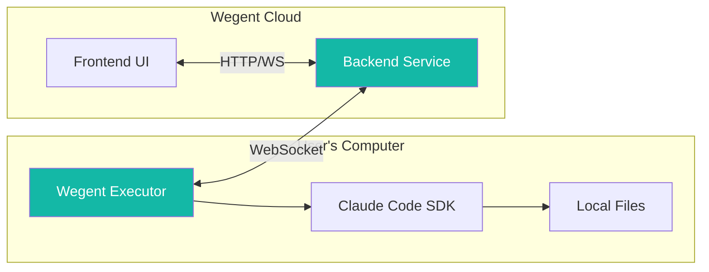
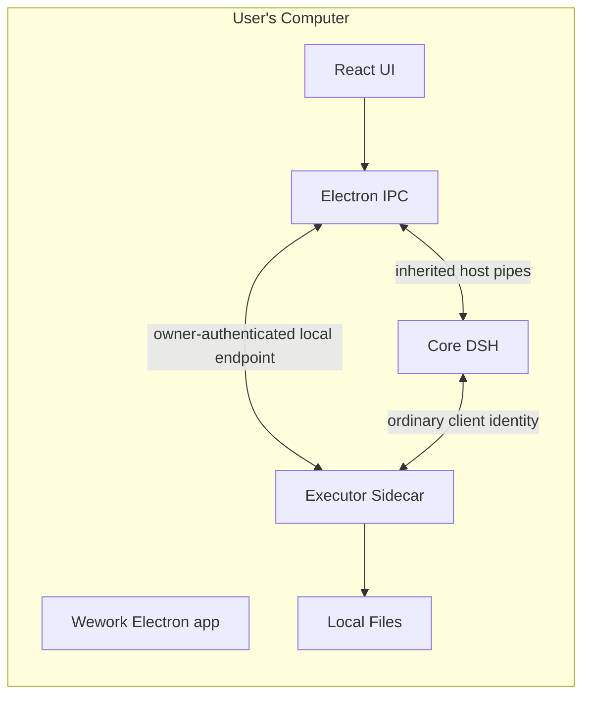
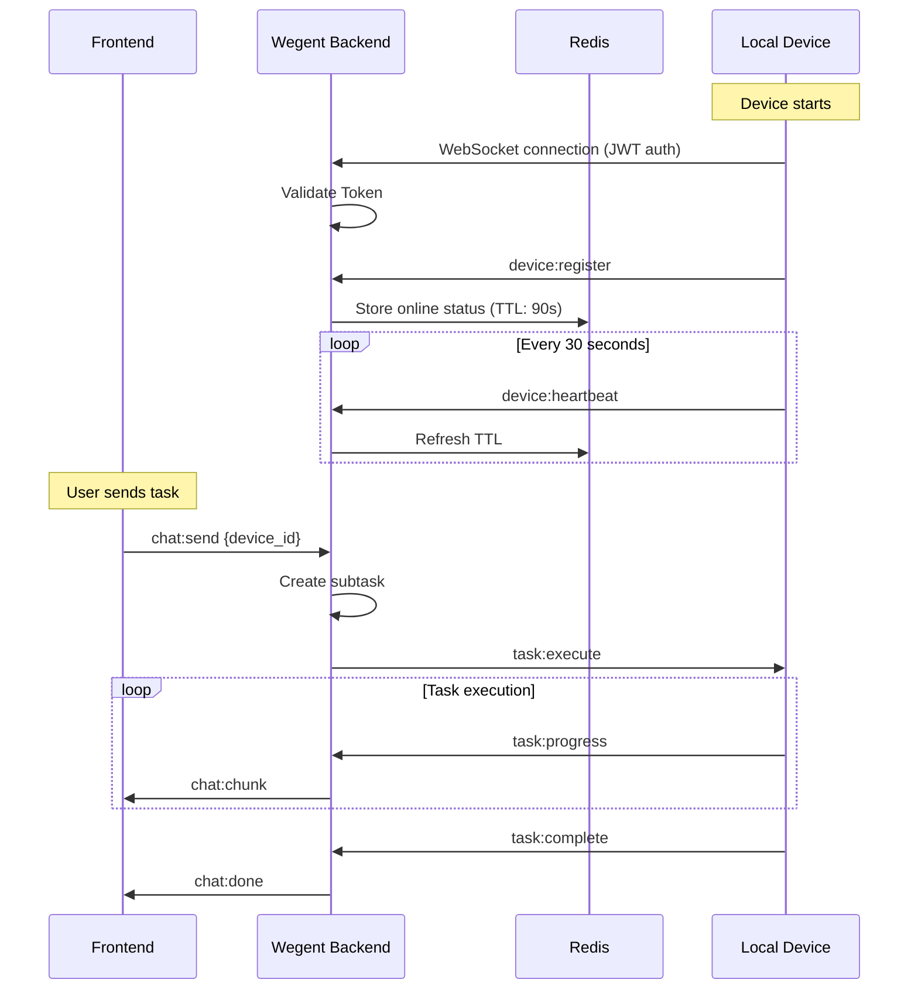
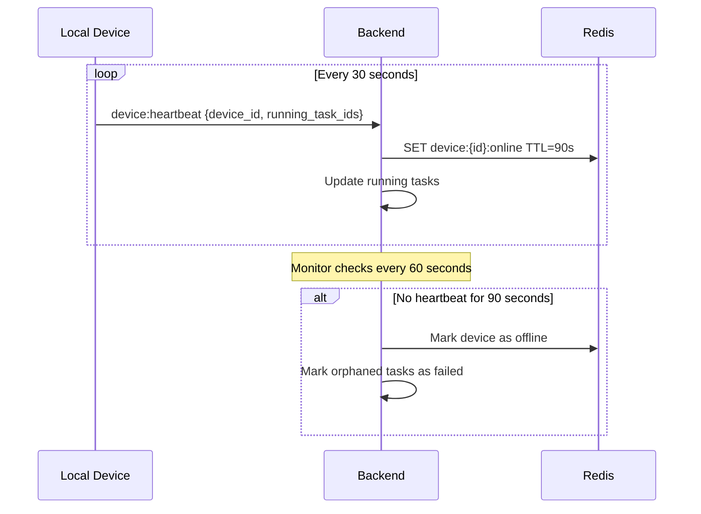
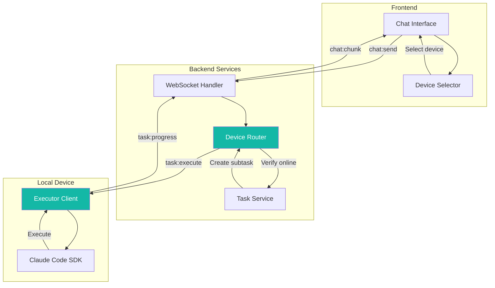
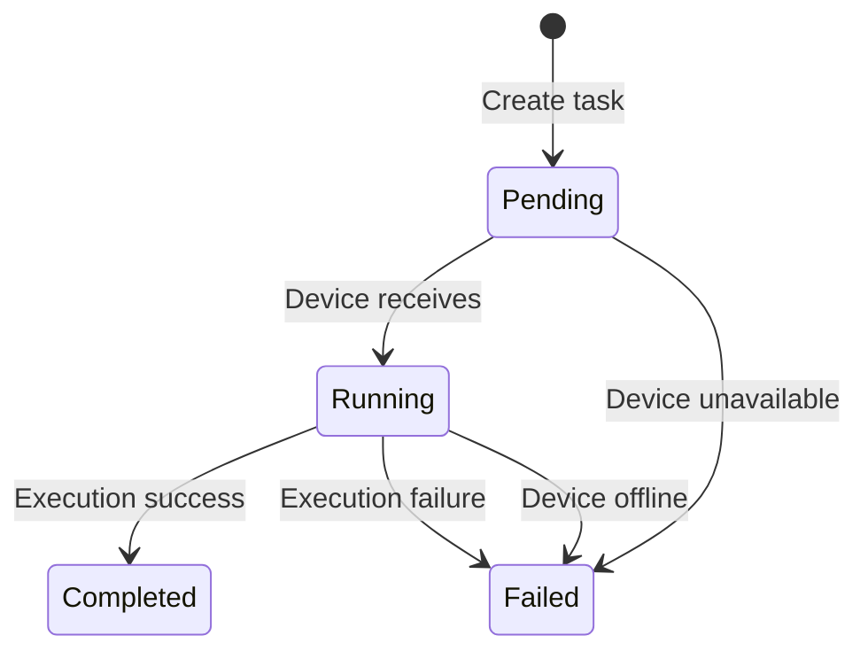
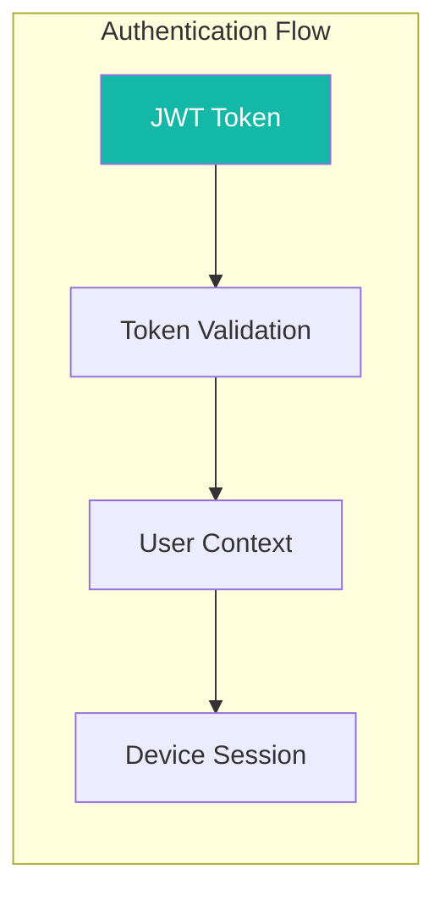
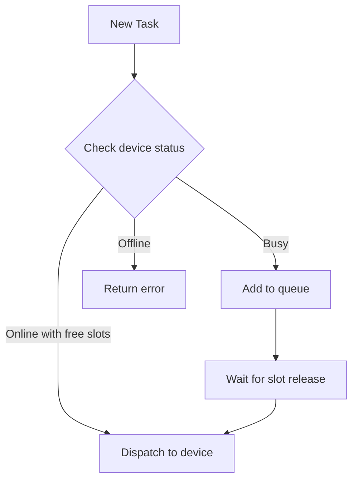

# Local Device Architecture

This document describes the technical architecture of local device support, including communication protocols, heartbeat mechanisms, and security design.

---

## 🏗 Architecture Overview

### System Components



### Wework Packaged App Local-First Channel

The packaged Wework Electron app defaults to local-first mode. This mode does not start the frontend Node dev server and does not start an extra local HTTP Backend service. The React UI runs inside the Electron renderer, while the Electron main process provides the app's internal command layer.

Local-first mode has three local runtime roles: the Electron main process, the executor sidecar, and core DSH:



Electron starts the executor sidecar with no arguments and exchanges newline-delimited JSON through a Unix socket or Windows named pipe unique to that App launch. Ordinary clients authenticate with the App IPC token. Electron uses a separate owner token for one connection that remains open for the lifetime of that executor generation. Disconnecting an ordinary client, including core DSH, closes only that connection; EOF on the owner connection closes the local endpoint and exits the executor. The executor therefore detects owner death even when Electron is killed with `SIGKILL`, crashes, or is force-quit before JavaScript cleanup can run.

Core DSH calls restricted host commands over inherited pipes created by Electron. An `end` or `close` on the input pipe means the Electron host no longer exists, so DSH invokes the launcher's `appExit` service. Normal client disposal removes those disconnect listeners first, preventing an orderly shutdown from being treated as owner death.

The Electron main process owns the executor and DSH processes it starts. On macOS and Linux, each runtime uses an isolated process group. An orderly App close or restart sends `SIGTERM`, continues waiting for the complete process group even if its leader has already exited, and sends `SIGKILL` to surviving members after the deadline. The dev-mode reload supervisor and the executor it launches remain in the same cleanup scope. Owner sockets and host pipes provide in-process self-termination for forced exits; process-group cleanup is the fallback for orderly shutdown, and neither mechanism replaces the other.

A local-endpoint write failure, EOF, or child exit marks the corresponding IPC connection unavailable. A normal request timeout ends only that request and does not tear down the transport, so system sleep or scheduling delays cannot trigger endpoint reconnection or attach the App to another executor. If the supervisor starts a new executor generation after a crash, Electron must complete a new owner handshake before that generation becomes ready.

Device commands started by the executor must have stdin closed instead of inheriting the process stdin that carries the App JSONL protocol. Otherwise, a child command that reads standard input can steal request bytes and corrupt the next protocol frame. The executor reads App IPC as bytes, splits frames on newlines, and validates UTF-8 per frame; an invalid frame is discarded after logging only its length and error offset and must not terminate the executor or interrupt unrelated running tasks. When Wework detects a changed executor runtime instance, it reloads the affected task list and transcripts. Queued messages confirmed by the transcript are removed, while sends that were still unconfirmed at disconnection return to a retryable queued state.

The local runtime event channel and App IPC write queues use bounded buffers with a capacity of 8192. IPC writing places Responses text, terminal events, errors, and RPC responses on a high-priority queue, while tool blocks, diagnostics, plans, and file-change events use a low-priority queue. A full high-priority queue applies explicit sender backpressure and records it. A full low-priority queue drops the current recoverable event, records the pressure, and emits `executor.event_lagged` instead of waiting for the broadcast channel to overwrite older events before detecting loss.

Tool-output events carry at most 64 KiB, and file-change events carry at most a 128 KiB diff preview; the complete patch remains available in its artifact. When Wework receives `executor.event_lagged`, it reloads transcripts for the current task and every running task, then reconciles those transcripts with optimistic user messages that have not yet been persisted by using the stable client message ID. Task switching or event congestion therefore converges execution state, user input, and assistant output from the same recovery result.

Wework's DSH channel subscribes to executor events through a dedicated local endpoint connection. Event sequencing, reconnect replay, and history-loss detection are all executor responsibilities. The executor assigns a monotonically increasing `sequence` and retains an in-memory journal bounded by both 4096 events and 8 MiB. A reconnect supplies the last consumed sequence, and the executor atomically returns the subsequent journal snapshot before continuing with live events, avoiding a race between snapshotting and subscription. If the requested sequence is older than the retained window or ahead of the latest event, the executor emits `executor.event_lagged` with the `event_history_lost` reason so Wework can converge from transcripts.

The Electron layer does not retain an event journal, generate sequences, or implement replay and coalescing policy. It only bridges the executor's dedicated event socket to the SSE consumed by the renderer. If `res.write()` reports HTTP backpressure from the browser side, Electron closes the upstream socket and the current SSE so the renderer reconnects with the last consumed executor sequence. This prevents an unbounded Electron backlog while the screen is locked, the system is asleep, or the renderer is reloaded, and keeps stream correctness independent of Electron scheduling.

Backend connectivity is optional, not a required dependency for the local app. When login, model/capability sync, cloud projects, or web control of the local computer are needed, the executor can register as a local device over the Backend Socket.IO channel. The same executor sidecar reuses one command handler and one runtime work handler while serving Wework App and core DSH over the local App IPC endpoint and Backend over Socket.IO. This design does not introduce a local HTTP gateway and does not require Wework App to start Backend itself.

### Cross-Component Request Log Correlation

Wework generates a request ID when a request enters a cross-process or cross-service boundary and reuses it in downstream logs for that request. This field diagnoses one request only. It does not replace task IDs, device IDs, thread IDs, or OpenTelemetry trace IDs, and it must not be used to infer business state.

- Renderer HTTP requests to Backend use `wework-http-<uuid>` and pass it through `X-Request-ID`. Backend reuses that value in its request context and returns `X-Request-ID` in the response; CORS explicitly exposes the response header.
- Renderer calls through core DSH to the local executor use `wework-local-<uuid>`. The same `request_id` appears in DSH request-started, completed, or failed logs and in the executor's `runtime:rpc` received and responded logs.
- Wework calls to a remote executor through Backend Socket.IO use `cloud-runtime-<uuid>`. Backend binds the value to the request context while handling `runtime:request` and copies it unchanged into the downstream `runtime:rpc` envelope; the remote executor continues logging the same value.

When no request ID exists, the protocol layer omits the `request_id` field instead of sending a null value, and each component uses its normal no-context log placeholder. Request IDs must be bounded printable diagnostic identifiers. Logs must not pair them with request bodies, authentication data, model keys, or local credentials.

To investigate a request, take the `request_id` from the Wework frontend, DSH, or Backend log near the user-visible failure, then search for that exact value in the same diagnostic directory or centralized log system. Start and finish entries also record the method, outcome, and elapsed time, so a missing boundary identifies the component where the request stopped without relying on approximate timestamps or task names.

### Executor Startup Environment and Codex Home Initialization

Before creating its asynchronous runtime or starting Agent child processes, a Unix executor runs the current user's interactive login shell to read the complete environment. It prefers the login shell from the system user database and falls back through `$SHELL`, `zsh`, `bash`, and `sh`. Environment capture has a fixed timeout. On failure, the executor keeps its parent environment and still appends standard developer locations such as Homebrew and `/usr/local`. The executor then passes the resulting environment consistently to Codex, Claude Code, plugins, skills, hooks, PTYs, and device commands, so Wework local sidecars, standalone local devices, and Linux cloud or remote devices share the same PATH resolution behavior.

Windows has no login shell to capture, so the executor instead merges the machine and current-user PATH from the registry at startup. This keeps tools that a fresh pwsh can resolve visible to device commands even when the desktop app was launched before a PATH edit. Git diff and hosting CLI status device commands run git, `gh`, or `glab` natively without requiring `bash` or `python3`, which are not guaranteed on Windows PATH.

Wework uses an isolated Codex Home for local runtime configuration. During first-run initialization, users can copy configuration, plugins, skills, and plugin marketplace data from the native Codex Home. After initialization, Wework writes `apps = true` under `[features]` by default so migrated plugin Apps are immediately available. If a user explicitly disables Apps later in Settings, ordinary subsequent startups preserve that choice.

Wework considers the local runtime usable only after the real Codex app-server completes `initialize`, not merely when the executor stdio transport is connected. After Electron starts the executor, it first applies the current local proxy configuration and then starts and initializes the shared Codex app-server through `runtime.codex.ensure_started`; the renderer proceeds to the interactive workbench only after that call succeeds. The Codex initialization path must not synchronously wait for plugin marketplace refreshes, Git fetches, update checks, or other external network requests. Those background requests must not delay the `initialize` response even when the network is unavailable or a proxy never responds. Startup E2E coverage must verify this boundary with the real Codex binary and a blocking network proxy, while also confirming that no Agent model request is sent during initialization.

### Runtime Task and Goal State

The runtime task `running` field represents only whether a model turn is currently executing. After a turn completes, fails, or is cancelled, the executor must settle that field to `false`. Wework uses it to decide whether to render the stop control and running indicator, and whether a new message can be sent directly.

Two live signals jointly determine `running`: the active-task set owned by the current executor process and a turn explicitly marked `inProgress` in the Codex thread. The latter covers cases such as automatic Goal continuation, where the local execution wrapper has returned while the provider is still running a later turn. A Codex thread-level `active` status, persisted task summaries, and Wework reminder state cannot independently infer execution. The task list, transcript, detail pane, system tray, and sleep-inhibition logic must consume the same executor-provided `running` value. After an executor or Wework restart, the UI must restore running state when `thread/read` or `thread/list` still returns an active turn, and settle to idle only when no active turn remains.

Within one executor process, send, guidance, and cancellation operations use one local execution record as the authoritative lifecycle. The Codex `threadId` and `turnId` are subordinate context on that execution and remain valid only while its execution ID still matches; they must not live in an independent registry that can keep a task running. When an execution finishes, the executor atomically removes the local execution and its Codex turn context before emitting the terminal response. Provider callbacks such as a concurrent `turn/steer` response that arrive after completion are ignored and cannot mark the settled task as running again. Active turns returned by `thread/read` or `thread/list` can still project task-list state and restore state after restart, but they do not create a second in-process execution lifecycle.

Task summaries also expose Codex `threadStatus` (`notLoaded`, `idle`, `systemError`, or `active`) and `turnStatus` (`inProgress`, `completed`, `interrupted`, or `failed`) without conflating their lifecycles. The separate `continuable` field means that the conversation is not archived and can accept another message; it must not be used to infer that a turn is running. Wework renders running feedback only from the explicit `running` field and real turn state, and does not convert an `active` thread or message status into streaming.

Refreshing thread metadata must not overwrite a persisted terminal task state. When a Codex thread becomes `idle`, the executor preserves local `done`, `cancelled`, or `failed`; only a genuinely active turn can move the task back to `running`. A normally completed conversation that remains available for follow-up therefore has `status=done`, `running=false`, `continuable=true`, `threadStatus=idle`, and `turnStatus=completed`.

Goals have an independent lifecycle. An `active` goal means that its objective can continue in later turns; it does not mean that a model turn is currently executing. Keeping an active goal while a task is idle must not mark the task as running again. A user's next message creates a new turn directly instead of being sent as guidance to an in-progress turn.

If a user creates a Goal while a normal turn is still running, Wework retains that request and starts a new Goal turn with `initialGoal` after the current turn explicitly settles. An active Goal keeps the task visibly running, but it must not block this queued Goal handoff; ordinary queued messages still wait until the task is genuinely idle. The executor waits for Codex automatic continuation only when the Goal was already active before the turn started. If the Goal is created during a normal turn, that execution must settle first so Wework can start the queued Goal turn. This boundary prevents a deadlock where the frontend waits for an idle task while the executor waits for an automatic continuation that Codex will not create.

The Wework frontend manages every task lifecycle through one user-scoped `RuntimeTaskLifecycleStore`. The Store owns one state machine per task and routes events to it. The state machine is the aggregate root for execution, turn, Goal, and unread state; its reducer is only an internal transition implementation. The React Provider adapts that same Store for subscription and neither stores nor infers execution state. The task list, composer, message thinking feedback, system tray, close guard, and completion reminders all read the same Store snapshot.

Authoritative frontend execution state is memory-only and is never written to a local file or browser storage. The optimistic `starting` state created when a user sends a message is owned by the same state machine and converges when the executor explicitly reports `running=true` or `running=false`. During automatic continuation of an active Goal, the task remains visibly running between turns and after a page reload while either local execution remains active or the provider still reports an `inProgress` turn. A turn without streaming content may remain `idle`, so Wework shows no thinking indicator and creates no unread marker. To preserve unread edge detection across an application restart, Wework persists only task keys for unread results and task keys that were last observed running. The latter is not an execution-state source and cannot override the executor's current snapshot.

Before a normal follow-up on a persistent thread calls `turn/start`, it must use `thread/read` to confirm that no active turn exists. Ephemeral threads do not support `thread/read(includeTurns)`, so their sends must instead check the executor's local active execution inside a per-task serialized critical section. A new turn must register itself as locally running before a concurrent sender can leave that section. If the provider rejects an overlapping send, Wework immediately restores the task to running state, refreshes the work list, and preserves the user's input in the queue. Once the provider settles to idle, Wework automatically sends that queued item with the same client message ID to avoid loss or duplication. Completion or interruption clears the active turn and restores the UI to idle. Interrupt-and-send creates a new turn only after the previous turn is confirmed interrupted: persistent threads also confirm that the provider turn stopped, while ephemeral threads rely on interruption of the local execution.

Consecutive sends on an ephemeral thread depend on that thread remaining loaded in the shared Codex app-server. After a successful turn, the executor must not send `thread/unsubscribe` for an ephemeral thread; otherwise a later direct `turn/start` can target a thread that the app-server has already unloaded. Ephemeral threads also do not support the paginated transcript RPCs, so transcript queries must read the executor's local runtime cache instead of calling `thread/turns/list`. Persistent threads continue to unsubscribe after each terminal turn and use the provider transcript as their history source.

Codex guidance is sent to the active turn through the shared app-server. If that turn finishes or changes while guidance is being sent, the executor reports the race as `no_active_turn`; Wework then sends the same content as a normal follow-up message so user input is preserved without a misleading send failure.

A conversation can switch models and providers between turns. Wework sends the selected model and provider configuration with every continuation, and Codex app-server applies the new `modelProvider` during `thread/resume`. For tasks routed through the Wework router, the executor assigns one stable local model-proxy URL per task and atomically updates its upstream configuration at the start of every turn. After the root thread is created, the proxy binds its thread ID and accepts requests only from that thread or its child threads. The upstream and model supplied by the executor for the current turn are the sole routing authority.

OpenAI reasoning and remote-compaction items can contain `encrypted_content` that is valid only for the provider that produced it. Before continuing, runtime work compares the previous `modelSelection` in the task summary with the requested selection and passes a switch marker to the executor when the model or model type changed. On the first target request through the Wework router, the proxy removes provider-bound encrypted reasoning or compaction items and `previous_response_id`, then consumes the marker only after a successful request. This also covers a compaction request that occurs immediately after switching and temporarily omits the `<model_switch>` marker, preventing stale ciphertext from reaching OpenAI Responses, Chat Completions, or Anthropic Messages upstreams.

After an explicit failure, “switch model and retry” starts one new turn. It preserves the original task and portable thread context and sends exactly one request to the newly selected upstream. The executor also writes the turn's `modelSelection` back to the task summary so the model shown after a refresh matches the model that handled the request. Guidance sent while a turn is running remains part of that turn and does not switch models; the new model applies only to a normal new turn or one created by interrupt-and-send.

The local model proxy uses the Codex Responses protocol as its internal canonical representation and converts bidirectionally among OpenAI Responses, OpenAI Chat Completions, and Anthropic Messages upstream protocols. When the protocol changes, tool-call IDs and tool-result references in history must be normalized at the request boundary to stable IDs containing only letters, numbers, underscores, or dashes, while preserving a one-to-one mapping within that history. Raw provider IDs must not be forwarded directly into another protocol. Tool-call IDs returned by streaming responses follow the same normalization rule so later tool results still reference the original call and `item/started` and `item/completed` settle the same Wework tool block.

Before sending a user message, Wework generates a stable `clientUserMessageId` and renders an optimistic local message. The ID travels unchanged through the runtime create/send request to Codex app-server's `turn/start.clientUserMessageId`. When the Codex transcript returns the user message, the executor preserves the same `clientUserMessageId`, which Wework uses to reconcile it with the optimistic message. The Codex provider item ID remains the provider-event identity, but it cannot replace the client user message ID; otherwise transcript pagination or refresh can interpret one send as two messages.

The turn ID returned by a live send may be a provisional ID allocated by the executor before the provider turn exists, while the later transcript contains the canonical Codex turn ID. When Wework merges the live conversation with the transcript, it first reconciles by canonical turn ID. If the IDs differ, it must fall back to the stable `clientUserMessageId`, merge both representations into one turn, and adopt the transcript's canonical turn ID. A non-null local turn ID must not disable client-message reconciliation; otherwise races such as automatic Goal continuation can render the same user message and subsequent output twice.

When a terminal event races with a transcript refresh, the same provider assistant item can also appear briefly under both a provisional turn and the canonical turn. The provider item ID is the stable cross-turn alias identity in this case: when an assistant item ID belongs to exactly one canonical snapshot turn, Wework must merge every local alias carrying that item into the canonical turn while preserving live tool blocks or other content not yet present in the snapshot. It must not retain both representations merely because their turn IDs differ, and it must not deduplicate across turns by text content because distinct provider item IDs may legitimately contain repeated model output.

The Codex Goal protocol returns `createdAt` and `updatedAt` as Unix seconds, while Wework's `RuntimeGoal` contract uses Unix milliseconds. The executor must normalize these fields at the provider boundary for `thread/goal/get`, `thread/goal/set`, and `thread/goal/updated` before the frontend reconciles snapshots by `updatedAt`. Without that normalization, an optimistic Goal's millisecond timestamp always appears newer than the canonical completed Goal's second timestamp, leaving a completed Goal visible as active.

Wework explicitly sets `historyMode=paginated` when creating a Codex thread. To restore a transcript, the executor first reads thread metadata with `thread/read(includeTurns=false)`, then reads turns in descending chronological order through `thread/turns/list`, and loads each turn's complete items in ascending order through `thread/items/list`. Pagination cursors are opaque Codex values; neither the executor nor the frontend may parse them or rewrite them as local offsets. Ordinary requests load one page, while search, Supervisor, and other full-history consumers follow `nextCursor` to the end. The executor rejects repeated cursors, missing turn IDs, and items attributed to a different turn instead of silently returning incomplete or misordered history.

Paginated transcript responses do not synthesize global `rangeStart`, `rangeEnd`, or provider-wide navigation indexes. Wework derives turn navigation from the messages currently loaded in the pane. When the user requests older history, the frontend returns `beforeCursor` unchanged and merges the resulting page into the existing conversation. Real Codex desktop E2E coverage must create a conversation larger than one page, restart the application, verify that only the newest page is initially restored, load older history with an opaque cursor, and confirm that virtualized navigation state still follows the currently visible user message.

Tool state follows app-server lifecycle events: `item/started` creates a running tool block, while `item/completed` must settle the matching block to `done` unless the item explicitly failed. Some standalone tool items, including image view, sleep, and web search, do not carry a `status` field. The executor normalizes these terminal items to `done` in both live event mapping and transcript restoration so Wework does not keep showing a running state or advancing timer after the tool completes.

Manual context compaction succeeds only after a new `contextCompaction` item is persisted in the Codex thread, not when `thread/compact/start` merely accepts the request. The executor records the latest turn before starting compaction and then polls the recent transcript. It returns `turnId` and `compactionItemId` to Wework only after finding the compaction item in a new turn; timeout or transcript read failures return an explicit error. While the request is pending, Wework shows one "Compacting context" processing block, then settles that same block to "Context compacted" or an error state.

Compaction event routing preserves the synthetic `${taskId}-context-compact` subtask identity so the real Codex turn ID does not split the optimistic processing block into another message. The executor accepts both `item/completed` and `context/compaction` notification forms: duplicate notifications for the same item ID are collapsed, while distinct compaction item IDs are emitted independently. Wework reconciles optimistic and runtime blocks by subtask to prevent duplicate indicators. Desktop E2E coverage uses a controlled mock model endpoint to receive and hold open the compaction request sent by Wework, verifies the confirmation, pending, completed, and follow-up stages, and proves that the follow-up model request contains the compaction summary returned by the mock rather than checking only a UI marker. Executor regression tests cover the Codex transcript persistence completion boundary.

A Codex turn may interleave reasoning, assistant text, and tool calls. The executor must track streaming offsets and completed snapshots for each assistant text segment by provider item ID. A `delta` and `completed` event for the same item represent an incremental stream and its snapshot and must be deduplicated. Completed text from a different item must still be forwarded as subsequent text even when it occurs in the same turn; it cannot be discarded merely because an earlier item emitted deltas. Before Wework moves current assistant text into a tool or processing block, it clears that text stream's offset state so the next assistant segment after the tool starts at offset 0 and preserves transcript event order.

Assistant text always enters Wework as process text while it streams. A phase carried by `item/started` is provisional: Codex can start an item as `final_answer` and complete that same item as commentary after more tools run. The executor therefore waits for completed items and the successful turn boundary before committing final content, so the UI never has to demote visible final content back into a process block. A completed explicit `final` or `final_answer` item wins; if the turn has no explicit final item, the latest completed assistant text becomes the fallback final result.

Reasoning summaries supplied by Codex enter Wework as `thinking` processing blocks. A streaming summary appears as a single “Thinking · summary” row and reports only the currently active reasoning progress. After the turn completes, fails, or is cancelled, Wework removes the thinking block instead of retaining a summary placeholder or detail in message history. The executor must map both reasoning deltas and `item/completed` notifications that carry only the complete summary; otherwise a long reasoning phase degrades to a generic waiting state with no visible progress. Internal reasoning that the provider does not include in its summary is not displayed.

### Backend Device Chat Task REST Entrypoint

The web device chat page still sends messages through WebSocket. For external systems or curl-based callers that need to create the same kind of task, Backend exposes a REST entrypoint:

```text
POST /api/device-chat/tasks
```

This entrypoint writes central `TaskResource` and `Subtask` rows, and reuses the same `create_chat_task`, device resolution, and `trigger_ai_response_unified` path as the device chat page. The request does not include `workspacePath` or `localTaskId`: regular device chat tasks do not have a project workspace concept. If `projectId` is provided, Backend resolves the target device from the Project config. If `projectId` is omitted, Backend resolves the target from explicit `deviceId`, the existing task device, Wework defaults, or the user's default local device.

Creating a task only requires `teamId` and `message`; callers may also send `deviceId`, `projectId`, model options, and context fields. Continuing a task sends `taskId`; Backend verifies that the current user can access the task and then reuses the existing task's `client_origin`. The response returns the central task and message identifiers:

```json
{
  "taskId": 2267,
  "userSubtaskId": 3332,
  "assistantSubtaskId": 3333,
  "messageId": 5,
  "aiTriggered": true,
  "deviceId": "device-de8f474294621dd5acfd1287",
  "chatUrl": "/devices/chat?taskId=2267"
}
```

The OpenAPI schema is generated automatically by FastAPI from `DeviceChatTaskRequest` and `DeviceChatTaskResponse`; no static `docs/api` file needs to be maintained.

### Communication Architecture

The following diagram shows how local devices communicate with the Wegent system:



### Device Types

Device CRDs use `spec.deviceType` to separate lifecycle ownership and frontend capabilities:

| Type     | Lifecycle owner                              | Connection | Typical entrypoint                                              |
| -------- | -------------------------------------------- | ---------- | --------------------------------------------------------------- |
| `local`  | User's local executor                        | WebSocket  | Local installer or manually started executor                    |
| `cloud`  | Wegent cloud device service                  | WebSocket  | Cloud device create, restart, and release flows                 |
| `remote` | User-managed Docker container or remote host | WebSocket  | Remote Docker command generated from Wework connection settings |

`remote` devices reuse the local executor WebSocket registration, heartbeat, task execution, and command RPC channels, but `RemoteDeviceProvider` lists them separately and returns `remoteConfig`. Backend does not persist the `WEGENT_AUTH_TOKEN` contained in the generated command; the Device CRD stores only non-sensitive metadata such as provider, image, deviceId, deviceName, backendUrl, publicBaseUrl, and createdAt.

After a remote Docker device starts, it sends `device:register` with `device_type=remote`, which updates the matching Device CRD. Online state still uses the Redis device-online key, so task routing, slot accounting, and terminal/code-server session RPC use the same protocol as local devices. The frontend does not expose cloud lifecycle actions for `remote` devices; users stop, restart, or remove the container on the Docker host.

---

## 📡 WebSocket Protocol

### Event Types

| Event              | Direction        | Description         |
| ------------------ | ---------------- | ------------------- |
| `device:register`  | Device → Backend | Device registration |
| `device:heartbeat` | Device → Backend | Heartbeat keepalive |
| `task:execute`     | Backend → Device | Task dispatch       |
| `task:progress`    | Device → Backend | Task progress       |
| `task:complete`    | Device → Backend | Task completion     |

### Rust Executor Local Event Coverage

The Rust executor Backend channel must remain event-compatible with the legacy
Python local device runner. In addition to task execution and heartbeat events,
the local device currently registers and handles:

- `task:cancel`, `task:close-session`
- `chat:message`
- `device:execute_command`
- `device:sync_capabilities`
- `device:start_terminal_session`, `device:start_code_server_session`
- `terminal:input`, `terminal:resize`, `terminal:close`
- `runtime:rpc`
- `device:upgrade`
- `device:run_extension`

The `extension_scope` field of `device:run_extension` accepts `task` or
`global` and defaults to `task` when omitted. Task-scoped extensions run from
the current task's `.claude/skills/<extension>` directory; global extensions
run from `~/.claude/skills/<extension>` for the user running the executor. The
script path must remain inside the selected extension directory, and other
scope values are rejected.

The migration coverage matrix is tracked in
`executor/docs/LOCAL_DEVICE_PYTHON_MIGRATION_TESTS.md`. When adding a local
device event, add coverage to
`executor/tests/local_backend_device_migration_contract.rs` first, then update
that migration matrix.

### Message Format

```json
// device:register
{
  "event": "device:register",
  "data": {
    "device_id": "uuid-xxx",
    "name": "Darwin - MacBook-Pro.local",
    "max_slots": 5
  }
}

// device:heartbeat
{
  "event": "device:heartbeat",
  "data": {
    "device_id": "uuid-xxx",
    "running_task_ids": ["task-1", "task-2"]
  }
}

// task:execute
{
  "event": "task:execute",
  "data": {
    "subtask_id": "subtask-xxx",
    "prompt": "User message",
    "context": {}
  }
}
```

---

## 💓 Heartbeat Mechanism

### Sequence Diagram



### Timing Parameters

| Parameter              | Value               | Description                    |
| ---------------------- | ------------------- | ------------------------------ |
| **Heartbeat Interval** | 30 seconds          | Device sends heartbeat         |
| **Online TTL**         | 90 seconds          | Redis key expiration           |
| **Monitor Interval**   | 60 seconds          | Backend checks expired devices |
| **Offline Threshold**  | 3 missed heartbeats | Device marked as offline       |

If one `device:heartbeat` ACK times out, is rejected by Backend, or hits a Socket.IO transport error, the executor quickly retries the next heartbeat after 10 seconds instead of waiting for the full 30-second heartbeat interval. After two consecutive heartbeat failures, the executor proactively disconnects the current socket and enters the reconnect-and-register flow. This tolerates one transient hiccup while still normally letting the device re-register and refresh online state before the 90-second online TTL expires after a short network interruption recovers.

### Running Task Tracking

Each heartbeat contains currently running task IDs, used for:

- Real-time slot usage tracking
- Orphaned task detection
- Automatic cleanup on disconnection

### Global Capability Reporting

Local devices also report Claude Code global capability state through heartbeats. A full report includes:

- `capabilities.revision`: local Wegent-managed manifest revision
- `capabilities.digest`: content digest for `skills`, `plugins`, and `mcps`
- `capabilities.skills`: Skills available under `~/.claude/skills`
- `capabilities.plugins`: Plugins installed in `~/.claude/plugins/installed_plugins.json`
- `capabilities.mcps`: Wegent-managed global MCP configuration

Plugin reports must include the Skills contained inside each plugin. The executor scans `SKILL.md` files under each plugin install directory and returns them in `plugins[].skills[]`:

```json
{
  "name": "context7",
  "marketplace": "claude-plugins-official",
  "version": "1057d02c5307",
  "source": "wegent",
  "installed_plugin_id": 301,
  "skills": [
    {
      "name": "context7",
      "description": "Look up version-specific documentation.",
      "path": "skills/context7"
    }
  ]
}
```

Backend persists the complete capability state only when `capabilities.full = true`. Later heartbeats with the same `digest` refresh device liveness without rewriting the full capability lists.

### Global Capability Sync

Backend can send desired global capability state to an online local device through `device:sync_capabilities`. The sync payload currently includes:

- `skills`: backend-resolved `InstalledSkill` / `Skill` entries, downloaded by the executor into `~/.claude/skills`
- `plugins`: backend-resolved `InstalledPlugin` entries, written by the executor into `~/.claude/plugins/installed_plugins.json`
- `mcps`: backend-resolved `InstalledMCP` entries, written into the Wegent-managed manifest

In `replace` mode, the executor only removes capabilities marked as `managed` in the Wegent manifest and missing from the desired state. Plugins installed directly by the user on the local machine are not removed by a Wegent sync.

Capability package downloads are constrained to the configured Backend origin. The executor resolves relative package paths against `connection.backend_url`, rejects package URLs from other origins, and only attaches the device bearer token to same-origin Backend requests. Skill download URLs are built with encoded query parameters, and package extraction uses a per-sync staging directory before replacing the managed skill directory.

When a project task runs through the local executor, its task-level `CLAUDE_CONFIG_DIR` exposes both global `skills` and `plugins` directories and inherits non-sensitive plugin settings such as `enabledPlugins` and `extraKnownMarketplaces` from the local `~/.claude/settings.json`. This lets Claude Code load global Skills and Skills provided by Plugins. Sensitive model and token configuration is still injected through runtime environment variables and is not copied from global settings into the task directory.

Claude Code, Agno, and Codex task shells receive a task identity environment set. `WEGENT_TASK_ID` identifies the current Task, `WEWORK_PARENT_TITLE` provides the current task title, `AUTH_TOKEN` provides the per-turn bearer token for Backend API access, `WEGENT_RUNTIME_AUTH_TOKEN` provides the bearer token that local Skills use to access Wegent runtime APIs, and `WEGENT_SKILL_IDENTITY_TOKEN` plus `WEGENT_SKILL_USER_NAME` identify task-scoped Skill operations. Claude Code and Agno receive the values through their child-process environments. Codex receives them through thread-scoped `shell_environment_policy.set.*` settings, so task identity never enters the shared app-server process environment and cannot leak across tasks. After Wework connects to cloud, it issues the runtime token through `POST /api/users/me/wegent-runtime-token` and refreshes it before the returned `expires_in`; disconnecting from cloud removes `WEGENT_RUNTIME_AUTH_TOKEN` from the local Codex config. The executor does not inject `WEGENT_SUBTASK_ID` into these child runtimes.

When project mode calls Claude or Codex model APIs, the executor adds a `wecode-project: <project_id>` request header in the directly launched runtime context and fills source identity headers: `wecode-action: wegent`, `wecode-source: wegent-local`, and `wecode-executor: <runtime>`, where Claude Code uses `claudecode` and Codex uses `codex`. Claude Code local mode first merges existing `ANTHROPIC_CUSTOM_HEADERS` from the executor startup process environment and the runtime environment, then appends the project identity and writes the resulting header set to both `ANTHROPIC_CUSTOM_HEADERS` and `DEFAULT_HEADERS`/`default_headers`. This keeps the Claude Code child process and downstream model gateways on the same header set. Codex writes the header into provider `http_headers` for Wegent-managed provider configs, and also injects it for personal Codex config runs when the execution model explicitly names the provider.

### Chat Task Device Resolution And Claude Code Launch Context

When a regular chat Task runs through the local executor, Backend resolves the actual dispatch device before creating or continuing the task. Resolution order is:

1. The `device_id` explicitly provided by the current request.
2. The current Project local execution config, such as `config.execution.targetType = local` and `config.execution.deviceId`.
3. The `deviceId` already stored in the existing Task spec.

The `appDeviceId` used by frontend App IPC is only the local process identity. Backend maps it to the executor Socket.IO `name` stored on the Device CRD before dispatching. If the resolved local device is stale or offline and the current user has exactly one online local executor, Backend switches the task to that online device so a stale id does not block local execution. Unknown device ids are not silently rewritten.

Before launching a Claude Code child process, the executor prepares the task context:

- It downloads turn attachments into the task directory. Project workspaces use `.wegent/attachments/<taskId>/<subtaskId>/`; non-Project tasks use an attachment subdirectory under the executor task directory.
- It restores plugin packages from `~/.claude/plugins/cache` when they are still enabled in `enabledPlugins` but their install directory is missing, and it repairs plugin hook permissions.
- It deploys task-selected Skills into `SKILLS_DIR`. Regular Project tasks use global `~/.claude/skills`; standalone local work with `project_id = 0` and task Skills uses task-level `.claude/skills` so the global directory is not polluted.
- If `WEGENT_FILE_EDIT_HOOK_COMMAND` is configured, it writes `Write|Edit|MultiEdit|NotebookEdit` `PreToolUse` and `PostToolUse` hooks into Claude `settings.json` so file-change records can be captured as turn artifacts. When Wework macapp starts the local sidecar, it generates this command by default; `WEGENT_FILE_EDIT_HOOK_COMMAND` can override the full command, and `WEWORK_FILE_EDIT_LOG_ENDPOINT` can change the default reporting endpoint.

The local executor converts Claude stdout NDJSON into Responses API events as soon as output arrives: visible text becomes `response.output_text.delta`, reasoning summaries become `response.reasoning_summary_text.delta`, and the process still sends a final `response.completed` or error event after exit. Backend and frontend code must not assume that `response.created` is followed immediately by a terminal event.

---

## 🔄 Task Execution Flow



### Task State Transitions



---

## 🔐 Security Mechanisms

### Authentication Flow



### Security Features

| Feature                | Description                                     |
| ---------------------- | ----------------------------------------------- |
| **JWT Authentication** | WebSocket connections require valid token       |
| **Token Expiration**   | 7-day expiry, requires periodic refresh         |
| **User Isolation**     | Devices can only execute tasks from their owner |
| **Hardware Binding**   | Device ID generated from hardware identifiers   |

Backend-triggered terminal and code-server sessions resolve relative paths under the configured local workspace root. Backend-triggered upgrades must stop running local tasks before restarting the executor: if `force_stop_tasks` is not set, the upgrade is rejected as busy; if forced cancellation fails for any task, the upgrade is aborted and an error status is emitted instead of proceeding to restart.

### Local Executor Connection Configuration

On startup, the local executor resolves configuration in this order: environment variables, `~/.wegent-executor/device-config.json`, then defaults. If `WEGENT_EXECUTOR_HOME` is not set, the executor uses `~/.wegent-executor`. The executor always starts the HTTP server. Wework sets `WEGENT_APP_IPC_DEVICE_ID` on its child process, explicitly enabling local App JSONL IPC on the current process stdin/stdout. If `connection.backend_url` or `WEGENT_BACKEND_URL` is also set, that same process connects to Backend, using `connection.auth_token` or `WEGENT_AUTH_TOKEN` for device authentication. A standalone Local Executor launched only with Backend connection settings does not enable the stdio control plane and continues to use the existing Socket.IO remote-device path. Wework App manages and communicates only with the executor child process it starts directly; it does not discover or attach to an executor started manually outside the App. A full App exit also terminates only the child it owns.

On macOS, development mode uses a Node watcher that builds and starts the real executor once, then rebuilds and restarts it after source changes. Windows development mode continues to use `wegent-executor-dev`. The watcher must also monitor the Wework process that launched it: on Unix, a parent PID change stops the current executor and exits so the operating system cannot adopt the watcher and let it keep restarting executors after Wework has exited.

`EXECUTOR_MODE` overrides `mode`. `docker` starts only the HTTP server. Other values start the loopback HTTP server and select either the Wework stdio control plane or the standalone Local Executor remote Backend control plane from the explicit identity described above; no local IPC socket is created. `WEGENT_BACKEND_URL` overrides `connection.backend_url`, `WEGENT_SOCKET_URL` overrides `connection.socket_url`, and `WEGENT_AUTH_TOKEN` overrides `connection.auth_token`. An empty Socket URL defaults to the Backend URL. When the origins are split, HTTP APIs use the Backend URL while the executor Socket.IO transport uses the independent Socket URL. Normal standalone startup scripts therefore do not set `WEGENT_APP_IPC_DEVICE_ID`, preserving the existing remote behavior and transport.

### Cloud Device Bootstrap Identity Variables

Cloud devices use a user data startup script to install and run the executor automatically. The startup script injects these identity-related environment variables:

| Variable                | Source                                                           | Purpose                                                                                               |
| ----------------------- | ---------------------------------------------------------------- | ----------------------------------------------------------------------------------------------------- |
| `WEGENT_AUTH_TOKEN`     | API key generated by the backend for the cloud device            | Allows the executor to connect to the backend and register the device                                 |
| `WEGENT_USER_JWT_TOKEN` | Current user's Bearer JWT from the cloud device creation request | Allows scripts or integrations on the cloud device to access backend capabilities as the current user |
| `WEGENT_USER_NAME`      | Current login username                                           | Allows scripts or integrations on the cloud device to identify the current user                       |

`WEGENT_AUTH_TOKEN` and `WEGENT_USER_JWT_TOKEN` must not be used interchangeably: the former represents the device authentication identity, while the latter represents the user identity at cloud device creation time.

### Cloud Device Bootstrap System Configuration

When creating a cloud device, the backend generates the initial login password for the `ubuntu` user and stores it in the Device CRD `spec.cloudConfig.ubuntuInitialPassword` field. The user data startup script uses that password with `chpasswd` to initialize the `ubuntu` user's password.

The same user data startup script also creates `/etc/systemd/system/fstrim.timer.d/override.conf`, configures `fstrim.timer` to run daily, then reloads, restarts, and enables the timer.

### User Isolation

Each device session is bound to a user:

- Devices can only receive tasks from their registered owner
- Prevents cross-user task execution
- Subtasks validated against user namespace

### Data Privacy

When using local devices:

- **Code stays local**: Source code is never uploaded to cloud
- **Local execution**: All processing happens on user's machine
- **Result streaming**: Only output text is transmitted
- **No persistent storage**: Cloud doesn't store local files

---

## 🔧 Device ID Generation

The Executor automatically generates a stable device ID based on the following priority:

1. **Cached ID**: Stored in `~/.wegent-executor/device_id` (if exists)
2. **Hardware UUID**:
   - macOS: System hardware UUID
   - Linux: `/etc/machine-id`
   - Windows: `MachineGuid` from registry
3. **Fallback**: MAC address or random UUID

This ensures devices maintain consistent identity across restarts.

---

## 📊 Concurrency Control

### Slot Management

Each device supports up to **5 concurrent tasks**:

- Slot usage tracked in real-time via heartbeats
- Device shows "busy" when all slots are occupied
- Tasks queue if busy device is selected

### Load Balancing



---

## 🔗 Related Documentation

- [Local Device User Guide](../user-guide/ai-devices/local-device-support.md) - User operation guide
- [System Architecture](./architecture.md) - Overall architecture design
- [OpenAPI Responses API](../reference/openapi-responses-api.md) - API reference

---

## 💬 Get Help

Need help?

- 📖 Check the [FAQ](../faq.md)
- 🐛 Submit a [GitHub Issue](https://github.com/wecode-ai/wegent/issues)
- 💬 Join community discussions
