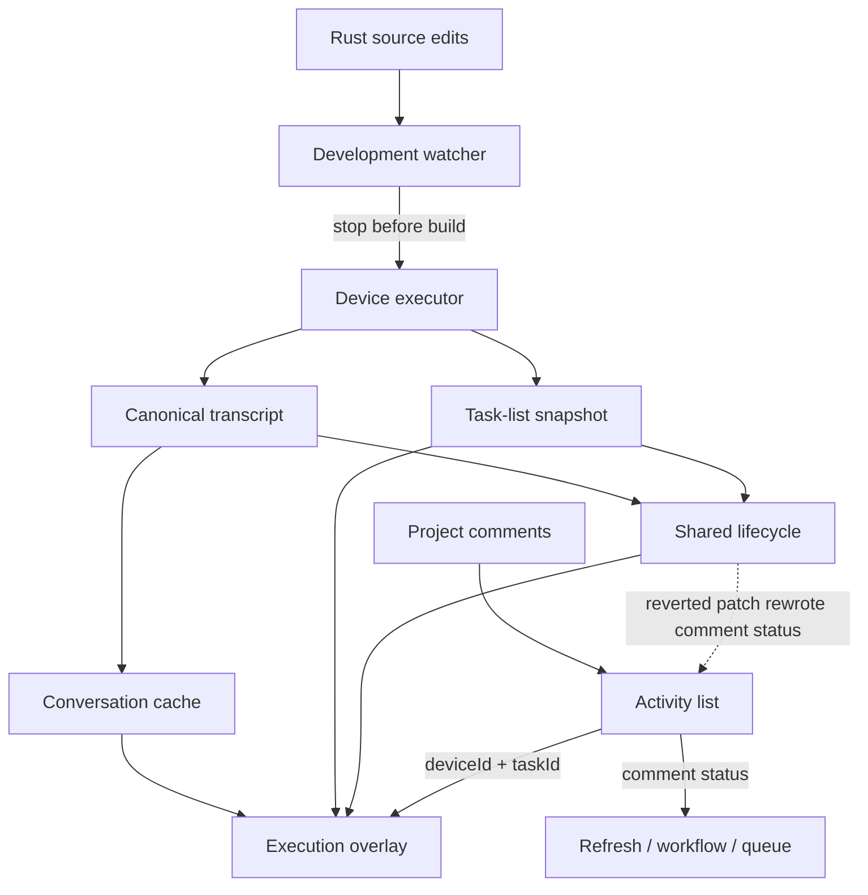
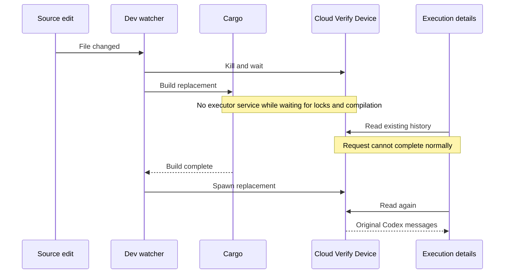
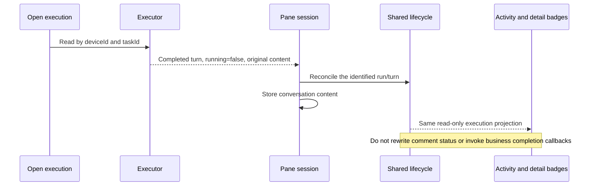
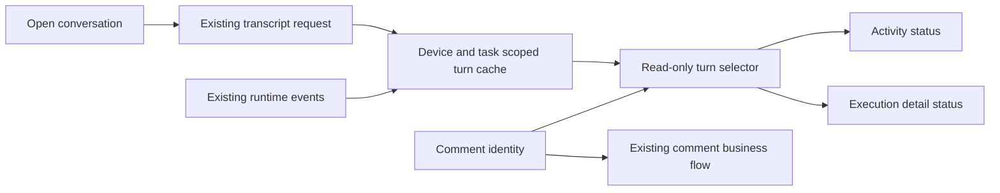
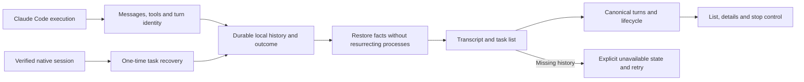
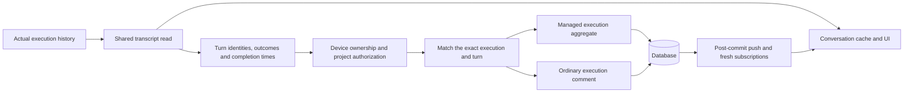
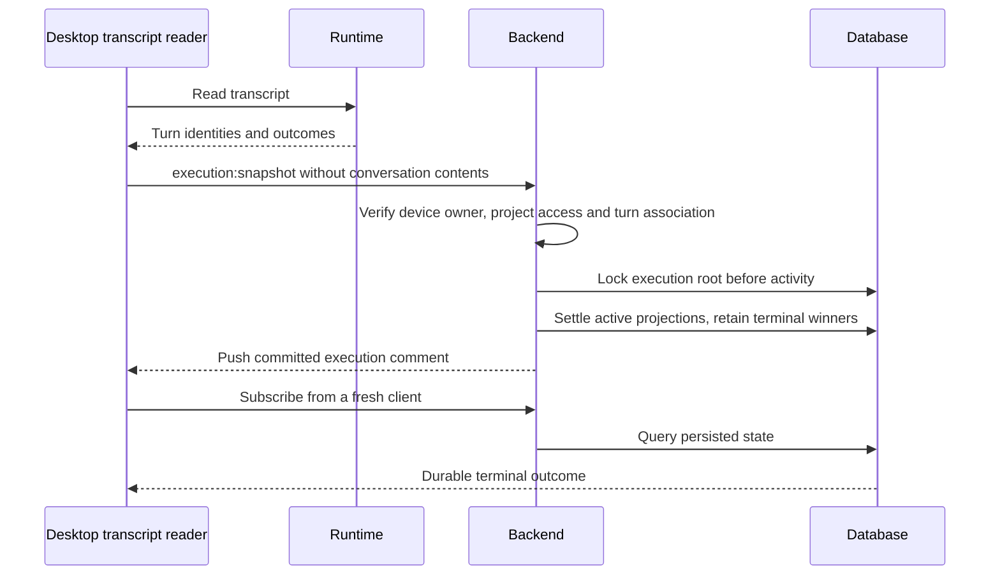

# Wework execution state and history investigation, 2026-09-17

The investigation below records the state before the frontend fix: rolled-back product code, read-only runtime inspection and isolated A/B tests. It did not restore user data, replace executors or restart user processes. The subsequent frontend implementation is documented at the end.

## Confirmed findings

1. **Development edits interrupted the device serving otherwise valid Codex history.** Cloud Verify Device runs under `wegent-executor-dev`, watching this checkout's Rust sources. Its restart loop kills the serving process before waiting for Cargo and building the replacement. The earlier investigation changed those files, triggering automatic restarts even without a manual restart command.
2. **Execution state has multiple UI projections.** Activity badges read comment status and Issue metadata, while the overlay combines pane running state with a separate task-list snapshot. Loading a transcript updates the shared lifecycle, but the activity does not consume it and the overlay can still display the stale task-list status.
3. **The reverted patch changed business data to update a badge.** Writing runtime outcomes into comment `status` also activates task refresh, workflow completion callbacks, and queued replies. The A/B test confirms one extra task refresh after reading an identical transcript.
4. **The local empty conversation and the working Codex example are distinct runtime tasks.** Claude persistence evidence cannot explain every Codex history outage.

## Evidence and task identity

`~/.wegent-executor-cloud-device/executor.log.4` records repeated `executor source changed; restarting`. Between local log timestamps 00:10:20 and 00:20:48, two builds took 7m17s and 2m42s. Another source restart occurred near the rollback, between 00:21:02 and 00:22:56. Later reads returned six messages for `codex-queue-638` at 00:30:35/37 and two messages for `codex-queue-628` at 00:30:59.

| Execution | Runtime task | Device | Provider |
| --- | --- | --- | --- |
| PRJ3EB7D2-9: original pwd execution | codex-queue-638 | Cloud Verify Device | Codex |
| Same Issue: add the comment to its description | runtime-280737517 | Local app executor | ClaudeCode |
| Working scheduler screenshot, run 3118762067395402890 | codex-queue-628 | Cloud Verify Device | Codex |

An Issue and an agent display name do not identify a unique runtime or provider.

## Architecture and the two crossed boundaries



## Outage sequence



The process interruption is confirmed. The exact renderer response during that outage was not captured; an unavailable device must not be equated with a successful empty transcript.

## Required state flow



## Validation and limits

An ignored fixture under `wework/test-results/status-ab/` compares copies of current and reverted code with the real WorkbenchProvider, pane loader, and lifecycle store. External API responses are controlled.

| Variant | Activity | Overlay | Original content | Task refresh callbacks |
| --- | --- | --- | --- | --- |
| Current, stale running task list | running | running | Preserved | 0 |
| Reverted status patch | succeeded | succeeded | Preserved | 1 |

Both focused tests pass. They confirm split state sources and unintended callbacks, but do not reproduce frontend deletion of history. Earlier component tests mocked the pane hook and missed this integration boundary. No E2E or real-Electron verification was run.

## Durable correction boundaries

Use isolated source, build, and executor-home directories for development; keep user devices on a fixed build with controlled replacement. Make both badges read one run-aware lifecycle selector without mutating comment records. Distinguish empty history, a missing task, and an unavailable device; an outage must not erase confirmed content. Validate provider-specific transcript durability independently, without changing Codex history loading based on a Claude-only finding.

No product fix is reapplied by this investigation.

## 2026-09-17: update presentation when opening a conversation

The chosen behavior uses the existing transcript request, without adding polling. Both activity and execution details read the canonical conversation turn cache. Task lifecycle continues to own task-level busy state; it must not overwrite historical turn outcomes.



```mermaid
sequenceDiagram
  participant User
  participant Pane
  participant Cache as Canonical turns
  participant Views as Activity and details
  User->>Pane: Open execution
  Pane->>Pane: Retain existing content and read history
  alt Read succeeds
    Pane->>Cache: Merge normalized turns
    Cache-->>Views: Render the associated turn outcome
  else Read fails
    Pane-->>Views: Show error and retry; retain confirmed content and status
  end
  Note over Cache,Views: Remember identity only; do not copy status or mutate comments
```

New initial comment runs use the triggering comment ID as their existing client user message ID. Continuations, including custom automation managers, use the execution comment ID. Both badges select the same turn; success, failure and cancellation remain distinct. Neither prose nor task idleness implies success.

For legacy records without an association, a binding is established only with complete history, exactly one execution comment for the addressed device/task, and exactly one identified turn. The activity view retains that binding when subsequent turns arrive. Ambiguous legacy histories retain server comment status; repairing those records requires recovering actual run/turn associations. This change does not claim to repair them or explain the original missed backend completion event.

No Rust, executor processes, historical storage or comment business state is changed. Integration tests use the real WorkbenchProvider, pane session, cache and presentation with mocked external APIs. They cover synchronization, closing, subsequent turns, read failure/retry and incomplete history, with additional identity and launch tests. Real-device regression assertions are added to the existing collaboration-shared-core scenario through board-reply-model.mjs. E2E and ai:verify were not run.

Final verification: 88 tests across six files passed, along with Wework type checking, changed-file ESLint and formatting checks. The E2E module passes syntax checking and its scenario is registered in desktop CI; it was not executed. jsdom reports its missing canvas implementation, so these tests do not establish real-client rendering correctness.


## 2026-09-17: verified local execution and durable history

The affected task is `runtime-280737517`, attached to Issue `PRJ3EB7D2-9`. Its actual runtime is `claude_code`; the bot display name does not identify the engine. Native session `1373eac3-c6fc-4e61-9bd7-915f18e561ae` matches the workspace and sole user request. It ended at 2026-09-16 15:21:24.984 UTC with `end_turn` and seven tool calls. This establishes execution termination, not complete achievement of the business request; the original response's caveats are preserved.

Before repair, the live executor listed the task as `done/running=false` while successfully returning zero transcript messages and turns. The index omitted its messages, terminal state and native session association.



Local Claude messages and execution results now survive restart. Codex continues using its provider transcript reader. Missing request identifiers are allocated before recording the user message, and follow-ups retain the saved native session association. Terminal message outcomes survive an exit between saving the response and releasing execution control. Interrupted execution is never restored as a live process.

Idle cancellation no longer changes completion timestamps. Opening the viewer accepts authoritative idle state unless newer live events arrived during the read; stopping triggers another read. An existing idle execution with missing history displays an explicit unavailable state and no stop control. Confirmed conversation content is retained across read failures, and an unmatched outcome is not inferred as business success.

Validation: 498 Rust runtime-work tests and 40 Claude-related tests passed, including restart after multiple turns. Focused desktop provider/pane/cache tests cover empty idle history, retry recovery and stop refresh. Shared conversation/viewer tests and TypeScript/ESLint checks were also run. A pre-existing test-server assumption was corrected to read complete TCP headers and compare HTTP header names without case sensitivity.

An isolated real executor verified the recovered task over IPC: two messages, one completed turn and seven tool blocks, matching native text and tools exactly; idle cancellation preserved timestamps. The user's local executor subsequently returned the same verified transcript and original completion time. The index, prior binary and recovery manifest were backed up under `~/.wework/recovery/runtime-280737517-20260917-verified/`; these private runtime artifacts are not committed. Recovery changes only this task's history, native session association and execution result, without rerunning it or changing Issue/comment business data.

Rust changes were validated in isolated source/build directories. Integration checks the cloud device is idle, pauses its source watcher while keeping the existing service alive, builds before resuming the watcher, and uses the existing frontend build watcher. No E2E, `ai:verify`, or personal Electron UI automation was run. The CI-covered board-reply-model scenario adds an assertion that a finished execution does not offer Stop; that E2E has not been executed in this round.

Integration and the original-checkout build completed successfully. The source watcher is running again. After switching the local app to the integrated binary, another live IPC read confirmed the two messages, one completed turn, seven tool blocks and original completion timestamp. The desktop frontend production build also passed and contains the new unavailable-history messages.

## 2026-09-17: persist the cloud execution projection

The earlier presentation-only correction left a missing write-back path. A direct database read confirmed that `runtime-280737517` had completed locally while execution comment `9f2f7db6-b289-4ec6-afc9-37b9d861b085` remained `streaming`, with `metadata.run_status=running`. This comment execution has no `loop_item_executions` row. Local history persistence and renderer cache correction could not repair the cloud projection.

The shared desktop transcript read now reports compact execution facts, without polling or conversation contents:





Association uses a saved turn ID, execution comment ID, or trigger comment ID. Legacy association requires a complete, idle, single-turn history with exactly one execution comment, and completion must not predate comment creation. Naive MySQL timestamps use the existing `+08:00` session timezone; SQLite uses UTC. Empty, unknown, ambiguous or incomplete history cannot establish success.

Ordinary comment reconciliation writes execution status and turn evidence, and updates the Issue AI summary only when it still refers to that same run. It does not advance the business task to review or rerun work. Managed executions use the existing `LoopItemExecution` transition instead of independently changing its comment. Live projection and reconciliation share lock ordering; repeated reports are idempotent and conflicting terminal reports preserve the durable winner. Failed cloud writes are logged, leave local history readable, and are attempted again on the next read.

Validation: 89 backend reconciliation and existing project-chat tests, 12 snapshot conversion tests, and 56 desktop hybrid-service tests passed. Type checking, focused lint and the frontend build passed. The actual task was verified through local IPC and repaired through the same backend service; an independent database connection confirmed completed comment, run and AI summary states, with the business task status unchanged. A private backup of the original database projection remains in the existing local recovery directory.

The CI-owned `board-reply-model` scenario now checks persisted terminal states through an independent Socket.IO subscription. E2E and `ai:verify` were not run.

A final check against the running backend Socket.IO handler reported the same verified snapshot and changed zero rows. A separate client subscription returned `completed` with the original turn identity, confirming the live handler's idempotence and durable fresh-read behavior. This used existing authentication and did not start another execution or control the personal Electron window.
