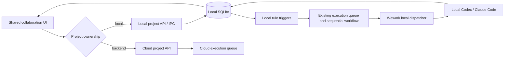
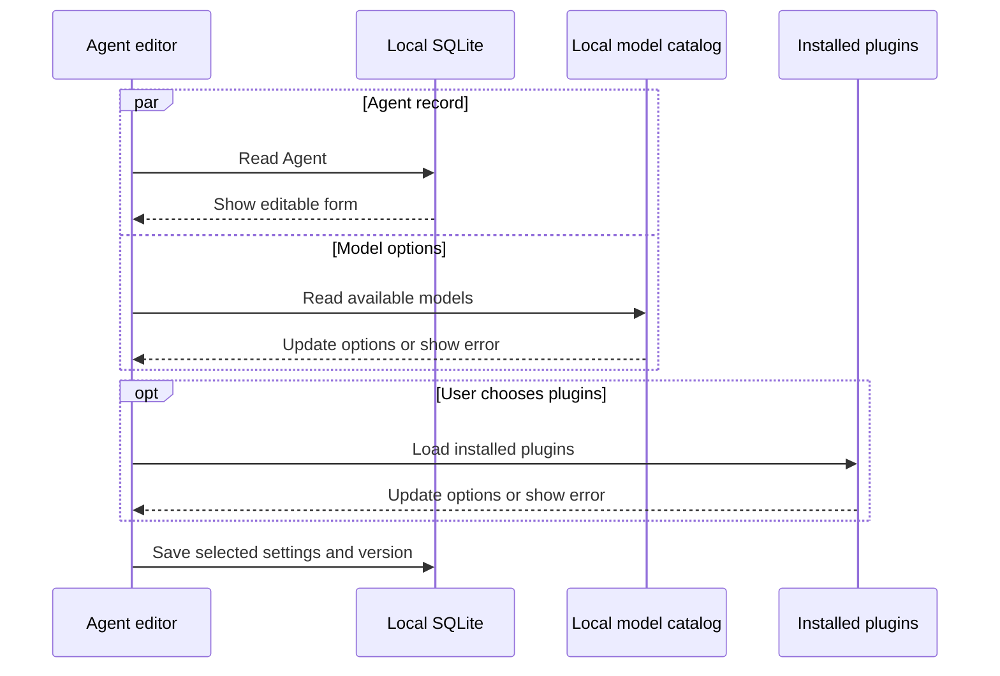
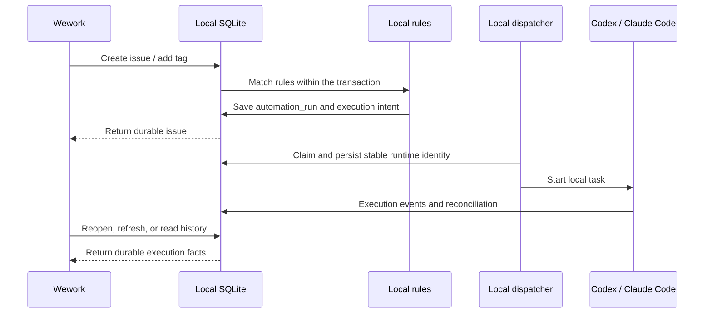
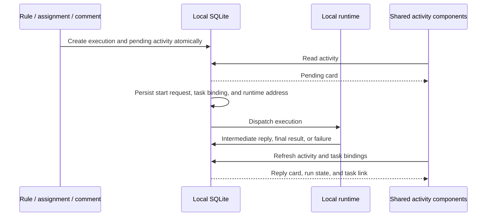

# Wework local projects and agent execution

Wework stores and drives local projects independently of Wegent Backend. Projects,
issues, comments, agents, collaboration groups, processing rules, and execution
records belong to the current device. Model inference uses locally configured
providers or runtime authentication; backend independence does not imply offline
model inference.

## Ownership and entry points

| Object                       | Local project                                     | Cloud project                              |
| ---------------------------- | ------------------------------------------------- | ------------------------------------------ |
| Projects, issues, comments   | Executor SQLite                                   | Backend                                    |
| Agents                       | Local ProjectChatAgent                            | Cloud resources and project bindings       |
| Models, Skills, MCP, Plugins | Local configuration and installed resources       | Cloud definitions and selected environment |
| Rules and run history        | Project metadata, automation_run, execution queue | Backend                                    |
| Execution                    | Current Wework runtime                            | Selected cloud or local runtime            |

The UI reuses `packages/collaboration`. Wework selects the API from the project's
`project_store`, never from whether an API request happened to succeed. Local
agent creation and editing use IPC directly, without creating or resolving a
cloud Team.

## Reused implementation

- `localDelivery.ts`: local project, issue, agent, and execution APIs.
- `localWorkspaceApi.ts`: shared UI adapter, including agents in board refreshes.
- `ProjectChatAgentEditor.tsx`: reuses the shared Agent form for local runtime,
  model, prompt, capability source, Skills, MCP, and Plugin configuration.
- `LocalTaskStore`: SQLite, optimistic versions, execution identity, claim leases,
  cancellation, and durable status updates.
- `local_automation.rs`: compiles rules into the existing queue or sequential workflow.
- `localRobotQueueDispatcher.ts`: claims work and submits it to Runtime. Local and
  cloud claim loops are independent; failed or hanging cloud requests cannot
  block local dispatch.

Local projects receive a service instance without `cloudModelGateway` or cloud
Team materialization. Requests carry `origin.projectStore = local`; the executor
removes Backend credentials and skips connection injection. Transcript responses
carry the stored origin so reading local history does not report state to Backend.

## Agent editor loading boundaries

The editor waits only for the local Agent record. Model options load independently;
the installed-plugin catalog loads on demand. Neither blocks editing the name,
instructions, or workspace. Catalog errors remain visible, and catalog retries
preserve the draft. An unavailable saved model stays visible and blocks saving
until the user explicitly chooses an available model or the runtime default.
The runtime default can be saved while the model catalog is still loading.

Installed-plugin selection reads the installed inventory without requesting the online app catalog for display-name enrichment.

## Processing and state

Supported triggers are issue creation, addition of a matching tag, status changes
through the issue update API, and schedules. Human targets update local assignment;
agent targets enqueue work; collaboration groups compile their ordered stages into
the existing workflow. Run state derives from durable execution records and pending
workflow stages. A pending human stage cannot be reported as success. Invalid
rules or archived agents produce failed runs without losing the issue.

Schedules reuse the existing Cron/timezone implementation and persist their cursor
in project metadata. Restarting does not dispatch a consumed occurrence twice;
missed periods are coalesced into one occurrence after recovery. Wework drives the
dispatcher; no new work starts while the application is fully exited.

Cancellation fences workflow advancement before cancelling executions. Unstarted
work cancels immediately; delivered work remains cancellation-requested until the
runtime confirms its result. A late completion cannot launch the next stage.
Retry creates a new run and preserves the previous failed or cancelled record.

External Webhook ingress and cloud membership remain cloud capabilities. Local
processing hides unavailable external-event triggers. Legacy cloud workflow
migration operations do not simulate success locally.

## Local execution activity

Enqueueing an execution creates its activity card in the same transaction. Rules,
assignments, comments, and group stages share this entry point. Before dispatch,
the store persists the task binding and activity runtime address, so a short run
finishing before acceptance cannot lose its task link. Codex intermediate replies
update the card; final results and errors persist with execution state. Late
progress cannot overwrite terminal results.

## Migration and verification

SQLite schema v8 adds missing `execution_payload` columns to existing execution
tables. It preserves projects, issues, conversations, execution rows, and existing
payloads. The updated executor applies migration on startup; no manual mutation
of the user's database is needed.

SQLite schema v9 restores missing activity and task bindings from persisted executions.
It preserves existing replies, errors, and explicit unlinks without running tasks again.
Repeated opens must not create duplicate cards.

Focused coverage includes agent create/edit/error recovery, cloud isolation,
Codex/Claude execution, rule triggers, reopen persistence, group progression and
cancellation/retry, and v7 migration. The offline desktop scenario belongs to the
existing CI suite and checks that local operations do not call cloud project APIs.
E2E and real Electron verification run only when explicitly requested, per repository policy.
