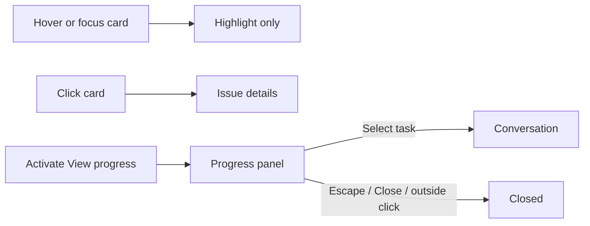

# Board cards and progress panels

## Sources and decision

[WAI-ARIA APG Tooltip](https://www.w3.org/WAI/ARIA/apg/patterns/tooltip/)
states that tooltips do not receive focus and suggests a non-modal dialog for
content with focusable elements. This pattern is guidance and is still marked
as work in progress, not a requirement to open all previews on click.
[WCAG 2.2 SC 1.4.13](https://www.w3.org/WAI/WCAG22/Understanding/content-on-hover-or-focus.html)
requires applicable hover content to be dismissible, hoverable, and persistent.
Neither source prescribes a universal board-card hover delay.

Wework uses explicit activation because progress contains conversations,
composers, and execution actions. Opening an Issue and opening progress are
separate actions. This also follows `wework/DESIGN.md`.

## Interaction contract

- Hovering or focusing a card only highlights it. Clicking its primary area
  opens Issue details. Hover must not move or resize the card or its hit targets.
- The primary area includes the title, metadata, progress summary, edges, and
  whitespace. It uses a consistent arrow cursor and the same open action as
  the detail button, focusing that button without adding a duplicate keyboard stop. Independent buttons,
  links, and inputs retain their own actions. Unavailable details remain disabled.
  Buttons and links inside the card also use the arrow cursor; their click actions stay unchanged.
  The entire active board page uses arrows for navigation, toolbar actions,
  filters, cards, and body-mounted popups. Hidden workspace tabs do not enable
  this policy on other pages. Text editing, dragging, and resize cursors remain available.
- A visible native **View progress** button opens the panel by click, Enter, or
  Space. Focus moves into the panel without automatically focusing the composer.
- Pointer exit does not close it. Task conversations switch only by explicit
  selection, never pointer movement or focus.
- Escape and Close dismiss it and restore trigger focus without reopening it.
  Clicking an Issue outside dismisses the panel and opens the Issue in one click.
- Disabling previews, dragging, or losing available executions closes the panel.
  Becoming available again requires explicit activation.
- Progress summaries and their repair/review actions are separate from the
  trigger. Radix Popover owns positioning, collision handling, and focus.

## Evidence and verification limits

The September 16 recording contains 434 encoded frames over 11.9 seconds, with
nonuniform timestamps. A full timeline contact sheet and frame-by-frame crops
of 5.7–9.5 seconds show alternating arrow/hand cursors while card boundaries
remain largely stable. This establishes cursor flicker, not a proven browser
hit-testing or OS-level cause.

Previously the whole card opened a conversation after 450ms of hover or
immediately on focus. Pointer-down dismissal could be followed by focus-driven
opening during the same Issue click. Hovering a task inside the panel also
changed its content collection. These competing paths have been removed.
The card's outer structure now stays mounted as progress availability changes.

Focused unit coverage checks activation, keyboard dismissal and focus return,
outside Issue clicks, persistent display on pointer exit, explicit task
selection, disabled previews, and read timers. The existing desktop CI
`board-focus-view` scenario also checks hover does not open progress before
explicit activation. Per repository policy, E2E and real-Electron verification
are not run by default. Cursor stability still needs real-app verification;
unit results do not establish a frame-by-frame visual fix.
