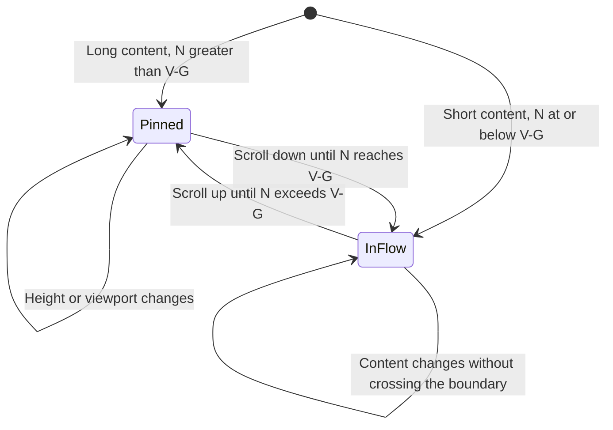

# Issue activity comment composer interaction contract

This contract covers the main composer in issue activity. Inline reply composers always scroll with their cards.
“Per frame” means geometry invariants on every rendered frame, not a timed animation. All dimensions are CSS pixels.

## Geometry and states

- `V`: the visible bottom edge of the actual detail scroll container.
- `G = max(16px, safe-area-inset-bottom)`: pinned bottom inset.
- `N`: the composer's normal-flow bottom in viewport coordinates.
- `B`: its actual bottom. While activity is visible and the composer fits, `B = min(N, V-G)` on every frame, within `1px`.
- Its horizontal edges match the content column within `1px`; state changes must not change width.
- Keep one DOM instance to preserve focus, drafts, attachments and IME composition.

## Frame-by-frame behavior

| Situation                              | Required behavior                                                                  | Prohibited behavior                                         |
| -------------------------------------- | ---------------------------------------------------------------------------------- | ----------------------------------------------------------- |
| Enter activity                         | Pin for long content; remain after short content without excessive whitespace      | Flash in the middle before snapping down                    |
| Scroll the middle                      | Keep `B = V-G`; only content moves                                                 | Body text visible below the pinned composer                 |
| Approach the end                       | Transition continuously when `N = V-G`                                             | Position animation, jitter or duplicate inputs              |
| Reach the end                          | Use normal flow; at least `12px` after the final event and `32px` page-end spacing | Permanent occlusion or duplicate spacer height              |
| Reverse scrolling                      | Retrace the same geometry without resetting draft, focus or scroll                 | Force scrolling to the bottom                               |
| Enter more lines                       | Grow upward from two lines; cap the text area at `240px`, then scroll internally   | Native resize handle or downward growth                     |
| Expand attachments, settings or errors | Grow upward; constrain height in short panels and keep controls reachable          | Controls outside the panel or clipped popovers              |
| Receive content or load images         | Reflow under the same formula; preserve the reader's position in the middle        | Timers or repeated scrollTo calls to conceal layout defects |
| Resize panel or change safe area       | Recompute layout against actual `V` and `G` on the next frame                      | Cached window dimensions or screen coordinates              |

An opaque panel-colored bottom gutter prevents content from appearing beneath the pinned surface.
The composer reserves its own normal-flow space: do not add a second fixed-height placeholder. Keep settings menus on their separate overlay layer.
In short panels, constrain composer height to the visible height minus the bottom inset and `16px` top clearance, with internal scrolling as necessary.

## Implementation constraints

1. The detail pane is the only vertical body scroll owner; activity must not create another scroll region.
2. Keep one bottom-inset source. Do not add scroll-container bottom padding to the sticky bottom inset; put end spacing inside the content column.
3. Use browser layout instead of per-scroll top/transform writes or input remounts.
4. Dynamic input, attachment and settings heights must participate in layout; never position using only the initial measured height.
5. Respect the configured send shortcut, Shift+Enter and IME confirmation; preserve drafts and attachments after failure.
6. Web and desktop share the main composer, attachment cards and image preview. Hosts provide file storage and download services. Show image thumbnails during upload, then use the shared lightbox with zoom, download and close controls.
7. The main toolbar contains execution settings, attachments and send. Typing `@` reveals available member or agent candidates; inserting a mention changes only the comment body and never implicitly reassigns the Issue.
8. Execution settings apply to the current comment's execution context; never substitute a project-wide configuration action. Keep the draft while sending and clear it only on success. Results from an old Issue must not update the new Issue's composer.

## Acceptance evidence

Each activity body initially shows up to `240px`, or `192px` on narrow screens (at most `767px`), roughly 8–10 ordinary text lines.
Measure rendered height: short content needs no toggle; overflowing content offers Show full content / Collapse without truncating Markdown source.
Only collapse the body, keeping authors, timestamps, reply controls and run status accessible. Expansion preserves tables, code and links without introducing a nested vertical scroller.
Remeasure after resizing, streaming updates and image loading; preserve the user's expanded state.
If collapsing moves the activity above the panel, bring its top into view instead of jumping to the list's bottom.

Use short and multi-screen Markdown threads, code blocks, a final run event, attachments and send errors.
Check desktop and narrow panels at entry, mid-scroll, `1px` on both sides of the transition, the end and reverse scrolling.
Include multiline input, expanded settings and viewport resizing. Record scrollTop, scroll-container rect, composer rect and normal-flow bottom per frame; assert the formula and retain middle/end screenshots.
Append content while reading the middle and verify no forced bottom jump. The final event must be fully readable at the end.

An isolated CSS check proves only layout mechanics. Unit tests, type checks and still images do not replace real Electron scroll acceptance.
Under repository policy, run E2E and AI verify only when explicitly requested, and report unexecuted checks as unverified.

Web and desktop activity share the desktop Markdown renderer for headings, numbered lists, highlighted code, table copy/expansion and diagram previews. Hosts provide clipboard, navigation, theme and authenticated attachment services; local files and local HTML previews remain desktop capabilities. Do not add a separate Web body renderer or stylesheet.

