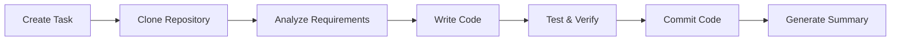

# Managing Code Tasks

This guide explains how to create, execute, and manage code-type tasks in Wegent.

---

## Table of Contents

- [What is a Code Task](#what-is-a-code-task)
- [Creating a Code Task](#creating-a-code-task)
- [Task Execution Flow](#task-execution-flow)
- [Task Status Management](#task-status-management)
- [Sending Follow-ups While Running](#sending-follow-ups-while-running)
- [Advanced Features](#advanced-features)
- [Viewing Codex-generated Visualizations](#viewing-codex-generated-visualizations)
- [Cleaning Stale Runtimes](#cleaning-stale-runtimes)
- [Common Issues](#common-issues)

---

## What is a Code Task

A code task is a task type in Wegent specifically designed for software development. Unlike regular chat tasks, code tasks connect to Git repositories, allowing AI agents to make code changes directly in the repository.

**Core Concept**:

```
Code Task = User Prompt + Code Agent + Git Repository + Branch
```

### Code Tasks vs Chat Tasks

| Feature               | Code Task                           | Chat Task                    |
| --------------------- | ----------------------------------- | ---------------------------- |
| **Git Repository**    | Required                            | Optional                     |
| **Code Execution**    | Runs in Docker container            | No code execution            |
| **Workbench**         | Shows file changes, commit history  | Not displayed                |
| **Branch Management** | Auto-creates feature branches       | None                         |
| **Use Cases**         | Development, refactoring, bug fixes | Q&A, analysis, documentation |

---

## Creating a Code Task

### Step 1: Open the Code Entry

1. Click **"Code"** in the left navigation bar to enter coding mode at `/chat?agent=code`
2. The system displays the code task list and input area

### Step 2: Select a Code Agent

Above the input area, click the agent selector:

1. **Click the agent dropdown** - Shows available agents
2. **Select a code-type agent** - Choose an agent configured with a ClaudeCode Shell

> ⚠️ Only agents configured with a code-type Shell can execute code tasks

### Step 3: Select Code Repository

1. **Click the repository selector** - Shows repositories you have access to
2. **Select target repository** - Choose the repository for code changes
3. **Select branch** - Choose the base branch (AI will create a new branch from this)

### Step 4: Configure Task Options (Optional)

#### Model Selection

Click the model selector to override the agent's default model:

- **Select model**: Choose from the dropdown list
- **Force override**: When enabled, uses your selected model even if the agent has a configured model

When you switch to a different model in an existing Wework conversation, Wework asks for confirmation first. Different models may interpret existing context differently and may vary in tool support, response style, and task continuity. After confirmation, the new model is used for the next message; a response already in progress continues with the previous model. No warning is shown when selecting a model for a new conversation or reselecting the model that is already chosen.

#### Friendly Titles

You can enable **Use friendly titles** under **Settings > General > Runtime**. It is off by default, and enabling it requires a title-generation model:

- **Same as task**: The default option. Each new task uses the model actually selected for that task to generate its title.
- **A specific model**: Used only to generate the title asynchronously; it does not change the model used by the task itself.

Title generation never blocks task submission. If a selected title model is no longer available, Wework skips title generation and still creates the task normally.

#### Knowledge Base Context

Click the context button to add knowledge bases:

1. **Click the "#" button** - Opens the context selector
2. **Select knowledge bases** - Check the ones to add
3. **Confirm selection** - Knowledge bases appear as tags

#### Skill Selection

If the agent supports skills:

1. **Click the skill button** - Opens skill selector
2. **Select skills** - Check the needed skills
3. **Or use "/" command** - Type `/` in the input box to trigger skill selection

### Step 5: Enter Task Description and Send

1. **Type your task description in the input box** - Clearly describe your requirements
2. **Add attachments (optional)** - Use the attachment button, or drag files from Finder directly into the Wework input box
3. **Press Enter to send** - Or click the send button
4. **Wait for response** - Agent starts processing and streams results

---

## Task Execution Flow

### Execution Stages



### 1. Task Initialization

- System creates task record
- Allocates execution container
- Clones target repository into container

### 2. Code Analysis

- AI analyzes repository structure
- Understands existing code patterns
- Plans implementation approach

### 3. Code Implementation

- AI uses tools to read, edit, create files
- Executes necessary commands (e.g., install dependencies, run tests)
- Shows progress in real-time in the Workbench

### 4. Code Commit

- AI creates feature branch
- Commits code changes
- Generates commit messages

### 5. Task Completion

- Generates task summary
- Shows file change statistics
- Provides option to create PR

---

## Task Status Management

### Task States

| Status        | Description         | Actions                     |
| ------------- | ------------------- | --------------------------- |
| **PENDING**   | Waiting to execute  | Can cancel                  |
| **RUNNING**   | Currently executing | Can stop                    |
| **COMPLETED** | Execution finished  | Can view results, create PR |
| **FAILED**    | Execution failed    | Can retry                   |
| **CANCELLED** | Was cancelled       | Can recreate                |

### Stopping a Task

If you need to stop a running task:

1. **Click the stop button** - In the input area or task details
2. **Confirm stop** - Task will be marked as cancelled
3. **View partial results** - Completed code changes are preserved

### Retrying a Task

If a task fails:

1. **View error message** - Understand the failure reason
2. **Click retry button** - Re-execute the task
3. **Or modify and retry** - Adjust task description and resend

After the retry request is accepted, the failed message turn is removed from the conversation. When the retry succeeds, the conversation keeps the original user message and the new successful response without retaining the old failure card or leaving an empty response turn. Wework applies the same rule when the task is reopened.

## Sending Follow-ups While Running

While a Wework task is running, you can choose among three send modes:

- **Send after current response**: queues the message until the current turn finishes. Press `Enter`.
- **Guide current response**: keeps the current turn running and lets Codex apply the instruction at its next safe input boundary. Press `Command/Ctrl + Enter`.
- **Interrupt and send now**: stops the current turn and immediately sends the message as a new turn in the same conversation. Press `Command/Ctrl + Shift + Enter`.

After entering a message, use the down arrow on the right side of the send button to open the menu. The clock means wait for the current response, the turning arrow means guide the current response, and the lightning bolt means interrupt and send immediately. Interrupting does not roll back file changes or other tool side effects that already occurred. Regular queued messages remain queued.

The queue sends messages from top to bottom. When several messages are queued, drag the handle on the left of a message to reorder the list with live feedback. Stopping the current response also pauses the queue instead of immediately sending the next message. Selecting **Continue sending** restores the guidance state and sends the first queued message immediately.

If you submit new composer text while the queue is paused, Wework asks how to handle the existing queue:

- **Keep and continue**: sends the new composer message first, then continues the preserved queue; the composer is cleared after submission.
- **Clear queue**: removes the existing queue and sends only the new composer message.
- **Cancel**: sends nothing and preserves both the composer and the queue.

The temporary sidebar conversation supports automatic queueing, cancellation, and editing: a message submitted while the current response is running appears in the pending queue and is sent automatically after the current response finishes. The sidebar does not surface “task is already running” as a send failure while a message is queued; you can cancel or edit the pending message from its queue card.

---

## Advanced Features

### Continue Conversation

After task completion, you can continue chatting with the agent:

1. **Send new message in the same task** - Agent continues working with previous context
2. **Request modifications** - e.g., "Please rename the function to createUser"
3. **Request additions** - e.g., "Please add unit tests"

### View Execution Details

View detailed execution information in the Workbench:

- **Execution Timeline**: See tools used by AI and execution order
- **Tool Duration**: Each command or tool row shows its own precise duration; the tool-group header does not count the turn's reasoning and waiting time as tool duration
- **Reasoning Summary**: Shows the latest model-provided reasoning summary while work is active and keeps it expandable after completion
- **Commit History**: View all code commits
- **File Changes**: See specific modifications for each file

### Create Pull Request

After task completion, you can directly create a PR:

1. **Click "Create PR" button** - In the Workbench or task menu
2. **Fill in PR information** - Title, description, etc.
3. **Submit PR** - System creates PR in GitHub/GitLab

### Export Task

Export task conversation history and code changes:

1. **Click export button** - In the task menu
2. **Choose format** - Markdown or JSON
3. **Download file** - Save to local

---

## Viewing Codex-generated Visualizations

When Codex creates an HTML visualization in the task workspace and references it in its response, Wework displays the chart or interactive page directly in that response. You do not need to copy a file path or open a separate browser.

- Wework loads only HTML files created or modified in the current response's file changes. Deleted, reverted, or unlisted files are never loaded inline.
- The visualization runs in a script-isolated iframe and cannot access the Wework page.
- Only relative workspace paths ending in `.html`, `.htm`, or `.xhtml` are accepted. Parent traversal, absolute paths, and directives inside code fences remain normal text.
- A Codex visualization directive may reference only the file name. Wework resolves a unique matching file from the current response's file changes, including fragments organized by date and thread under `.codex/visualizations/`.
- Wework wraps HTML fragments in a UTF-8 visualization host, supplies the Codex visualization theme variables, and automatically sizes the iframe to the fragment content.

## Cleaning Stale Runtimes

Admins can manually clean up code task runtimes that have not been updated for a long time to release execution container resources. Cleanup only deletes runtime Pods or containers. It does not delete Task records, conversation history, or code changes.

Use this when:

- A task has stopped or finished, but its execution environment still consumes resources
- A runtime has had no activity for a long time and should be reclaimed by Task ID
- You want to run a dry run first, then perform the actual cleanup

Cleanup rules:

- Cleanup targets one Task ID at a time and is not a full cleanup action from the user interface
- Runtimes newer than the configured inactive duration are not deleted
- Tasks with `preserveExecutor` enabled are not cleaned up
- Device executors are not deleted by this cleanup entrypoint
- Task history remains available after cleanup, but rerunning work allocates a new runtime

For API details, see [Runtime Cleanup](../../developer-guide/runtime-cleanup.md) in the developer documentation.

---

## Common Issues

### Q1: Task stuck in PENDING status?

**Possible causes**:

1. No available execution containers
2. Repository access permission issues
3. Git token expired

**Solutions**:

- Check if system resources are sufficient
- Verify Git token is valid
- Check repository access permissions

### Q2: Code commit failed?

**Possible causes**:

1. Branch protection rules
2. Insufficient permissions
3. Network issues

**Solutions**:

- Check target branch protection rules
- Confirm Git token has write permissions
- Retry the task

### Q3: AI modified the wrong files?

**Solutions**:

1. Explicitly specify file paths to modify in the task
2. Provide more detailed context information
3. Use knowledge base to provide project structure documentation

### Q4: How to make AI follow project coding standards?

**Solutions**:

1. Add `.cursorrules` or `.windsurfrules` file in repository root
2. Explicitly state coding standards in task description
3. Use knowledge base to provide coding standards documentation

### Q5: Task execution taking too long?

**Possible causes**:

1. Task scope too large
2. Need to install many dependencies
3. Network latency

**Solutions**:

- Split large tasks into smaller ones
- Use pre-configured base images
- Check network connection

---

## Related Resources

- [Overview](./README.md) - AI Coding feature overview
- [Spec Clarification](./spec-clarification-guide.md) - Requirement clarification feature
- [Agent Settings](../settings/agent-settings.md) - Configure code agents

---

<p align="center">Efficiently manage your code tasks and let AI be your programming assistant! 🚀</p>
