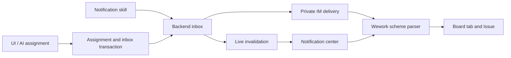

# Wework notifications and navigation

The bell beside Feedback is the single notification inbox. Its badge and the macOS Dock badge show the total unread count from visible task completion reminders on this device, collaboration notifications (assignments, comment mentions, run updates and human work), and other cloud notifications. Whether the tray shows unread tasks does not change this total.

The bell opens a category popover with Task updates, Collaboration, and Other notifications. Each category shows its latest preview, time, and unread count; unrelated sources are not mixed into one list. Opening an entry marks it read. Entries with a destination open it, while entries without one keep the current page and notification content visible. Opening the popover alone does not clear unread state. Mark all read acknowledges unread entries from every available source.

Task reminder read state belongs to the local task lifecycle on this device. Cloud notifications are stored in Backend and remain available after sign-in or on another device. While offline, local task reminders remain available and cloud categories show that they cannot be loaded. Cloud entries return after reconnection; a failed refresh does not erase entries already loaded.

Human assignments offer Notify or Do not notify before saving, including assignment through board lanes and Issue creation. Assigning the same person again does not duplicate the notification. Ordinary self-assignment stays quiet; AI handing an Issue back to its user sends a notification.

Delivery also attempts the recipient's connected private IM sessions. IM failures do not remove the inbox entry or change the active IM task.

## Mentioning members in comments

Typing `@` in an Issue comment opens the project member picker and inserts `@Member`. Only project members can be mentioned; mentioning a non-member is rejected. Mentioned members receive an inbox notification under Collaboration and a DingTalk push when connected, and both links open the Issue. Mentioning an agent is unchanged and still triggers execution.

The title names the actor, and the second line carries the board, the item key and the current column. The body holds the comment preview, and a reply also shows the comment it answered. A DingTalk push has no summary line, so it lays the facts out as `label: value` lines instead: task title, item key, task state, current assignee and board, followed by the comment itself. For mention and assignment notices the task state is the board column the item sits in; for execution notices it is the state of that run. The lines are separated by a blank line because DingTalk collapses a single markdown newline.

A push closes with two destinations: “Open in Wework” opens the desktop app at the Issue, highlighting a mentioned comment; “View task” opens the web board. A custom DingTalk card first opens a Wegent web handoff page for the desktop action, where the recipient explicitly launches Wework and can also choose the web task. Markdown notifications and built-in cards still use the direct `wework://` link. The in-app inbox keeps its original deep link.

## Task execution notifications

An Issue's own robot run notifies on start, when it needs human handling, and when it ends; its inbox entry also lands under Collaboration. Human handling covers waiting for approval, waiting for a device to be selected, and waiting for the AI to receive your input. The task assignee is the recipient; an unassigned task notifies its creator. Clicking the notification opens the Issue. The push headline summarises the transition (started, waiting for your approval, completed, not successful, cancelled) and its result, failure reason or cancellation reason comes from what that run actually recorded.

Notifications belong to Wework users and do not require a project or board. With Backend connected, an ordinary conversation can request “Send me a notification saying hello.” The built-in `wework-notifications` skill calls `wework_space.send_notification` with a title and body. Omitting the recipient notifies the authenticated user. Project and Issue context are optional sources: when provided, they are authorized and produce a navigation link. Sending to another user requires a shared Backend project to establish recipient authorization. For example: “If acceptance fails, notify me in Wework.” AI assignments notify by default and must not send a duplicate alert; explicit opt-out uses `notify_assignee: false`.

An optional `url` specifies the click destination independently of project source. For “send me a hello notification that opens the board homepage when clicked”, use `{ "title": "Hello", "body": "Hello", "url": "wework://boards" }`. Receiving it keeps the current page; clicking opens the board homepage. An explicit URL takes precedence over the source link.

## Scheme addresses

| Address                                       | Destination                         |
| --------------------------------------------- | ----------------------------------- |
| `wework://boards`                             | Board homepage; no project required |
| `wework://boards/{projectId}`                 | Backend board                       |
| `wework://boards/{projectId}/issues/{itemId}` | Board Issue                         |
| `wework://boards/{projectId}/issues/{itemId}/comments/{commentId}` | One comment inside that Issue (opened and highlighted) |
| `wework://tasks/{deviceId}/{taskId}`          | Task on a particular device         |

URL-encode each address segment. In-app Markdown links, inbox actions and Electron external launches use the same destination parser. Installers register `wework`; cold-start URLs wait until authentication and the workbench are ready. Normal resource permissions apply. Links cannot execute commands, switch servers or grant access.

Native addresses remain queued in the Electron process until navigation is acknowledged. Renderer remounts and authentication restoration do not consume them prematurely.

An Issue navigation request is marked as handled only when its detail view opens. The request remains pending while project data loads or a parent rerender cancels the scheduled operation, so clicking a notification does not stop at the board without opening the Issue.

## Architecture

Inbox reads and read-state changes are scoped to the recipient. Version conflicts roll back both the assignment and its notification. WebSocket and IM delivery happen after commit; opening the inbox, reconnecting and periodic refreshes reload its persisted state.

The inbox API accepts `category=collaboration` or `category=general`. Backend computes unread counts and pagination after filtering each category. Task updates come from the current device's local task state.

## Database storage

All notification columns are non-nullable, have comments, and use indexes with the `idx_` prefix. An empty stored URL means no navigation. `is_read` and `read_status_changed_at` store read state and its transition time. The API continues to expose `url: null` for no destination and `read_at: null` for unread entries. Migration preserves messages, destinations and actual read timestamps; repeated read requests preserve the first read time.
