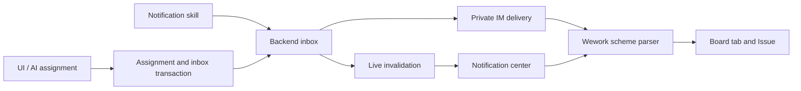

# Wework notifications and navigation

The bell beside Feedback displays your inbox and unread count. Opening a notification marks it read. Entries with a source link open that destination; entries without a link keep the current page and notification content visible. Notifications are stored in Backend and remain available across devices and reconnects.

Human assignments offer Notify or Do not notify before saving, including assignment through board lanes and Issue creation. Assigning the same person again does not duplicate the notification. Ordinary self-assignment stays quiet; AI handing an Issue back to its user sends a notification.

Delivery also attempts the recipient's connected private IM sessions. IM failures do not remove the inbox entry or change the active IM task.

Notifications belong to Wework users and do not require a project or board. With Backend connected, an ordinary conversation can request “Send me a notification saying hello.” The built-in `wework-notifications` skill calls `wework_space.send_notification` with a title and body. Omitting the recipient notifies the authenticated user. Project and Issue context are optional sources: when provided, they are authorized and produce a navigation link. Sending to another user requires a shared Backend project to establish recipient authorization. For example: “If acceptance fails, notify me in Wework.” AI assignments notify by default and must not send a duplicate alert; explicit opt-out uses `notify_assignee: false`.

An optional `url` specifies the click destination independently of project source. For “send me a hello notification that opens the board homepage when clicked”, use `{ "title": "Hello", "body": "Hello", "url": "wework://boards" }`. Receiving it keeps the current page; clicking opens the board homepage. An explicit URL takes precedence over the source link.

## Scheme addresses

| Address                                       | Destination                         |
| --------------------------------------------- | ----------------------------------- |
| `wework://boards`                             | Board homepage; no project required |
| `wework://boards/{projectId}`                 | Backend board                       |
| `wework://boards/{projectId}/issues/{itemId}` | Board Issue                         |
| `wework://tasks/{deviceId}/{taskId}`          | Task on a particular device         |

URL-encode each address segment. In-app Markdown links, inbox actions and Electron external launches use the same destination parser. Installers register `wework`; cold-start URLs wait until authentication and the workbench are ready. Normal resource permissions apply. Links cannot execute commands, switch servers or grant access.

Native addresses remain queued in the Electron process until navigation is acknowledged. Renderer remounts and authentication restoration do not consume them prematurely.

An Issue navigation request is marked as handled only when its detail view opens. The request remains pending while project data loads or a parent rerender cancels the scheduled operation, so clicking a notification does not stop at the board without opening the Issue.

## Architecture

Inbox reads and read-state changes are scoped to the recipient. Version conflicts roll back both the assignment and its notification. WebSocket and IM delivery happen after commit; opening the inbox, reconnecting and periodic refreshes reload its persisted state.

## Database storage

All notification columns are non-nullable, have comments, and use indexes with the `idx_` prefix. An empty stored URL means no navigation. `is_read` and `read_status_changed_at` store read state and its transition time. The API continues to expose `url: null` for no destination and `read_at: null` for unread entries. Migration preserves messages, destinations and actual read timestamps; repeated read requests preserve the first read time.
