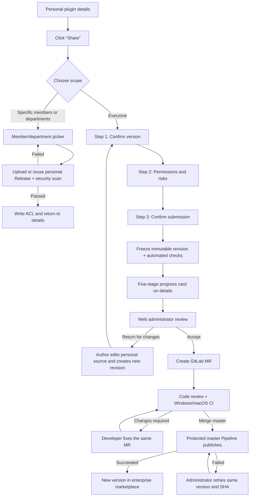

# Feature: Wework Plugin Sharing and Enterprise-wide Publication Interaction Design

## 0. Document status and design basis

This document is the development-level interaction specification for Wework plugin sharing, enterprise-wide submissions, Web administrator review, and enterprise marketplace publication. Implementations must follow the page sequence, states, copy, permissions, and immutable boundaries defined here. For the technical contract, see the [Plugin Marketplace V2 Technical Design](./plugin-marketplace-v2.md).

- Design baseline: the user-approved `1536 × 1024` overall flow diagram, “Wework Plugin Sharing and Enterprise-wide Publication · Complete Interaction Flow.”
- Visual baseline: the existing Wework plugin detail page and the Codex desktop design guidelines in [`wework/DESIGN.md`](../../../../wework/DESIGN.md).
- In scope: targeted sharing of personal plugins, enterprise-wide publication requests, administrator review, GitLab status synchronization, and coexistence of personal and enterprise editions.
- Out of scope: submission, synchronization, and review of Wework-official public plugins on GitHub; regular users cannot select `public`.
- Non-regression principle: this document changes only the sharing/publication path and does not redesign the existing plugin detail-page information architecture.

## 1. Product goals and locked decisions

### 1.1 User goals

A plugin author completes two distribution intents from the same Wework detail page:

1. Share with specific members or departments, effective immediately after the scan passes.
2. Request visibility to everyone, entering the enterprise code-asset review and publication flow.

Regular users do not need to understand Git, MRs, or Pipelines. Administrators do not handle review in the Wework client. Technical and non-technical submissions use the same quality gates starting from the GitLab MR.

### 1.2 Locked decisions

1. The detail-page entry is always named **Share**, not **Publish** or **Share & publish**. The scope-selection dialog opened from it is always titled **Share & publish**.
2. Scope offers exactly two choices: **Specific members or departments** and **Everyone**. “Organization” is the root department, not a third scope.
3. Any signed-in user who owns a personal plugin may submit an enterprise-wide publication request. There is no submission allowlist.
4. Targeted sharing requires no human review. Enterprise-wide publication must pass automated checks, administrator review, GitLab code review, and protected-branch release.
5. Administrator “acceptance” only creates a MR; it does not publish directly.
6. Submission freezes the snapshot, revision, version, and SHA256. The personal source remains editable, chat-capable, available for targeted sharing, and able to produce a new version.
7. The personal source and enterprise edition are two Plugin identities, allowing personal `v1.3.0` and enterprise `v1.2.0` to coexist.
8. An enterprise publication failure must not affect the currently available enterprise version. Repeated publication of the same version and same SHA must be idempotent.

## 2. Information architecture and permissions

### 2.1 Detail-page content that remains

The existing detail page continues to include:

- Chat now;
- Try these tasks;
- available scope;
- automatic-update settings;
- application authorization and sign-out;
- included capabilities and capability toggles;
- plugin information, developer, and version;
- Continue editing, Uninstall, and Delete plugin for the personal owner.

### 2.2 Role and action matrix

| Role                      | Share                                   | View request                        | Withdraw request                 | Review           | Install/uninstall | Delete personal source                      |
| ------------------------- | --------------------------------------- | ----------------------------------- | -------------------------------- | ---------------- | ----------------- | ------------------------------------------- |
| Personal plugin owner     | Visible                                 | Visible                             | Available before merge           | Unavailable      | Available         | Available, subject to request cleanup rules |
| Targeted-share recipient  | Hidden                                  | Hidden                              | Unavailable                      | Unavailable      | Available         | Unavailable                                 |
| Ordinary enterprise user  | Hidden                                  | Enterprise version information only | Unavailable                      | Unavailable      | Available         | Unavailable                                 |
| Enterprise administrator  | Manages only their own personal plugins | Can view all                        | Does not withdraw for the author | Return or accept | Available         | According to original ownership only        |
| GitLab developer/reviewer | Does not share through the client       | Through MR/Pipeline                 | According to GitLab permissions  | Code review      | Not applicable    | Not applicable                              |

## 3. Complete interaction sequence



The user-facing UI always shows these five stages:

```text
Submit request → Automated checks → Administrator review → Code review → Release
```

Backend substates may be more granular, but GitLab MR creation, CI execution, and release failure must not be collapsed into a vague “Under review” state.

## 4. Wework client page specification

### S0. Personal plugin detail page (existing page, localized changes)

**Entry**: Open details from the plugin list or **Created by me**.

Every owner **Share/Publish** entry on the legacy `/plugins/manage` page only redirects to the personal-plugin detail page. It must no longer open the legacy submission dialog or call the old `/plugins/submissions` endpoint. All non-technical authors use the single S1–S8 flow defined here.

**Header action order**:

```text
[share icon Share]  […]  [Chat now]
```

- **Share** is a compact secondary button with a `Share2` icon, visible only to the personal plugin owner.
- The overflow menu continues to contain **Continue editing**, **Uninstall**, and **Delete plugin**; it no longer contains **Publish new version**.
- **Chat now** remains the only black primary button.
- During review, do not disable **Chat now**, **Continue editing**, targeted sharing, or capability toggles.
- When a request exists, add the enterprise-publication progress card after **Available scope** without replacing existing information.

**Test IDs**:

- `plugin-detail-share-{pluginId}`
- `plugin-detail-actions-{pluginId}` (preserved)
- `plugin-detail-toggle-{pluginId}` (preserved)
- `plugin-publication-card-{requestId}`
- `plugin-publication-view-progress-{requestId}`

### S1. Share-scope selection dialog

**Trigger**: Click **Share** on S0.

Before showing the dialog, load the personal plugin's existing member/department ACL and latest enterprise-wide request, including terminal states such as Published. Keep the entry busy while loading. On failure, show a retryable error and do not render a submittable empty form, because that could overwrite an existing ACL with an empty one. S1 may be shown and continued only after ACL loading completes.

**Form factor**: A centered `520px` Dialog on desktop and a bottom Sheet on mobile. On close, focus returns to **Share**.

**Title**: **Share & publish**. The subtitle shows the plugin name and current personal version. The title describes the two distribution intents inside the dialog; it does not rename the detail-page entry from **Share**.

**Choices**: Two vertically stacked radio rows; the entire row is clickable.

1. **Specific members or departments**
   - Description: “Takes effect after scanning, without review”
   - With existing grants, show a summary such as “Shared with 2 departments and 5 members.”
2. **Everyone**
   - Description: “Submit an enterprise publication request; publish to everyone after checks and review”
   - When an active request exists, show its state and version, and change the action to **View request progress**.

**Actions**:

- Secondary button: **Cancel**.
- The primary button changes with the selection:
  - **Select members or departments**;
  - **Continue publication request**;
  - **View request progress** when an active request exists.

**Rule**: A personal source plugin may have only one active enterprise-wide Request, even after its personal version changes. The existing Request must be resolved before another can be created. A Published Request is terminal; submitting a higher personal version creates a new Request.

**Test IDs**:

- `plugin-share-intent-dialog`
- `plugin-share-intent-restricted`
- `plugin-share-intent-enterprise`
- `plugin-share-intent-continue`

### S2. Specific members or departments

**Form factor**: Reuse the member/department selection Dialog. Do not show the previous three-part “Only me / Specific members / Organization” scope.

**Content**:

- Search input: **Search members or departments**;
- distinguish **Members** and **Departments** in search results;
- show the organization root as a root-department item;
- show selected principals as removable tags;
- optional **Allow copying as a personal plugin**, off by default;
- current-grant summary and an entry to clear the scope.

**Actions**:

- **Cancel** returns to S1 without losing the selection;
- **Save sharing scope** starts upload/reuse of the personal Release, scanning, and the atomic ACL update;
- when all principals are cleared, explicitly state that the plugin will return to **Only me**.

**Submission state**: Preserve the primary button width and show **Scanning…**. Prevent duplicate submission. On scan failure, preserve selections and `allowCopy`, and show the stable error code, reason, and retry action within the form.

**Test IDs**: Continue using `plugin-share-*`, adding `plugin-share-save-scope` and `plugin-share-scan-status`.

### S3. Targeted-sharing result

After success, close the Dialog and return to S0:

- **Available scope** shows “Shared with X departments and Y members”;
- provide **Manage members and departments**;
- use the non-blocking toast “Sharing scope updated”;
- do not show an approval progress card.

If the ACL write fails, a successful scan must not be displayed as a successful share. Preserve the Dialog and allow an idempotent retry with the same Release.

### S4. Enterprise-wide request Drawer: Step 1, “Confirm version”

**Trigger**: Select **Everyone** in S1.

**Form factor**: A `480px` right-side Drawer on desktop that overlays the main content without replacing the detail route; full-width on mobile. The fixed header contains the title, three-step Stepper, and close button; the action bar is fixed to the bottom; the middle region scrolls independently.

**Content**:

- plugin icon, name, and **Created by me** badge;
- version being submitted;
- last source update time;
- release/change notes, required after trimming and limited to `2000` characters;
- immutable notice: “Submitting creates an independent snapshot. Later edits will not update this request.”

**Version rule**: Select the current packageable version by default. If the enterprise catalog already has the same version with a different SHA, block submission and require the semantic version to be incremented first. Never allow a manual overwrite of an online version.

**Actions**: **Cancel** and **Next: Permissions and risks**.

**Test IDs**:

- `plugin-publication-drawer`
- `plugin-publication-step-version`
- `plugin-publication-release-notes`
- `plugin-publication-next-risk`

### S5. Enterprise-wide request Drawer: Step 2, “Permissions and risks”

**Content groups**:

1. External network access: whether external services are accessed and the domain list.
2. Commands and scripts: system commands, Shell, Node, Python, Hook, and bin.
3. Local files: read/write scope and purpose.
4. Credential use: API Key, Token, and account passwords; explicitly prohibit credentials in the package or logs.
5. Application authorization: connectors, OAuth, local QR code, and so on.
6. MCP and extension capabilities: MCP, Agent, Command, LSP, Monitor, and so on.
7. Test notes: validated platforms, scenarios, and results; required after trimming and limited to `1000` characters.

This step captures the author's declaration. Source is not uploaded or scanned before the author confirms submission. After final submission, the server parses the Manifest and package from the immutable snapshot and cross-checks automated findings against the declaration. Undeclared risks block later review and appear in request progress with an actionable reason. This matches the latest interaction: security scanning starts after submission and before administrator review, while avoiding a remote source snapshot before the author has confirmed submission.

**Actions**: **Previous** and **Review and submit**. With a blocking item, disable the primary button and show an actionable error summary at the top.

**Test IDs**:

- `plugin-publication-step-risk`
- `plugin-publication-risk-network`
- `plugin-publication-risk-command`
- `plugin-publication-risk-files`
- `plugin-publication-risk-credentials`
- `plugin-publication-test-notes`
- `plugin-publication-next-confirm`

### S6. Enterprise-wide request Drawer: Step 3, “Confirm submission”

**Content**: Read-only plugin, version, change notes, the complete risk declaration, application authorization, test notes, enterprise-wide scope, and the revision to be generated. Upload and immutable snapshot creation begin only after final submission. The server response must return and persist the revision, package SHA256, and source-tree SHA256; every later check, review, and release is bound to those server-computed values.

**Declarations**:

- I confirm that the declaration matches the plugin's behavior;
- I understand that this revision cannot be modified after submission;
- I understand that GitLab code review and cross-platform checks are still required after administrator approval.

**Actions**: **Previous** and **Submit enterprise-wide publication request**. While submitting, show **Creating snapshot…** and prevent repeated clicks while closing.

**Failure handling**: For upload, transport, or automated-check infrastructure failures, preserve the form/current revision and allow an idempotent retry of that revision with the same key, or withdrawal; never create a false “Submitted” state. If an automated check deterministically rejects package content, the Manifest, SHA, or risk declaration, keep the old revision immutable. The author fixes the personal source and creates a new revision in the same Request; modified content must never overwrite the old revision.

**Test IDs**:

- `plugin-publication-step-confirm`
- `plugin-publication-declaration`
- `plugin-publication-submit`

### S7. Enterprise-publication progress card on details

After successful submission, close the Drawer and add this card to S0:

```text
Enterprise-wide publication · v1.2.0
Administrator review
Submit request  ✓  Automated checks  ✓  Administrator review  ●  Code review  ○  Release  ○
[View progress] [Withdraw]
```

- The card always shows the requested version to avoid confusion with a subsequently edited personal version.
- Use a narrow blue accent and text for the current stage, neutral gray for waiting, a red icon and reason for failures/returns, and a green success icon for successful publication.
- **Withdraw** is available only before merge. During merge/release, explain why withdrawal is unavailable.
- When returned by an administrator, the primary action changes to **Fix and resubmit**. It creates a new revision from the current personal version and does not overwrite old evidence.

### S8. Request-progress detail Drawer

**Trigger**: **View progress** in S7 or an active request in S1.

**Content**:

- request number, current revision, version, and SHA256;
- five-stage vertical timeline;
- time, actor, checks, evidence, and stable error code for each stage;
- administrator return reason;
- MR, Pipeline, and Windows/macOS Job links and states;
- release result and enterprise-version link;
- the complete request history and read-only switching among historical revisions; after a client restart, records in Returned, Withdrawn, Failed, and Published states must still be recoverable from the server;
- bidirectional source links between the current personal source and enterprise edition, using server-persisted source Plugin IDs rather than name matching or local in-memory state.

**Actions** appear by state: **Withdraw request**, **Create new revision**, **Open MR**, and **View enterprise version**. Administrator return or a deterministic automated-check failure allows a new revision in the same Request. After `code_changes_requested`, the developer fixes the current MR; do not offer a new-revision action to a non-technical author. Before activating an external link, clearly identify GitLab as the destination.

## 5. Web administration page specification

### S9. Plugin-publication review queue

**Entry**: Add a **Plugin publication review** Tab in the Web administration console, visible only to administrators.

**List fields**: plugin, version/revision, submitter, risk level, current stage, submission time, waiting duration, and GitLab state.

**Filters**: state, risk, submitter, plugin name, and time range. By default, show pending requests sorted by earliest submission time. Persist filters in the URL so refresh restores them.

**States**: Provide a loading skeleton, empty state, error state, and pagination. The entire row opens details. Do not put accept/return actions in the list, to avoid action without sufficient evidence.

**Test IDs**:

- `admin-plugin-publications-tab`
- `plugin-publication-review-list`
- `plugin-publication-review-row-{requestId}`
- `plugin-publication-review-filter-status`
- `plugin-publication-review-filter-risk`

### S10. Review details

**Layout**: Two columns on desktop. The left side contains the immutable revision, Manifest, permission declarations, change notes, and history. The right side contains automated checks, risk evidence, GitLab state, and fixed review actions. Switch to one column on narrow screens and place the action bar at the bottom.

The administrator reviews an explicit `request / revision / version / SHA256`. The page must show:

- automated-check summary and all blockers/warnings;
- differences between author declarations and scan evidence;
- package tree, Manifest, and key capabilities;
- Windows/macOS state; a check that did not run must not be shown as passed;
- previous return reasons and revision history;
- concurrent-state-change notice to prevent reviewing a stale revision.

**Actions**:

- **Return for changes** is a secondary destructive action;
- **Accept and create MR** is the only primary action;
- with blockers or warnings that have not been individually acknowledged, disable the primary action and explain why;
- the page has no **Publish** button.

### S11. Return for changes

Open a confirmation Dialog:

- return reason is required;
- at least one required change is required; it may be selected from checks and supplemented;
- explicitly state that the old revision remains and cannot be edited;
- after submission, update the state to **Returned for changes**; the author views it in Wework and creates a new revision.

### S12. Accept and create MR

The confirmation Dialog shows the plugin, revision, SHA256, target repository, and target directory. After administrator confirmation:

1. the backend materializes a controlled branch using request/revision as the idempotency key;
2. create or reuse a MR;
3. write back branch, commit SHA, and MR IID/URL;
4. transition to **Code review**.

If GitLab fails, preserve the fact that the administrator accepted the request, show the error and **Retry creating MR** on details, and ensure a retry cannot create a second MR.

## 6. GitLab, release, and enterprise-use page states

### S13. Code review

Wework and Web use the same state projection: MR, In review, Changes required, CI running, Ready to merge, and Merged. Each MR may contain only one version of one plugin.

- The MR Pipeline must include deterministic packaging, risk checks, tests, native Windows, and native macOS.
- A missing Runner appears as **Blocked/Not run**, never as passed.
- MR updates must update the recorded commit SHA. Release accepts only the artifact corresponding to the final merged SHA.
- After `code_changes_requested`, a developer fixes the same controlled branch and MR and reruns its Pipeline; the flow does not return to Wework to create a new revision. If the accepted immutable submission snapshot itself must change, end the current code-review flow and submit through a new Request/Revision flow.

### S14. Release

The protected `master` Pipeline is the only automatic publication entry. Webhooks only synchronize state or trigger reconciliation.

- Success: the progress card shows **Published to everyone in the enterprise** and provides **View enterprise version**.
- Infrastructure failure: automatically retry the same artifact.
- Business publication failure: the administrator retries the same version/SHA while the current enterprise version remains online.
- Same version with a different SHA: permanent conflict; the author must submit a higher version.

### S15. Relationship among the enterprise marketplace and personal/enterprise editions

- The personal source remains in **Created by me**, showing the personal version, personal grants, and personal actions.
- The enterprise edition appears under **Enterprise internal**, with the source badge **Enterprise internal**.
- For the same source plugin, personal details provide **View enterprise version**, while enterprise details provide **View personal source** to an authorized author. Both directions are established from the server-persisted `origin_plugin_id`/enterprise Plugin ID, not fuzzy matching on a shared slug.
- An ordinary employee installing or uninstalling an enterprise edition changes only their own installation state, not marketplace visibility.
- Deleting the personal source does not automatically delete a merged or published enterprise edition.

### S16. Requesting another new version

When a personal plugin is edited from `v1.2.0` to `v1.3.0`:

- the submitted/published `v1.2.0` revision and enterprise edition remain unchanged;
- the enterprise-wide entry under **Share** shows the difference between the current enterprise and personal versions;
- the user repeats S4–S6 to create a new Request starting at revision 1; the Published Request and all of its revisions remain read-only;
- failure of the new version does not affect enterprise `v1.2.0`.

## 7. Deletion, withdrawal, and failure boundaries

| Scenario                                          | Required behavior                                                                                                                 |
| ------------------------------------------------- | --------------------------------------------------------------------------------------------------------------------------------- |
| Upload or snapshot is incomplete                  | The temporary revision may be cancelled, and unreferenced objects are cleaned up                                                  |
| Submitted, no MR created                          | The request may be withdrawn while preserving audit events; withdrawal is disabled during `materializing`                         |
| MR is not merged                            | Withdrawal closes the MR first; if closing fails, withdrawal fails                                                                |
| Deleting personal source with an unmerged request | Withdraw/close the MR in the same confirmation; failure of any step prevents deletion                                             |
| Merged or published                               | Deleting the personal source cannot be used to roll back the enterprise edition                                                   |
| Returned by administrator                         | The old revision is read-only; create a new revision after fixing                                                                 |
| CI/code review failed                             | A developer fixes the same controlled branch/MR and creates a new commit; a non-technical author does not create a revision |
| Release failed                                    | Retry the same version/SHA and preserve the current enterprise latest Release                                                     |

## 8. Visual and responsive specifications

### 8.1 Visual hierarchy

- Preserve the existing neutral gray/white workbench. Do not add large colorful cards or marketing-style hero sections.
- Each action group has at most one black inverse primary button.
- Use blue only for focus, links, and the current step; green only for completion; orange for waiting/warnings; and red for failure/return.
- Dialogs use a `20px` radius, a light overlay, and semantic backgrounds. Drawers use the main background, a thin left divider, and restrained shadow.
- Progress cards establish hierarchy through spacing, low-contrast surfaces, and thin lines, not heavy borders.
- Body text size, button height, icons, and radii must reuse Wework semantic components and tokens. Do not scatter literal colors or arbitrary font sizes across business components.

### 8.2 Baseline dimensions

| Object                     | Desktop specification                                |
| -------------------------- | ---------------------------------------------------- |
| Overall design QA viewport | `1536 × 1024`, light theme                           |
| Detail content             | Preserve the existing maximum width and gutters      |
| Share-scope Dialog         | `520px`, maximum `92vw`                              |
| Request Drawer             | `480px`, maximum `100vw`                             |
| Normal desktop buttons     | Existing shared Button size; equal height in a group |
| Icons                      | Normal `16px`; state micro-icons `12–14px`           |
| Motion                     | `150–220ms`, with reduced-motion support             |

### 8.3 Responsive behavior

- `>=1024px`: center the Dialog, enter the request Drawer from the right, and use two columns for Web review details.
- `768–1023px`: the Drawer may grow to `56%` of the viewport; Web review details use one column.
- `<=767px`: the Dialog becomes a bottom Sheet and the request Drawer fills the screen; touch targets are at least `44 × 44px`.
- Long Chinese and English copy, `200%` text zoom, and narrow/tall windows must not hide fixed primary actions; the content area must scroll independently.

## 9. Accessibility and copy

- Put all visible copy in Chinese and English i18n. Never use the displayed Chinese value for state comparisons.
- Move focus when a Dialog/Drawer opens and restore it to the original trigger when it closes. Escape closes the topmost cancellable layer.
- Stepper, check results, and progress changes have readable state text; color is not the only cue.
- On validation failure, focus the first error or error summary and preserve all valid input.
- Icon buttons must have localized `aria-label` and Tooltips.
- Before activating GitLab external links, delete, withdraw, or return actions, clearly explain their consequences.
- Use the single-character ellipsis “…” to indicate another layer will open, not three periods.

## 10. Implementation security contract and rollout gates

### 10.1 Identity, immutable data, and idempotency

- Persist `Request / Revision / Check / Event` separately. User and administrator reads include the complete revision history; terminal records must not disappear from personal details because of an `activeOnly` query.
- The server validates the caller-provided `Idempotency-Key` format and recomputes a canonical resource and complete request-payload fingerprint. Persistently bind the caller principal, operation, resource, and payload fingerprint. Under the same principal and operation, the same key with the same resource/payload returns the original result; the same key with a different resource/payload returns `409`. Merely recording a client-provided value as provenance is insufficient.
- These seven mutations require an `Idempotency-Key` between `8` and `200` characters using only `[A-Za-z0-9._:-]`: create Request, create Revision, complete Revision, withdraw, administrator return, administrator accept, and administrator reconcile. A duplicate while processing returns `409`; retrying the same logical operation after a failure may reuse the original key.
  - `POST /api/plugins/publication-requests`
  - `POST /api/plugins/publication-requests/{requestId}/revisions`
  - `POST /api/plugins/publication-requests/{requestId}/revisions/{revision}/complete`
  - `POST /api/plugins/publication-requests/{requestId}/withdraw`
  - `POST /api/admin/plugins/publication-requests/{requestId}/return`
  - `POST /api/admin/plugins/publication-requests/{requestId}/accept`
  - `POST /api/admin/plugins/publication-requests/{requestId}/reconcile`
- The client creates an `operationAttemptId` for each logical submission: a transport retry reuses it, while reopening the request form or starting a new explicit reconciliation creates a new one; the key also includes the complete request-payload fingerprint. Withdrawal keys include the current revision so a later revision cannot replay an earlier withdrawal, and every explicit GitLab reconciliation uses a new attempt so the same revision can observe newer remote state.
- Personal sources and enterprise editions use different namespaces/Plugin IDs. An enterprise slug is bound to exactly one `origin_plugin_id`; another personal source cannot append versions to that enterprise slug. Legacy rows with `origin_plugin_id = 0` must be explicitly migrated or rejected for claiming; ownership must never move silently.
- Once administrator acceptance enters `materializing`, temporarily disable withdrawal until controlled-branch/MR creation or failure has been reconciled. A Withdrawn request with an open MR is invalid.
- After namespace-split data exists that would violate the legacy global slug uniqueness constraint, database downgrade must run a preflight and explicitly block the unsafe rollback. It must not fail halfway through recreating the old unique index or lose data.

### 10.2 Controlled GitLab branches, MRs, and package checks

- A Web-submission branch is named exactly `wework/publication-<requestId>-r<revisionNumber>`. Its marker must exist and bind the request, revision, original-snapshot SHA256, and canonical source-tree SHA256; that source tree includes the versioned manifest. Removing or altering the marker must not downgrade the branch into the direct-developer submission path.
- GitLab writes use a dedicated materializer identity. `WEWORK_PLUGIN_PUBLICATION_GITLAB_TOKEN` belongs only to that bot/service account, and `WEWORK_PLUGIN_PUBLICATION_GITLAB_MATERIALIZER_USER_ID` is the numeric ID returned when that token calls GitLab `GET /user`. The server also verifies the project, MR author, source/target projects, and HMAC binding. An existing same-name branch or MR without that exact binding is never reused, and neither a developer account nor a general operations token may act as the materializer.
- A plugin publication MR may modify only `plugins/<slug>/**` and the single validated marketplace entry for that plugin. It must not mix changes to `.gitlab-ci.yml`, CI/release scripts, or another plugin. Infrastructure changes require a separate MR.
- Validate every ZIP entry and allow exactly one expected plugin root. Reject files outside that root, multi-root archives, absolute paths, path traversal, and unsafe links; validating or extracting only a matching subtree is insufficient.
- Secret scanning covers every tracked repository file returned by `git ls-files`, not only `plugins/`. Scan logs and artifacts must not expose secret values.
- The MR Pipeline runs compatibility checks on native Windows and native macOS Runners. A missing Runner, a job that did not run, or a skippable job is a blocker.

### 10.3 Release authorization, trusted proof, and status synchronization

- The release job runs only on protected `master` and only when changes include `plugins/**`. A normal branch, no-plugin change, or CI/script-only change must not obtain release credentials or call the release API.
- The release API accepts only `Authorization: Bearer <token>`. The token is a dedicated `plugin_release` machine credential; bare tokens, ordinary user sessions, and user impersonation are rejected.
- Create a `plugin_release` credential with `POST /api/admin/plugin-release-keys`, list credentials with `GET /api/admin/plugin-release-keys`, and disable or re-enable one with `POST /api/admin/plugin-release-keys/{id}/toggle-status`. Creation takes a name, optional description, and expiry only; the raw `wg-...` value is returned once. Rotate by creating and validating a new key before disabling the old one. The GitLab project and target branch are server-side publication-channel configuration, not credential fields.
- A protected-master Release request also carries the exact `Idempotency-Key` form `wework-plugin-v1:&lt;64hex>`. Its digest is derived from the project ID, final commit SHA, and artifact SHA256, and the server recomputes and verifies it.
- The server must not trust caller-asserted project/ref/SHA/Pipeline strings. It validates the configured GitLab project, protected `master` ref, final merged SHA, and Pipeline, then reads `plugins/<slug>` from that exact commit and compares path, content, and executable mode for the complete canonical file tree—including `.wework-publication.json` and `plugin-risk.json`—with the uploaded ZIP. The durable release idempotency binding includes both this trusted proof and the authenticated `plugin_release` key database ID, so another caller cannot reuse the same key.
- Webhooks perform monotonic status synchronization and reconciliation only. A Pipeline event must match the controlled commit SHA of the current revision; a smaller Pipeline ID or a late state after the same Pipeline reached a terminal state cannot advance the workflow. A lost Webhook must not permanently block release, and a Webhook is never release authorization.
- Enterprise submission has neither a people allowlist nor a global enable/disable switch. The Request API becomes available to authenticated personal-plugin owners as soon as the Backend is deployed, while internal `/plugins/releases` is always constrained by the dedicated Release Key, server-configured GitLab project, protected `master`, and trusted-artifact validation. Complete the real GitLab, Runner, approval, TLS, and credential-rotation prerequisites before coordinating the Backend, Wework, and Web-admin rollout.
- GitLab protected environments, Code Owner/approval rules, protected variables, and native Windows/macOS Runners are external P0 prerequisites for production enablement. Until they are configured and verified in the real GitLab project, passing all local tests and packaging means only **implementation verified**, never **production publication enabled**.

### 10.4 Credential migration boundary

- Any previous release credential that entered a file or Git history must be revoked and rotated by its owner in the external system. Removing it from the current worktree does not invalidate it.
- Inject new credentials only through protected variables/environments; never put them in the repository, logs, or artifacts. Do not inject a real credential while the release endpoint still uses an unverified plaintext HTTP path. First verify TLS or an approved equivalent secure transport boundary.

### 10.5 Client and response DTO contract

- The member/department picker calls `GET /api/groups/search?include_organization=true` to explicitly include the organization namespace. The parameter defaults to `false`. The server returns only organizations accessible to the current user; even an administrator receives only valid organization records.
- When creating a Request/Revision, `releaseNotes` is `1–2000` characters after trimming and `testNotes` is `1–1000`; client limits and the Backend Schema must agree. Blank or overlong values return `422`.
- The public `PluginPublicationEvent` DTO exposes only dedicated safe fields. Administrator-return events expose `requiredChanges: string[]` to both the requester and administrators; never return arbitrary `payload_json` to a client.

## 11. Component and implementation mapping

| Existing implementation                                                          | Target treatment                                                                                                                                                                       |
| -------------------------------------------------------------------------------- | -------------------------------------------------------------------------------------------------------------------------------------------------------------------------------------- |
| `PluginDetailView.tsx`                                                           | Preserve the detail structure; add Share, request-progress card, and personal/enterprise cross-links                                                                                   |
| `PluginPublishDialog.tsx`                                                        | Replace with two-intent selection + enterprise three-step Drawer; remove the three-part `public/workspace/personal` selection semantics                                                |
| `PluginShareDialog.tsx`                                                          | Converge on a member/department ACL editor while preserving scan-failure recovery and `allowCopy`                                                                                      |
| `pluginOwnerActions.ts`                                                          | Reduce to owner share/publication actions; remove allowlist- and capability-driven UI                                                                                                  |
| `PluginManagementWorkspace.tsx`                                                  | Redirect the legacy `/plugins/manage` Share/Publish entry to the one new personal-detail flow                                                                                          |
| `PluginsWorkspace.tsx`                                                           | Open forms only after ACL/request loading; unify history queries, dialog orchestration, and personal/enterprise identities                                                             |
| `wework/src/api/plugins.ts`                                                      | Add publication request/revision/progress/withdraw APIs; permanently keep old submission only for `restricted_share + personal` artifact upload/scanning and historical-record cleanup |
| `PluginWorkspaceConversationResult.tsx` / `executor/src/plugin_workspace_cli.rs` | Preserve the actual Task-workspace version; keep restricted sharing on legacy submission, but route enterprise publication through the new immutable publication request/revision API  |
| `frontend/src/app/admin/page.tsx`                                                | Add the administrator review Tab                                                                                                                                                       |
| `frontend/src/features/admin/`                                                   | Add queue, details, return, and accept components                                                                                                                                      |
| Backend publication domain                                                       | Add tables, state machine, automated checks, GitLab materialization, Webhook reconciliation, and dedicated release endpoint                                                            |

New interactive elements must have stable `data-testid` values. Preserve existing detail-page selectors unless the same change updates unit tests and desktop E2E coverage.

## 12. Acceptance scenarios

### 12.1 Required automation

1. An owner opens personal details and sees **Share**, **…**, and **Chat now** in that order, with all existing detail content intact.
2. Selecting a member and the root department takes effect after a successful scan, without administrator review.
3. A scan failure preserves the selection, and retry does not create a duplicate Release.
4. Required fields, risk blockers, Previous navigation, and close/recovery all work correctly in the three-step request flow; client and API enforce trimmed nonblank release/test notes and the `2000/1000` character limits.
5. Editing the personal source after submission does not change the revision/SHA.
6. Only one active Request exists for the same personal source plugin; create a new revision in that Request after return or deterministic automated-check failure, and create a new Request for a higher version after publication while preserving the old Request.
7. An administrator cannot accept with blockers; return reason is required; acceptance creates only one MR.
8. The flow is blocked when Windows/macOS checks do not run.
9. Withdrawal before merge closes the MR; failure to close prevents withdrawal and personal-source deletion.
10. Release failure preserves the old enterprise version; idempotent retry does not create a duplicate Release.
11. Personal and enterprise editions can be displayed, installed, and deleted/uninstalled independently.
12. Recipients and ordinary enterprise users cannot see Share, submission, edit, or delete entries.
13. The `/plugins/manage` owner entry only navigates to the new detail flow; the old submission API receives no enterprise-wide request.
14. No submittable form appears before ACL loading completes; a load failure cannot overwrite existing grants with an empty ACL.
15. After a client restart, terminal requests, complete revision history, and personal/enterprise bidirectional links remain available.
16. A missing/mismatched controlled-branch marker, a plugin MR mixed with CI/script changes, a multi-root ZIP, or a full-repository secret-scan failure blocks the flow.
17. The release API rejects non-Bearer auth, the wrong key type, and untrusted project/ref/SHA/Pipeline proof; out-of-order Webhooks cannot regress state.
18. Withdrawal during `materializing`, cross-origin append to an enterprise slug, and an unsafe database downgrade are explicitly blocked.
19. Each of the seven publication mutations returns `422` without an idempotency key; same key/resource/payload replay is exact, a key reused with different resource/payload returns `409`, and explicit reconciliation uses a new attempt.
20. The root department is returned only with `include_organization=true` and subject to access control. Requesters and administrators both see return requirements through the dedicated `requiredChanges` field, and event responses do not leak arbitrary payloads.
21. Upload/transport/infrastructure failures can idempotently retry the original revision; deterministic content failures require a fixed new revision; `code_changes_requested` is fixed in the same MR.

### 12.2 Real desktop and design QA

Use the isolated Electron `ai:verify` flow from `wework/AGENTS.md` to capture at least:

1. S0 personal details in the normal state;
2. S1 scope selection;
3. S2 with selected members/departments;
4. S4, S5, and S6 three-step Drawer;
5. S7 under administrator review and S8 in returned/CI/release states;
6. enterprise-edition details and personal/enterprise cross-links.

Compare implementation screenshots with the overall flow diagram and corresponding page designs at the same viewport, theme, and state. If any P0/P1/P2 difference remains, continue fixing and recapturing. Append this feature's evidence and conclusion as a clearly titled independent chapter in the repository-root `design-qa.md`; do not create another QA file/path, overwrite QA records for other features, or put a separate overall result inside the chapter. The whole file may contain only one final `final result: passed` or `final result: blocked`, at its very end, and that result must account for every still-valid blocker in the file.
