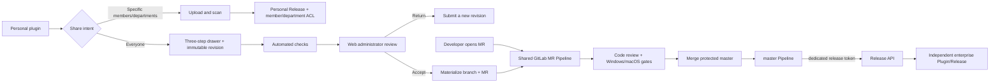
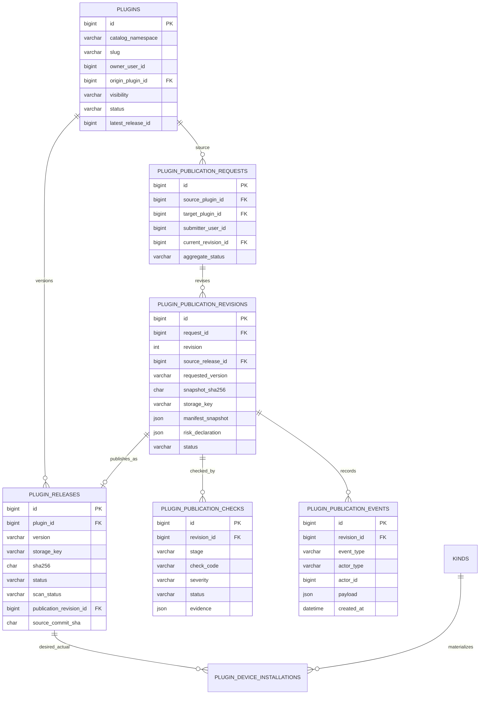
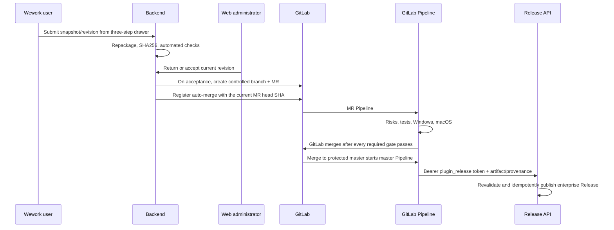

# Wework Plugin Marketplace V2 Technical Design

For plugin development, open-source migration, and local integration, start with the [Plugin Marketplace Developer Guide](./wework-plugin-marketplace-dev.md). This document is the **implementation and acceptance contract** for Wework plugin sharing, enterprise-wide publication, GitLab review, and marketplace Releases.

> Implementation status (2026-08-29): the implementation includes the two-intent UI, ACL and publication-state loading, Request/Revision/Check/Event domain, Web review queue, MR materialization, restricted Release API, and local verification. **This does not mean production rollout is approved or deployed.** Revocation and rotation of the old token, HTTPS, protected master/environment, Code Owner approvals, project-locked native Windows/macOS Runners, and a new Release credential remain external P0 configuration and acceptance work in the real GitLab/production environment. Section 10 records the implemented boundary and activation gates.

## 1. Locked product and technical decisions

Any change to these decisions must update this document, the API contract, interaction designs, and acceptance tests together:

1. A personal plugin detail page has one distribution entry. The header uses a compact share-icon **Share** button, followed by the overflow menu and the primary **Chat now** button. “Publish” and “Share and publish” are removed.
2. Share exposes exactly two user intents:
   - **Specific members or departments**: takes effect after security scanning, without human review.
   - **Everyone**: creates an enterprise publication request and takes effect only after administrator review, GitLab code review, and release gates.
3. “Organization” is not a third scope. The organization root is represented as a department ACL principal and follows the same `resource_members` path as every other department.
4. A regular user's Everyone request always targets the enterprise catalog with `visibility=workspace`. `visibility=public` is unavailable to regular submitters and is reserved for a future Wework-official public catalog.
5. Every authenticated personal-plugin owner may request enterprise publication. Eligibility is not granted through a user allowlist. The server still enforces ownership, active-request count, package-size, and security policies.
6. Everyone publication uses a three-step right drawer: **Confirm version → Permissions and risks → Confirm submission**. Submission freezes an immutable snapshot, revision, and SHA256. Later personal edits cannot mutate that revision.
7. The user-facing progress has five stable stages: **Submit request → Automated checks → Administrator review → Code review → Release**.
8. The Web administration console is the human-review surface. An administrator may return or accept a revision. Accept only materializes that revision into a GitLab branch and creates a MR; it never creates a marketplace Release directly.
9. A non-technical user submits from Wework, while a developer may open a GitLab MR directly. Both routes use the same checks, merge rules, and release path from the MR onward.
10. The personal source and enterprise edition are distinct Plugin identities. During review, the personal source remains editable, chat-capable, shareable, and installable. Enterprise publication never transfers, mutates, or deletes it.
11. **A protected master Pipeline is the only automatic release trigger.** GitLab Webhooks only synchronize MR/Pipeline state and trigger reconciliation for missing events; they do not publish.
12. The source, review, and synchronization policy for Wework-official public plugins on GitHub remains a P1 decision. It neither blocks this enterprise flow nor may be inferred from it.

## 2. Page and interaction contract

### 2.1 Plugin details

The redesign must preserve the existing detail capabilities:

- Chat now and Try these tasks;
- availability scope, plugin information, and version information;
- automatic-update settings;
- application authorization and sign-out;
- included capabilities and per-capability toggles;
- Continue editing, Uninstall, and Delete plugin when the personal owner has permission.

Header action order is fixed:

```text
[share icon Share]  […]  [Chat now]
```

Share is visible only to an owner who may manage the personal plugin. Recipients, ordinary enterprise-plugin users, and users without management access cannot see submission or scope-management actions.

### 2.2 Specific members or departments

Selecting this intent opens the member/department picker:

- members and departments can be selected together;
- the organization root appears as a department item and does not create an organization-wide scope;
- first share creates a personal cloud Release through the existing upload, object-storage, and security-scan path;
- once a personal cloud Release exists, later scope changes atomically replace grants through the ACL API;
- the share becomes active only after both scan and ACL persistence succeed, with no Web review;
- `allowCopy` is optional; returning to owner-only clears all ACLs and disables copying.

### 2.3 Three-step Everyone drawer

| Step                     | Content                                                                                                                                                       | Submission constraint                                                                                    |
| ------------------------ | ------------------------------------------------------------------------------------------------------------------------------------------------------------- | -------------------------------------------------------------------------------------------------------- |
| 1. Confirm version       | Plugin name, personal source, requested version, change notes, and source timestamp                                                                           | Explicitly says that the submission creates an independent snapshot and later edits will not update it   |
| 2. Permissions and risks | External network/domains, system commands/scripts, local file reads/writes, credential use, application authorization, MCP/Hook/bin execution, and test notes | Captures the author declaration before any remote source snapshot                                        |
| 3. Confirm submission    | Pending revision, version, complete declaration summary, target scope, and policy declaration                                                                 | After the second confirmation, creates an immutable snapshot and runs checks before administrator review |

A failed upload or a revision that has not entered automated checks may be cancelled. After review starts, the action is Withdraw request. A returned revision and its evidence remain immutable; the user edits the personal plugin and submits a new snapshot as the next revision rather than overwriting the previous one.

### 2.4 Progress and actions

The enterprise-publication card on the detail page shows the five stages and diagnostic substate:

```text
Submit request → Automated checks → Administrator review → Code review → Release
```

- Before approval, the user may withdraw, while the personal plugin remains usable and shareable.
- An automated-check failure shows a stable error code, evidence path, and remediation.
- An administrator return shows required changes and allows the next revision from a new snapshot.
- Code review shows MR, Pipeline, and Windows/macOS check state, with a GitLab link when the viewer has access.
- A release failure leaves the previous enterprise version available and supports an idempotent operator retry; it never asks the user to overwrite an old revision.
- After release, the personal source remains under Personal creations and the independent enterprise edition appears under Enterprise.

Deleting a personal source with an unmerged request must first withdraw that request in the same confirmation flow; deletion is blocked if withdrawal or MR closure fails. Once code is merged or published, deleting the personal source affects only that source; it cannot delete the enterprise edition, GitLab record, request revision, or historical Release.

### 2.5 Web administration console

Regular users complete sharing and submission in Wework. The Web surface is only for administrators and includes at least:

- paginated lists and filters for status, risk, submitter, plugin, and time;
- immutable revision details, SHA256, permission declarations, automated evidence, history, and GitLab state;
- Return for changes, with a required reason and required-change list;
- Accept and create MR, enabled only with no blockers and explicit acknowledgement of every warning; the action is idempotent;
- retry and reconciliation controls after GitLab materialization failures;
- complete actor, timestamp, and state-event audit history.

The console has no direct Publish button and never invokes the official publisher CLI.

## 3. Architecture and flow boundaries

Marketplace V2 keeps a Wework cloud control plane and a local Codex runtime. The cloud owns catalog identity, visibility, immutable Releases, account desired versions, and publication state. Codex App Server remains the source of truth for actual installation on the current device. Private object storage contains packages; the database holds metadata and immutable object references.



Four boundaries must remain distinct:

1. **Personal restricted sharing**: cloud scan plus ACL, no human review, and no GitLab.
2. **Non-technical enterprise submission**: Wework snapshot → Web review → automatically created MR.
3. **Developer enterprise submission**: directly created MR, sharing the exact same gates from the MR onward.
4. **Wework-official public plugins**: a separate P1 `public`-catalog flow, not implemented in this phase.

## 4. Data ownership and identity

| Data                                      | Location                                           | Source-of-truth meaning                          |
| ----------------------------------------- | -------------------------------------------------- | ------------------------------------------------ |
| Plugin, Release, Publication Request      | MySQL                                              | Cloud catalog and publication state              |
| Publication Revision, Check, Event        | MySQL                                              | Immutable submission evidence, checks, and audit |
| GitLab project/MR/commit/pipeline mapping | MySQL                                              | Code-review and release provenance               |
| ZIP, media, and check reports             | Private MinIO/S3 bucket                            | Content-addressed immutable artifacts            |
| Account installation intent               | `kinds/InstalledPlugin`                            | Desired state                                    |
| Member/department visibility              | `resource_members` + `ResourceType.PLUGIN`         | Personal-share authorization                     |
| Device installation result                | `plugin_device_installations`                      | Per-device materialized state                    |
| Local creation                            | Wework Codex Home / `wework-personal`              | Current-device private content                   |
| Local installation registry               | Codex App Server                                   | Current-device runtime truth                     |
| Personal-copy provenance                  | `wework-personal/.wegent/plugin-copy-sources.json` | Local-only source mapping                        |
| Tokens and MCP secrets                    | System secure storage                              | Never stored in a package or log                 |

### 4.1 Catalog namespaces

The stable `plugins` key changes from globally unique `slug` to `(catalog_namespace, slug)`:

| `catalog_namespace`        | Owner/visibility                             | Purpose                                |
| -------------------------- | -------------------------------------------- | -------------------------------------- |
| `personal/<owner_user_id>` | Personal owner, `visibility=personal`        | Personal source and restricted sharing |
| `enterprise`               | System catalog owner, `visibility=workspace` | Enterprise-internal plugins            |
| `wework-official`          | System catalog owner, `visibility=public`    | Future Wework-official public plugins  |

The server derives `catalog_namespace`; clients cannot supply arbitrary values. Display slugs may match, so `personal/42:foo` and `enterprise:foo` may coexist. An enterprise Plugin references its personal source through `origin_plugin_id` and the publication revision, but does not inherit its ACL, ownership, or mutable state.

The runtime marketplace mapping remains `personal -> wework-personal`, `workspace -> wegent`, and `public -> wework`. It applies only to managed installation records; display names and slugs must never merge identities across namespaces.

### 4.2 ER model



### 4.3 Table responsibilities and immutability

| Table                          | Constraint                                                                                                                                         |
| ------------------------------ | -------------------------------------------------------------------------------------------------------------------------------------------------- |
| `plugins`                      | `(catalog_namespace, slug)` is unique; personal and enterprise identities never convert in place                                                   |
| `plugin_releases`              | `(plugin_id, version)` is unique; package, version, Manifest, SHA, and provenance become immutable at `ready`                                      |
| `plugin_publication_requests`  | One business request can contain several revisions and relates the personal source to the eventual enterprise target                               |
| `plugin_publication_revisions` | `(request_id, revision)` is unique; submitted content is immutable and a return creates a new revision                                             |
| `plugin_publication_checks`    | Uses stable `check_code` values and records severity, evidence, execution environment, and external job URL rather than one mutable scan JSON blob |
| `plugin_publication_events`    | Append-only audit of user, administrator, GitLab, Pipeline, and release-bot actions                                                                |
| `plugin_device_installations`  | `(installed_kind_id, device_id)` is unique and separates desired account state from device truth                                                   |
| `resource_members`             | Personal ACL only; member/department grants replace atomically and the organization root is a department principal                                 |

A Revision also records release notes, test notes, risk declarations, actor and timestamps, GitLab project, source branch, MR IID/URL, commit SHA, Pipeline ID/URL, artifact SHA256, and release result. These fields may be normalized into related tables, but the workflow cannot exist only inside mutable `scan_report_json`.

## 5. State machine

Users see five stable stages while the backend retains diagnostic substates:

| User stage           | Typical backend state                                                                             | Allowed action                                                      |
| -------------------- | ------------------------------------------------------------------------------------------------- | ------------------------------------------------------------------- |
| Submit request       | `uploading`, `submitted`                                                                          | Cancel failed upload; withdraw after submission                     |
| Automated checks     | `automatic_checking`, `automatic_check_failed`, `awaiting_admin`                                  | Inspect evidence; fix and create a new revision after failure       |
| Administrator review | `admin_review`, `changes_requested`, `admin_accepted`                                             | Administrator returns or accepts; user may withdraw                 |
| Code review          | `materializing`, `draft_mr_open`, `ci_running`, `code_changes_requested`, `merge_ready`, `merged` | Review and fix in GitLab; merged code cannot be withdrawn           |
| Release              | `publishing`, `published`, `publish_failed`                                                       | Idempotent retry; keep the current enterprise version after failure |

Terminal states also include `withdrawn` and an explicitly administrator-closed `closed`. Every transition appends an event and uses optimistic locking or a conditional update. Duplicate Webhooks, repeated administrator clicks, and Pipeline retries cannot create duplicate MRs or Releases.

Checks cover at least:

- ZIP traversal, duplicate entries, symlinks, encrypted members, sensitive files, size, SHA256, and Manifest;
- external network domains, system commands/scripts, local file reads/writes, credentials, application authorization, and MCP/Hook/bin risks;
- Manifest/catalog registration consistency, versioning, and repository layout;
- unit and integration tests;
- native Windows compatibility;
- native macOS compatibility.

Static portability scanning cannot claim native Windows or macOS execution. When the matching Runner is unavailable, the result is `blocked` or `not_run`, never passed.

## 6. Core flows

### 6.1 Restricted sharing and personal copies

The first Specific members or departments share uses `purpose=restricted_share` and reuses signed upload, object storage, and the common security scanner. A successful scan creates a `visibility=personal` cloud Plugin/Release and atomically persists `resource_members`. This path creates no Publication Request and never enters GitLab.

Only the owner and matching recipients can discover, inspect, and install the personal plugin. Revocation removes the recipient's account intent, uninstalls online devices, and waits for offline-device reconciliation. When `allowCopy` is enabled, Electron verifies SHA256, ZIP paths, and the Manifest, then atomically imports a uniquely named `0.1.0` copy into `wework-personal`. Provenance stays in the local registry and is never embedded in the package; revoking the original does not remove an independent copy.

### 6.2 Non-technical enterprise submission



The GitLab materializer writes only a server-validated snapshot to the controlled `plugins/<slug>/` path and updates the controlled catalog registry. Branch names, paths, and commit messages must not concatenate unvalidated user input. MR creation uses a request/revision idempotency key and records project, branch, MR IID, and commit SHA. The controlled project must enable `Pipelines must succeed`; after creating or reusing the MR, the Backend calls the GitLab merge API with the current MR head SHA and `merge_when_pipeline_succeeds=true`. The webhook only synchronizes and reconciles status and does not trigger the merge.

### 6.3 Developer-direct GitLab submission

A developer may create a branch and MR directly in the enterprise plugin repository. The MR must satisfy the same layout, Manifest, registration, risk, test, and Windows/macOS gates. From the MR Pipeline onward it has no privilege over a Wework submission. When there is no Publication Request, repository metadata creates release provenance and a read-only audit mapping.

### 6.4 GitLab and release

The enterprise plugin repository Pipeline contains at least:

1. `validate`: allow one version of one plugin per MR, then validate the Manifest, layout, version, catalog registry, and deterministic package;
2. `security`: common package scanner and permission/risk checks;
3. `test`: plugin and contract tests;
4. `windows`: a native Windows Runner;
5. `macos`: a native macOS Runner;
6. `release`: runs only on protected master after all gates pass and under a protected environment.

An MR Pipeline never receives the Release Token and cannot publish. After merge to protected master, the master Pipeline builds a deterministic artifact from the reviewed commit and calls the internal Release API. Backend independently validates artifact SHA, Manifest, SemVer, scan result, and provenance; a successful CI result is not sufficient trust by itself.

Retries with the same `catalog_namespace + slug + version + artifact_sha256` return the existing Release. Different content for the same version returns `409` and cannot overwrite. A failed new release leaves the enterprise `latest_release_id` unchanged.

GitLab Webhooks use a separate Webhook Secret. They only update MR/Pipeline/merge state and trigger reconciliation. A periodic job recovers missing events by project/MR/pipeline ID. The Webhook path has no Release Token and never calls the publisher.

### 6.5 Reusing the publishing service

The current implementation converges marketplace Release transactions on
`PluginMarketplaceService.publish_catalog_release`:

- `OfficialPluginPublisher` builds a deterministic package from a local source
  directory and then calls the same marketplace publication service;
- Publication Request completion validates SHA, Manifest, SemVer, layout, and
  risk through the shared check service;
- the CI Release API revalidates a built artifact and then calls the same
  marketplace publication transaction;
- the CLI is a local dry-run/break-glass adapter, and dry-run writes neither the
  database nor object storage.

An HTTP endpoint must not spawn `publish_official_plugin.py` and must not duplicate publisher logic.

### 6.6 Marketplace installation and update

Installation, update, and device synchronization contracts remain unchanged. `kinds/InstalledPlugin` is account desired state, `plugin_device_installations` is device actual state, and Codex App Server is the local installation authority. New installs select `latest_release_id`; auto-update advances only to an immutable `ready + scan passed` Release. Failure cannot replace `actual_release_id`. Three consecutive failures pause automatic retry, while a manual update or new desired Release resets the count.

Normal uninstall removes the confirmed runtime entry and installation record but does not directly purge Codex or Claude `plugins/cache`. Offline devices reconcile after reconnect. A current-device failure returns an explicit error and cannot be hidden by success on another device.

## 7. API contract

### 7.1 Retained and narrowed

| Method          | Path                                                                   | Current use                                                                               |
| --------------- | ---------------------------------------------------------------------- | ----------------------------------------------------------------------------------------- |
| GET             | `/plugins/marketplace`, `/{id}`, `/{id}/releases`                      | Catalog, details, and historical Releases                                                 |
| POST/PUT/DELETE | `/plugins/marketplace/{id}/install`, `/plugins/installed/{id}`         | Install, update, enable/disable, and uninstall                                            |
| GET/PUT         | `/plugins/marketplace/{id}/access`                                     | Personal owner atomically manages member/department ACLs and `allowCopy`                  |
| POST            | `/plugins/marketplace/{id}/copy`                                       | Authorized recipient copies a personal plugin                                             |
| POST/GET        | `/plugins/submissions/init`, `/{id}/complete`, `/{id}`, `/{id}/cancel` | After migration, artifact upload and scan for personal restricted sharing only            |
| GET/POST/PATCH  | `/admin/plugins/upstreams...`                                          | Temporarily retains selected-upstream behavior; it is not the Wework-official public flow |

### 7.2 Enterprise publication requests

| Method | Path                                                               | Purpose                                                                               |
| ------ | ------------------------------------------------------------------ | ------------------------------------------------------------------------------------- |
| POST   | `/plugins/publication-requests`                                    | Owner creates a request and revision and receives signed upload details when required |
| GET    | `/plugins/publication-requests`                                    | List the current user's requests and status                                           |
| GET    | `/plugins/publication-requests/{id}`                               | Read revisions, checks, timeline, GitLab, and release state                           |
| POST   | `/plugins/publication-requests/{id}/revisions`                     | Create the next revision from a new snapshot after return or failure                  |
| POST   | `/plugins/publication-requests/{id}/revisions/{revision}/complete` | Freeze upload, SHA256, and risk declarations and start automated checks               |
| POST   | `/plugins/publication-requests/{id}/withdraw`                      | Idempotently withdraw before merge                                                    |
| GET    | `/admin/plugins/publication-requests`                              | Paginated administrator list, filters, and counts                                     |
| GET    | `/admin/plugins/publication-requests/{id}`                         | Complete administrator evidence and event view                                        |
| POST   | `/admin/plugins/publication-requests/{id}/return`                  | Return the current revision with required reason and changes                          |
| POST   | `/admin/plugins/publication-requests/{id}/accept`                  | Idempotently materialize a branch and MR; never publish                         |
| POST   | `/admin/plugins/publication-requests/{id}/reconcile`               | Retry materialization or actively reconcile GitLab state                              |

### 7.3 Internal APIs

| Method | Path                              | Authentication and purpose                                                    |
| ------ | --------------------------------- | ----------------------------------------------------------------------------- |
| POST   | `/internal/plugins/releases`      | `plugin_release` machine key only; idempotent protected-master publication    |
| POST   | `/internal/plugins/gitlab/events` | Separate GitLab Webhook Secret; state synchronization and reconciliation only |

Every state mutation requires an idempotency key and conditional state validation. A regular-user API cannot accept `visibility=public`; the server fixes an enterprise request to `workspace` instead of relying on hidden UI.

### 7.4 Compatibility and deprecation boundary

The new path already prevents legacy `/plugins/submissions` from creating a
`workspace/public` submission, and permission-configuration cleanup is complete.
Historical processing entry points remain only to drain existing rows:

- `PLUGIN_PUBLISH_USER_IDS`, `PLUGIN_PUBLISH_ENABLED`, `PLUGIN_PUBLICATION_ENABLED`, allowlist `_can_publish/_ensure_publish_allowed`, and the decision-free `/plugins/capabilities` endpoint, client cache, and legacy capability response fields are removed;
- enterprise submission has no application-level global switch. During an incident, isolate traffic at the gateway or roll back the service; do not reintroduce a people allowlist or set the active-request limit to `0` as an implicit shutdown;
- keep legacy `/plugins/submissions` restricted to `restricted_share + personal`;
- retire the “approval publishes immediately” behavior of `/admin/plugins/submissions/{id}/review` and `review_plugin_submission.py approve`;
- keep `/plugins/upload` as `410` for one compatibility observation window, then remove it when no legacy callers remain;
- audit deployed traffic and client versions before removing unused endpoints such as `/admin/plugins/{id}/visibility`;
- keep upstream-mirror APIs until the P1 official-public decision is made.

## 8. Machine authentication and security boundary

`Authorization: Bearer <release-token>` is a service-to-service credential, not a new user sign-in system. Reuse existing API-key primitives for random creation, hash-only storage, one-time secret display, expiry, disablement, last-used time, and audit, with a dedicated `key_type=plugin_release`:

- it can call only `/internal/plugins/releases`; regular APIs explicitly reject the type;
- it cannot impersonate a user through `wegent-username` or a similar header and uses a fixed release service principal;
- the Release API fixes `catalog_namespace=enterprise`; the GitLab project and target branch are server configuration validated against live GitLab proof, not API-key attributes;
- it has a required expiry and supports overlapping rotation and immediate revocation;
- it exists only in a protected and masked GitLab CI variable readable by the protected-master release job;
- logs record only key ID/prefix and service principal, never the raw value.

Webhook Secret and Release Token are separate credentials. The Webhook endpoint additionally validates allowed projects, event type, target ref/commit, and replay protection. Successful Webhook authentication never grants release permission.

## 9. GitHub Wework-official public plugins (P1 pending)

The following decisions are not frozen: whether a Wework-official GitHub repository is the only source, internal mirroring, external contribution review, license and signature policy, public-catalog upgrade/unlist ownership, and trust between GitHub CI and the internal release system.

For this phase:

- neither regular users nor enterprise administrators can publish `public` through an enterprise request;
- the `wework-official` namespace and `visibility=public` are reserved data capabilities only;
- the existing official publisher CLI may remain an operational tool for already reviewed source, but it is not the P1 product flow;
- GitHub automatic synchronization and public publication remain disabled until a separate ADR, threat model, and acceptance suite are approved.

## 10. Current implementation and production-activation boundary

### 10.1 Implemented on the current feature branch

| Area                   | Current branch implementation                                                                                                                                                                   |
| ---------------------- | ----------------------------------------------------------------------------------------------------------------------------------------------------------------------------------------------- |
| Wework                 | Two scopes, three-step application drawer, five-stage progress, complete Request/Revision history, and a ready gate that waits for both ACL and publication state before submission             |
| Backend                | `catalog_namespace`, personal/enterprise origin links, Request/Revision/Check/Event, user/admin/internal APIs, idempotent MR materialization, and status-only Webhooks                    |
| Web                    | Publication queue and filters, revision evidence detail, return for changes, confirmed Accept and create MR, retry, and reconciliation                                                    |
| Release                | dedicated `plugin_release` machine identity, Bearer-only internal endpoint, trusted GitLab/master provenance checks, idempotency, and preservation of the previous enterprise version             |
| Compatibility boundary | Legacy `/plugins/submissions` accepts `restricted_share + personal` only; legacy direct review and its script exist solely to drain historical records and are never used by the new flow       |

The current branch adds a new Alembic revision for namespaces, origin links, and publication-domain tables, with upgrade → downgrade → upgrade and collision-blocking coverage. Local tests prove the code and migration implementation only; they do not replace real production configuration or an end-to-end publication rehearsal.

### 10.2 External P0 before production activation

1. Revoke and rotate the old release token found in repository history. Do not inject a replacement until the Release API uses HTTPS or an approved equivalent encrypted transport.
2. Configure and verify protected `master`, a protected environment, Code Owner approval rules, and protected/masked variables in the real GitLab project.
3. Configure project-locked native Windows and macOS Runners. A missing, skipped, or static-only platform check must block merge.
4. Create a new `plugin_release` credential through the approved key-management path, expose it only to the protected-master release job, and prove that MR jobs cannot read it.
5. Rehearse personal sharing, initial/resubmitted revisions, administrator return/accept, MR, both native Runners, merge, publication, replay, failure, and rollback in the real environment.

### 10.3 Legacy-path closure

- The new Request API has no legacy submission switch or people allowlist; every authenticated personal-plugin owner may create a request.
- Legacy `/plugins/submissions` remains for personal restricted-share upload and rejects `workspace/public` purposes.
- Historical pending rows must be drained or migrated. The old “approval publishes immediately” endpoint and script must never be called by the new Web review UI and can be removed after the observation window proves that no historical traffic remains.
- Migration must preserve personal ACLs, installation intent, device state, existing enterprise versions, and object references. It must never convert a personal Plugin into an enterprise Plugin in place.

## 11. Acceptance checklist

### Product and authorization

- Plugin details have one Share entry and two intents only, with the fixed header order and no regression to tasks, authorization, capabilities, or update settings.
- The organization root behaves as a department ACL. Member and department grants combine, replace atomically, and drive revocation uninstall.
- Every authenticated personal-plugin owner can request enterprise-wide publication, and a regular user cannot construct a `public` request.
- Three-step fields, validation, cancel, withdraw, return/resubmit, and five-stage progress match the interaction design.
- During review, the personal source remains editable, chat-capable, and shareable, while the submitted revision SHA256 remains unchanged.
- After release, personal and enterprise entries coexist with traceable origin but independent permissions, versions, and lifecycles.

### Review and GitLab

- Administrator return requires a reason. Repeating acceptance returns the same MR and never creates a Release.
- Non-technical submissions and developer MRs run the same gates from the MR Pipeline onward.
- Risk checks expose stable code, severity, evidence, and execution environment; declaration/scan mismatches block.
- Windows and macOS checks run on matching native Runners; a skipped check cannot show passed.
- MR Pipelines have no Release Token. Only the protected-master release job can call the Release API.
- Duplicate, out-of-order, or missing Webhooks cannot duplicate a publication, and periodic reconciliation restores actual state.

### Release, installation, and migration

- The Release API accepts only a `plugin_release` key that cannot impersonate users or call normal APIs; rotation, disablement, expiry, and audit work.
- Same version and SHA are idempotent; same version with a different SHA conflicts; release failure preserves the previous enterprise version.
- Backend independently verifies the CI artifact, and Release provenance traces revision/MR/pipeline/master commit/artifact SHA.
- A published Release is immutable. New install selects latest, failed update preserves `actual_release_id`, and device state never reports false success.
- The new migration upgrades, downgrades, and upgrades again while preserving enterprise plugins, personal ACLs, installation references, and downloadable objects.
- Legacy `/plugins/submissions` accepts personal restricted sharing only; new enterprise requests are not authorized by an allowlist and cannot enter the old “approval publishes immediately” path.
- Wework-official GitHub public publication remains disabled until the separate P1 design is approved.
