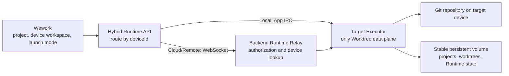
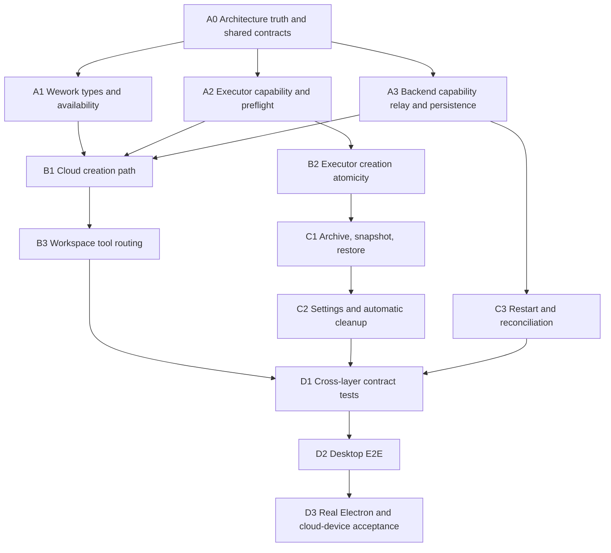

# Cloud Git Worktree Goal Mode and Parallel Development Plan

## 1. Document status

- Created: August 17, 2026
- Status: core implementation, the real-Electron cloud lifecycle, and the Remote Docker container lifecycle are complete; only managed-production persistent-volume and instance-replacement acceptance still require the target environment
- Objective: let local devices, managed cloud devices, and user-managed Remote Docker devices share one managed Git Worktree capability
- Delivery model: one primary agent owns the goal, shared contracts, integration, and final verification; sub-agents implement disjoint workstreams in parallel

This document records the implementation plan, parallel ownership, and acceptance status.

## 2. Target model

When a user selects New Worktree for any eligible online device workspace, Wework sends the task to that workspace's Executor. The target Executor owns planning, creation, execution, archiving, snapshots, restoration, and cleanup on its persistent filesystem.



Required invariants:

1. Only the target Executor holding the source repository may create, delete, or restore a Worktree.
2. `deviceId` records the device that created or most recently prepared the Worktree and remains
   available for routing and diagnostics. It is not Worktree ownership or an operation permission:
   an Executor must not block task execution, reconciliation, archival, restoration, or cleanup
   solely because a persisted record contains a different `deviceId`.
3. Backend never executes Git and never owns filesystem truth.
4. A Runtime Task binds to at most one managed Worktree.
5. Worktree IDs derive from stable unique task IDs.
6. Queued tasks expose only a planned path and do not create directories before acquiring a physical execution slot.
7. Worktree creation failure never falls back to the base workspace.
8. Terminal, IDE, file-tree, and Git actions use the task's final workspace path.
9. Default deletion preserves a restorable snapshot and handles all linked tasks first.
10. Offline devices never trigger cross-device restoration, deletion, or recreation.
11. Cloud Executor home, repositories, Worktree roots, and absolute mount paths remain stable across restarts.
12. External callers use logical device IDs; Backend resolves the current Runtime socket identity and verifies ownership.
13. Worktree features do not reuse the existing Skills, Plugins, and MCP `capabilities` payload.
14. Existing target directories are accepted only after proving that they are the expected Worktree for the same repository and Worktree ID.
15. Restart reconciliation never auto-resumes an agent. Valid Worktrees may become manageable again while interrupted tasks remain failed or interrupted.
16. Deletion requires Runtime stop acknowledgement before task archival, snapshot creation, and directory removal.
17. A single Executor process owns each Executor Home in the first release.

## 3. Scope

The implementation will:

- align Wework types with `remote`, `cloud`, and `device_path`;
- replace device-type gating with project, workspace, capability, and online-state availability;
- add Executor Worktree capability and workspace preflight;
- reuse `runtime.tasks.create` for deferred cloud and Remote Docker Worktree creation;
- reuse the existing Runtime WebSocket relay;
- complete remote archive, snapshot, restore, cleanup, and settings behavior;
- ensure all workspace tools follow the task Worktree path;
- scope launch-mode and branch preferences to DeviceWorkspace identity;
- separate execution location from launch-mode UI semantics;
- enforce managed-cloud persistent-volume prerequisites;
- add unit, contract, Backend, desktop E2E, and real-Electron verification.

It will not:

- execute Git in Backend;
- store Worktree files or filesystem state in Backend;
- migrate Worktrees across devices;
- fall back to another device when the owner device is offline;
- silently infer support for old Executors;
- create a Backend DeviceWorkspace for each temporary task Worktree.

## 4. Dependency waves



Wave 0 is serialized and owned by the primary agent. In Wave 1, Wework availability, Executor capability/preflight, and Backend capability/persistence may proceed in parallel. Later waves start only after their declared gates pass.

## 5. Agent ownership

### Primary agent

Owns:

- goal status and dependency tracking;
- shared request/response contracts;
- cross-module decisions and conflict resolution;
- review, integration, broad tests, real Electron verification, and final acceptance.

Exclusive write scope:

- shared cross-layer contracts and final integration files.

### Agent A: Wework types and availability

Write scope:

- Wework API types;
- project classification and Worktree availability;
- a pure Worktree availability resolver and its tests.

Deliverables:

- complete `remote`, `cloud`, and `device_path` types;
- one Local, Cloud, and Remote availability model with stable unavailable reasons.

### Agent B: Executor Worktree capability

Write scope:

- Runtime Worktree manager and handlers;
- Executor capability generation;
- focused Executor Worktree tests.

Deliverables:

- versioned capability;
- `runtime.worktrees.preflight`;
- create-time revalidation and repository fingerprinting;
- atomic failure behavior;
- deferred preparation, snapshot, restore, and restart tests.
- blocking Git and filesystem work moved off the async RPC thread;
- explicit preparing/reconciliation states and existing-directory identity checks.

### Agent C: Backend routing, online features, and cloud persistence

Write scope:

- Wework Runtime WebSocket namespace;
- device services and schemas;
- cloud provider and deployment persistence configuration;
- focused Backend tests and device documentation.

Deliverables:

- logical-device-to-Runtime-route resolution;
- Worktree capability/preflight relay and optional independent `runtime_features` projection;
- ownership enforcement;
- distinct offline, missing-route, timeout, disconnect, unsupported, and invalid-response errors;
- stable device identity and persistent-volume guarantees.

Agent C must not implement Git commands or a Worktree database table.

### Agent D: Hybrid routing and task projection

Write scope:

- Hybrid Services;
- local/runtime IPC adapters;
- runtime messaging and remote Runtime Work cache;
- related tests.

Deliverables:

- strict routing by target `deviceId`;
- base workspace as the source path;
- correct planned/final path reconciliation;
- no unknown-device fallback;
- preserved `workspaceKind=worktree` in lists, events, and caches.

### Agent E: tools, archive, and settings

Write scope:

- runtime task archive lifecycle;
- Worktree settings page;
- Terminal, code-server, file-tree, and Git workspace actions;
- focused tests.

Deliverables:

- archive/delete/restore on the original device;
- snapshot preservation;
- final task workspace path for every tool;
- truthful offline failures.

### Agent F: E2E and acceptance

Write scope:

- shared desktop E2E scenarios and checkpoint registration;
- test fixtures and diagnostics directly required by those scenarios.

Deliverables:

- local, cloud, and Remote Docker scenarios;
- queued cancellation, archive/restore, offline, and restart coverage;
- existing GitHub CI invocation;
- a real-Electron acceptance checklist and evidence requirements.

### Agent G: Workbench state, preferences, and Composer

Write scope:

- WorkbenchProvider, context types, and preference helpers;
- ProjectWorkBar, work-bar utilities, PopoutWorkspaceMenu, tests, and translations.

Deliverables:

- DeviceWorkspace-scoped launch-mode and branch preferences;
- stale asynchronous state protection during workspace switches;
- separate device-location status and Current Workspace/New Worktree launch modes;
- one availability result shared by UI and send-time gating;
- no silent removal of `execution` followed by base-workspace execution.

### Executor secondary workstreams

After the shared state model is frozen, Agent B may split into disjoint streams:

| Stream | Exclusive responsibility                                  |
| ------ | --------------------------------------------------------- |
| B1     | lifecycle state, target identity checks, reconciliation   |
| B2     | capabilities, preflight, and error model                  |
| B3     | scheduler, deferred creation, task failure atomicity      |
| B4     | stop acknowledgement, archive, snapshot, restore, cleanup |
| B5     | fixtures, crash-window, and restart tests                 |

The handler registration and shared module wiring remain single-owner files.

## 6. Parallel execution protocol

1. One file belongs to one agent per wave.
2. Shared contracts and architecture files belong only to the primary agent.
3. Agents do not make opportunistic edits outside their assigned scope.
4. If an out-of-scope change is required, the agent reports it for primary-agent integration.
5. Every agent reports changed files, tests run, known limits, and unresolved dependencies.
6. The primary agent reviews uploaded changes before starting dependent work.
7. Existing user changes are preserved; an unsafe overlap stops that write stream.

Recommended branches:

```text
docs/cloud-worktree-architecture
feature/cloud-worktree-ui
feature/cloud-worktree-executor
feature/cloud-worktree-device-capabilities
feature/cloud-worktree-runtime-routing
feature/cloud-worktree-lifecycle
test/cloud-worktree-e2e
```

## 7. Shared protocol proposal

Capability:

The initial source of truth should be an Executor RPC:

```text
runtime.worktrees.capabilities
```

```json
{
  "runtimeWorktrees": {
    "version": 1,
    "managed": true,
    "deferredPrepare": true,
    "snapshots": true,
    "restore": true,
    "persistentStorageVerified": true
  }
}
```

Backend may project the same model as `runtime_features.worktrees` in registration or heartbeat state for fast device-list rendering. It must not reuse the existing Skills, Plugins, and MCP `capabilities` payload. Mutating operations still rely on preflight and create-time validation. `persistentStorageVerified` is not inferred from current writability: only a Cloud/Remote deployment that has verified a stable volume, stable absolute paths, and single-writer ownership may inject it. Missing or false disables Worktrees with an infrastructure reason. Local/App does not depend on a remote-deployment attestation.

Preflight request:

```json
{
  "deviceId": "device-id",
  "sourcePath": "/persistent/workspaces/project-a"
}
```

Preflight response:

```json
{
  "supported": true,
  "gitRepository": true,
  "writable": true,
  "repoRoot": "/persistent/workspaces/project-a",
  "repoRootFingerprint": "sha256:...",
  "resolvedWorktreeRoot": "/persistent/executor/workspace/worktrees"
}
```

Task creation:

```json
{
  "deviceId": "cloud-device-id",
  "taskId": "runtime-codex-...",
  "workspacePath": "/persistent/workspaces/project-a",
  "execution": {
    "workspace": {
      "source": "git_worktree",
      "branch": "main"
    }
  }
}
```

The request path is the base workspace. The Executor response path is the planned or final task workspace. A `git_worktree` response with no independent path, or with the base workspace path, fails; Backend and UI never fall back to the source path. A queued response may expose a non-existent planned path, but the Worktree must exist before the task becomes running.

Backend resolves logical device IDs to current Runtime socket IDs. Mutating RPCs are never automatically retried: a timeout is an unknown outcome and must be reconciled with the stable task ID and task list.

## 8. Verification gates

Wave 1:

- old Executors are explicitly unsupported;
- new Executors return preflight;
- non-Git or unwritable workspaces remain unavailable.

Wave 2:

- cloud tasks start inside Worktrees;
- queued tasks create no directories;
- failures never start in the base workspace;
- concurrent tasks use distinct paths;
- local behavior has no regression.

Wave 3:

- archive and restore remain on the original device;
- all tools use the final task path;
- offline actions do not report false success;
- restart restores task and Worktree metadata;
- lost storage is reported as loss, not recreated as an empty Worktree.
- crash reconciliation preserves a valid orphaned Worktree without auto-resuming its agent;
- deletion refuses to remove a Worktree until the linked Runtime has stopped.

Wave 4:

- focused and broad tests pass;
- every new E2E scenario runs in existing GitHub desktop CI;
- real Electron verification passes;
- managed cloud and Remote Docker acceptance passes without retries or skipped assertions.

## 9. Completion definition

The goal is complete only when:

- cross-layer shared contracts are confirmed;
- local, cloud, and Remote Docker use the same Executor Worktree data plane;
- Wework no longer hard-codes capability from device type;
- old, offline, and non-Git targets have explicit unavailable reasons;
- create, queue, run, archive, restore, cleanup, and restart pass on cloud;
- Terminal, IDE, file-tree, and Git actions use the final Worktree path;
- persistent-volume and stable-path requirements are implemented and verified;
- all new E2E coverage runs in CI;
- focused tests, broad regression, and real Electron verification pass;
- no retry, skip, or fallback masks a failure.

## 10. Implementation record and acceptance result

As of August 18, 2026, the core code work in this plan has been completed through goal mode and parallel sub-agent work. The real Remote Docker container lifecycle has passed, leaving only the managed-production persistent-volume gate:

| Wave | Result                                                                                                                                                              |
| ---- | ------------------------------------------------------------------------------------------------------------------------------------------------------------------- |
| A0   | Cross-layer protocol boundaries and invariants are frozen                                                                                                           |
| A1   | Wework now has unified Local, Cloud, Remote, and `device_path` types and Worktree availability                                                                      |
| A2   | Executor now owns versioned capability, preflight, deferred creation, identity checks, snapshots, restore, cleanup, and restart reconciliation                      |
| A3   | Backend now owns logical-device routing, authorization, structured RPC errors, and `runtime_features` projection                                                    |
| B    | Hybrid creation, planned/final path reconciliation, tool path routing, and DeviceWorkspace preferences are complete                                                 |
| C    | stop acknowledgement, archival snapshot deletion, unarchive restore, settings, and automatic cleanup are complete                                                   |
| D    | cross-layer contracts, CI classification, six atomic checkpoints, and the real-Electron cloud lifecycle are complete; target-environment acceptance is described below |

The real-Electron `cloud-git-worktree` aggregate expanded and verified six independently runnable checkpoints:

1. `cloud-worktree-capability`: live capability, protocol version, target-workspace preflight, and explicit unavailable reasons;
2. `cloud-worktree-create`: selecting New Worktree, target-Executor creation, isolation from the base workspace, and execution from the final path;
3. `cloud-worktree-queued-cancel`: planned-path projection without creating a Worktree directory before slot acquisition;
4. `cloud-worktree-tools`: Terminal, IDE, file tree, and Git actions using the task's final Worktree path;
5. `cloud-worktree-archive-restore`: stop acknowledgement, archive, snapshot, removal, unarchive restore, linked settings, and final cleanup;
6. `cloud-worktree-device-restart`: manageable state after Executor restart while interrupted tasks stay failed and quarantined, never auto-resume, and are not revived by stale provider metadata.

Verification evidence:

```text
Backend full suite: 5246 passed, 1 skipped
Persistent Runtime identity and acceptance contracts: 20 passed
Wework full suite: 398 files, 4028 tests passed; TypeScript typecheck passed
Executor: cargo fmt --check and cargo test passed
  unit layer: 869 passed, 1 ignored
  app_runtime_work_send_contract: 37 passed in 3.54s
CI desktop classifier contract: passed
Real Electron aggregate:
  node e2e/desktop/run-checkpoints.mjs --parallel-segments cloud-git-worktree
  all six atomic checkpoints passed with three isolated workers
Evidence:
  capability: wework/test-results/desktop-e2e/2026-08-17T19-23-55-812Z-291225
  create: wework/test-results/desktop-e2e/2026-08-17T19-23-55-826Z-291233
  queued-cancel: wework/test-results/desktop-e2e/2026-08-17T19-23-55-845Z-291239
  tools: wework/test-results/desktop-e2e/2026-08-17T19-24-54-569Z-294076
  archive-restore: wework/test-results/desktop-e2e/2026-08-17T19-25-16-480Z-294503
  device-restart: wework/test-results/desktop-e2e/2026-08-17T19-25-17-780Z-294565
Device-restart verification after Runtime Instance pinning:
  wework/test-results/desktop-e2e/2026-08-17T19-59-48-919Z-324677
Tools verification after adding the logical-device IDE endpoint assertion:
  wework/test-results/desktop-e2e/2026-08-17T20-43-04-527Z-379134
Real Executor App IPC local persistence probe:
  seed(instance-a) -> verify(instance-b) -> verify(instance-c) -> cleanup: passed
Real Remote Docker container lifecycle:
  image: wegent-device:worktree-acceptance (linux/amd64)
  seed(instance-a) -> verify(instance-b) -> verify(instance-c) -> cleanup: passed
  single-writer conflict and wrong logical-device identity rejection: passed
  probe: git-worktree-20260818102917-529947
```

The real lifecycle and final regression uncovered and fixed these cross-layer defects:

- Workbench availability incorrectly returned `no_project` when a remote project existed only as the current Runtime project.
- Executor returned millisecond timestamps for archived items while the Backend DTO accepted only strings.
- Backend renamed the established `taskId` field and dropped `threadId` and `runtimeHandle`, preventing the UI from addressing the archived task.
- Backend remote-workspace root parsing recognized only legacy fields instead of preferring Executor's canonical `tasks` field, and the cloud workspace-file and Git command routing allowlist was incomplete.
- After Executor restart, stale provider thread metadata could project a locally interrupted task back to `active`, hiding the failed quarantine state.
- The aggregate checkpoint had only one alias, so it did not prove that all six long-flow checkpoints could run independently and were distributed across CI shards.
- When the same Cloud or Remote logical device was attached to a fresh empty volume, Executor generated a new Runtime Instance ID and Backend previously overwrote the established value, silently accepting storage loss. The first recorded ID is now immutable, and a later different or empty value rejects registration.
- Runtime Turn Queue atomic-write temporary names used only the PID and millisecond timestamp, so concurrent writers could collide. Queue-key creation and persistence are now serialized within the process, and temporary names include a monotonic sequence.
- The shared fake Codex App Server used by Runtime Work tests exited after the expected turn count. A later list or transcript RPC could race process restart and wait for the startup-protection timeout. The shared fixture now remains alive, while dedicated failure fixtures exclusively cover process-exit behavior.
- `preserveSnapshot=false` removed the directory but retained a `deleted` tombstone in `worktrees.json`, which failed the real cleanup probe. Terminal cleanup now removes any existing snapshot ref and the persistent record; cancelled-task diagnostics remain in the Runtime Task Store.

On August 18, 2026, the current workspace was built as the Linux/AMD64 image `wegent-device:worktree-acceptance`, and `scripts/acceptance/remote-device-worktree-persistence.sh` passed against real Remote Docker containers. The gate covered container startup, real Git Worktree and Runtime state, single-writer conflict rejection, containers B and C restoring from the same Docker Volume after container A was destroyed, binary refresh, wrong logical-device identity rejection, and final cleanup without a tombstone. Access to the Docker daemon required `sudo`, which does not affect the acceptance result.

The managed-production gate is now encoded as the `seed`, `verify`, and `cleanup` phases of `scripts/acceptance/executor-home-persistence-probe.sh`. A local instance-replacement simulation using the real debug Executor App IPC and one temporary Executor Home now passes: instance A writes the Git Worktree and Runtime state; instances B and C independently verify logical-device identity, Runtime Instance ID, Git common directory, contents, and index state; instance C completes terminal cleanup without a tombstone.

When a cloud device enables Worktrees for the first time with a newly created empty volume, no historical Worktree data is expected. That first startup generates and registers the initial Runtime Instance ID and establishes the persistence baseline. An empty volume becomes an error only after the logical device already has a registered Runtime Instance ID; Backend then rejects an empty or different new ID so historical data loss or a wrong-volume attachment cannot be accepted silently.

A deployment must still provide a real Pod UID or instance ID plus the PVC/PV UID or an equivalent immutable volume identity, reattach the same volume at the same absolute path after replacement, and pass the same gate. Neither the local simulation nor the Remote Docker Volume acceptance is actual PVC/PV acceptance. Managed-cloud Worktrees should not be declared generally available until the managed-production persistent-volume acceptance passes.
