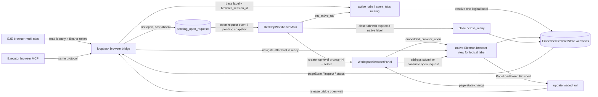

# Embedded Browser

Wework's embedded browser displays an interactive web page inside the desktop workbench right panel and lets the local runtime control the same page through the Electron browser view bridge. It is not a screenshot preview, and it should not open a separate external Chrome window.

## Architecture

The embedded browser has three layers:

- The Wework Electron main process owns embedded-page navigation, page state, screenshots, and logical labels; the React renderer creates and positions the matching `<webview>` host.
- The Wework React workbench mounts the browser panel into the right workspace pane and owns panel, task, overlay, and annotation state.
- `executor/src/browser_mcp` exposes browser MCP tools to Codex and uses the Wework bridge to operate the Electron browser view bound to the current task.

When Executor launches Codex, it injects the browser MCP server configuration. Browser tool calls from the model read the current bridge identity and send controlled requests to the Wework process's loopback bridge. The bridge then schedules Electron browser view navigation, page inspection, DOM actions, waits, and screenshots on the main thread.

Each Wework process binds an independent random local bridge port and atomically writes the bridge identity to `runtime/embedded-browser-bridge.json` under the active Executor home. The identity contains a schema version, process PID, loopback address, authentication token, and start time. Directory and file permissions should be restricted to the current user, and the token must not be logged. The MCP server reads the latest identity before each request and accepts only loopback addresses, so multiple Wework instances do not route browser requests to the wrong window.

After starting the bridge, Electron must pass the runtime file path to the managed Executor. When the Executor builds the Codex browser MCP configuration, it must pass only that file path and must not pin the current bridge URL or token in the configuration. Otherwise, a random Electron port or a restarted bridge leaves the MCP server connected to stale coordinates and bypasses runtime identity refresh.

Bridge requests must include the authentication token. `open` and `navigate` allow only safe web schemes; do not allow `file:`, `javascript:`, or other URLs that could read local files or execute arbitrary script through the Agent navigation path.

The bridge supports limited concurrency. A long `waitFor` request must not block independent `click`, `fill`, or `inspect` requests; when the concurrency limit is reached, return an explicit busy error instead of waiting forever.

### Multi-tab navigation connection graph



Connection ownership is fixed as follows:

| Connection                               | Sole responsibility                                                                                          | Current code owner                                                                                                                           |
| ---------------------------------------- | ------------------------------------------------------------------------------------------------------------ | -------------------------------------------------------------------------------------------------------------------------------------------- |
| E2E/MCP → bridge                         | Read the latest identity, authenticate the request, and carry the base label plus optional session ID        | `e2e/desktop/scenarios/embedded-browser-multi-tabs.scenario.mjs`, `executor/src/browser_mcp`, `electron/src/host/embedded-browser-bridge.ts` |
| bridge → routing                         | Resolve the base label to exactly one active logical label; tests must not guess native labels               | `electron/src/host/embedded-browser-manager.ts`                                                                                              |
| bridge → pending open                    | Persist an ID-bearing request before notifying React to create the host                                      | `request_browser_open`, `embedded_browser_pending_open_requests`                                                                             |
| React → top-level tab                    | Create independent state and a logical label for every `browser:N`, then synchronize the active tab          | `DesktopWorkbenchMain.tsx`, `RightWorkspacePanel.tsx`                                                                                        |
| panel → native WebView                   | Create or reuse the WebView for the logical label after the host has usable bounds                           | `WorkspaceBrowserPanel.tsx`, `embedded_browser_open`                                                                                         |
| native load → execution truth            | Only `PageLoadEvent::Finished` writes `loaded_url`; `url` represents navigation intent only                  | `on_page_load` in `embedded_browser.rs`                                                                                                      |
| load truth → bridge                      | `open` succeeds only after the target entry has a `loaded_url`                                               | `wait_for_browser_navigation`                                                                                                                |
| tab select/close → routing and lifecycle | Selection updates base-label routing; close may destroy only the instance matching the expected native label | `DesktopWorkbenchMain.tsx`, `embedded_browser_set_active_tab`, `embedded_browser_close(_many)`                                               |

### First multi-tab navigation sequence

```mermaid
sequenceDiagram
    participant T as E2E / browser MCP
    participant B as loopback bridge
    participant S as EmbeddedBrowserState
    participant R as React workbench
    participant P as WorkspaceBrowserPanel
    participant W as native Electron browser view
    participant H as target HTTP service

    T->>B: open(base label, URL, timeout)
    B->>S: resolve active logical label
    alt logical label has no host
        B->>S: store pending open(request ID, target label, URL)
        B-->>R: embedded-browser-open-request
        R->>R: create and select browser:N
        R->>S: set_active_tab(base, target label)
        R->>P: render panel with openRequest
        P->>W: embedded_browser_open(URL, bounds, target label)
        W->>S: Opening -> Ready
        B->>S: observe target label Ready
    else logical label is already Ready
        B->>S: reuse existing entry
    end
    B->>W: navigate(URL)
    W->>H: GET URL
    H-->>W: page response
    W-->>S: PageLoadEvent::Finished(URL)
    S->>S: loaded_url = URL
    S-->>P: page-state-change(URL, title)
    B->>S: read loaded_url
    S-->>B: navigation completed
    B-->>T: open succeeds

    T->>R: add and select a second browser:N
    R->>S: set_active_tab(base, second label)
    T->>B: open(base label, URL B)
    B->>S: route base label to second label
    Note over B,W: Later switches, inspections, and closes must target each logical label; the two WebViews never overwrite each other's page state
```

This path must preserve these invariants:

1. The base label is only the Agent entry point; state, lifecycle, and page truth belong to the resolved logical label.
2. `Ready` means that the native host can be operated, not that the destination page loaded. Navigation success requires `loaded_url` on that entry.
3. A first `open` has exactly one navigation owner. React creates the host; the bridge waits and submits the destination navigation. Consuming the same pending request must not produce competing duplicate navigations.
4. `PageLoadEvent::Finished` updates the current logical owner of the native label; tab switching or relabeling must not write the event to a stale owner.
5. The E2E fixture must receive the destination request. After the bridge succeeds, the test asserts both the address field and inspected content; a tab, address draft, or `navigation_requested` log alone is not success.
6. A second browser tab owns a distinct logical label and native WebView. `set_active_tab` changes only base-label routing and never copies or swaps page state.
7. Closing a tab carries the expected native label, and the base label routes to the surviving active tab afterward.
8. A timeout retry or longer wait cannot replace a missing `GET → Finished → loaded_url` completion edge.

## Agent Browser Capabilities

The model sees browser action tools, not raw Chromium APIs. Common capabilities include:

- `browser_open` / `browser_navigate`: open or navigate pages.
- `browser_inspect`: return a structured page inspection result.
- `browser_click`, `browser_type`, `browser_fill`, `browser_press_key`, `browser_hover`, `browser_focus`: operate page elements.
- `browser_scroll`, `browser_scroll_into_view`, `browser_select_option`, `browser_set_checked`: cover common scrolling and form controls.
- `browser_wait`: wait for page stability, URL conditions, text, or element state.
- `browser_take_screenshot`: capture a real browser screenshot.
- `browser_capabilities`, `browser_native_input_probe`, `browser_ax_probe`, `browser_present_probe`: report Electron browser view capability boundaries and diagnostics.

Combined tools may collapse frequent flows into one model call, such as `browser_open_and_inspect`, `browser_click_and_inspect`, and `browser_wait_and_inspect`. Combined tools must appear in MCP `tools/list` so the protocol remains self-describing.

`inspect` means structured page inspection, while `screenshot` means an actual image capture. Do not reuse `snapshot` for structured DOM output because that conflicts with real screenshot semantics.

Structured inspect results should include at least the page URL, title, viewport, node list, and text summary. Nodes should consistently include:

- `ref` and `index`: used by later actions for targeting.
- `role`, `name`, `text`, and `value`: used by the model to understand semantics.
- `rect`, `visible`, `disabled`, and `actionable`: used to decide whether the node can be operated.
- `frameId`, `selector`, or other diagnostic locator data: useful for debugging, but the model should not depend on fragile selectors.
- `warnings`: occlusion, invisibility, sensitive input, cross-frame limits, or other risks.

Action tools should prefer `ref` values produced by `inspect`. If page re-rendering invalidates a `ref`, return a recoverable error that asks the model to inspect again instead of silently guessing a selector. Action results should describe the observed effect, such as value change, DOM change, URL change, or only dispatching an event without an observed effect.

## Task Binding

Browser instances are bound by pane/task label:

- A new conversation without a runtime task uses the current pane key as a temporary browser label.
- After sending from a new conversation creates a runtime task, Wework relabels the temporary browser to the new task label.
- When the user switches tasks, only the browser bound to the active pane/task is visible; pages from other tasks must not leak across panes.
- Executor injects a task-specific label for an existing runtime task. Only temporary new conversations use the default or pane label, and only the active task may claim the default label.
- When a top-level task tab becomes inactive, its workbench effects must stay active so the task-specific bridge listener can handle background `open`, `waitFor`, and `inspect` requests. Hide the React surface with `hidden` and keep the native WebView invisible; non-task tabs should not pay this keep-alive cost.
- When the right browser panel is closed, the native WebView is hidden offscreen and must not cover the chat area, debug panel, or splitter.

This binding keeps the browser the user sees and the browser the agent controls as the same object.

Each pane/task label currently maps to one browser host. Wework can keep multiple top-level task tabs and their independent browsers alive, but there is no browser-internal multi-tab model inside one task. Adding browser-internal tabs must extend bridge routing identity, lifecycle ownership, and the Agent tool protocol instead of reusing another task's host.

A programmatic first open must treat "the panel was requested" and "the native WebView is ready for navigation" as separate phases. The bridge stores pending navigation with a request ID and executes it only after the browser host for that task has nonzero visible bounds and reaches the ready state. If the frontend listener registers after the request, it recovers the event from the pending-request snapshot. The tool may report success only after the native WebView has navigated to the requested URL, not merely because the right panel or a blank WebView was created.

Close requests triggered by task switching or component unmounting must include the expected native label. A stale pane may close only the WebView it created; it must not close an instance that was relabeled or adopted by a replacement pane. An inactive task may prepare a hidden ready browser, but it cannot display that browser over the active task.

## Main-interface overlays and address synchronization

Electron embedded pages must be mounted as renderer-owned `<webview>` elements under the shared browser host root. Main-interface dialogs, menus, and listboxes then cover that host through portals and the system-level `z-index`. Do not reintroduce main-process child views such as `BrowserView` or `WebContentsView` for application tabs or Smart apps, because those surfaces leave the renderer stacking context and cover top-tab menus.

Desktop implementations that still use a separate native WebView cannot rely on React `z-index`. When a main-interface overlay intersects such a browser region, the browser panel must hide the native WebView and restore it after the overlay is removed or no longer intersects. Add `data-embedded-browser-occlusion` when a custom overlay cannot be identified through a semantic role or shared layer class; do not duplicate native visibility calls across feature components.

Page-state polling owns the browser's actual URL, while the address field owns the user's editing draft. While the address field is focused, polling may update page URL state, title, and favicon, but it must not overwrite the draft. Restore the actual URL after focus leaves the field. New navigation and page-state synchronization paths must preserve this boundary.

## WebView Compatibility

- Built-in-browser child WebViews enable DevTools only in debug builds; an explicit build cfg disables it in release builds. On macOS debug builds, Wework saves the child-WebView frame before the Inspector frontend first appears, detaches the Inspector, and restores the frame exactly. F12 therefore opens only a separate window and cannot dock, resize the browser, or cover the workbench. The main-WebView Inspector remains available only through Developer Commands.
- Browser WebViews use a fixed isolated data-store identifier and app data directory. They must not share Wework's main-interface sign-in storage, and the browser settings clear action only targets this store.
- Wegent Agent application tabs in Electron also use native child WebViews instead of cross-origin iframes. All application tabs share the same fixed data-store identifier, so the complete website storage for an origin, including every `localStorage` key, cookies, and IndexedDB, remains available after closing and reopening a tab or restarting the application. A tab label identifies only the WebView lifecycle; it does not partition storage. On macOS 14 and later, `data_store_identifier` selects the persistent `WKWebsiteDataStore`, while `data_directory` primarily serves other platforms. Do not mirror or restore page storage key by key in the Wework main interface.
- Electron Smart apps reuse the same renderer-owned `<webview>` hosting path and use a stable `smart-app:<installationId>` logical label. The renderer owns the visible host; the main process retains Harness runtime and embedded-browser control-plane responsibilities but no longer creates a visible `WebContentsView`. A component remount must atomically replace the old guest, and delayed closes must carry the expected native label so a stale component cannot close the replacement.
- Browser WebViews use a Chromium-compatible User-Agent so websites do not treat a Chromium User-Agent without a browser product identifier as an unsupported client.
- Popups, OAuth, SSO, and payment flows may use `window.open` or new-window navigation. Implementations should route them to a controlled browser window or explicitly hand them to the system; the Agent must not operate invisible hidden pages.
- The download handler reads the download directory and ask-before-download preference. Cancelling the system save dialog must cancel that download.
- Page-load events write the current URL into application state. Do not synchronously read the native WebView URL while handling IPC or custom protocols because macOS Chromium may temporarily have no URL while creating or destroying a WebView.
- Page action scripts may only perform behavior that matches the current tool semantics. Do not wrap arbitrary DOM mutations in internal evaluate calls to bypass safety checks.
- macOS App Transport Security permits HTTP only for embedded web content. An invalid server certificate must first fail system trust evaluation; only then may the browser continue that server-trust challenge and publish risk state containing the native WebView identity and origin to the frontend. Register the TLS handler before the first navigation so initial loading cannot race asynchronous `with_webview` configuration. Keep the warning across same-origin pages, and clear it after cross-origin navigation or WebView closure.

## Optional Cloud Desktop Extension

The public Wework codebase defines only cloud-desktop UI slots, the internal-page classifier contract, and an unavailable default implementation. It does not include connection credentials, launch targets, launch orchestration, a concrete remote desktop protocol, authentication endpoint, proxy, page, or third-party client assets. The workbench and device settings use this capability only through `src/extensions/cloud-desktop-contract.ts`; the default implementation sets `available` to `false`, so no desktop action is shown.

Product distributions may provide an implementation for `@extensions/cloud-desktop` at build time. The generic contract exposes `DeviceAction` and `WorkspaceAction` entry points for settings and project workspaces. A concrete implementation owns its connection types, launch target, asynchronous state, and launch orchestration, and must use `isCurrent` to ignore asynchronous requests after the project, device, or connection context changes. Public Wework provides only an unavailable fallback and must not contain concrete remote-desktop protocols, pages, assets, or dedicated copy.

## Annotation Flow

The browser address bar includes an annotation icon. The implementation has three layers:

- The Electron `browser-annotation-controller` owns annotations, drafts, original-view preview state, and runtime revisions per browser logical label. It is the only state source of truth.
- A dedicated preload uses a page-local ShadowRoot for target hit testing, highlighting, numbered markers, anchor rebinding, and design styles so annotation internals do not pollute page observers.
- A separate transparent overlay window renders the compact comment or design editor. The React browser panel owns only the annotation toolbar, count, and transfer into the main composer.

In annotation mode:

- Hover highlights only the current DOM element. Clicking creates a stable anchor containing selector, DOM path, text, and geometry context, then opens the editor.
- The comment editor supports add, save, cancel, and delete. Saved annotations render numbered page markers that reopen the editor.
- The design editor starts from the target's computed styles and can change text, appearance, and layout properties. The preload applies those changes and rebinds them after target-node replacement.
- Holding Original View uses the same render/sync path to suppress every design change and restore replaced text. Releasing it reapplies the annotation design.
- A same-URL reload preserves annotations and rebinds anchors. A real cross-URL navigation exits annotation mode and clears the draft so stale page state cannot leak.
- Published annotations enter the Wework main composer attachment area. The runtime DTO sent to the model contains element context, comment, and design changes but omits screenshots, timestamps, and other UI-private fields.

Annotations are comments on the visible web page, not code selection comments. `browser_annotation` items should be interpreted by the model as comments on current visible page elements.

Annotation regression coverage is split into independently runnable checkpoints:

- `browser-annotation-core`: target selection, comment creation, numbered marker, editing, deletion, and exit.
- `browser-annotation-anchors`: anchor recovery after DOM movement, same-URL reload, and target-node replacement.
- `browser-annotation-design`: computed-style baseline, design application, Original View, and design rebinding.

`browser-annotation` is the composite entry for all three checkpoints. It must expand and execute every member instead of reporting success after only the generic desktop flow.

## Development Checks

After changing embedded browser code, run at least:

```bash
pnpm --filter wework typecheck
pnpm --filter wework lint
cargo check --manifest-path executor/Cargo.toml
cargo test --manifest-path executor/Cargo.toml browser_mcp
pnpm --dir wework/electron typecheck
pnpm --dir wework/electron test
pnpm --filter wework e2e:desktop:embedded-browser
pnpm --filter wework e2e:desktop -- --segment browser-toolbar-actions
pnpm --filter wework e2e:desktop -- --segment browser-annotation
```

`e2e:desktop:embedded-browser` must create task A, switch to task B, and then use task A's specific label for the first bridge `open`, `waitFor`, and `inspect`. It verifies that the inactive task completes background navigation before the tool timeout without taking over task B's browser, and that the same page state is visible after switching back to task A. A test that covers only a second open, an active-task open, or a manually exposed browser panel does not exercise the first-open and inactive-task routing races.

When the browser change touches Electron IPC commands, native WebView behavior, IPC, or the Agent action path, also start an isolated real Electron session with `pnpm --filter wework ai:verify start` and record evidence for opening a page, inspect, actions, and screenshot. If the full E2E is too slow locally, document why it was not run and make sure CI runs `e2e:desktop:embedded-browser`.

macOS Inspector changes must also run the `browser-toolbar-actions` checkpoint. It serves a local HTTP simulation page, opens and closes the Inspector twice, and verifies that a separate native window appears, becomes invisible after close, and leaves the child-WebView frame unchanged.

When the Executor Codex launch configuration changes, also run the matching Codex launch config unit tests to verify that the browser MCP server is injected correctly.
