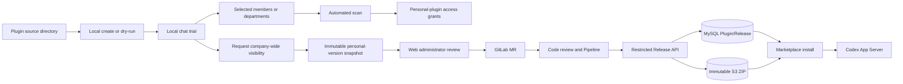

# Wework Plugin Marketplace Developer Guide

For developers who need to build, migrate, or publish Wework plugins. See [Plugin Marketplace V2](./plugin-marketplace-v2.md) for architecture and operations, [Codex Plugin Runtime](./wework-codex-plugins.md) for local runtime details, and [Plugin Icon Guide](./wework-plugin-icons.md) for light/dark logos.

> Implementation status (2026-08-29): the current feature branch implements the section 4 Wework two-scope interaction, Request/Revision history, Web review, MR materialization, and restricted Release API. New enterprise requests no longer use a people allowlist. Legacy Submission remains only for personal restricted-share upload and draining historical rows. **Production is not enabled**: revocation/rotation of the old token, HTTPS, protected master/environment, Code Owner approvals, project-locked native Windows/macOS Runners, and a new Release credential still require external P0 verification.

## 1. Mental model

Wework has two related but separate layers:

| Layer                       | Responsibility                                                    | Source of truth                            |
| --------------------------- | ----------------------------------------------------------------- | ------------------------------------------ |
| Local Codex runtime         | Actual install, enablement, and skill / MCP / command use in chat | Local Executor + Codex App Server          |
| Wegent cloud marketplace V2 | Catalog, versions, visibility, review, and desired device state   | MySQL metadata + private immutable S3 ZIPs |

Keep these rules in mind:

1. **The install unit is always a Codex Plugin.** A Skill is a listing type; a single-skill package is still one Plugin ZIP.
2. **A Git directory is not a production distribution source.** Source can live in a repo or local folder; production distribution goes only through cloud `PluginRelease` objects.
3. **Never ship secrets in the package.** Tokens, MCP credentials, `.env` files, and private keys must stay out of the ZIP.



### Two sharing intents and two artifacts

A personally created or imported plugin has one **Share** entry on its detail page. It contains only two intents:

| Intent                          | User selection                                                                             | Activation rule                                                                                                      | Artifact ownership                                                   |
| ------------------------------- | ------------------------------------------------------------------------------------------ | -------------------------------------------------------------------------------------------------------------------- | -------------------------------------------------------------------- |
| Selected members or departments | People and departments; the organization is selectable as the address-book root department | Grant access immediately after package scanning, with no human review                                                | Remains a personal plugin under My creations                         |
| Everyone in the company         | The current company's entire membership                                                    | Submit an immutable version snapshot, then complete automated checks, administrator review, code review, and release | A separate enterprise version appears under Enterprise after release |

The organization is not a third sharing scope. The regular user UI also does not expose `public`; in this phase,
“Everyone in the company” maps to `visibility=workspace`. The personal source and enterprise version must have
separate catalog identities. Review and release must not promote the personal plugin in place or clear its existing
member and department grants.

## 2. Package layout

Minimum useful layout:

```text
my-plugin/
├── .codex-plugin/
│   └── plugin.json          # required
├── skills/
│   └── review/
│       └── SKILL.md         # optional, but usually valuable
├── commands/                # optional
├── agents/                  # optional
├── hooks/                   # optional
└── bins/                    # optional; executables must be reviewable
```

`.claude-plugin/plugin.json` is accepted for compatibility, but new plugins should prefer `.codex-plugin/plugin.json`.

### Example `plugin.json`

```json
{
  "name": "gitlab-engineering",
  "version": "1.0.0",
  "description": "Review merge requests and diagnose pipelines",
  "interface": {
    "displayName": "GitLab Engineering",
    "shortDescription": "GitLab review and CI workflows",
    "developerName": "Wegent",
    "category": "Productivity",
    "logo": "./assets/app-icon.svg",
    "composerIcon": "./assets/app-icon.svg",
    "logoDark": "./assets/app-icon-dark.svg",
    "defaultPrompt": [
      {
        "title": "Review MR",
        "prompt": "Please review this merge request in the current repository:"
      }
    ]
  }
}
```

Conventions:

- `name` must be a slug: lowercase letters, digits, `.`, `_`, `-`, up to about 100 characters.
- `version` must be SemVer such as `1.2.0`. Official publishing rejects versions older than the current latest.
- `interface.displayName` / `shortDescription` appear on marketplace cards; describe user value, not implementation detail.
- `interface.logo` / `logoDark` / `composerIcon` point at package `assets/`; provide `logoDark` when the light mark fails on dark UI. Details: [Plugin Icon Guide](./wework-plugin-icons.md).
- A single-skill plugin may be listed as `listing_type=skill`.

### Example `SKILL.md`

```markdown
---
name: review
description: Review a merge request and summarize risks
---

# Review

1. Read the MR description and changed files.
2. Call out risks, missing tests, and suggested edits.
```

## 3. Local development loop

### Option A: Create inside Wework

1. Open the desktop **Plugins** page.
2. Use the create flow to generate a plugin under `wework-personal`.
3. After install, choose **Chat now** or one of the trial tasks on the detail page; the composer inserts a `plugin://...` mention.
4. Edit the local directory, refresh the marketplace/management views, and re-test in chat.

Local creations **do not** upload automatically. Only an explicit **Share** action submits the current version: sharing with members or departments only scans and grants access, while company-wide visibility starts a publication request.

### Option B: Develop in the enterprise plugin repository

The internal `wework-plugins` GitLab repository is the source of truth for plugins visible to everyone in an enterprise.
Each plugin lives under `<checkout>/plugins/<slug>/` and is registered in
`.agents/plugins/marketplace.json`. The repository exists for development, review, and CI only; Backend and Wework
**do not** scan it at startup.

Developers create a branch and submit a Merge Request directly. When a non-technical user requests company-wide
visibility from Wework, an administrator accepts it in the Web review console. The system materializes that immutable
snapshot on a controlled branch and creates a MR. Both entry paths share the same code review, compatibility
checks, and release Pipeline from the MR onward.

Build and scan locally:

```bash
cd backend
uv run python scripts/publish_official_plugin.py \
  ../wework-plugins/plugins/<plugin-slug> --dry-run
```

Success prints `name`, `version`, and `sha256`. A `--dry-run` only proves that local packaging and static scanning pass;
it does not prove Windows or macOS compatibility, a passing remote Pipeline, or a successful online release.

### Local cloud-market integration

You need MySQL, Redis, MinIO, and the current Backend source tree. Do not rely on a stale Compose Backend image.

```bash
# Migrate
cd backend
uv run alembic upgrade head

# Start Backend (./start.sh is fine)
./start.sh --host 127.0.0.1 --port 8000

# Start Wework
cd ..
VITE_WEGENT_BACKEND_URL=http://127.0.0.1:8000 \
WEGENT_DISABLE_SCCACHE=1 \
pnpm --filter wework dev:mac -- --executor-isolation
```

## 4. Sharing and enterprise-wide publishing

### 4.1 Selected members or departments

On a personal plugin's detail page, its owner chooses **Share → Selected members or departments** and selects people
or departments from the address book. The organization itself appears as the root department; there is no separate
“Organization visibility” option. The client packages the current version, computes SHA256, and uploads it for scanning.
After the scan passes, the personal plugin's access grants take effect immediately. This path does not enter Web review
or write source into the enterprise plugin repository.

Adding or removing members and departments only changes grants; it does not create a new enterprise Release. The plugin
remains under My creations, and its owner can keep editing, chatting, trying tasks, uninstalling, or deleting it.

### 4.2 Non-technical users requesting company-wide visibility

Any signed-in personal-plugin owner may submit a request; a publishing allowlist is no longer used. Wework presents a
three-step right-side drawer:

1. **Confirm version**: show the plugin, SemVer, update time, and the immutable version being submitted;
2. **Permissions and risks**: declare network access, commands/scripts, local-file access, credentials, and test results;
3. **Confirm submission**: review the company-wide scope, risk declarations, and version SHA256 before submitting.

Submission freezes the version, manifest, ZIP, and SHA256 for that request; it does not freeze the personal source.
During review, the owner can continue editing the personal plugin into a later version and keep sharing it with selected
members or departments. Later edits never replace the submitted snapshot silently.

The user-facing progress has five fixed stages:

1. **Submit request**: create the request and persist its immutable snapshot;
2. **Automated checks**: validate package structure, security, and declaration consistency;
3. **Administrator review**: administrators review risks and return or accept only in the Web console;
4. **Code review**: acceptance creates a GitLab MR for human review, risk checks, and Windows/macOS compatibility tests;
5. **Release**: after the MR is merged into protected `master`, its Pipeline calls the restricted Release API.

Administrator acceptance **only creates a MR; it does not publish**. A returned request must identify the reason
and risk items. The submitter reads the status in Wework, updates the personal source, and submits a new revision.

### 4.3 Developers submitting a GitLab MR directly

Developers can add or update `plugins/<slug>/` directly in the internal `wework-plugins` repository, update the marketplace
registry, and open an MR. MRs generated from non-technical submissions and developer-authored MRs use the same checks
from this point onward. There must be no administrator-only direct-publish bypass around GitLab.

One MR contains one version of one plugin. The MR Pipeline must include at least:

- manifest, directory, and registry consistency checks;
- the shared package scanner plus sensitive-file and high-risk-capability checks;
- plugin-owned tests;
- Windows and macOS compatibility tests. Checks that require a native environment must use the corresponding Runner;
  an unavailable Runner blocks the merge rather than masquerading as a pass;
- provenance containing build results, commit SHA, package SHA256, and audit links.

### 4.4 Merge, release, and authentication

`master` is protected. Only a post-merge protected master Pipeline may publish an enterprise version. Regular branches,
MR jobs, the Wework client, and the Web admin console must not receive release credentials. The release job rebuilds and
verifies the reviewed commit, then calls the internal Release API:

```http
Authorization: Bearer <release-token>
```

This is a service-to-service machine credential, not a user sign-in system or general administrator token. It reuses the
existing API-key lifecycle with a dedicated `key_type=plugin_release`. The target is fixed to the enterprise catalog; the GitLab project and protected `master` ref are server configuration validated against live GitLab proof.
It must support expiry, rotation, revocation, and auditing, and be stored as a GitLab masked and protected variable.
GitLab webhooks use a separate signature or token only to synchronize MR, Pipeline, and release status; they cannot replace
the Release Token to publish.

The Release API and `OfficialPluginPublisher` both reuse the marketplace
transaction in `PluginMarketplaceService.publish_catalog_release`. The former
validates the protected-master artifact; the latter builds a deterministic
package from a local directory. `publish_official_plugin.py` remains a local
dry-run, emergency, and diagnostic adapter. The HTTP endpoint neither spawns the
CLI as a subprocess nor duplicates another publication transaction.

Publishing rules:

- The same `catalog + slug + version + SHA256` succeeds idempotently.
- The same version with different content conflicts; a published ZIP is never overwritten.
- A Release records its submission/revision when present, GitLab project, MR, commit, Pipeline, publisher, and build URL.
- Success creates a separate `workspace` enterprise Plugin/Release. The personal source and its targeted grants remain intact.

### 4.5 Withdrawal, deletion, and rollback

- Before an MR is merged, the submitter can withdraw a company-wide request from Wework. If a MR exists, the system closes or marks it cancelled as well.
- Deleting a personal plugin with an unmerged request first withdraws that request, then uninstalls and removes personal source. It must not leave an orphaned pending MR.
- After merge or once release has started, a personal user cannot withdraw the enterprise version. Deleting the personal source affects only that source; an administrator owns enterprise deactivation or rollback.
- A failed Pipeline or release does not advance the enterprise catalog's `latest_release_id`; the existing version remains available.
- Published ZIPs are immutable. Roll back through an audited catalog-pointer change to a previous Release, or fix forward with a higher SemVer; never replace content under the same version.

### 4.6 Cloud Plugin Creator

Cloud Plugin Creator does not upload a ZIP or create a separate draft record during creation. Source stays under
`$WEGENT_TASK_WORKSPACE/plugins/<plugin-name>`, and `plugin-workspace describe` writes a result marker into the current
Task conversation. When the user chooses **Share** on the result card or detail page, Wework sends a follow-up to the
original Task. Its Executor runs `plugin-workspace publish`, revalidates and packages the current source, and then enters
either selected-member/department sharing or a company-wide publication request. Workspace restoration and archival
follow the existing Task lifecycle; unshared content is not listed in the cloud catalog.

## 5. Migrating an open-source plugin

Use this checklist when moving a GitHub, Codex, or Claude-ecosystem plugin into the Wework marketplace.

### 5.1 Product and compliance

- [ ] Confirm product value and whether it duplicates an existing official plugin.
- [ ] Confirm the license allows internal redistribution and repackaging.
- [ ] Assign an owner or owning team; do not ship unowned plugins.
- [ ] Document authentication: OAuth, PAT, local CLI, or MCP secrets.
- [ ] Review sensitive capabilities such as shell execution, browser control, and enterprise data access.

### 5.2 Package adaptation

- [ ] Ensure `.codex-plugin/plugin.json` exists (or compatible `.claude-plugin/plugin.json`).
- [ ] Make `name` a stable slug; avoid spaces and non-ASCII identifiers.
- [ ] Add a SemVer `version`.
- [ ] Fill `interface.displayName` / `shortDescription` for marketplace cards.
- [ ] Add `interface.logo` (and preferably `composerIcon`); add `logoDark` when dark contrast is weak (see [Plugin Icon Guide](./wework-plugin-icons.md)).
- [ ] Remove `.env`, secrets, sessions, private keys, and symlinks.
- [ ] Drop unrelated repo files: `.git`, `node_modules`, caches, huge sample datasets.
- [ ] For multi-plugin upstream ZIPs, keep only the selected plugin root.

### 5.3 Capability mapping

| Upstream capability | Wework landing          | Notes                                              |
| ------------------- | ----------------------- | -------------------------------------------------- |
| Skill               | `skills/*/SKILL.md`     | Frontmatter needs `name` / `description`           |
| Slash command       | `commands/`             | Markdown command files                             |
| MCP                 | Plugin MCP declarations | Store secrets locally; never hardcode them         |
| Hook / bin          | `hooks/` / `bins/`      | Executables appear in scan reports and need review |
| App / Connector     | Codex app mechanism     | Remote Apps toggle is separate from local auth     |

### 5.4 Verify and ship

```bash
# 1. Dry-run build and scan
uv run python scripts/publish_official_plugin.py /path/to/plugin --dry-run

# 2. Local install and trial
# Install in the Wework Plugins page, then send a trial template in a new chat

# 3. Choose a publish path
# - Non-technical maintainer: request company-wide visibility in Wework
# - Developer maintainer: submit an MR in the internal wework-plugins repository
# Both share code review, compatibility tests, and protected master Pipeline from the MR onward
```

Acceptance criteria:

- Scan passes: no path traversal, duplicate paths, symlinks, encrypted members, sensitive files, or oversized expansion.
- Device state becomes `installed` with `actual_release_id` equal to the desired release.
- Chat mentions activate the expected capability; failures are explicit rather than silent fallbacks.
- The enterprise catalog version is traceable to its MR, commit, Pipeline, and immutable SHA256.

## 6. Boundary for official GitHub-hosted plugins

This phase implements only **enterprise-internal company-wide visibility**. The source, signing, synchronization,
cross-enterprise `public` release, and emergency takedown model for Wework-maintained plugins hosted on GitHub remains
a separate open decision. It must not be presented as completed by reusing this phase's `workspace` request, and it does
not block development of the enterprise-internal path.

The GitHub Connector already available through the OpenAI / Codex official marketplace continues to use its existing
source and authorization path. It is not the same workflow as future Wework-maintained public plugins.

Existing administrator-selected Codex or license-cleared open-source mirrors also remain separate. Administrators
register the upstream URL, license, and synchronization policy; the system downloads, scans, and stores an immutable
Release. This does not pass through a personal plugin's company-wide request and does not determine the final design for
Wework-maintained public plugins.

## 7. Safety limits

Package limits: archive ≤ 50 MB, expanded size ≤ 200 MB, entries ≤ 10,000.

Rejected content includes:

- `..` or absolute paths
- Symlinks
- Encrypted ZIP members
- Sensitive files such as `.env`, `credentials.json`, `id_rsa`, `.pem`
- Duplicate archive paths

Publishing rules:

- Final S3 keys are immutable; staging needs lifecycle cleanup.
- Sharing with selected members or departments requires package scanning. Company-wide visibility requires administrator review, GitLab code review, and a protected-branch Pipeline.
- The administrator console can only return a request or create a MR; it cannot construct an enterprise Release directly.
- Release credentials are visible only to protected master jobs and must never appear in logs, webhooks, or build artifacts.
- Every enterprise release retains provenance.
- Truly offline-critical capabilities belong in Executor / built-in hooks, not as marketplace plugins baked into the client installer.

## 8. FAQ

**I changed a repo directory, but the marketplace did not change.**  
Runtime does not read the repo directory. Dry-run or publish a new version, or edit a local creation under `wework-personal`.

**What is the difference between Skill and Plugin?**  
Skills are lighter for users; the install unit remains a Plugin. Single-skill plugins use `listing_type=skill`.

**Can we expose a raw GitHub URL to normal users?**  
No. Regular users only see the cloud catalog. Enterprise-internal content must enter the `wework-plugins` MR and Pipeline; Wework-maintained public GitHub plugins require a separate design.

**Why is a plugin not installable company-wide immediately after administrator acceptance?**

Acceptance means product and risk review passed and creates a MR. Code review, Windows/macOS compatibility tests, merge into protected master, and the release Pipeline still have to complete.

**Can I keep editing and sharing my personal plugin during review?**

Yes. The request binds an immutable snapshot. The personal source remains editable, usable in chat, and shareable with members or departments. Submit a new revision if the new content should enter the enterprise release.

**Does deleting my personal plugin delete the enterprise version?**

No. Before merge, deletion withdraws the request first. After enterprise release, the personal source and enterprise version are independent; only an administrator can deactivate or roll back the enterprise version.

**What happens when an update fails?**  
Desired account state may advance, but a failed device keeps the previous actual release and records the error. Updates are never silent.

**Is the old `/plugins/upload` path still available?**  
It returns `410` by default. Use sharing requests or GitLab MRs; production release is limited to the protected master Pipeline calling the Release API.

**Can legacy `/plugins/submissions` still publish an enterprise edition?**

No. It accepts only `restricted_share + personal` and rejects `workspace/public` server-side. The historical review endpoint and script exist only to drain existing rows and must never be called by the new Web review flow.

## 9. Related docs and code

| Purpose                               | Location                                               |
| ------------------------------------- | ------------------------------------------------------ |
| Marketplace architecture and runbooks | [plugin-marketplace-v2.md](./plugin-marketplace-v2.md) |
| Local Codex plugin runtime            | [wework-codex-plugins.md](./wework-codex-plugins.md)   |
| End-user plugin guide                 | [../plugins-and-skills.md](../plugins-and-skills.md)   |
| Local dry-run / emergency CLI         | `backend/scripts/publish_official_plugin.py`           |
| Release service abstraction           | `backend/app/services/official_plugin_publisher.py`    |
| Shared package scanner                | `backend/app/services/plugin_package_scanner.py`       |
| Marketplace control plane             | `backend/app/services/plugin_marketplace_service.py`   |
| Wework marketplace UI                 | `wework/src/components/plugins/`                       |
