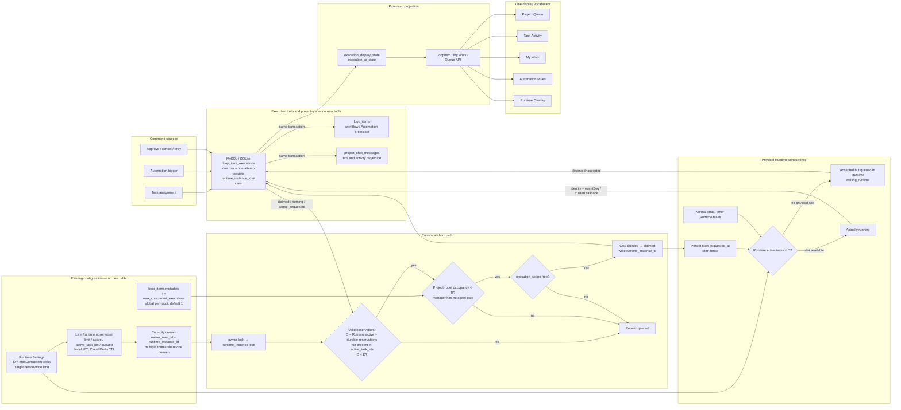
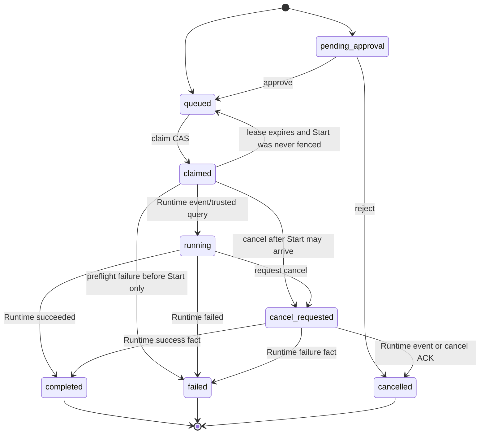
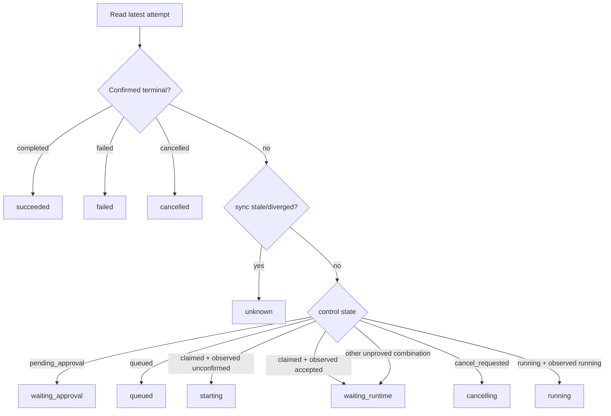
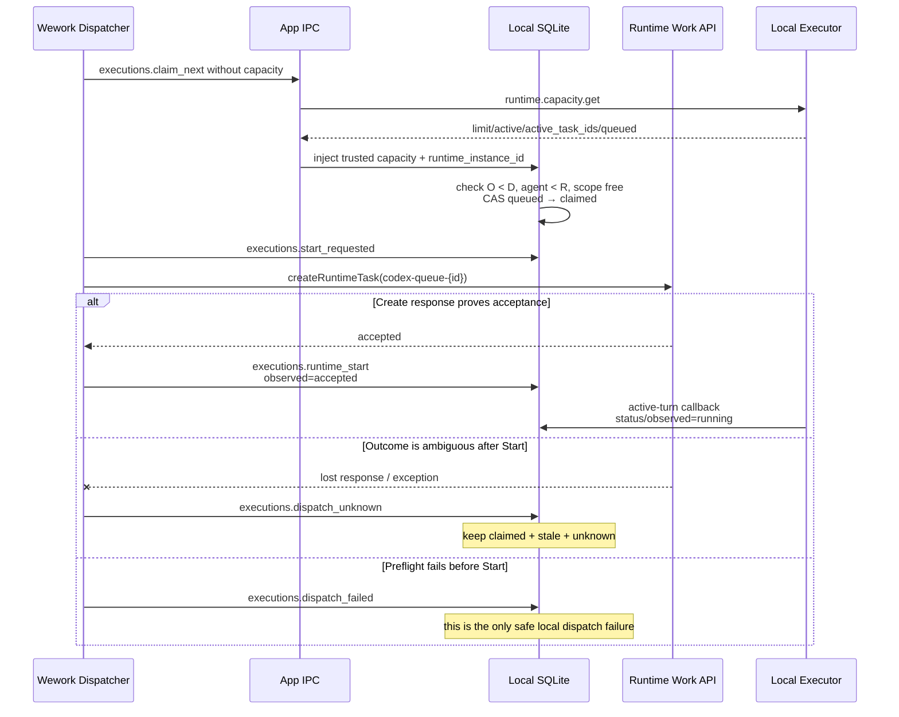
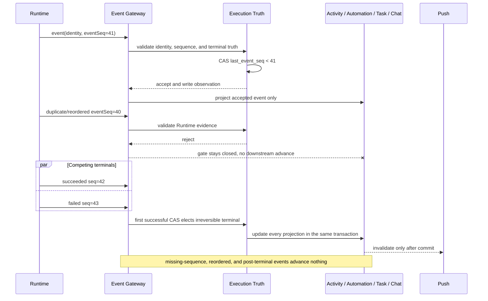
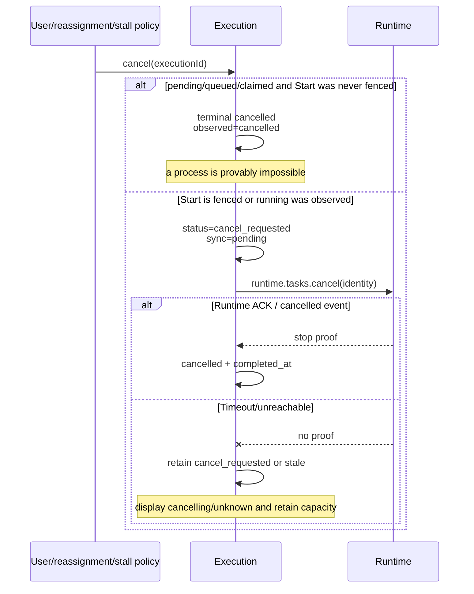
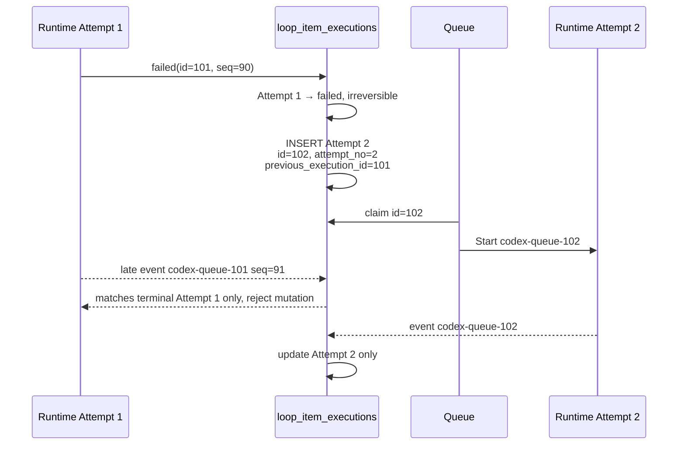
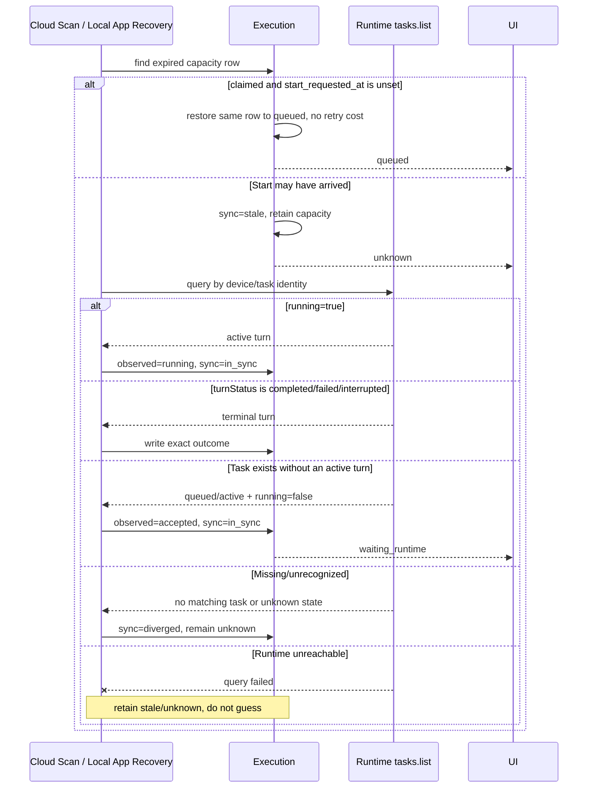
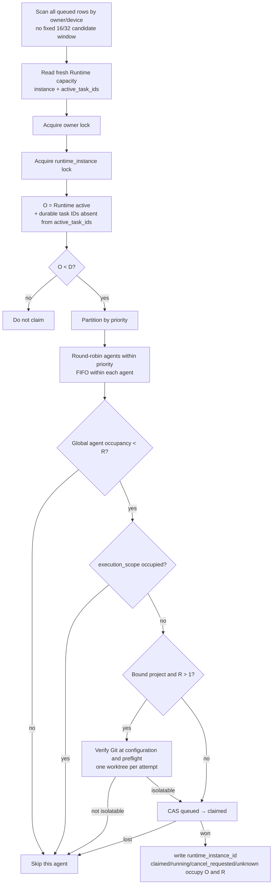
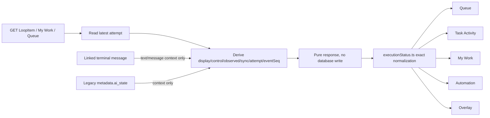

# Project Execution State-of-Truth Refactoring

> Implementation status: the state-of-truth path and concurrency extension are complete; full Backend, Wework, and Executor regression, MySQL migration rollback/upgrade, and real Electron desktop acceptance have passed.
>
> Hard constraint: no new database tables. This change only extends the existing MySQL/SQLite `loop_item_executions` tables and continues using existing LoopItem, chat-message, and Automation Run storage.

## 1. Goal and scope

This is not an enum cleanup. It makes every user-visible execution state provable. It covers project-robot and automation-manager queueing, startup, events, cancellation, recovery, retry, and UI projection across cloud and local Runtime.

`TaskResource`/`Subtask` execution keeps its own existing `tasks`/`subtasks` authority. It is not copied into `loop_item_executions`, and this document does not claim that the two execution models were merged.

The implementation guarantees:

- Claim proves control-plane ownership, not that Runtime is running.
- Once Start may have arrived, timeout cannot requeue the same attempt.
- Heartbeat renews a control lease; it does not prove process liveness.
- Unprovable state is `unknown`, not guessed failure, success, or retryability.
- Runtime terminal events use attempt identity, monotonic event sequence, and CAS.
- Cancellation intent is distinct from proof that Runtime stopped.
- A Runtime failure retry creates a new row in the existing table and preserves the old attempt.
- GET is read-only; message and cached state cannot overwrite execution truth.

## 2. Authority and projection connections



The direction is one-way: Execution → Message/Automation/Workflow projections. A message, `metadata.ai_state`, board lane, or UI cannot decide Execution state.

`D` has one configuration source. Occupancy is neither the sum nor the maximum of two unrelated counters. It is merged by Runtime task identity: `O = Runtime active + durable capacity rows whose runtime_task_id is absent from active_task_ids`. A robot process visible to both layers is counted once, while manual Runtime work and claimed work not yet seen by Runtime are both retained. Runtime remains the hard physical limit for chat, robots, and automations together. “Run now” can only move a queued task to the front; it cannot start task D+1.

Capacity is live Runtime state and is never persisted into Device Kind as fact. Local claim reads it through App IPC. Cloud Runtime reports `limit/active/active_task_ids/queued/runtimeInstanceId` into the existing Redis online record under its TTL. Every active count must have one unique non-empty task ID. Missing, expired, incomplete, or mismatched observations stop claim. Claim APIs reject caller-supplied `deviceCapacity` and have no fixed-constant fallback.

`execution_device_id` is a transport route, not capacity identity. All local/app/socket routes for one installation share `owner_user_id + runtime_instance_id`; claim persists that identity in the existing execution row. Robot `R` is global by `agent_id` across routes and environments. `claimed`, `running`, `cancel_requested`, and `unknown` retain both device and robot capacity. Bound project runs with `R > 1` require a verified Git repository and a separate worktree per attempt; a non-isolatable workspace cannot enable parallel robot execution.

## 3. Zero-new-table model

One existing `loop_item_executions` row is one attempt. This concurrency migration adds only `runtime_instance_id` and the non-unique `idx_exec_runtime_capacity` index to the existing MySQL table; it contains no `CREATE TABLE`. Local SQLite alters the existing table, creates `ix_exec_runtime_capacity` after the column exists, and moves to schema version 7.

| Dimension             | Columns                                     | Meaning                                                                                                    |
| --------------------- | ------------------------------------------- | ---------------------------------------------------------------------------------------------------------- |
| Control               | `status`                                    | `pending_approval`, `queued`, `claimed`, `running`, `cancel_requested`, `completed`, `failed`, `cancelled` |
| Runtime observation   | `observed_state`, `observed_at`             | Latest verified Runtime state and evidence time                                                            |
| Sync health           | `sync_state`                                | `pending`, `in_sync`, `stale`, `diverged`                                                                  |
| Attempt causality     | `attempt_no`, `previous_execution_id`       | Attempt number and previous-attempt link                                                                   |
| Concurrency domain    | `execution_scope`                           | Project robot by task; manager by Automation Run                                                           |
| Start fence           | `claimed_at`, `start_requested_at`          | Separates a releasable claim from a Start that may have arrived                                            |
| Runtime identity      | `runtime_device_id`, `runtime_task_id`      | Task ID is deterministically `codex-queue-{execution.id}` and validated at every write                     |
| Capacity identity     | `runtime_instance_id`                       | Merges all routes by `owner_user_id + runtime_instance_id`                                                 |
| Event fence           | `last_event_seq`                            | Only a greater Runtime sequence is accepted                                                                |
| Cancellation/terminal | `cancel_requested_at`, `termination_reason` | Cancellation intent time and confirmed terminal reason                                                     |
| Control lease         | `heartbeat_at`, `lease_expires_at`          | Dispatcher/claim liveness, never standalone process proof                                                  |

There is deliberately no unique `runtime_task_id` index: a row is inserted before its ID exists, and historical empty defaults would conflict. Deterministic identity validation plus `execution_scope`, agent occupancy, owner/device locks, and CAS enforce the invariant.

## 4. Independent dimensions and display state



Display state is derived at request time with fixed precedence:



Updating `heartbeat_at` therefore cannot turn `starting/unknown` into `running`, and stale sync health cannot hide a confirmed terminal outcome.

## 5. Cloud startup sequence

```mermaid
sequenceDiagram
  participant C as Queue Consumer
  participant H as Redis Runtime Capacity TTL
  participant DB as loop_item_executions
  participant W as Celery Dispatch
  participant G as Runtime RPC Gateway
  participant R as Cloud Executor
  C->>H: read instance + limit/active/active_task_ids
  H-->>C: fresh identity-matching observation
  C->>C: owner lock → runtime_instance lock
  C->>DB: merge exact O; check O < D, agent < R, scope free
  C->>DB: CAS queued → claimed<br/>bind runtime_instance_id + codex-queue-{id}
  W->>DB: build just-in-time Runtime payload
  W->>DB: persist start_requested_at fence
  W->>G: runtime.tasks.create
  G->>R: emit create command
  alt Explicitly not emitted
    G-->>W: emitted=false
    W->>DB: safely restore queued without retry cost
  else Ambiguous outcome or first-event timeout
    G--xW: response lost / no proof
    W->>DB: retain claimed, sync=stale
    Note over DB: display unknown, hold capacity, do not redeliver
  else Runtime emits its first event
    R-->>DB: identity + eventSeq
    DB->>DB: observed=running, status=running
  end
```

An RPC transport failure is distinct from an explicit `emitted=false`. After the Start fence, ambiguity can only become unknown.

## 6. Local/App startup sequence



App IPC no longer exposes dispatcher-callable `executions.complete` or `executions.fail`. Local Executor turn outcomes write terminal state.

## 7. Event ordering and atomic terminal state



Manual rejection uses the same transaction boundary: Execution, Activity, Automation projection, and task-version CAS commit together. Internal helpers cannot commit early.

## 8. Cancellation sequence



The local Queue stop action first calls local `executions.cancel`, then calls `cancelRuntimeTask` with the identity stored on that row. It no longer calls the cloud stop API.

## 9. Retry and late-event isolation



Only a proven Runtime failure may consume retry budget and create a retry attempt. A definitively pre-Start infrastructure failure may restore the same row to queued because no process can exist.

## 10. Lease expiry, unknown, and reconciliation



Both Cloud Scan and Local App reconcile by the persisted device/task identity. Local App uses `executions.list_stale` and `executions.reconcile` to recover events lost while it was offline. `task.status=active` alone is not running proof; reconciliation must combine `running` and `turnStatus`.

A long-running attempt with no text only triggers `cancel_requested` plus Runtime cancellation; it is not manufactured into `failed`.

## 11. Concurrency, capacity, and fairness



The fixed order is fresh observation → owner lock → Runtime-instance lock → database CAS. A batch CAS must update every selected row or roll back the whole batch; Runtime identity is never written onto a row that was not claimed. Unknown retains capacity. Higher priority runs first, while agents round-robin within a priority and remain FIFO internally, so a 20-item queue for one robot cannot starve another robot.

## 12. Pure reads and UI consistency



Precedence is latest Execution → linked terminal-message context → legacy cache. Expired cache becomes `unknown` in the response only. `failed`, `cancelled`, `skipped`, and `succeeded` remain distinct in the UI.

## 13. Implemented and removed entry points

Cloud/App startup protocol:

- `start-requested` persists the Start fence.
- `runtime-start` records Runtime acceptance without claiming running.
- `dispatch-unknown` holds capacity when Start outcome is ambiguous.
- `dispatch-failed` is valid only for a proven pre-Start failure.
- Runtime events and trusted status queries are the only running and execution-terminal authorities.

Direct App dispatcher `complete`/`fail` entry points were removed. Heartbeat requires the exact execution/device/task identity and only extends the lease.

## 14. Acceptance matrix

| Scenario                                                       | Required result                                       | Forbidden result                             |
| -------------------------------------------------------------- | ----------------------------------------------------- | -------------------------------------------- |
| Claimed, Start not sent                                        | `starting`                                            | `running`                                    |
| Runtime accepted, no active turn yet                           | `waiting_runtime`                                     | `starting` or `running`                      |
| Start response lost                                            | `unknown`, capacity held                              | Same-row redelivery or duplicate run         |
| First Runtime event                                            | `running` with `observed_at/eventSeq`                 | Heartbeat-as-proof                           |
| Missing-sequence, duplicate, reordered, or post-terminal event | Execution and every downstream projection ignore it   | Message/activity bypasses the truth gate     |
| Cancel before Start                                            | Immediate `cancelled`                                 | Pointless Runtime cancel                     |
| Cancel after Start                                             | `cancelling` until ACK/event                          | Immediate fake cancelled                     |
| Lease expires before Start                                     | Same row queued, retry unchanged                      | Duplicate attempt                            |
| Lease expires after possible Start                             | Unknown, reconcile, hold capacity                     | Automatic failure/redelivery                 |
| Runtime failure and retry                                      | Old row failed, new row queued                        | Old row changed back to queued               |
| GET/page refresh                                               | State unchanged                                       | Read-time mutation                           |
| My Work/Queue/Detail/Automation                                | Same exact display state                              | Pending/claimed shown as running             |
| Missing/expired/mismatched capacity heartbeat                  | Stop claiming and retain existing state               | Fixed or caller-supplied capacity fallback   |
| Runtime active and durable claim share a task ID               | Count once                                            | False-full double count                      |
| Manual Runtime task and not-yet-delivered durable claim differ | Count both in O                                       | `max()` undercount and over-claim            |
| One robot reaches R                                            | Other robots remain claimable fairly                  | Hot-robot starvation or route-based R bypass |
| Bound non-Git project requests R > 1                           | Reject at configuration and verify again at preflight | Concurrent execution in one shared directory |
| “Run now” while Runtime is full                                | Move to queue front and wait                          | Start task D+1                               |
| Migration                                                      | ALTER existing table and create index only            | Any new table                                |

## 15. Automated and manual verification

Automation must cover: no-`create_table` migration, capacity identity and heartbeat TTL, exact `active_task_ids` deduplication, D shared across device routes, global robot R, same-priority round-robin, no fixed candidate window, all-or-nothing batch CAS, non-Git concurrency rejection, Runtime hard limit and force-start, claim/identity/Start fence, event sequence, competing terminals, pre/post-Start cancellation, ambiguous dispatch, cloud/local recovery and reconciliation (including `running` plus `turnStatus`), new-attempt retry, same-transaction projections, pure GET, local IPC/store, UI mapping, and TypeScript/Rust compilation.

Manual acceptance sequence:

1. Run one cloud and one local task through `queued → starting → (optional waiting_runtime) → running → succeeded`.
2. Disconnect after Start and verify unknown appears without a second launch.
3. Cancel once while queued and once while running; verify immediate terminal versus cancelling-first behavior.
4. Produce a Runtime failure and verify retry preserves the old attempt and uses a new task ID.
5. Open Queue, Task Activity, My Work, Automation, and Overlay together and compare states.
6. Refresh and repeat GET requests; verify reads do not change state.
7. Set D to 2, mix normal chat and robot work, and verify physical active count never exceeds 2 while accepted work shows waiting_runtime.
8. Set one robot to R=2 and pull through two routes; verify it remains globally capped at 2 and another same-priority robot is not starved.
9. Verify R > 1 creates distinct worktrees for a Git project and is rejected at save time for a plain directory.
