# Wework Transcript and Preference Cloud Sync

The Wework Core DSH plugin `@wegent/dsh-transcript-sync` synchronizes native
Codex rollouts, task workspaces, summaries using the previous schema, and
portable preferences. Cross-device restore no longer reduces a session to
user/assistant text or reconstructs history through `thread/inject_items`.

## Storage boundary

The Backend uses three tables:

| Table                        | Purpose                                                                  |
| ---------------------------- | ------------------------------------------------------------------------ |
| `wework_transcripts`         | Transcript identity, branch relation, sequence, state, and writer lease  |
| `wework_transcript_archives` | Immutable native segment sequence, object key, SHA-256, size, and format |
| `wework_transcript_turns`    | One structured finalized-turn summary using the previous data contract   |

The Executor encrypts bodies with AES-256-GCM before uploading them through the
authenticated Backend API. The Backend writes ciphertext to the private
`wework-transcripts` object bucket; desktop clients never receive object-store
endpoints, credentials, or presigned URLs. The `wework_transcript_turns.payload`
JSON retains the previous protocol's user messages, final assistant text,
reasoning summary, completion state, and task ID, but not the complete tool
protocol, usage, rollout JSONL, or workspace files. Each turn has its own row
instead of appending an entire transcript into one field; segmented tgz objects
carry full-fidelity capacity and exact restore.

The archive index, turn summary, and transcript head for one sequence commit in
one MySQL transaction. A retry is idempotent only when both object metadata and
summary match exactly. A missing or conflicting side is rejected instead of
leaving a state that claims synchronization while either the tgz or summary is
absent.

The Backend derives one stable key per user from
`WEWORK_TRANSCRIPT_ENCRYPTION_SECRET` and the user ID and returns it only
through the authenticated `GET /{id}/encryption-key` endpoint. All transcripts
owned by one user share that key, while different users receive different keys.
The key is never persisted in sync state, the outbox, or object contents. Each
segment nonce is derived from the key, AAD, and plaintext digest.
AAD binds the transcript ID, sequence, and format. Identical retries therefore
produce identical ciphertext for SHA-256 reconciliation without reusing a
nonce for different plaintext.

Each cloud sequence maps to exactly one object:

- Sequence 1, every tenth sequence, sequence 1 of a conflict branch, and the
  first continuation after a cross-device restore are full encrypted
  `codex-snapshot.v1.tgz.aes256gcm` snapshots. Restore rewrites the local thread
  ID and workspace path, so a new snapshot establishes a portable byte
  baseline.
- Other sequences are encrypted `codex-delta.v1.tgz.aes256gcm`
  increments.
- Every segment also carries a workspace overlay so recent files are not lost.
- Workspace packaging excludes `.git`, `node_modules`, build outputs, and
  common cache directories so repository objects and unrelated derived files
  are not uploaded repeatedly.
- The outbox stores only task, session, turn, sequence, and branch locators.
- Native object snapshot pruning does not remove the corresponding structured summaries.
- After a new full snapshot is committed, the Backend retains the previous full
  snapshot and every later segment, then deletes older object bodies and
  metadata. With a snapshot interval of 10, an active transcript normally keeps
  11 objects and peaks at about 20 instead of growing without bound.

Two computers may keep Wework open at the same time. Clients poll cloud progress
every five seconds and acquire a short writer lease only while uploading, then
release it immediately. An idle office computer does not hold the lease, and a
running local task is never overwritten by restore. If both computers complete
the same sequence concurrently, the first commit remains on the main line and
the second becomes a deterministic branch, preserving both results.

The existing `wework_transcript_turns` table remains in place with the previous
summary fields. Restore ignores this table, and it cannot replace the native
tgz.

## State transitions

```mermaid
stateDiagram-v2
    [*] --> LocalReady
    LocalReady --> LeaseHeld: acquire lease while online
    LocalReady --> OfflinePending: Backend unavailable
    OfflinePending --> LeaseHeld: connection restored
    LeaseHeld --> SegmentBuilt: build and encrypt snapshot or rollout delta
    SegmentBuilt --> ObjectUploaded: stream ciphertext through Backend
    ObjectUploaded --> MetadataCommitted: atomically commit object index, summary, and head
    MetadataCommitted --> LocalReady: record rollout offset, clear outbox, release lease

    LeaseHeld --> Reconcile: cloud head differs from baseSequence
    Reconcile --> LocalReady: same-sequence object and summary both match
    Reconcile --> BranchSnapshot: object or summary missing/mismatched
    BranchSnapshot --> LeaseHeld: create deterministic fork transcript

    [*] --> RestoreRequired: transcript missing or behind locally
    RestoreRequired --> Downloading: stream latest snapshot and contiguous deltas through Backend
    Downloading --> Staging: download and verify SHA-256
    Staging --> Bound: restore workspace, rollout, thread metadata, and dynamic tools
    Staging --> RestoreRequired: validation failed; remove staging
    Bound --> LocalReady
```

Conflicting rollout files are never merged. The cloud mainline remains
unchanged. The conflicting local chain moves to a branch derived from
`clientId + transcriptId + turnId` and uploads a full snapshot as branch
sequence 1.

## Two-device verification

The GitHub CI `transcript-sync` desktop checkpoint starts real Electron,
Executor, and Codex processes and sequentially simulates device A and device B
inside one test. The devices use separate `HOME`, `WEGENT_EXECUTOR_HOME`,
`WEGENT_CODEX_HOME`, `CODEX_SQLITE_HOME`, Electron user data, application
configuration directories, and device identities. Switching to device B does
not delete or reuse device A's state.

The checkpoint must verify that device A uploads an encrypted snapshot and
delta, device B restores the workspace and complete history from an empty
state, and device B continues the conversation and uploads the next sequence.
Every sequence must also create its structured summary. A restart test that
shares local state is not an equivalent verification.
Testing on two physical computers remains a release acceptance check for real
network, sleep, and operating-system differences, but is not a prerequisite for
GitHub CI.

## Restore order

1. Select the latest full snapshot at or before the current head.
2. Download that snapshot and every contiguous later delta, verifying
   ciphertext SHA-256, format, and sequence.
3. Authenticate and decrypt each object with the current user's key, verify its
   identity, restore the workspace in staging, and concatenate and parse rollout
   JSONL.
4. Rewrite the workspace path and allocate a new thread ID on collision.
5. Restore Codex `threads` and `thread_dynamic_tools` state transactionally.
6. Bind the local task only after all checks pass; otherwise remove staging,
   rollout, and workspace output.

## API

The authenticated prefix is `/api/wework-transcripts`:

| Method and path                           | Purpose                                            |
| ----------------------------------------- | -------------------------------------------------- |
| `GET /`                                   | List transcripts and native segment metadata       |
| `GET /{id}`                               | Read one transcript                                |
| `GET /{id}/turns`                         | Page through structured finalized-turn summaries   |
| `GET /{id}/encryption-key`                | Obtain the current user's transcript cipher key    |
| `POST /{id}/lease`                        | Create a transcript or acquire its writer lease    |
| `PUT /{id}/lease/{token}`                 | Renew a lease                                      |
| `POST /{id}/lease/release`                | Release a lease                                    |
| `POST /{id}/segments`                     | Receive ciphertext and commit index, summary, head |
| `POST /{id}/archive`                      | Mark a transcript archived                         |
| `GET /{id}/archives/{archiveId}/download` | Stream ciphertext through the Backend              |

Object keys contain a SHA-256 digest of the transcript ID rather than the raw
identifier.

## Deployment configuration

Object storage reuses the `ATTACHMENT_S3_*` connection settings:

| Environment variable                  | Default              | Purpose                                    |
| ------------------------------------- | -------------------- | ------------------------------------------ |
| `WEWORK_TRANSCRIPT_S3_BUCKET`         | `wework-transcripts` | Private native transcript segment bucket   |
| `WEWORK_TRANSCRIPT_ENCRYPTION_SECRET` | empty                | Stable high-entropy root for per-user keys |

This design reuses the existing three transcript tables. It adds no Alembic
migration and requires no schema change for existing deployments. If object
storage is unavailable, segment metadata is not committed and the outbox keeps
its locator while local execution remains available offline.

When the dedicated root is empty, `SECRET_KEY` is used for compatibility.
Production deployments should configure a dedicated value and keep it unchanged
while related tgz objects are retained.
