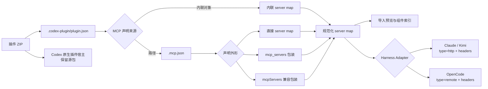
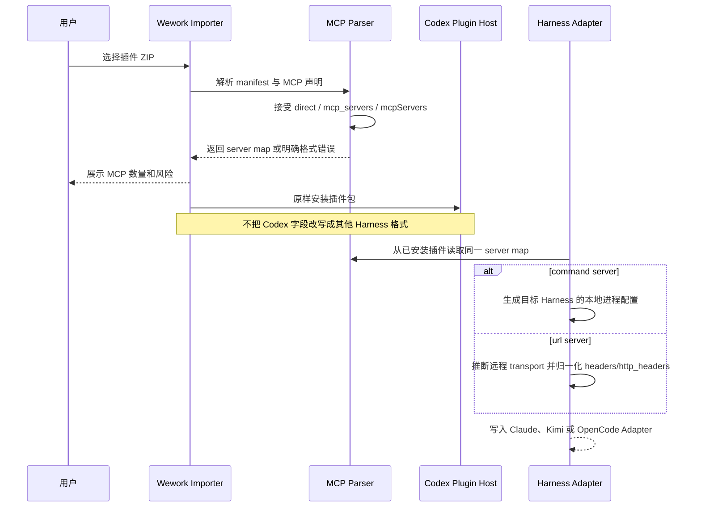

# Agent 插件 MCP 配置兼容

范围：Agent 插件包中的 MCP 声明校验、组件索引，以及 Wework 为 Claude Code、Kimi Code 和 OpenCode 生成的 Harness Adapter。MCP Server 的网络实现与业务工具契约不在本主题内。

| 边                         | 代码归属                                                |
| -------------------------- | ------------------------------------------------------- |
| ZIP → 导入预览             | Wework Tauri `local_executor`                           |
| MCP 声明 → server map      | Wework `agent_plugins`；Backend `plugin_package_parser` |
| server map → 组件索引      | Wework 导入预览；Backend 插件包解析器                   |
| server map → Claude / Kimi | Wework `agent_plugins` Claude Adapter                   |
| server map → OpenCode      | Wework `agent_plugins` OpenCode Adapter                 |
| 源插件 → Codex             | Codex 个人 marketplace 安装路径                         |
| 手动 MCP JSON → 表单       | Wework `mcp-json-import`                                |

不变量：

- `.mcp.json` 必须接受 Codex 标准的直接 server map 和 `mcp_servers` 包装；`mcpServers` 仅作为既有 Claude/Wework 插件的兼容外形保留。预览、组件计数、Backend 索引和 Harness Adapter 必须使用相同解析语义。
- manifest 的 MCP 路径必须是插件根目录内的安全相对路径。导入器不得通过放宽路径校验来实现格式兼容。
- Codex 插件包必须原样安装，不能为了其他 Harness 改写 `.mcp.json`。跨 Harness 差异只存在于派生 Adapter 中。
- 包含 `command` 的 server 归一化为本地 stdio；包含 `url` 的 server 归一化为远程 transport。仅提供 `url` 的 Codex 配置不能因缺少显式 `type` 被丢弃。
- 远程静态请求头同时接受 Codex 的 `http_headers` 和 Claude/OpenCode 的 `headers`。两者并存时先读取 `http_headers`，再由 `headers` 覆盖同名键，确保既有 Wework 行为稳定。
- Claude 与 Kimi 的 Streamable HTTP 输出使用 `type: http` 和 `headers`；OpenCode 输出使用 `type: remote` 和 `headers`。Adapter 不得把目标 Harness 不识别的 `http_headers` 留在派生配置中。
- 格式错误必须在安装前显示为明确校验问题；不得把无效声明静默计为零个 MCP。
