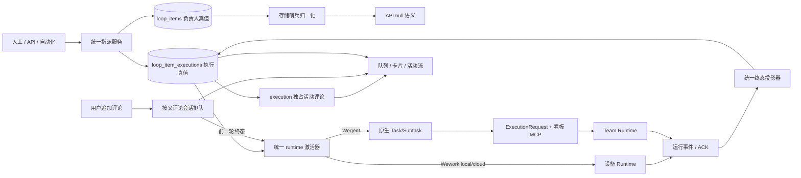
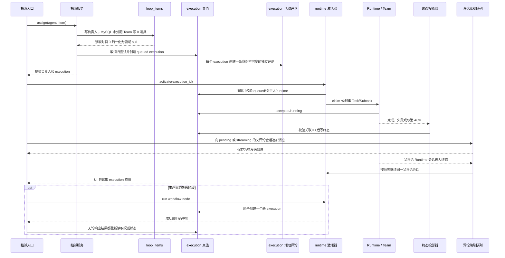

# 看板自动化与 Wegent 执行

范围：人工、API 和自动化指派进入同一执行真值与 runtime 激活路径，并把可信终态投影回看板。

| 边                                | 代码归属                                                              |
| --------------------------------- | --------------------------------------------------------------------- |
| 入口 → 指派                       | `backend/app/services/loop_items/`、`project_automation_execution.py` |
| 负责人存储 → API 语义             | `backend/app/models/delivery.py`、`backend/app/schemas/delivery.py`   |
| 指派 → execution 真值             | `backend/app/services/loop_item_executions/service.py`                |
| execution → 独立评论              | `loop_item_executions/service.py`、`project_automation_execution.py`  |
| execution → runtime 激活          | `board_team_execution.py`、`robot_queue_tasks.py`、Wework puller      |
| Wegent 请求 → 看板 MCP            | `execution/request_builder.py`、`mcp_server/tools/wework_space.py`    |
| Runtime 事件 → 终态               | `board_team_completion.py`、Executor 状态更新                         |
| 评论 → 精确续聊                   | `board_team_continuation.py`、`project_automation_tasks.py`           |
| pending/streaming 评论 → 顺序续聊 | `wework/src/features/todo/TaskActivityView.tsx`、会话消息队列缓存     |

不变量：所有入口共用指派与激活器；机器人负责人变更必须在同一业务事务中创建对应的 queued execution，自动执行由该 execution 的既有队列消费链负责；激活只能发生在提交后；`loop_item_executions` 是看板执行唯一真值；阶段重跑一次只允许创建一个新 execution，请求进行中必须禁止重复点击，响应成功或冲突后都必须重新读取权威 Issue 状态；若冲突后的权威阶段已经 queued/running，则视为前次命令已收敛，否则必须向用户显示错误；任务包含多个评论，每条评论的作者身份创建后不可修改；人创建父评论且负责人是机器人时，机器人以新评论回复该父评论；机器人创建父评论后，人回复该评论时，负责人机器人以另一条新评论继续回复；同一父评论会话处于 `pending` 或 `streaming` 状态时，追加消息必须保留在该会话的待发送队列中，按创建顺序逐条发送，不能因 Runtime 忙碌而丢弃或创建并行续聊；评论之间只通过 `reply_to_message_id` 和 `thread_root_message_id` 建立线程关系，不得通过改写旧评论作者表达交接；AI 调度员评论与其选中的项目机器人评论必须始终分离；Wegent 绑定使用精确 execution/task/subtask/team ID；MySQL `loop_items.assignee_team_id=0` 只表示未分配，服务和 API 必须将其归一化为 `null`，不得把 `0` 当作 Team ID；`loop_item_executions` 的可选 Team/Task ID 使用独立但一致的 `0 ↔ null` 边界；取消先写意图，只有 Runtime ACK 或取消后的权威缺席证明才能写终态；消息和 UI 不能反向覆盖执行状态。

详细领域、API 与交付说明见 [云项目协作开发指南](../wegent/developer-guide/cloud-project-collaboration.md)。
