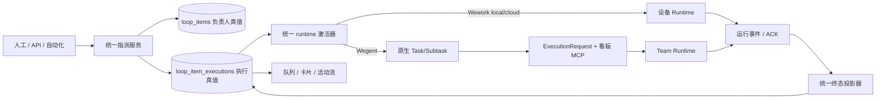
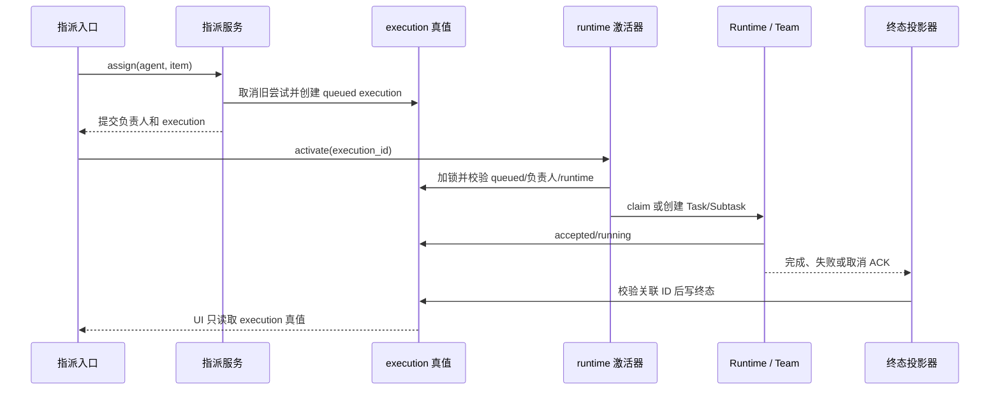

# 看板自动化与 Wegent 执行

范围：人工、API 和自动化指派进入同一执行真值与 runtime 激活路径，并把可信终态投影回看板。

| 边                       | 代码归属                                                              |
| ------------------------ | --------------------------------------------------------------------- |
| 入口 → 指派              | `backend/app/services/loop_items/`、`project_automation_execution.py` |
| 指派 → execution 真值    | `backend/app/services/loop_item_executions/service.py`                |
| execution → runtime 激活 | `board_team_execution.py`、`robot_queue_tasks.py`、Wework puller      |
| Wegent 请求 → 看板 MCP   | `execution/request_builder.py`、`mcp_server/tools/wework_space.py`    |
| Runtime 事件 → 终态      | `board_team_completion.py`、Executor 状态更新                         |
| 评论 → 精确续聊          | `board_team_continuation.py`、`project_automation_tasks.py`           |

不变量：所有入口共用指派与激活器；激活只能发生在提交后；`loop_item_executions` 是看板执行唯一真值；Wegent 绑定使用精确 execution/task/subtask/team ID；取消先写意图，只有 Runtime ACK 写终态；消息和 UI 不能反向覆盖执行状态。

详细领域、API 与交付说明见 [云项目协作开发指南](../wegent/developer-guide/cloud-project-collaboration.md)。
