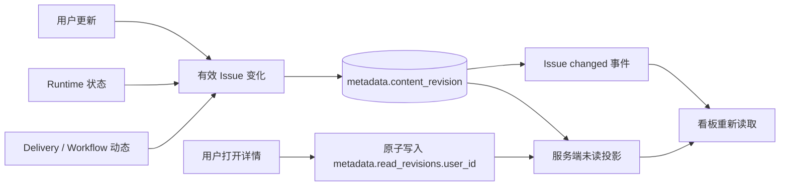
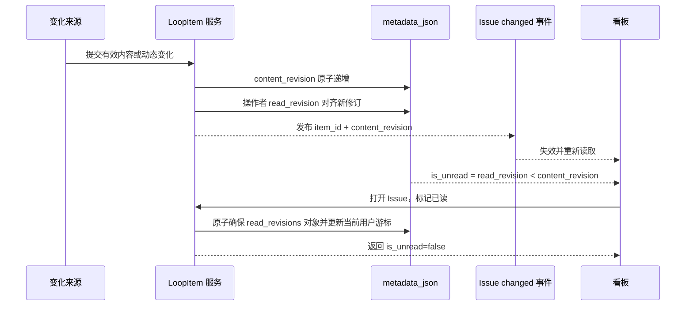

# 看板 Issue 未读投影

范围：Issue 有效内容变化、状态变化、Runtime 与 Delivery 动态进入统一内容修订号，按用户阅读游标投影看板未读状态。

| 边                             | 代码归属                                                         |
| ------------------------------ | ---------------------------------------------------------------- |
| 有效变化 → content revision    | Backend `loop_item_unread` 与各 LoopItem 更新服务                 |
| 用户阅读 → read revision       | Backend deliveries API 与 `loop_item_unread`                     |
| revision → 当前用户未读投影    | Backend `LoopItemService.response_values`、delivery schema        |
| Issue changed → 看板刷新       | Backend `loop_item_events`、Wework `projectChatSocket`            |
| 未读投影 → 卡片标识 / 打开已读 | Wework `CloudTodoWorkspace`、`CloudTodoBoardCard`、deliveries API |

必要不变量：

- 未读是服务端按当前用户投影的关系状态，不是客户端本地状态。
- `content_revision` 只在用户可感知的 Issue 内容、状态、Workflow、Runtime 或 Delivery 变化时递增；排序、列表读取和标记已读不得递增。
- `read_revisions` 复用 LoopItem 的 `metadata_json`，键为用户 ID，值为最后阅读的 `content_revision`；不得新增数据库表。
- 判断公式固定为：没有阅读游标，或 `read_revision < content_revision` 时未读。
- 有效更新的操作者在同一事务中对齐自己的阅读游标，自己的修改不得立即反向标记为未读。
- 标记已读必须在同一个数据库表达式中确保缺失或非法的 `read_revisions` 为对象，并更新单个用户的 JSON 路径；不得读取并覆盖整个 `metadata_json`，不得丢失其他用户游标，也不得增加 LoopItem 乐观锁 `version` 或改变业务 `updated_at`。
- Issue changed 事件只负责失效，不作为未读真值；断线重连或跨设备后必须由列表/详情 API 恢复正确状态。
