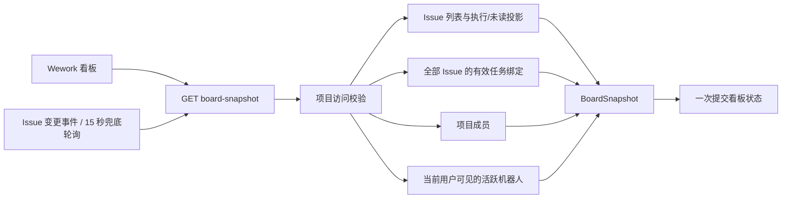
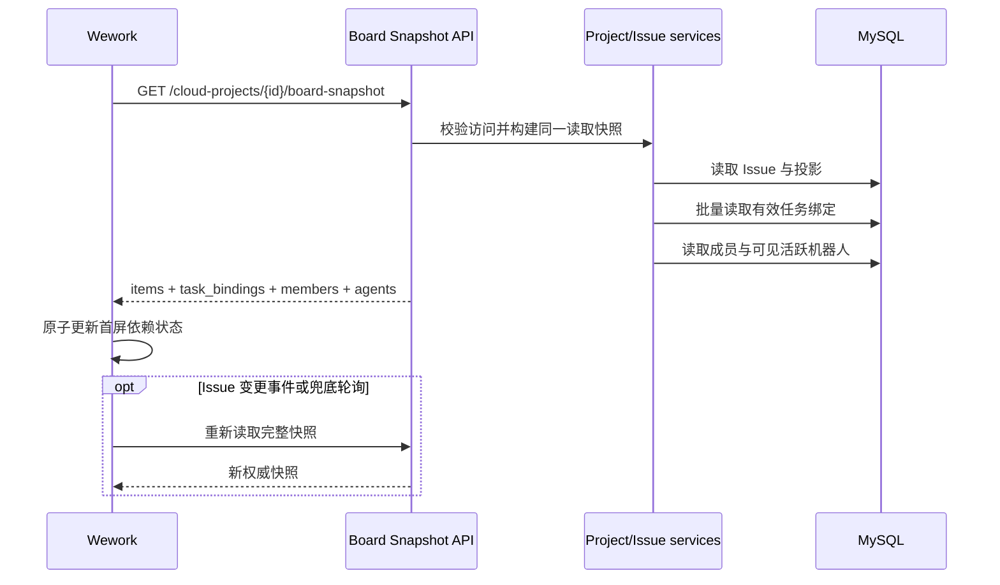

# 看板首屏读取快照

范围：Wework 打开云项目空间看板时，通过一个权威快照请求读取首屏渲染和交互所需的 Issue、任务绑定、成员与可见机器人。

| 边 | 代码归属 |
| --- | --- |
| 看板 → 快照 API | `wework/src/features/todo/CloudTodoWorkspace.tsx`、`wework/src/api/deliveries.ts` |
| 快照 API → 聚合读取 | `backend/app/api/endpoints/cloud_projects.py`、`backend/app/services/project_board_snapshot.py` |
| Issue → 任务绑定批量读取 | `backend/app/services/loop_items/service.py` |
| 快照 → 前端状态 | `wework/src/features/todo/CloudTodoWorkspace.tsx` |

不变量：打开一个云看板的首屏业务数据只能发起一个 HTTP 请求；快照必须同时包含当前用户可见的 Issue、这些 Issue 的全部有效任务绑定、项目成员和当前用户可见的活跃机器人；任务绑定必须按项目内 Issue 批量读取，不得按卡片发起 N+1 请求；前端只能在完整快照成功后提交对应项目的首屏依赖状态，旧项目或已取消请求不得覆盖当前项目；Issue 变更事件和 15 秒兜底轮询重新读取同一快照契约，不得恢复拆分请求；详情抽屉的附件、评论、交付物等非首屏数据继续按需读取。
