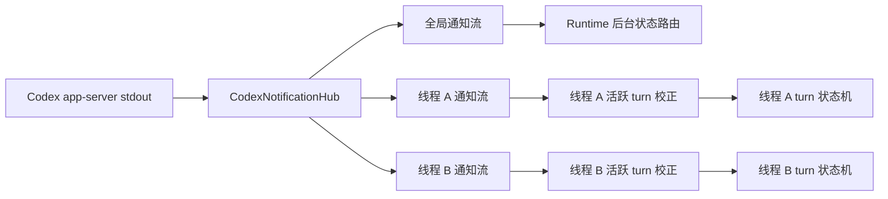
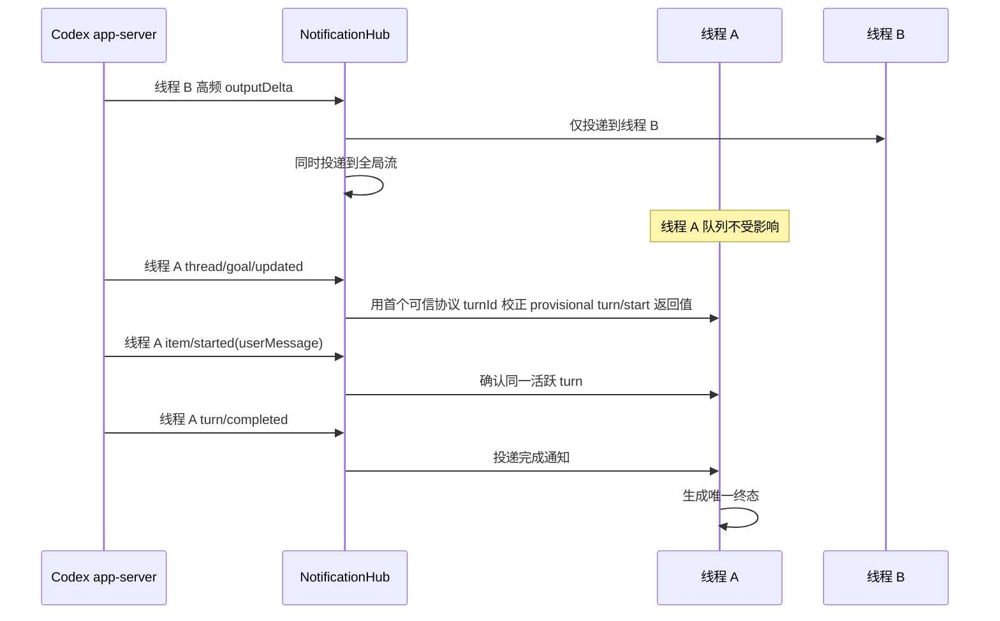

# Codex 通知流隔离

## 范围

约束本地 Executor 复用一个 Codex app-server 时，JSON-RPC 通知如何投影到全局后台路由和单个活跃线程。

## 连线图

## 时序图

## 代码归属

| 职责 | 代码 |
| --- | --- |
| app-server 进程与通知 Hub | `executor/src/agents/codex.rs` |
| 活跃 turn 状态机 | `executor/src/agents/codex/run_state.rs` |
| Runtime 后台通知投影 | `executor/src/runtime_work/handler/notifications.rs` |
| 共享 app-server 契约测试 | `executor/tests/codex_app_server_contract.rs` |

## 必要不变量

- 一个线程的通知突发不得占用或覆盖另一个线程的有界队列。
- 带 `threadId` 的通知只能进入匹配线程的 turn 流；全局流仍接收全部通知。
- 无 `threadId` 的进程退出通知必须到达所有活跃线程。
- 线程订阅必须在可能启动该线程 turn 的请求之前建立。
- `turn/start` 返回的 turn ID 在首个可信协议事件确认前只是 provisional；`turn/started`、根用户消息的 `item/started`，以及 provisional turn 期间先到达的 `thread/goal/updated` 或 `thread/goal/cleared` 必须用其协议 `turnId` 校正活跃 turn。
- Goal 状态通知即使先于根用户消息到达，也必须进入同一 turn 状态机；同一 turn 后续通知不得被误判为 stale。
- 助手消息等非根用户消息不得替换当前活跃 turn。
- 全局后台路由掉队不得把无关活跃 turn 标记为失败。
