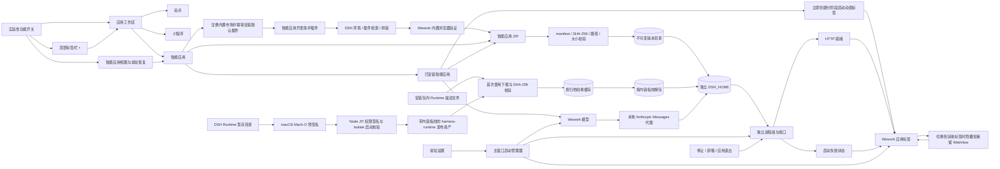
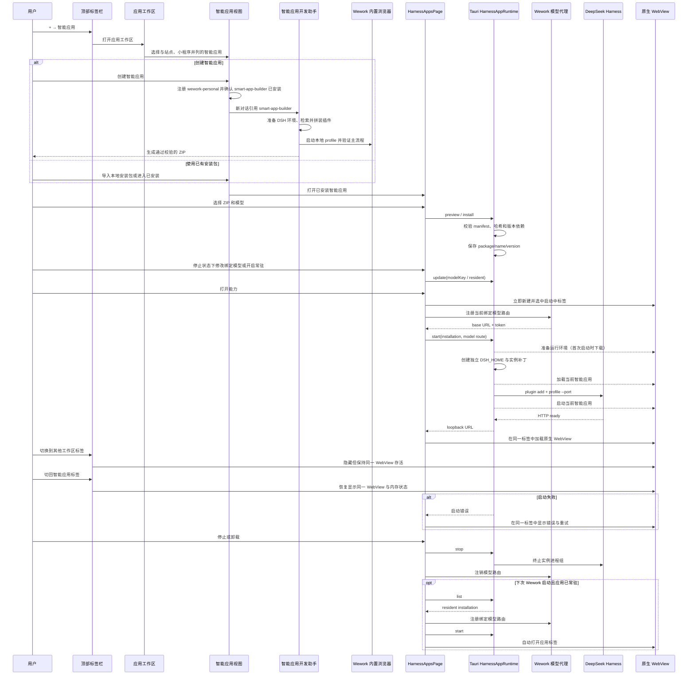

# 智能应用（DeepSeek Harness Runtime）

范围：Wework 将 DeepSeek Harness 安装包作为“智能应用”导入，在不修改 Harness 源码的前提下，将其绑定到一个 Wework 模型并作为独立工作区标签运行。

| 边                                                                 | 代码归属                                                                                                                                                   |
| ------------------------------------------------------------------ | ---------------------------------------------------------------------------------------------------------------------------------------------------------- |
| ZIP、manifest、版本和落盘校验                                      | `wework/src-tauri/src/harness_apps.rs`                                                                                                                     |
| Runtime 发布资产、描述文件、内容指纹、macOS 预签名和 Node JIT 校验 | `wework/scripts/prepare-harness-runtime.mjs`、`wework/scripts/lib/deepseek-harness-signing.mjs`、`wework/scripts/deepseek-harness-node.entitlements.plist` |
| Runtime 首次下载、SHA-256 校验、缓存、解包、实例目录和进程组       | `wework/src-tauri/src/harness_apps.rs`                                                                                                                     |
| Wework 模型到 Anthropic Messages 代理                              | `wework/src/features/local-harness/localHarnessModels.ts`                                                                                                  |
| 顶部标签栏入口                                                     | `wework/src/features/workspace-tabs/WorkspaceTabStrip.tsx`                                                                                                 |
| 应用工作区与站点 / 小程序 / 智能应用导航                           | `wework/src/pages/SitesPage.tsx`、`wework/src/components/sites/SitesWorkspace.tsx`                                                                         |
| 智能应用市场与市场 / 已安装导航                                    | `wework/src/pages/SmartAppsMarketplacePage.tsx`、`wework/src/components/smart-apps/SmartAppsSectionNav.tsx`                                                |
| 内置市场注册与默认插件安装                                         | `wework/src/tauri/localExecutor.ts`、`wework/src-tauri/src/local_executor.rs`、`executor/src/runtime_work/handler/runtime_rpc.rs`                          |
| 智能应用创建工作流插件                                             | `wework/src-tauri/bundled-plugins/wework-personal/plugins/smart-app-builder/`                                                                              |
| 安装、管理和生命周期 UI                                            | `wework/src/pages/HarnessAppsPage.tsx`                                                                                                                     |
| 常驻应用的启动恢复                                                 | `wework/src/features/harness-apps/ResidentSmartAppsManager.tsx`                                                                                            |
| 启动中 / 失败状态、工作区标签与原生 WebView                        | `wework/src/App.tsx`、`wework/src/features/harness-apps/`、`wework/src/features/workspace-tabs/workspaceTabs.ts`                                           |

应用类型导航顺序不变量：启用实验性智能应用后，“智能应用”必须排在“站点”和“小程序”之前。

不变量：所有用户可见名称统一为“智能应用”，DeepSeek Harness 只作为运行时技术说明出现；智能应用属于“应用”工作区，必须与“站点”“小程序”作为同级应用类型展示，插件市场和插件管理页不得承载智能应用管理界面；`smart-app-builder` 可以作为开发工具插件存在，但其产品入口必须位于实验性智能应用市场，创建流程必须保持 DSH 源码只读，复用外部插件包，通过 Wework 内置浏览器验证，并以原生预览、版本检查和模型确认结束安装，不得直接改写本机安装注册表；智能应用整体属于实验性功能，关闭开关时顶部“+”和应用工作区不得显示智能应用入口，直接访问 `/sites?app_type=smart_app` 或遗留应用标签必须退出该功能，常驻应用不得自动恢复；开启开关后，`/sites?app_type=smart_app` 必须承载智能应用市场和已安装管理，运行中的应用必须使用独立标签，应用工作区、管理视图和运行标签三层职责不得混合；顶部标签栏“+ → 智能应用”必须直接打开应用工作区的智能应用类型，工作区标签标题仍为“应用”；DeepSeek Harness 源码保持只读；应用安装包只能携带小型 Runtime 描述文件，不得内置 DSH Runtime 归档或递归登记其 `node_modules`；Runtime 发布资产必须统一使用 `harness-runtime-<platform>-<content-fingerprint>.tar.gz` 命名，描述文件必须固定其 HTTPS 下载地址、SHA-256 和字节数，首次使用时下载到临时文件，完整校验后原子写入按归档哈希组织的缓存，再按内容指纹解包到应用数据目录；下载失败、截断或校验不一致不得激活或污染缓存，多个应用并发启动必须复用同一个下载和解包临界区；macOS 正式构建必须在创建发布资产前使用 Developer ID、secure timestamp 和 hardened runtime 签署暂存目录中的每个 Mach-O 文件，签名模式和身份必须进入内容指纹，禁止复用未签名或由其他身份签名的资产；归档中的 Node 必须在通用 Mach-O 预签名之后最后签入 V8 所需的 JIT 与可执行内存权限，并通过实际创建 V8 Isolate 校验，不能只检查 `node --version`；安装包必须先校验再写入不可变的 `name/version` 目录；插件声明的 DSH 版本范围必须包含实际 Runtime 版本；每个智能应用实例拥有独立 `DSH_HOME`、端口和进程组；绑定模型必须持久化且只能在应用停止时修改，模型凭据只存在于运行期代理和子进程环境中；“常驻”必须表示主窗口每次启动时自动启动并打开应用标签，且每个启动周期只执行一次；普通打开必须立即创建并选中唯一的应用标签，在该标签内展示与当前应用名称关联的“准备运行环境、加载应用、启动应用”真实阶段和连续动画，HTTP 就绪后必须复用同一标签加载原生 WebView，失败时也必须在同一标签展示错误与重试，不得用标签栏动效或后端启动耗时阻塞标签创建；切换到其他工作区标签时，运行中的智能应用只能隐藏其宿主并暂停交互，不得断开 React effect、关闭或重建原生 WebView，切回后必须恢复同一页面及其内存状态；一个实例的启动、停止或失败不得影响其他实例；停止、卸载、关闭实验性功能和 Wework 退出都必须回收完整进程组。
`wework-personal` 清单中标记为 `INSTALLED_BY_DEFAULT` 的插件必须在内置市场注册后幂等安装。智能应用创建入口必须确认 `smart-app-builder` 已安装后才写入带插件引用的新会话草稿并跳转，安装失败必须留在市场页，不得打开空白会话。默认插件协调必须通过 Executor 明确允许的 Codex `config/read` 读取已有插件配置，并将已存在但被用户禁用的插件视为已配置，不得借默认同步重新启用它。
