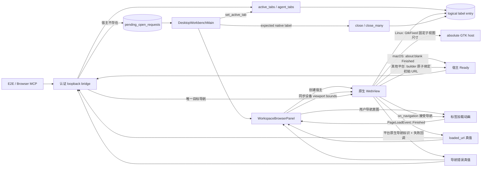
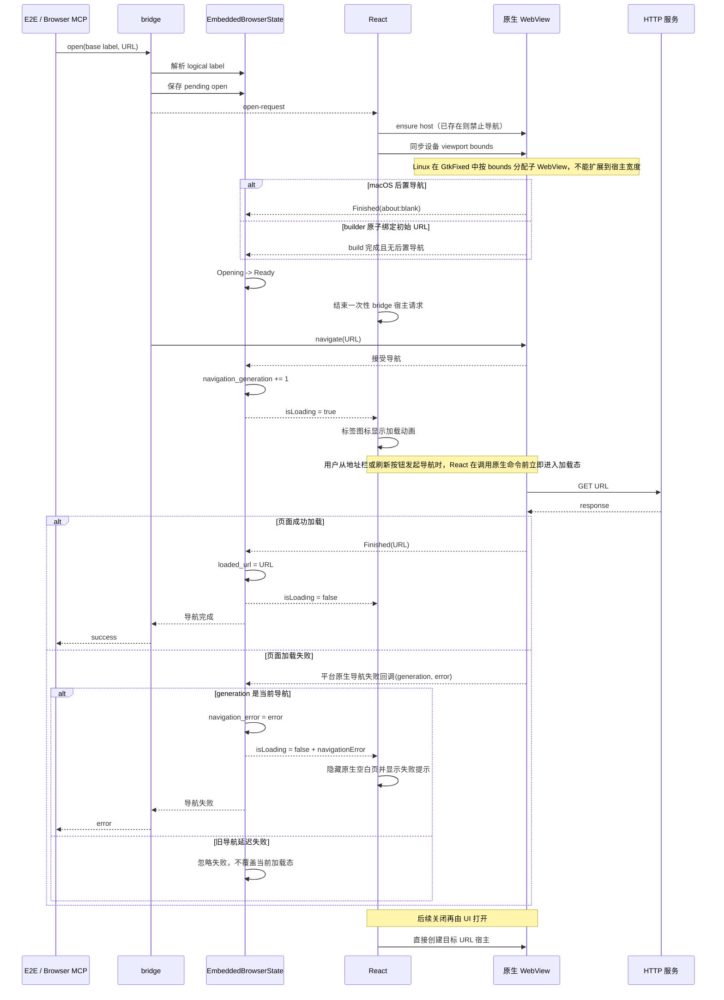

# 内置浏览器导航与多标签

范围：Agent/测试通过 bridge 首次打开页面，以及右侧多个浏览器标签的路由、加载真值和关闭。

| 边                                            | 代码归属                                                                  |
| --------------------------------------------- | ------------------------------------------------------------------------- |
| bridge 认证与分发                             | `wework/src-tauri/src/embedded_browser/bridge_server.rs`                  |
| logical-label 路由、pending request、导航真值 | `wework/src-tauri/src/embedded_browser.rs`                                |
| macOS TLS 与导航失败回调                      | `wework/src-tauri/src/embedded_browser_tls.rs`                            |
| Linux 失败回调、子视图定位与尺寸分配          | `wework/src-tauri/src/embedded_browser/linux_host.rs`                     |
| 标签创建、选择和关闭                          | `wework/src/components/layout/DesktopWorkbenchMain.tsx`                   |
| `about:blank` 宿主创建与 UI 状态              | `wework/src/components/layout/workspace-panels/WorkspaceBrowserPanel.tsx` |
| 多标签真实桌面回归                            | `wework/e2e/desktop/scenarios/embedded-browser-multi-tabs.scenario.mjs`   |

不变量：base label 只负责入口路由；每个标签拥有独立 logical label 和 WebView；bridge 请求只在首次宿主创建期间有效，React 用 ensure-host 创建宿主且复用时禁止导航；macOS 的 `build()` 只代表对象创建，后置 bootstrap `about:blank` 的 `Finished` 才能把宿主从 `Opening` 变为 `Ready`，其他平台由 builder 原子绑定初始 URL，无后置导航竞争；bridge 是首次目标 URL 的唯一后置导航者；用户从地址栏或刷新按钮发起导航时，React 必须在调用原生命令前立即进入加载态，不能等待平台可能延迟或瞬时完成的 `Started` 事件；原生 `on_navigation` 接受导航即递增 `navigation_generation` 并确认加载态，成功 `Finished` 或匹配当前 generation 的非取消导航失败都必须结束加载；平台回调必须保留原生导航标识到 generation 的映射，过期失败即使 URL 与当前导航相同也不得停止当前加载或写入错误；过期页面或失败后合成的 `Finished` 不得覆盖当前导航及失败真值；加载时替换现有标签图标而不增加信息位；设备工具栏的 viewport bounds 必须到达原生子 WebView，Linux 的 `GtkFixed` 子视图不得扩展到宿主宽度；目标 URL 只有当前导航的 `Finished → loaded_url` 才能完成 `open`，失败则返回导航错误；React 必须隐藏失败后的原生空白页并在同一内容位显示错误提示，恢复操作复用现有刷新入口；关闭只能销毁 expected native label。

详细能力与验证说明见 [内置浏览器开发指南](../wework/developer-guide/wework-embedded-browser.md)。
